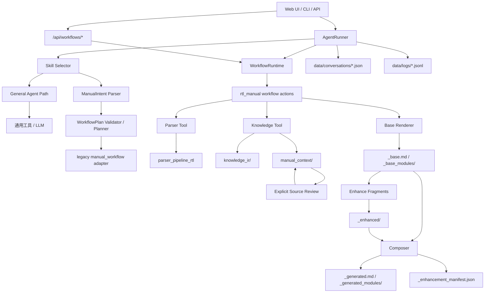

# LX-Agent

LX-Agent 是一个本地 AI Agent 项目，用于读取工程、调用本地工具，并为 RTL 项目生成结构化代码手册。当前核心能力是 RTL 手册生成 workflow：从 RTL 源码解析开始，经过 Parser Artifacts、Knowledge IR、AI Context、Semantic Layer、Manual Context，再按 base / enhanced / final 三层生成 Markdown 手册。

项目正在从单一手册生成工具演进为轻量 Agent 平台。当前后端已经具备 `WorkflowRuntime`，可以把强流程任务作为标准 workflow 调度；普通问答、文件分析和开放式任务仍走 Agent + Tool 路径。

项目主要包含：

- Flask Web UI：聊天、文件上传、路径导入、会话管理、日志查看、RTL Manual workflow 面板。
- 命令行入口：用于调试 Agent 和 RTL Manual workflow。
- Skill 系统：根据用户输入确定性选择合适的 skill；workflow skill 可声明 `workflow_id` 和 action。
- Workflow Runtime：统一注册、查询和执行固定 workflow。
- RTL Manual workflow：固定流程、分层 artifact、manifest 状态、可单独 build/enhance/compose/review。
- 本地持久化：会话、日志、Parser 输出、Knowledge 输出、Manual Context、最终手册均保存为本地文件。

## 项目结构

```text
.
|-- backend/
|   |-- app.py                         # Flask 路由、会话持久化、Web 后端入口
|   |-- agent_runner.py                # Web 和 CLI 共享的 Agent 执行核心
|   |-- agent_core.py                  # 简单交互式 CLI Agent
|   |-- manual_workflow.py             # 旧 workflow 适配层和 Web 执行器
|   |-- manual_intent.py               # 将用户自然语言解析为结构化 ManualIntent
|   |-- manual_planner.py              # 将 ManualIntent 校验并规划为 WorkflowPlan
|   |-- manual_cli.py                  # 手册 workflow 兼容命令行入口
|   |-- workflows/
|   |   |-- types.py                    # Workflow Runtime 通用数据结构
|   |   |-- registry.py                 # workflow 注册表
|   |   |-- runtime.py                  # WorkflowRuntime 统一调用入口
|   |   `-- rtl_manual/                # RTL manual 分层 workflow 实现
|   |-- tools.py                       # 工具注册和脚本封装
|   |-- context_manager.py             # 对话上下文压缩
|   |-- event_logger.py                # JSONL 事件日志
|   `-- skills/
|       `-- catalog/
|           `-- rtl-manual-generation/
|               |-- SKILL.md
|               |-- SKILL.zh.md
|               |-- skill.json
|               |-- scripts/
|               |   |-- run_parser_tool.py
|               |   `-- run_knowledge_tool.py
|               `-- packages/
|                   |-- parser/
|                   `-- knowledge/
|-- frontend/
|   |-- templates/index.html           # 聊天界面和 RTL Manual workflow 面板
|   `-- static/style.css
|-- rtl/
|   |-- rtl/                           # RTL 源码输入目录
|   |-- parser_pipeline_rtl/           # Parser 产物
|   |-- knowledge_ir/<top_module>/     # Knowledge IR / AI Context / Semantic Layer
|   |-- manual_context/<top_module>/   # Manual Context 主证据
|   `-- docs/manuals/                  # 以 rtl/ 为 project_root 时的手册产物
|-- docs/
|   `-- manuals/                       # 生成的 Markdown 手册
|-- data/
|   |-- conversations/                 # 会话 JSON
|   |-- logs/                          # Agent 事件日志
|   |-- imports/                       # 上传或导入的文件
|   `-- backups/                       # 备份目录
|-- main.py
|-- requirements.txt
`-- .env
```

## 核心架构



`AgentRunner` 是共享执行核心。`app.py` 负责 Web 路由和会话持久化，`agent_core.py` 和 `manual_cli.py` 提供命令行入口。

当前平台有两条执行路径：

1. **General Agent Path**：普通问答、文件分析、通用工具调用和开放式任务。
2. **Workflow Runtime Path**：固定流程任务，例如 RTL Manual。入口只传 `workflow_id/action/params/context`，具体业务步骤留在 workflow 内部。

RTL Manual 仍保留旧聊天式 `manual_workflow.py` 适配层，同时已经提供标准 runtime actions：

```text
status
build
source_review
enhance_main
enhance_module
compose
review
```

CLI、Workflow API 和 Web UI 手册面板都通过 `WorkflowRuntime` 调用这些 action。

## 环境要求

建议使用 Python 3.10 或更高版本。

安装依赖：

```powershell
python -m pip install -r requirements.txt
```

当前依赖：

```text
openai>=1.0.0
python-dotenv>=1.0.0
flask>=3.0.0
```

## 环境变量配置

在项目根目录创建或修改 `.env`。

最小配置：

```env
DEEPSEEK_API_KEY=your_api_key_here
```

推荐配置：

```env
DEEPSEEK_API_KEY=your_api_key_here
DEEPSEEK_BASE_URL=https://api.deepseek.com
DEEPSEEK_MODEL=deepseek-v4-pro
DEEPSEEK_REVIEW_MODEL=deepseek-v4-flash
KNOWLEDGE_IR_SEMANTIC_MODEL=deepseek-v4-flash

RTL_MANUAL_SEMANTIC_WORKERS=4
RTL_MANUAL_PARSER_TIMEOUT=220
RTL_MANUAL_KNOWLEDGE_TIMEOUT=10800
RTL_MANUAL_KNOWLEDGE_WRAPPER_TIMEOUT=10920
```

常用变量：

| 变量 | 默认值 | 说明 |
| --- | ---: | --- |
| `PORT` | `5000` | Flask Web 服务端口。 |
| `DEEPSEEK_API_KEY` | 空 | Web/CLI 默认模型 API key。 |
| `DEEPSEEK_BASE_URL` | `https://api.deepseek.com` | DeepSeek 兼容接口地址。 |
| `DEEPSEEK_MODEL` | `deepseek-v4-pro` | 文档增强默认模型名称。 |
| `DEEPSEEK_REVIEW_MODEL` | `deepseek-v4-flash` | source-review、review 和 compose 后自动审查默认模型名称。 |
| `KNOWLEDGE_IR_SEMANTIC_MODEL` | `deepseek-v4-flash` | Knowledge Semantic Layer 默认模型名称。 |
| `RTL_MANUAL_PARSER_TIMEOUT` | `220` | Parser Tool 超时时间，单位秒。 |
| `RTL_MANUAL_KNOWLEDGE_TIMEOUT` | `3600` | Knowledge pipeline 内层超时时间，单位秒。 |
| `RTL_MANUAL_KNOWLEDGE_WRAPPER_TIMEOUT` | `knowledge_timeout + 120` | Knowledge Tool 外层 wrapper 超时时间。 |
| `RTL_MANUAL_SEMANTIC_WORKERS` | `4` | Semantic Layer 并发 LLM 请求数。遇到限流可降到 `2` 或 `1`。 |

不要把真实 API key 提交到版本库。

## 使用方法

本项目最常用的能力是“把 RTL 源码生成 Markdown 代码手册”。推荐先用 Web UI 跑通一次；需要复现实验、自动化或长时间运行时，再使用 CLI。

### 1. 启动 Web UI

在项目根目录运行：

```powershell
python -m backend.run_web
```

打开浏览器：

```text
http://127.0.0.1:5000
```

如果需要换端口：

```powershell
$env:PORT = "5001"
python -m backend.run_web
```

Web UI 顶部有“手册”按钮，可打开 RTL Manual workflow 面板。面板直接调用 Workflow API，可以执行：

```text
Status
Build
Source Review
Enhance Main
Enhance Module
Enhance Batch
Compose
Review
```

聊天入口仍可使用自然语言生成手册；显式 workflow 命令也可在聊天中使用，例如：

```text
workflow rtl_manual status project_root=./rtl top_module=arm_soc_top
```

### 2. 自然语言生成手册测试提示词

CLI 和 workflow 面板适合验证固定 action；自然语言测试建议直接在 Web UI 聊天框中发送下面的提示词。当前示例项目的确定性参数是：

```text
project_root=./rtl
rtl_inputs=rtl
top_module=arm_soc_top
```

#### 最短生成流程

用于测试自然语言能否触发完整手册生成，不额外执行源码复核或文档增强。

```text
请为当前项目生成 RTL 代码手册。

参数如下：
project_root=./rtl
rtl_inputs=rtl
top_module=arm_soc_top

请自动连续执行：
1. 从 build 阶段开始，生成 parser、knowledge、manual_context 和 base 手册。
2. 执行 compose，生成最终公开手册。

跳过 source-review。
跳过 LLM 文档增强。
```

#### 全量重新生成

用于测试从头重跑 parser/knowledge/base/compose。

```text
请为当前项目全量重新生成 RTL 代码手册。

project_root=./rtl
rtl_inputs=rtl
top_module=arm_soc_top

请自动连续执行。
请强制重新执行 build，重新生成 parser_pipeline_rtl、knowledge_ir、manual_context 和 base 手册。
build 完成后执行 compose，生成最终公开手册。
```

#### 带 Source Review 的完整流程

用于测试证据增强链路。注意这里明确要求先 build，再 source-review，然后直接重新 enhance / compose；不要在 source-review 后再次执行完整 build。

```text
请为当前项目生成带源码复核证据的 RTL 代码手册。

project_root=./rtl
rtl_inputs=rtl
top_module=arm_soc_top

请自动连续执行。
请按这个顺序执行：
1. build：生成或复用 parser、knowledge、manual_context 和 base 手册。
2. source-review：读取已有 Manual Context 和 RTL 源码，只对 `evidence_gap` / `needs_review` / `requires_rtl_source_review` 显式标记项执行受控源码复核，并把结论写回 Manual Context。
3. enhance：基于写回后的 Manual Context 重新增强主手册和模块页。
4. compose：生成最终公开手册。

不要把 source-review 放到第一次 build 前面。
不要在 source-review 后再次执行完整 build，避免覆盖 source-review 写回的 Manual Context。
```

#### 主手册增强

用于测试 LLM 文档增强只写 enhanced fragment，再由 compose 合成最终手册。

```text
请增强当前项目 RTL 代码手册的主手册。

project_root=./rtl
top_module=arm_soc_top

请自动连续执行。
请先检查 status。如果 base 手册不存在，请先 build。
然后执行 enhance main manual，只增强主手册，不覆盖 base。
增强完成后执行 compose。
```

#### 批量模块页增强

用于测试批量增强模块页。`retryable` 会选择 `pending/missing/stale/failed/invalid` 的模块。

```text
请批量增强当前项目 RTL 代码手册的模块页。

project_root=./rtl
top_module=arm_soc_top
module_filter=retryable

请自动连续执行。
请先检查 status。如果 base 模块页不存在，请先 build。
然后批量增强所有 retryable 模块页。
每个模块单独增强，某个模块失败不要影响其他模块继续执行。
完成后执行 compose。
```

#### 指定模块页增强

用于测试单模块增强。

```text
请只增强 cpu_slot 这个模块页。

project_root=./rtl
top_module=arm_soc_top
target_module=cpu_slot

请自动连续执行。
请执行单模块增强，不要增强其他模块。
增强完成后执行 compose。
```

#### 状态检查和继续执行

用于测试中断后恢复、状态检查和缺参追问。

```text
请检查当前 RTL 手册 workflow 状态。

project_root=./rtl
top_module=arm_soc_top

请告诉我 base、source_review、enhancements、compose、review 分别是什么状态，以及下一步建议执行什么。
```

```text
继续刚才的 RTL 手册生成流程。
如果上一步失败，请先说明失败阶段和错误原因；
如果可以继续，请从下一个安全阶段继续，不要重复已经成功且仍然有效的阶段。
```

自然语言入口适合测试 intent 解析、参数继承、继续执行和错误提示。若要验证底层 action 本身是否正确，优先使用 CLI 或 Web UI 的“手册”面板。

如果只是想跳过某个可选动作，推荐使用“跳过 source-review / 跳过 enhance”这类表述。系统已经区分“不要自动执行某个可选动作”和“不要自动继续后续阶段”；只有后者会进入分阶段单步执行。

### 3. 分层生成本仓库示例 RTL 手册

当前仓库内置示例 RTL 源码在 `rtl/rtl/`。当前 parser 不做嵌套目录自动识别，参数语义是固定的：

```text
project_root = ./rtl
rtl_inputs   = rtl
```

也就是 `project_root/rtl_inputs` 必须直接指向源码目录。对于本仓库示例，实际读取目录就是 `./rtl/rtl`。如果不需要源码复核，推荐 CLI 使用最短分层流程：

```powershell
python -m backend.manual_cli status `
  --project-root ./rtl `
  --top-module arm_soc_top

python -m backend.manual_cli build `
  --project-root ./rtl `
  --rtl-inputs rtl `
  --top-module arm_soc_top `
  --force `
  --knowledge-timeout 10800 `
  --log-events

python -m backend.manual_cli compose `
  --project-root ./rtl `
  --top-module arm_soc_top
```

`build` 会先运行或复用 Parser Tool 与 Knowledge Tool，生成 `parser_pipeline_rtl/`、`knowledge_ir/<top_module>/` 和 `manual_context/<top_module>/`，然后基于这些产物渲染 deterministic base 手册。Knowledge 的 Semantic Layer 可以使用 LLM；base 手册渲染本身不做最终写作 LLM 改写。`compose` 把 base 和有效增强片段组装成最终公开手册，并按 CLI 行为继续执行 final review。`status` 读取 enhancement manifest 和 artifact existence，不解析日志或 stdout。

运行完成后重点查看：

```text
rtl/docs/manuals/arm_soc_top_base.md
rtl/docs/manuals/arm_soc_top_base_modules/
rtl/docs/manuals/arm_soc_top_enhancement_manifest.json
rtl/docs/manuals/arm_soc_top_generated.md
rtl/docs/manuals/arm_soc_top_generated_modules/
rtl/docs/manuals/arm_soc_top_generated_review.md
```

### 4. 为外部 RTL 项目生成手册

外部项目只需要传对三个参数：

```text
project_root=<RTL 项目根目录>
rtl_inputs=<相对 project_root 的 RTL 源码目录>
top_module=<顶层模块名>
```

路径关系如下：

```text
实际读取源码目录 = project_root / rtl_inputs
Parser 产物       = project_root / parser_pipeline_rtl
Knowledge 产物    = project_root / knowledge_ir/<top_module>
Manual Context   = project_root / manual_context/<top_module>
base 手册         = project_root / docs/manuals/<top_module>_base.md
增强片段          = project_root / docs/manuals/<top_module>_enhanced/
最终手册          = project_root / docs/manuals/<top_module>_generated.md
```

例如源码目录是 `E:\arm\rtl`，并且希望产物写到 `E:\arm` 下，应传：

```text
project_root=E:\arm
rtl_inputs=rtl
top_module=arm_soc_top
```

如果希望产物写到 `E:\arm\rtl` 下，则应传：

```text
project_root=E:\arm\rtl
rtl_inputs=.
```

不要依赖工具自动猜测 `rtl/rtl` 这类嵌套布局。现在不会根据目录内容自动改写输入路径。

不推荐在本仓库示例中传成：

```text
project_root=.
rtl_inputs=rtl
```

### 5. Source Review 和 LLM 增强

`source-review` 是显式证据增强步骤，不是 Parser/Knowledge 的替代品。它依赖已有 `manual_context/<top_module>/`，因此第一次运行前必须先执行一次 `build`。

使用 Source Review 的正确顺序是：

```text
build -> source-review -> enhance -> compose -> review 可选
```

含义如下：

```text
第一次 build     生成或复用 parser_pipeline_rtl、knowledge_ir、manual_context，并渲染 base 手册。
source-review   读取已有 Manual Context 和 RTL 源码，只对 evidence_gap / needs_review / requires_rtl_source_review 显式标记项做受控源码复核，把结论写回 Manual Context。
enhance          读取写回后的 Manual Context，重新生成 enhanced fragments，不覆盖 base；模块页会注入 drive-only 事件流图 packet。
compose          组装最终公开手册；增强片段无效时自动回退 base。
```

`source-review` 的主要产物写在 Manual Context 中：

```text
<project_root>/manual_context/<top_module>/source_review_report.json
<project_root>/manual_context/<top_module>/modules/<module>/source_review_report.json
```

它还会更新对应模块的：

```text
<project_root>/manual_context/<top_module>/modules/<module>/module_context.json
<project_root>/manual_context/<top_module>/modules/<module>/module_doc_card.json
<project_root>/manual_context/<top_module>/manifest.json
```

`source-review` 完成后，enhancement manifest 会标记已有 enhanced fragments 过期；后续应重新执行 `enhance` 和 `compose`。不要立刻重新执行完整 `build`，因为 build 会重建 Manual Context 并覆盖 `source_review_claims` / `source_review_report`。

```powershell
python -m backend.manual_cli build `
  --project-root ./rtl `
  --rtl-inputs rtl `
  --top-module arm_soc_top `
  --knowledge-timeout 10800 `
  --log-events

python -m backend.manual_cli source-review `
  --project-root ./rtl `
  --top-module arm_soc_top `
  --log-events

python -m backend.manual_cli enhance `
  --project-root ./rtl `
  --top-module arm_soc_top `
  --main-manual `
  --log-events

python -m backend.manual_cli enhance `
  --project-root ./rtl `
  --top-module arm_soc_top `
  --all-modules `
  --module-filter retryable `
  --log-events

python -m backend.manual_cli compose `
  --project-root ./rtl `
  --top-module arm_soc_top `
  --log-events
```

LLM 文档增强不会覆盖 base，只写增强片段；主手册增强会读取紧凑 Manual Context 摘要，模块页增强会读取对应模块的 Manual Context packet。模块页 packet 还包含 `drive_diagram_packet.v1`，它从 Manual Context 的 `ordered_path` 和 parser assignments 中确定性提取 drive/event 流线，只用于展示 drive 传播与 drive-like 逻辑合成，不展开 payload 数据路径：

```powershell
python -m backend.manual_cli enhance `
  --project-root ./rtl `
  --top-module arm_soc_top `
  --main-manual

python -m backend.manual_cli enhance `
  --project-root ./rtl `
  --top-module arm_soc_top `
  --target-module cpu_slot

python -m backend.manual_cli enhance `
  --project-root ./rtl `
  --top-module arm_soc_top `
  --all-modules `
  --module-filter retryable

python -m backend.manual_cli enhance `
  --project-root ./rtl `
  --top-module arm_soc_top `
  --modules cpu_slot,decode_unit,writeback_unit
```

模块批量增强仍然按“单模块是原子目标”的方式执行：每个模块单独写入 `docs/manuals/<top_module>_enhanced/modules/<module>.md`，单个模块失败会记录到 manifest，不会覆盖 base，也不会阻止其他模块继续尝试。`--module-filter retryable` 表示只增强 `pending/missing/stale/failed/invalid` 模块，适合 source-review 后直接补齐增强片段。

`compose` 时如果增强片段存在且 base hash 匹配，就使用增强片段；否则自动回退 base。

### 6. CLI 子命令

```text
status        读取 manifest 和 artifact 状态。
build          跑 parser/knowledge/evidence/outline/chapter_plan，并生成 deterministic base。Knowledge Semantic Layer 可使用 LLM；base 渲染不做写作 LLM 改写。
source-review 依赖已有 Manual Context，只复核显式标记的不确定项，写回 Manual Context，并标记 enhanced stale。执行后应重新 enhance / compose。
enhance        增强整篇主手册、单个模块页或批量模块页，结果写入 enhanced fragments；主手册增强会注入 Manual Context 摘要，模块页增强会注入 drive-only 事件流图 packet。
compose        组装最终手册和模块页，并运行最终审查。
review         单独审查已 compose 的最终手册和模块页。
```

常用参数：

```text
status:
  --project-root <path>
  --top-module <name>
  --log-events

build:
  --project-root <path>
  --rtl-inputs <path>
  --top-module <name>
  --audience newcomer|maintainer|reviewer
  --evidence-mode project|reading_path
  --enrich-modules <list>
  --force
  --parser-timeout <seconds>
  --knowledge-timeout <seconds>
  --log-events

source-review / enhance:
  --project-root <path>
  --top-module <name>
  --model <model>   # source-review 默认 deepseek-v4-flash；enhance 默认 deepseek-v4-pro
  --base-url <url>
  --api-key <key>
  --no-llm
  --require-llm

enhance target:
  --main-manual
  --target-module <module>
  --all-modules
  --modules <module_a,module_b>
  --module-filter all|pending|missing|stale|failed|invalid|success|retryable|not-success

compose:
  --project-root <path>
  --top-module <name>
  --model <model>   # compose 后自动 review 默认 deepseek-v4-flash
  --base-url <url>
  --api-key <key>
  --no-llm
  --require-llm
  --log-events

review:
  --project-root <path>
  --top-module <name>
  --model <model>   # 默认 deepseek-v4-flash
  --base-url <url>
  --api-key <key>
  --no-llm
  --require-llm
  --log-events
```

所有 CLI 子命令现在都通过 `WorkflowRuntime` 调度；`manual_cli.py` 只是兼容入口，实际实现位于 `backend/workflows/rtl_manual/cli.py`。

### 7. Web API

Web UI 背后保留聊天接口 `/chat`：

```http
POST /chat
Content-Type: application/json
```

请求示例：

```json
{
  "conversation_id": "chat_20260522_100450_cc608f",
  "message": "继续"
}
```

全量生成请求示例：

```json
{
  "message": "请为当前项目生成 RTL 代码手册。\nproject_root=./rtl\nrtl_inputs=rtl\ntop_module=arm_soc_top\n\n从 references 阶段开始重跑，强制重新生成所有阶段，然后继续后续步骤。"
}
```

`conversation_id` 可选。不传时会使用当前会话或创建新会话；多人使用时建议前端始终带上自己的 `conversation_id`。

其他接口：

```text
POST   /upload
POST   /import_path
GET    /conversations
GET    /conversation/<conversation_id>
DELETE /conversation/<conversation_id>
POST   /conversation/<conversation_id>/rename
GET    /logs/current
GET    /logs/<conversation_id>
POST   /new_chat
POST   /reset
```

Workflow Runtime API：

```text
GET  /api/workflows
GET  /api/workflows/<workflow_id>/actions
GET  /api/workflows/<workflow_id>/status
POST /api/workflows/<workflow_id>/actions/<action>
```

查询 workflow：

```http
GET /api/workflows
```

查询 RTL Manual 状态：

```http
GET /api/workflows/rtl_manual/status?project_root=./rtl&top_module=arm_soc_top
```

执行 build：

```http
POST /api/workflows/rtl_manual/actions/build
Content-Type: application/json

{
  "project_root": "./rtl",
  "rtl_inputs": "rtl",
  "top_module": "arm_soc_top",
  "force": true
}
```

增强单个模块页：

```http
POST /api/workflows/rtl_manual/actions/enhance_module
Content-Type: application/json

{
  "project_root": ".",
  "top_module": "arm_soc_top",
  "target_module": "cpu_slot"
}
```

API 直接返回 `WorkflowActionResult` 或 `WorkflowStatus` 的 JSON 结构。Web UI 的“手册”面板和聊天中的显式 workflow 命令最终都走同一个 `WorkflowRuntime`。

### 8. Workflow Runtime 和旧阶段说明

标准 workflow 注册在：

```text
backend/workflows/registry.py
backend/workflows/runtime.py
backend/workflows/types.py
backend/workflows/rtl_manual/actions.py
```

`WorkflowRuntime` 只负责注册、查询、调用和结构化错误返回，不理解 RTL manual 内部 parser、knowledge、compose 等业务细节。

手册 workflow 是固定阶段表，定义在 `backend/manual_workflow.py`：

1. `references`：读取 skill 规则和参考文档。
2. `parser`：运行 Parser Tool，生成 `parser_pipeline_rtl/`。
3. `knowledge`：运行 Knowledge Tool，生成 `knowledge_ir/<top_module>/` 和 `manual_context/<top_module>/`。
4. `evidence`：从 Manual Context 建立主证据索引。
5. `outline`：生成手册目录。
6. `chapter_plan`：生成章节写作计划。
7. `manual`：渲染 base 手册和模块页，并 compose 最终手册。
8. `review`：检查最终手册。

`manual_workflow.py` 仍是聊天式旧适配层。源码复核不再是默认阶段；需要时通过 runtime action / CLI / Web UI 面板的 `source_review` 显式运行。注意：`source_review` 必须在已有 `manual_context/<top_module>/` 后运行，所以完整源码复核链路是 `build -> source_review -> enhance -> compose`，不是从空项目直接先跑 `source_review`。

简单 Agent 调试入口仍然保留：

```powershell
python main.py
python -m backend.agent_core
```

## 统计全量运行时间

`backend.manual_timing` 是专门的性能/回归分析入口。它会强制执行一次 deterministic base build，记录耗时、状态、重要输出路径和最终产物位置，并写出 JSON / Markdown timing report。它适合用来回答：

- Parser、Knowledge、Evidence、Outline、Chapter Plan、Base Render 各阶段分别耗时多久。
- 调整 `RTL_MANUAL_SEMANTIC_WORKERS` 或 timeout 后是否变快。
- 某次全量重跑失败在哪个阶段，最后错误是什么。
- 自动化环境里是否稳定生成了 parser、knowledge 和 base manual 产物。

直接运行：

```powershell
python -m backend.manual_timing `
  --project-root ./rtl `
  --rtl-inputs rtl `
  --top-module arm_soc_top `
  --knowledge-timeout 10800 `
  --report-dir data/logs `
  --log-events
```

`manual_timing` 固定统计 deterministic base build；它不会执行 source-review、enhance 或 compose 增强路径。适合做 parser/knowledge/base render 的性能回归。

PowerShell 计时示例：

```powershell
$body = @{
  message = @"
请为 rtl 目录全量重新生成 RTL 代码手册。
project_root=./rtl
rtl_inputs=rtl
top_module=arm_soc_top

从 references 阶段开始重跑，强制重新生成所有阶段，然后继续后续步骤。
语义增强开启，模块语义和 flow 语义都全量生成。
"@
} | ConvertTo-Json

$elapsed = Measure-Command {
  $resp = Invoke-RestMethod `
    -Uri "http://127.0.0.1:5000/chat" `
    -Method POST `
    -ContentType "application/json" `
    -Body $body
}

$elapsed
$resp.reply | Out-File -Encoding utf8 full_run_reply.txt
```

继续已有会话并计时：

```powershell
$body = @{
  conversation_id = "chat_20260522_100450_cc608f"
  message = "继续"
} | ConvertTo-Json

$elapsed = Measure-Command {
  $resp = Invoke-RestMethod `
    -Uri "http://127.0.0.1:5000/chat" `
    -Method POST `
    -ContentType "application/json" `
    -Body $body
}

$elapsed
```

`Measure-Command` 会一直等待 `/chat` 返回；全量流程运行多久，PowerShell 就会等待多久。

## 产物和备份

常见生成产物：

```text
rtl/parser_pipeline_rtl
rtl/knowledge_ir/<top_module>
rtl/manual_context/<top_module>
rtl/docs/manuals/<top_module>_base.md
rtl/docs/manuals/<top_module>_base_modules
rtl/docs/manuals/<top_module>_enhanced
rtl/docs/manuals/<top_module>_enhancement_manifest.json
rtl/docs/manuals/<top_module>_generated.md
rtl/docs/manuals/<top_module>_generated_modules
rtl/docs/manuals/<top_module>_generated_review.md
```

如果要冷启动全量重跑，建议先把这些产物移动到备份目录，而不是直接删除。

推荐备份目录格式：

```text
data/backups/full_rerun_<timestamp>/
```

不要移动或删除 RTL 源码目录：

```text
rtl/rtl/
```

## Semantic Layer 性能说明

全量 Semantic Layer 会比较慢，因为它可能对每个模块和每条 flow 调用一次 LLM。

以 `arm_soc_top` 为例，全量语义增强可能包含：

```text
106 个 module semantic card
103 个 flow semantic card
```

加速配置：

```env
RTL_MANUAL_SEMANTIC_WORKERS=4
RTL_MANUAL_KNOWLEDGE_TIMEOUT=10800
RTL_MANUAL_KNOWLEDGE_WRAPPER_TIMEOUT=10920
```

说明：

- `RTL_MANUAL_SEMANTIC_WORKERS=4` 表示并发 4 个 LLM 请求。
- 如果 API 限流或不稳定，可以改为 `2` 或 `1`。
- Semantic Layer 支持基于 `input_hash` 的缓存复用。
- 如果某次运行中断，下一次重跑会跳过 input hash 匹配的已生成 semantic card。

## 日志和调试

会话状态：

```text
data/conversations/<conversation_id>.json
```

事件日志：

```text
data/logs/agent_events_<YYYYMMDD>.jsonl
data/logs/conversations/<conversation_id>.jsonl
```

`manual_workflow_request` 事件会同时记录自然语言解析结果和最终执行计划，常用字段包括：

```text
intent
rerun_policy
parsed_start_stage
plan_start_stage
plan_force_stages
artifact_policy
confirmation_required
conflicts
questions
```

同时保留旧字段：

```text
stage
project_root
rtl_inputs
top_module
evidence_mode
auto_run
force_regenerate
force_stages
semantic_enrichment
enrich_modules
```

查看最近事件：

```powershell
Get-Content data\logs\agent_events_20260522.jsonl -Tail 80
```

查看最近生成的 Knowledge 文件：

```powershell
Get-ChildItem rtl\knowledge_ir\arm_soc_top -Recurse -File |
  Sort-Object LastWriteTime -Descending |
  Select-Object -First 10 FullName,LastWriteTime,Length
```

检查最终手册是否生成：

```powershell
Test-Path docs\manuals\arm_soc_top_generated.md
Test-Path docs\manuals\arm_soc_top_generated_modules
Test-Path docs\manuals\arm_soc_top_generated_review.md
```

## 常见问题

### `/chat` 返回 HTTP 200，但没有生成手册

HTTP 200 只表示 Flask 接口返回了响应，不代表 workflow 成功完成。需要看助手回复和事件日志：

```powershell
Get-Content data\logs\agent_events_20260522.jsonl -Tail 80
```

### Knowledge Tool 超时

增大超时时间：

```env
RTL_MANUAL_KNOWLEDGE_TIMEOUT=10800
RTL_MANUAL_KNOWLEDGE_WRAPPER_TIMEOUT=10920
```

修改 `.env` 后需要重启 Flask 后端。

### 全量运行比预期慢

先确认是否在跑全量 semantic：

```text
modules = all
flows = all
```

然后调整并发：

```env
RTL_MANUAL_SEMANTIC_WORKERS=4
```

如果模型服务限流，降为：

```env
RTL_MANUAL_SEMANTIC_WORKERS=2
```

### 看起来一直在运行，不知道是否卡住

检查文件时间戳是否还在变化：

```powershell
Get-ChildItem rtl\knowledge_ir\arm_soc_top -Recurse -File |
  Sort-Object LastWriteTime -Descending |
  Select-Object -First 10 FullName,LastWriteTime,Length
```

如果时间戳持续更新，说明工具仍在工作。

### Parser 之后找不到 Manual Context

预期路径是：

```text
rtl/parser_pipeline_rtl
rtl/knowledge_ir/arm_soc_top
rtl/manual_context/arm_soc_top
```

如果旧会话记录了错误路径，重启后端后在同一个会话发送：

```text
继续
```

## 源码阅读建议

如果要审查当前架构，推荐按以下顺序阅读：

1. Workflow Runtime 抽象：

```text
backend/workflows/types.py
backend/workflows/runtime.py
backend/workflows/registry.py
```

2. RTL Manual workflow facade 和 artifact 状态：

```text
backend/workflows/rtl_manual/actions.py
backend/workflows/rtl_manual/manifest.py
backend/workflows/rtl_manual/artifacts.py
```

3. CLI 入口：

```text
backend/manual_cli.py
backend/workflows/rtl_manual/cli.py
```

4. Skill metadata 和选择逻辑：

```text
backend/skills/spec.py
backend/skills/registry.py
backend/skills/catalog/rtl-manual-generation/skill.json
```

5. Agent 调度和 Web API：

```text
backend/agent_runner.py
backend/app.py
```

6. Web UI 面板：

```text
frontend/templates/index.html
frontend/static/style.css
```

7. 行为测试：

```text
backend/tests/test_manual_workflow.py
backend/tests/test_app_conversation_state.py
backend/tests/test_skill_registry.py
```

## 开发和测试

语法检查：

```powershell
python -m py_compile `
  backend\app.py `
  backend\agent_core.py `
  backend\agent_runner.py `
  backend\tools.py `
  backend\manual_intent.py `
  backend\manual_planner.py `
  backend\manual_workflow.py `
  backend\manual_cli.py `
  backend\workflows\types.py `
  backend\workflows\registry.py `
  backend\workflows\runtime.py `
  backend\workflows\rtl_manual\actions.py `
  backend\workflows\rtl_manual\manifest.py `
  backend\workflows\rtl_manual\cli.py `
  backend\context_manager.py `
  backend\event_logger.py
```

运行单元测试：

```powershell
python -B -m unittest `
  backend.tests.test_manual_intent `
  backend.tests.test_manual_workflow `
  backend.tests.test_semantic_layer `
  backend.tests.test_tools `
  backend.tests.test_skill_registry `
  backend.tests.test_app_conversation_state
```

当前测试覆盖：

- `ManualIntent` 阶段识别、重跑策略、确认机制和 `WorkflowPlan` 范围规划。
- manual workflow 阶段顺序和重跑逻辑。
- RTL manual CLI 子命令解析、base/enhanced/final artifact 分层和 manifest hash 校验。
- Workflow Runtime 注册、action 调用、结构化 status/result 和错误返回。
- Flask Workflow API 的 workflow/actions/status/action 调用。
- AgentRunner 显式 workflow 命令调度。
- RTL Manual Web UI 面板入口和 API 绑定。
- `source-review` 写回 Manual Context 后标记 enhanced fragments stale，以及 compose 对 stale/failed/missing 增强片段的 base 回退。
- 模块页 drive-only 事件流图 packet、plaintext 渲染和增强 packet 注入。
- parser 生成后 artifact 路径刷新。
- skill selector 确定性打分。
- conversation 级别的 manual workflow 状态隔离。
- tool timeout 参数传递。
- Semantic Layer 缓存复用和并发 workers。

## 设计说明

LX-Agent 当前按“Agent Core + Skill + Workflow Runtime + Tool Registry”组织能力。

任务分为两类：

```text
开放式任务 -> General Agent Path
强流程任务 -> Workflow Runtime
```

RTL 手册生成属于强流程任务，使用固定 workflow，而不是完全依赖提示词驱动，这是有意设计。

原因：

- 手册必须基于证据链生成，不能随意猜测。
- Parser、Knowledge、Manual Context 有明确前后依赖。
- 用户需要可控的阶段重跑能力，例如“从 knowledge 阶段开始重跑”。
- 仅靠 prompt 约束 LLM，无法可靠保证阶段顺序、产物复用和错误处理。

因此：

- Skill 描述能力、规则和边界；workflow skill 额外声明 `workflow_id` 和 `actions`。
- AgentRunner 负责普通问答、工具调用和显式 workflow 命令调度。
- WorkflowRuntime 负责固定 workflow 的统一注册、查询、执行和状态返回。
- Intent Parser 负责把自然语言转换成结构化 `ManualIntent`。
- Planner 负责把 intent 校验并转换成确定性的 `WorkflowPlan`。
- Workflow Executor 负责阶段顺序、状态转移、产物检查、重跑、继续执行和安全边界。

### 兼容性适配

这次重构没有把旧 workflow state 和旧入口一次性推倒重写，而是在边界处做了兼容：

- `handle_manual_workflow()` 仍保留旧签名和旧返回值 `(reply, state)`，用于兼容 `app.py`、既有测试和可能存在的旧调用方。
- 新增 `handle_manual_workflow_structured()` 返回 `(reply, state, intent_dict, plan_dict)`，`AgentRunner` 使用这个新入口保存 `last_manual_intent` 和 `current_manual_plan`。
- `AgentSession` 和 `AgentRunResult` 只新增可选字段，默认值为 `None`，旧测试和旧构造方式不需要立即传入 intent/plan。
- `manual_cli.py` 是兼容入口，实际实现下沉到 `workflows/rtl_manual/cli.py`；所有 RTL Manual CLI 子命令都通过 `WorkflowRuntime` 调度。
- `AgentRunner` 支持显式 workflow 命令，但低置信度自然语言仍保留旧 manual workflow 适配路径。
- Flask 已提供 `/api/workflows/*`，Web UI 的“手册”面板通过这些 API 调用 runtime。
- `manual_timing.py` 保留为 base 构建计时入口，只统计 deterministic base build。
- `_run_current_stage()` 和各阶段 handler 没有大规模改写，仍读取旧 state 字段，例如 `stage`、`force_stages`、`force_regenerate`、`completed_stages`。
- `apply_manual_plan_to_state()` 是新 plan 到旧 state 的适配层：它写入 `stage`、`restart_stage`、`force_stages`、`auto_run` 等旧字段，并清理对应阶段旧产物。
- `_should_force_stage()` 仍兼容 `force_regenerate`，但新的 plan 优先写入精确的 `force_stages`，避免全局 force 造成范围不清。
- `_extract_restart_stage()`、`_reset_from_stage()` 等旧 helper 暂时保留，主要用于旧测试和兼容代码；新的主入口不再依赖它们决定重跑范围。
- `_update_state_from_user_input()` 仍保留参数抽取、artifact path 刷新等兼容用途，但已经不再负责 `restart_stage`、`force_stages`、`force_regenerate` 的判断。
- 等待 `top_module` 时，用户只回复裸模块名的旧交互仍保留。

这些兼容层带来的设计代价是：短期内系统同时存在结构化 plan 和旧 state 两套表示。执行阶段仍依赖旧 state 字段，因此 `apply_manual_plan_to_state()` 必须保持严格、可测试；后续如果要进一步收敛，可以逐步让阶段 handler 直接读取 `WorkflowPlan` 或一个更明确的运行上下文。

## 当前限制

- Web UI 和 Workflow API 当前都是同步请求，长耗时 workflow 还没有任务队列和实时进度条。
- 当前不支持同一个 `project_root + top_module` 的多个并发 run；`run_id` 字段已保留，但第一版主要按 manifest 状态工作。
- 大型 RTL 项目的全量 Semantic Layer 仍可能耗时较长。
- 当前项目定位为本地开发工具，不是生产环境部署方案。

## 安全注意事项

- 不要删除 `rtl/rtl/` 源码目录，这是测试目录。
- 全量重跑前建议备份已有生成产物。
- 不要提交包含真实 API key 的 `.env`。
- `rtl/parser_pipeline_rtl/`、`rtl/knowledge_ir/`、`rtl/manual_context/`、`rtl/docs/manuals/`、`data/logs/` 通常是生成或运行时产物，不要提交到版本管理。
