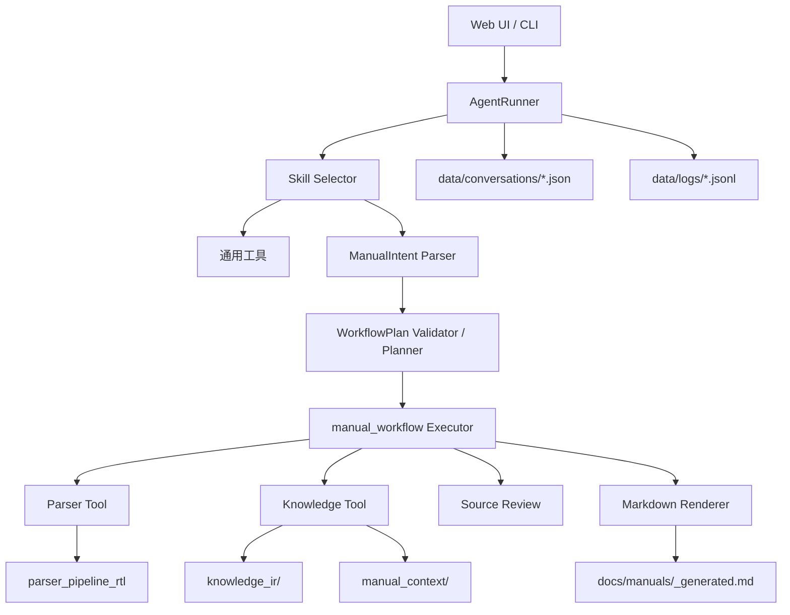

# LX-Agent

LX-Agent 是一个本地 AI Agent 项目，用于读取工程、调用本地工具，并为 RTL 项目生成结构化代码手册。当前核心能力是 RTL 手册生成流程：从 RTL 源码解析开始，经过 Parser Artifacts、Knowledge IR、AI Context、Semantic Layer、Manual Context、Source Review，最后渲染为 Markdown 手册。

项目主要包含：

- Flask Web UI：聊天、文件上传、路径导入、会话管理、日志查看。
- 命令行入口：用于调试 Agent 和手册生成 workflow。
- Skill 系统：根据用户输入确定性选择合适的 skill 和工具。
- RTL 手册生成 workflow：固定阶段、支持继续执行、支持从指定阶段重跑。
- 本地持久化：会话、日志、Parser 输出、Knowledge 输出、Manual Context、最终手册均保存为本地文件。

## 项目结构

```text
.
|-- backend/
|   |-- app.py                         # Flask 路由、会话持久化、Web 后端入口
|   |-- agent_runner.py                # Web 和 CLI 共享的 Agent 执行核心
|   |-- agent_core.py                  # 简单交互式 CLI Agent
|   |-- manual_workflow.py             # RTL 手册生成 workflow
|   |-- manual_intent.py               # 将用户自然语言解析为结构化 ManualIntent
|   |-- manual_planner.py              # 将 ManualIntent 校验并规划为 WorkflowPlan
|   |-- manual_cli.py                  # 手册 workflow 命令行入口
|   |-- tools.py                       # 工具注册和脚本封装
|   |-- context_manager.py             # 对话上下文压缩
|   |-- event_logger.py                # JSONL 事件日志
|   `-- skills/
|       `-- catalog/
|           `-- rtl-manual-generation/
|               |-- SKILL.md
|               |-- SKILL.zh.md
|               |-- skill.json
|               |-- scripts/
|               |   |-- run_parser_tool.py
|               |   `-- run_knowledge_tool.py
|               `-- packages/
|                   |-- parser/
|                   `-- knowledge/
|-- frontend/
|   |-- templates/index.html
|   `-- static/style.css
|-- rtl/
|   |-- rtl/                           # RTL 源码输入目录
|   |-- parser_pipeline_rtl/           # Parser 产物
|   |-- knowledge_ir/<top_module>/     # Knowledge IR / AI Context / Semantic Layer
|   `-- manual_context/<top_module>/   # Manual Context 主证据
|-- docs/
|   `-- manuals/                       # 生成的 Markdown 手册
|-- data/
|   |-- conversations/                 # 会话 JSON
|   |-- logs/                          # Agent 事件日志
|   |-- imports/                       # 上传或导入的文件
|   `-- backups/                       # 备份目录
|-- main.py
|-- requirements.txt
`-- .env
```

## 核心架构



`AgentRunner` 是共享执行核心。`app.py` 负责 Web 路由和会话持久化，`agent_core.py` 和 `manual_cli.py` 提供命令行入口。

RTL 手册生成现在分成三层：

1. `manual_intent.py`：只负责理解用户输入，把自然语言和 key-value 参数转换成 `ManualIntent`。
2. `manual_planner.py`：只负责校验 intent，并生成确定性的 `WorkflowPlan`。
3. `manual_workflow.py`：只负责把 plan 写入旧 workflow state，然后执行现有阶段 handler。

这样做的目标是让“自然语言理解”和“workflow 执行控制”解耦。执行器不再直接根据“手册”“review”“重新跑”等关键词决定阶段和重跑范围。

## 环境要求

建议使用 Python 3.10 或更高版本。

安装依赖：

```powershell
python -m pip install -r requirements.txt
```

当前依赖：

```text
openai>=1.0.0
python-dotenv>=1.0.0
flask>=3.0.0
```

## 环境变量配置

在项目根目录创建或修改 `.env`。

最小配置：

```env
DEEPSEEK_API_KEY=your_api_key_here
```

推荐配置：

```env
DEEPSEEK_API_KEY=your_api_key_here
DEEPSEEK_BASE_URL=https://api.deepseek.com
DEEPSEEK_MODEL=deepseek-chat

RTL_MANUAL_SEMANTIC_WORKERS=4
RTL_MANUAL_PARSER_TIMEOUT=220
RTL_MANUAL_KNOWLEDGE_TIMEOUT=10800
RTL_MANUAL_KNOWLEDGE_WRAPPER_TIMEOUT=10920
```

常用变量：

| 变量 | 默认值 | 说明 |
| --- | ---: | --- |
| `PORT` | `5000` | Flask Web 服务端口。 |
| `DEEPSEEK_API_KEY` | 空 | Web/CLI 默认模型 API key。 |
| `DEEPSEEK_BASE_URL` | `https://api.deepseek.com` | DeepSeek 兼容接口地址。 |
| `DEEPSEEK_MODEL` | `deepseek-chat` | Web 默认模型名称。 |
| `RTL_MANUAL_PARSER_TIMEOUT` | `220` | Parser Tool 超时时间，单位秒。 |
| `RTL_MANUAL_KNOWLEDGE_TIMEOUT` | `3600` | Knowledge pipeline 内层超时时间，单位秒。 |
| `RTL_MANUAL_KNOWLEDGE_WRAPPER_TIMEOUT` | `knowledge_timeout + 120` | Knowledge Tool 外层 wrapper 超时时间。 |
| `RTL_MANUAL_SEMANTIC_WORKERS` | `4` | Semantic Layer 并发 LLM 请求数。遇到限流可降到 `2` 或 `1`。 |

不要把真实 API key 提交到版本库。

## 使用方法

本项目最常用的能力是“把 RTL 源码生成 Markdown 代码手册”。推荐先用 Web UI 跑通一次；需要复现实验、自动化或长时间运行时，再使用 CLI。

### 1. 启动 Web UI

在项目根目录运行：

```powershell
python -m backend.run_web
```

打开浏览器：

```text
http://127.0.0.1:5000
```

如果需要换端口：

```powershell
$env:PORT = "5001"
python -m backend.run_web
```

### 2. 生成本仓库示例 RTL 手册

当前仓库内置示例 RTL 源码在 `rtl/rtl/`。因为工具会自动识别 `rtl` 目录下的嵌套 RTL 项目，所以 Web UI 中可以直接发送：

```text
请为当前项目生成 RTL 代码手册。
project_root=.
rtl_inputs=rtl
top_module=arm_soc_top
manual_generation_mode=deterministic

从 references 阶段开始重跑，强制重新生成所有阶段，然后继续后续步骤。
语义增强开启，模块语义和 flow 语义都全量生成。
```

`manual_generation_mode=deterministic` 是默认值，也可以不写。该模式只使用确定性 Markdown renderer，不会让 LLM 参与最终主手册生成。

如果希望在确定性 renderer 生成 draft 后，让 LLM 只对主手册做受控润色，可以显式指定：

```text
请为当前项目生成 RTL 代码手册。
project_root=.
rtl_inputs=rtl
top_module=arm_soc_top
manual_generation_mode=llm_polish

从 references 阶段开始重跑，强制重新生成所有阶段，然后继续后续步骤。
```

`llm_polish` 只润色主手册 Markdown，不生成或改写模块页。模块页仍由确定性 renderer 生成。如果模型客户端不可用，manual 阶段会自动回退到 deterministic draft，并在回复和日志里标记 LLM polish 被跳过或回退。

运行完成后重点查看：

```text
docs/manuals/arm_soc_top_generated.md
docs/manuals/arm_soc_top_generated_modules/
docs/manuals/arm_soc_top_generated_review.md
```

### 3. 为外部 RTL 项目生成手册

外部项目只需要传对三个参数：

```text
project_root=<RTL 项目根目录>
rtl_inputs=<相对 project_root 的 RTL 源码目录>
top_module=<顶层模块名>
```

路径关系如下：

```text
实际读取源码目录 = project_root / rtl_inputs
Parser 产物       = project_root / parser_pipeline_rtl
Knowledge 产物    = project_root / knowledge_ir/<top_module>
Manual Context   = project_root / manual_context/<top_module>
最终手册          = project_root / docs/manuals/<top_module>_generated.md
```

例如源码目录是 `E:\arm\rtl`，希望产物写到 `E:\arm` 下，应传：

```text
project_root=E:\arm
rtl_inputs=rtl
top_module=arm_soc_top
```

不要传成：

```text
project_root=E:\arm\rtl
rtl_inputs=.
```

对应 Web UI 输入示例：

```text
请为 E:\arm\rtl 下的 RTL 源码生成代码手册。
project_root=E:\arm
rtl_inputs=rtl
top_module=arm_soc_top
manual_generation_mode=deterministic

从 references 阶段开始重跑，强制重新生成所有阶段，然后继续后续步骤。
语义增强开启，模块语义和 flow 语义都全量生成。
```

外部项目同样可以显式启用 LLM 润色：

```text
请为 E:\arm\rtl 下的 RTL 源码生成代码手册。
project_root=E:\arm
rtl_inputs=rtl
top_module=arm_soc_top
manual_generation_mode=llm_polish

重新生成最终手册，然后继续后续步骤。
```

### 4. 继续执行和阶段重跑

如果一个会话已经进入 workflow，中途停止或浏览器等待超时后，可以在同一个会话继续发送：

```text
继续
```

如果只想从某个阶段开始重跑，直接说明阶段名：

```text
从 knowledge 阶段开始重跑，然后继续后续步骤。
```

支持的阶段：

```text
references
parser
knowledge
evidence
source_review
outline
chapter_plan
manual
review
```

常用重跑指令：

```text
从 parser 阶段开始重跑
从 knowledge 阶段开始重跑
重新生成 source_review 并继续
强制重新生成 manual 和 review
```

当前重跑控制会先生成结构化 plan，再执行：

- `从 source_review 阶段开始重跑` 会从 `source_review` 开始，强制重跑 `source_review -> outline -> chapter_plan -> manual -> review`。
- `从 references 阶段开始重跑` 会从 `references` 开始，强制重跑所有阶段。
- `从头再跑一遍`、`全量重来`、`清空后重来` 会按全量 clean run 处理。
- `重新生成最终手册`、`只重跑 manual 阶段`、`只生成 Markdown 正文` 才会按 `manual -> review` 处理。
- 普通的 `生成代码手册`、`项目手册`、`代码手册` 不会被解释成从 `manual` 阶段开始。
- 如果只说 `不要复用旧结果`，但没有说明从哪个阶段开始，且当前会话状态也不能推断，系统会要求确认，不会猜测执行。
- 如果同时说 `继续` 和 `全量重来`，系统会要求确认，不会执行任何阶段。

阶段名识别按完整 stage 优先处理，避免把 `source_review` 误判为 `review`，或把 `chapter_plan` 误判为普通 `plan/manual`。

手册正文生成模式也可以在 Web 对话里切换：

```text
manual_generation_mode=deterministic 重新生成最终手册
manual_generation_mode=llm_polish 重新生成最终手册
用 LLM 润色手册，重新生成最终手册
不用 LLM 润色，确定性生成手册
```

只有明确指定 `manual_generation_mode=llm_polish` 或说“用 LLM/模型润色手册”时，manual 阶段才会调用 LLM。普通“生成代码手册”不会启用 LLM polish。

### 5. 使用 CLI 运行 workflow

CLI 更适合本地调试、复现、计时和自动化：

```powershell
python -m backend.manual_cli `
  --project-root . `
  --rtl-inputs rtl `
  --top-module arm_soc_top `
  --manual-generation-mode deterministic `
  --force `
  --knowledge-timeout 10800 `
  --log-events
```

`--manual-generation-mode deterministic` 是默认值，也可以省略。

外部项目示例：

```powershell
python -m backend.manual_cli `
  --project-root E:\arm `
  --rtl-inputs rtl `
  --top-module arm_soc_top `
  --manual-generation-mode deterministic `
  --force `
  --knowledge-timeout 10800 `
  --log-events
```

如果希望让 LLM 参与最后主手册润色：

```powershell
python -m backend.manual_cli `
  --project-root . `
  --rtl-inputs rtl `
  --top-module arm_soc_top `
  --manual-generation-mode llm_polish `
  --force `
  --knowledge-timeout 10800 `
  --log-events
```

如果同时使用 `--manual-generation-mode llm_polish --no-llm`，CLI 不会报错；manual 阶段会回退到 deterministic draft，并输出 LLM polish skipped / fallback 状态。如果使用 `--manual-generation-mode llm_polish --require-llm` 且模型客户端不可用，会沿用现有 fail-fast 行为。

常用参数：

```text
--project-root <path>       RTL 项目根目录，默认当前仓库根目录。
--rtl-inputs <path>         RTL 输入目录，默认 rtl。
--top-module <name>         顶层模块名，必填。
--audience newcomer         newcomer | maintainer | reviewer。
--evidence-mode project     主证据模式。
--enrich-modules <list>     Semantic Layer 模块白名单，逗号分隔；空值表示全部模块。
--manual-generation-mode <mode>
                            deterministic | llm_polish | llm_section_generate。
                            默认 deterministic；llm_polish 会先确定性生成 draft，再让 LLM 润色主手册。
--output <path>             自定义 Markdown 输出路径。
--force                     强制重新生成，不复用已有产物。
--no-llm                    跳过 source_review 模型调用。
--require-llm               没有 API key 或模型客户端时直接失败。
--start-stage <stage>       从指定阶段开始。
--state-out <path>          保存最终 workflow state。
--parser-timeout <seconds>  覆盖 Parser Tool 超时时间。
--knowledge-timeout <sec>   覆盖 Knowledge Tool 超时时间。
--log-events                写入 data/logs 事件日志。
--quiet                     只输出简要阶段进度。
--verbose                   输出完整阶段回复。
```

### 6. Web API

Web UI 背后主要调用 `/chat`：

```http
POST /chat
Content-Type: application/json
```

请求示例：

```json
{
  "conversation_id": "chat_20260522_100450_cc608f",
  "message": "继续"
}
```

全量生成并启用 LLM polish 的请求示例：

```json
{
  "message": "请为当前项目生成 RTL 代码手册。\nproject_root=.\nrtl_inputs=rtl\ntop_module=arm_soc_top\nmanual_generation_mode=llm_polish\n\n从 references 阶段开始重跑，强制重新生成所有阶段，然后继续后续步骤。"
}
```

`conversation_id` 可选。不传时会使用当前会话或创建新会话；多人使用时建议前端始终带上自己的 `conversation_id`。

其他接口：

```text
POST   /upload
POST   /import_path
GET    /conversations
GET    /conversation/<conversation_id>
DELETE /conversation/<conversation_id>
POST   /conversation/<conversation_id>/rename
GET    /logs/current
GET    /logs/<conversation_id>
POST   /new_chat
POST   /reset
```

### 7. Workflow 阶段说明

手册 workflow 是固定阶段表，定义在 `backend/manual_workflow.py`：

1. `references`：读取 skill 规则和参考文档。
2. `parser`：运行 Parser Tool，生成 `parser_pipeline_rtl/`。
3. `knowledge`：运行 Knowledge Tool，生成 `knowledge_ir/<top_module>/` 和 `manual_context/<top_module>/`。
4. `evidence`：从 Manual Context 建立主证据索引。
5. `source_review`：对需要源码复核的项做受控 AI review，并写回 Manual Context。
6. `outline`：生成手册目录。
7. `chapter_plan`：生成章节写作计划。
8. `manual`：渲染主手册和模块页。
9. `review`：检查最终手册。

简单 Agent 调试入口仍然保留：

```powershell
python main.py
python -m backend.agent_core
```

## 统计全量运行时间

`backend.manual_timing` 是专门的性能/回归分析入口。它会按固定 workflow 从 `references` 开始做一次全量强制重跑，逐阶段记录耗时、状态、重要输出路径和最终产物位置，并写出 JSON / Markdown timing report。它适合用来回答：

- Parser、Knowledge、Source Review、Manual、Review 各阶段分别耗时多久。
- 调整 `RTL_MANUAL_SEMANTIC_WORKERS`、timeout 或 `manual_generation_mode` 后是否变快。
- 某次全量重跑失败在哪个阶段，最后错误是什么。
- 自动化环境里是否稳定生成了 parser、knowledge、manual、review 产物。

直接运行：

```powershell
python -m backend.manual_timing `
  --project-root . `
  --rtl-inputs rtl `
  --top-module arm_soc_top `
  --manual-generation-mode deterministic `
  --knowledge-timeout 10800 `
  --report-dir data/logs `
  --log-events
```

`manual_timing` 现在和 Web/CLI 一样使用 `ManualIntent -> WorkflowPlan -> apply_manual_plan_to_state()` 初始化 workflow state；区别是它固定按全量强制重跑来计时，并在每个 stage 后记录 timing item。

PowerShell 计时示例：

```powershell
$body = @{
  message = @"
请为 rtl 目录全量重新生成 RTL 代码手册。
project_root=.
rtl_inputs=rtl
top_module=arm_soc_top

从 references 阶段开始重跑，强制重新生成所有阶段，然后继续后续步骤。
语义增强开启，模块语义和 flow 语义都全量生成。
"@
} | ConvertTo-Json

$elapsed = Measure-Command {
  $resp = Invoke-RestMethod `
    -Uri "http://127.0.0.1:5000/chat" `
    -Method POST `
    -ContentType "application/json" `
    -Body $body
}

$elapsed
$resp.reply | Out-File -Encoding utf8 full_run_reply.txt
```

继续已有会话并计时：

```powershell
$body = @{
  conversation_id = "chat_20260522_100450_cc608f"
  message = "继续"
} | ConvertTo-Json

$elapsed = Measure-Command {
  $resp = Invoke-RestMethod `
    -Uri "http://127.0.0.1:5000/chat" `
    -Method POST `
    -ContentType "application/json" `
    -Body $body
}

$elapsed
```

`Measure-Command` 会一直等待 `/chat` 返回；全量流程运行多久，PowerShell 就会等待多久。

## 产物和备份

常见生成产物：

```text
rtl/parser_pipeline_rtl
rtl/knowledge_ir/<top_module>
rtl/manual_context/<top_module>
docs/manuals/<top_module>_generated.md
docs/manuals/<top_module>_generated_modules
docs/manuals/<top_module>_generated_review.md
```

如果要冷启动全量重跑，建议先把这些产物移动到备份目录，而不是直接删除。

推荐备份目录格式：

```text
data/backups/full_rerun_<timestamp>/
```

不要移动或删除 RTL 源码目录：

```text
rtl/rtl/
```

## Semantic Layer 性能说明

全量 Semantic Layer 会比较慢，因为它可能对每个模块和每条 flow 调用一次 LLM。

以 `arm_soc_top` 为例，全量语义增强可能包含：

```text
106 个 module semantic card
103 个 flow semantic card
```

加速配置：

```env
RTL_MANUAL_SEMANTIC_WORKERS=4
RTL_MANUAL_KNOWLEDGE_TIMEOUT=10800
RTL_MANUAL_KNOWLEDGE_WRAPPER_TIMEOUT=10920
```

说明：

- `RTL_MANUAL_SEMANTIC_WORKERS=4` 表示并发 4 个 LLM 请求。
- 如果 API 限流或不稳定，可以改为 `2` 或 `1`。
- Semantic Layer 支持基于 `input_hash` 的缓存复用。
- 如果某次运行中断，下一次重跑会跳过 input hash 匹配的已生成 semantic card。

## 日志和调试

会话状态：

```text
data/conversations/<conversation_id>.json
```

事件日志：

```text
data/logs/agent_events_<YYYYMMDD>.jsonl
data/logs/conversations/<conversation_id>.jsonl
```

`manual_workflow_request` 事件会同时记录自然语言解析结果和最终执行计划，常用字段包括：

```text
intent
rerun_policy
parsed_start_stage
plan_start_stage
plan_force_stages
artifact_policy
confirmation_required
conflicts
questions
```

同时保留旧字段：

```text
stage
project_root
rtl_inputs
top_module
evidence_mode
auto_run
force_regenerate
force_stages
semantic_enrichment
enrich_modules
```

查看最近事件：

```powershell
Get-Content data\logs\agent_events_20260522.jsonl -Tail 80
```

查看最近生成的 Knowledge 文件：

```powershell
Get-ChildItem rtl\knowledge_ir\arm_soc_top -Recurse -File |
  Sort-Object LastWriteTime -Descending |
  Select-Object -First 10 FullName,LastWriteTime,Length
```

检查最终手册是否生成：

```powershell
Test-Path docs\manuals\arm_soc_top_generated.md
Test-Path docs\manuals\arm_soc_top_generated_modules
Test-Path docs\manuals\arm_soc_top_generated_review.md
```

## 常见问题

### `/chat` 返回 HTTP 200，但没有生成手册

HTTP 200 只表示 Flask 接口返回了响应，不代表 workflow 成功完成。需要看助手回复和事件日志：

```powershell
Get-Content data\logs\agent_events_20260522.jsonl -Tail 80
```

### Knowledge Tool 超时

增大超时时间：

```env
RTL_MANUAL_KNOWLEDGE_TIMEOUT=10800
RTL_MANUAL_KNOWLEDGE_WRAPPER_TIMEOUT=10920
```

修改 `.env` 后需要重启 Flask 后端。

### 全量运行比预期慢

先确认是否在跑全量 semantic：

```text
modules = all
flows = all
```

然后调整并发：

```env
RTL_MANUAL_SEMANTIC_WORKERS=4
```

如果模型服务限流，降为：

```env
RTL_MANUAL_SEMANTIC_WORKERS=2
```

### 看起来一直在运行，不知道是否卡住

检查文件时间戳是否还在变化：

```powershell
Get-ChildItem rtl\knowledge_ir\arm_soc_top -Recurse -File |
  Sort-Object LastWriteTime -Descending |
  Select-Object -First 10 FullName,LastWriteTime,Length
```

如果时间戳持续更新，说明工具仍在工作。

### Parser 之后找不到 Manual Context

预期路径是：

```text
rtl/parser_pipeline_rtl
rtl/knowledge_ir/arm_soc_top
rtl/manual_context/arm_soc_top
```

如果旧会话记录了错误路径，重启后端后在同一个会话发送：

```text
继续
```

## 开发和测试

语法检查：

```powershell
python -m py_compile `
  backend\app.py `
  backend\agent_core.py `
  backend\agent_runner.py `
  backend\tools.py `
  backend\manual_intent.py `
  backend\manual_planner.py `
  backend\manual_workflow.py `
  backend\manual_cli.py `
  backend\context_manager.py `
  backend\event_logger.py
```

运行单元测试：

```powershell
python -B -m unittest `
  backend.tests.test_manual_intent `
  backend.tests.test_manual_workflow `
  backend.tests.test_semantic_layer `
  backend.tests.test_tools `
  backend.tests.test_skill_registry `
  backend.tests.test_app_conversation_state
```

当前测试覆盖：

- `ManualIntent` 阶段识别、重跑策略、确认机制和 `WorkflowPlan` 范围规划。
- manual workflow 阶段顺序和重跑逻辑。
- parser 生成后 artifact 路径刷新。
- skill selector 确定性打分。
- conversation 级别的 manual workflow 状态隔离。
- tool timeout 参数传递。
- Semantic Layer 缓存复用和并发 workers。

## 设计说明

RTL 手册生成使用固定 workflow，而不是完全依赖提示词驱动，这是有意设计。

原因：

- 手册必须基于证据链生成，不能随意猜测。
- Parser、Knowledge、Manual Context 有明确前后依赖。
- 用户需要可控的阶段重跑能力，例如“从 knowledge 阶段开始重跑”。
- 仅靠 prompt 约束 LLM，无法可靠保证阶段顺序、产物复用和错误处理。

因此：

- Skill 描述能力、规则和边界。
- Intent Parser 负责把自然语言转换成结构化 `ManualIntent`。
- Planner 负责把 intent 校验并转换成确定性的 `WorkflowPlan`。
- Workflow Executor 负责阶段顺序、状态转移、产物检查、重跑、继续执行和安全边界。

### 兼容性适配

这次重构没有把旧 workflow state 和旧入口一次性推倒重写，而是在边界处做了兼容：

- `handle_manual_workflow()` 仍保留旧签名和旧返回值 `(reply, state)`，用于兼容 `app.py`、既有测试和可能存在的旧调用方。
- 新增 `handle_manual_workflow_structured()` 返回 `(reply, state, intent_dict, plan_dict)`，`AgentRunner` 使用这个新入口保存 `last_manual_intent` 和 `current_manual_plan`。
- `AgentSession` 和 `AgentRunResult` 只新增可选字段，默认值为 `None`，旧测试和旧构造方式不需要立即传入 intent/plan。
- `manual_cli.py` 和 `manual_timing.py` 现在也通过 `ManualIntent -> WorkflowPlan -> apply_manual_plan_to_state()` 初始化 workflow state；它们仍保留原有逐阶段 loop 和输出/计时方式。
- `_run_current_stage()` 和各阶段 handler 没有大规模改写，仍读取旧 state 字段，例如 `stage`、`force_stages`、`force_regenerate`、`completed_stages`。
- `apply_manual_plan_to_state()` 是新 plan 到旧 state 的适配层：它写入 `stage`、`restart_stage`、`force_stages`、`auto_run` 等旧字段，并清理对应阶段旧产物。
- `_should_force_stage()` 仍兼容 `force_regenerate`，但新的 plan 优先写入精确的 `force_stages`，避免全局 force 造成范围不清。
- `_extract_restart_stage()`、`_reset_from_stage()` 等旧 helper 暂时保留，主要用于旧测试和兼容代码；新的主入口不再依赖它们决定重跑范围。
- `_update_state_from_user_input()` 仍保留参数抽取、artifact path 刷新等兼容用途，但已经不再负责 `restart_stage`、`force_stages`、`force_regenerate` 的判断。
- 等待 `top_module` 时，用户只回复裸模块名的旧交互仍保留。

这些兼容层带来的设计代价是：短期内系统同时存在结构化 plan 和旧 state 两套表示。执行阶段仍依赖旧 state 字段，因此 `apply_manual_plan_to_state()` 必须保持严格、可测试；后续如果要进一步收敛，可以逐步让阶段 handler 直接读取 `WorkflowPlan` 或一个更明确的运行上下文。

## 当前限制

- Web UI 当前等待 `/chat` 返回，长耗时阶段还没有实时进度条。
- 大型 RTL 项目的全量 Semantic Layer 仍可能耗时较长。
- 当前项目定位为本地开发工具，不是生产环境部署方案。

## 安全注意事项

- 不要删除 `rtl/rtl/` 源码目录。
- 全量重跑前建议备份已有生成产物。
- 不要提交包含真实 API key 的 `.env`。
- `rtl/knowledge_ir/`、`rtl/manual_context/`、`docs/manuals/`、`data/logs/` 通常是生成或运行时产物，是否纳入版本管理需要明确决定。
