# 模块 `IONet_slot`

- 源文件：`rtl/rtl/IONet/IONetwork_9.24/IONet_slot.v`。
- 职责：AI 推断：该模块是SoC中CPU与外围设备（UART、SPI、I2C、PWM、定时器、看门狗、GPIO）之间的NoC（片上网络）桥接槽位，负责事件驱动和数据传输的路由与转发。。
- 说明：模块通过cpu2noc_instance与CPU侧交互，通过uut（IONetwork）实例与多个外围设备实例（IIC、PWM0/1、TIMER、UART0/1、WatchDog、gpio_slot、spi0/1）进行事件和数据交换，形成星型拓扑结构。

## 1. 层级位置

- Parents：`arm_soc_top`。
- Children：`CPU2NoC`, `I2C2NoC`, `IONetwork`, `NoCUART0`, `NoCUART1`, `SPI02NoC`, `SPI2NoC`, `gpio_slot`, `pwm0_top`, `pwm1_top`, `timer_slot`, `wd2noc`。
- Component children：无。
- Upstream modules：无。
- Downstream modules：无。

### 1.1 本模块结构图

```mermaid
flowchart TB
  IONet_slot["IONet_slot"] -->|instance| IIC_I2C2NoC["IIC: I2C2NoC"]
  IONet_slot["IONet_slot"] -->|instance| PWM0_pwm0_top["PWM0: pwm0_top"]
  IONet_slot["IONet_slot"] -->|instance| PWM1_pwm1_top["PWM1: pwm1_top"]
  IONet_slot["IONet_slot"] -->|instance| TIMER_timer_slot["TIMER: timer_slot"]
  IONet_slot["IONet_slot"] -->|instance| UART0_NoCUART0["UART0: NoCUART0"]
  IONet_slot["IONet_slot"] -->|instance| UART1_NoCUART1["UART1: NoCUART1"]
  IONet_slot["IONet_slot"] -->|instance| WatchDog_wd2noc["WatchDog: wd2noc"]
  IONet_slot["IONet_slot"] -->|instance| cpu2noc_instance_CPU2NoC["cpu2noc_instance: CPU2NoC"]
  IONet_slot["IONet_slot"] -->|instance| gpio_slot_gpio_slot["gpio_slot: gpio_slot"]
  IONet_slot["IONet_slot"] -->|instance| spi0_SPI02NoC["spi0: SPI02NoC"]
  IONet_slot["IONet_slot"] -->|instance| spi1_SPI2NoC["spi1: SPI2NoC"]
  IONet_slot["IONet_slot"] -->|instance| uut_IONetwork["uut: IONetwork"]
  IONet_slot["IONet_slot"] --> CPU2NoC["CPU2NoC"]
  IONet_slot["IONet_slot"] --> I2C2NoC["I2C2NoC"]
  IONet_slot["IONet_slot"] --> IONetwork["IONetwork"]
  IONet_slot["IONet_slot"] --> NoCUART0["NoCUART0"]
  IONet_slot["IONet_slot"] --> NoCUART1["NoCUART1"]
  IONet_slot["IONet_slot"] --> SPI02NoC["SPI02NoC"]
  IONet_slot["IONet_slot"] --> SPI2NoC["SPI2NoC"]
  IONet_slot["IONet_slot"] --> gpio_slot["gpio_slot"]
  IONet_slot["IONet_slot"] --> pwm0_top["pwm0_top"]
  IONet_slot["IONet_slot"] --> pwm1_top["pwm1_top"]
  IONet_slot["IONet_slot"] --> timer_slot["timer_slot"]
  IONet_slot["IONet_slot"] --> wd2noc["wd2noc"]
```



```text
IONet_slot
|-- IIC: I2C2NoC
|-- PWM0: pwm0_top
|-- PWM1: pwm1_top
|-- TIMER: timer_slot
|-- UART0: NoCUART0
|-- UART1: NoCUART1
|-- WatchDog: wd2noc
|-- cpu2noc_instance: CPU2NoC
|-- gpio_slot: gpio_slot
|-- spi0: SPI02NoC
|-- spi1: SPI2NoC
|-- uut: IONetwork
|-- CPU2NoC
|-- I2C2NoC
|-- IONetwork
|-- NoCUART0
|-- NoCUART1
|-- SPI02NoC
|-- SPI2NoC
|-- gpio_slot
|-- pwm0_top
|-- pwm1_top
|-- timer_slot
`-- wd2noc
```

## 2. 输入/输出接口摘要

- 接收：drive 输入：`i_drvFCPU`；数据输入：`i_dataFCPU_51`, `io_pin`；free 输入：`i_freeFCPU`；其他输入：`BREG_UART0`, `BREG_UART1`, `FSEN_IIC0`, `HSEN_IIC0`, `... +24`。
- 输出：drive 输出：`o_drv2CPU`；数据输出：`INT_TIMER`, `gpio_ctrl_o`, `gpio_data_o`, `o_data2CPU_51`；free 输出：`o_free2CPU`；其他输出：`BAUD_UART0`, `BAUD_UART1`, `CKISO_IIC0`, `DAGND_IIC0`, `... +36`。

### 2.1 端口分组

| 端口组 | 方向统计 | 代表信号 |
| --- | --- | --- |
| `clock_reset_init` | input:7, output:4 | `RCLK_BAUD_UART0`, `RCLK_BAUD_UART1`, `RCLK_UART0`, `RCLK_UART1`, `clk`, `rst_finish`, `sclk_in_SPI1`, `WD_RST`, `io_ctl_sclk_SPI1`, `sclk_SPI0`, `... +1` |
| `uart0` | input:6, output:7 | `BREG_UART0`, `NCTS_UART0`, `NDCD_UART0`, `NDSR_UART0`, `NRI_UART0`, `SIN_UART0`, `BAUD_UART0`, `IRQ_UART0`, `NDTR_UART0`, `NOUT1_UART0`, `... +3` |
| `uart1` | input:6, output:7 | `BREG_UART1`, `NCTS_UART1`, `NDCD_UART1`, `NDSR_UART1`, `NRI_UART1`, `SIN_UART1`, `BAUD_UART1`, `IRQ_UART1`, `NDTR_UART1`, `NOUT1_UART1`, `... +3` |
| `iic0` | input:5, output:7 | `FSEN_IIC0`, `HSEN_IIC0`, `IFSDA_IIC0`, `ISCL_IIC0`, `ISDA_IIC0`, `CKISO_IIC0`, `DAGND_IIC0`, `DAISO_IIC0`, `ENDRV_IIC0`, `INTR_IIC0`, `... +2` |
| `spi0` | input:1, output:4 | `miso_SPI0`, `busy_SPI0`, `cs_n_SPI0`, `mosi_SPI0`, `startRead_SPI0` |
| `spi1` | input:3, output:7 | `miso_in_SPI1`, `mosi_in_SPI1`, `nss_in_SPI1`, `IRQ_SPI1`, `io_ctl_miso_SPI1`, `io_ctl_mosi_SPI1`, `io_ctl_nss_SPI1`, `miso_out_SPI1`, `mosi_out_SPI1`, `nss_out_SPI1` |
| `pwm0` | output:1 | `PWM0_OUT` |
| `pwm1` | output:1 | `PWM1_OUT` |
| `gpio` | input:1, output:3 | `io_pin`, `gpio_ctrl_o`, `gpio_data_o`, `IRQ_GPIO` |
| `drive_event` | input:1, output:1 | `i_drvFCPU`, `o_drv2CPU` |
| `free_backpressure` | input:1, output:1 | `i_freeFCPU`, `o_free2CPU` |
| `other_ports` | input:1, output:3 | `i_dataFCPU_51`, `INT_TIMER`, `o_data2CPU_51`, `Int_WD` |

## 3. Drive/Data/Free 契约

| Interface | 方向 | Event | Payload | Free/backpressure |
| --- | --- | --- | --- | --- |
| `i_drvFCPU` | input | `i_drvFCPU` | `i_dataFCPU_51 [50:0]` | 未记录 |
| `o_drv2CPU` | output | `o_drv2CPU` | 未记录 | 未记录 |

## 4. 主要 Drive-centered Flow

### `i_drvFCPU`

- 确定性事实：`i_drvFCPU to o_drv2CPU`；flow_id=`flow_000_IONet_slot_i_drvFCPU`。
- Payload：`i_drvFCPU` -> `i_dataFCPU_51 [50:0]`。
- 输出/影响：`o_drv2CPU`。
- 结构复杂度：branch=2，join=2，blocking=0。
- AI 推断：最终手册应重点描述流的完整路径、各组件在分发与汇聚中的角色，以及 NoC 网格的路由方向。


## 5. 内部组件与 assign 影响

### 5.1 内部组件

| 实例 | 类型 | 输入事件 | 输出事件 |
| --- | --- | --- | --- |
| `IIC` | `I2C2NoC` | `w_drvIIC0FNoc` | `w_drvNocFIIC0` |
| `PWM0` | `pwm0_top` | `w_drvPWM0FNoc` | `w_drvNocFPWM0` |
| `PWM1` | `pwm1_top` | `w_drvPWM1FNoc` | `w_drvNocFPWM1` |
| `TIMER` | `timer_slot` | `w_drvNoC2Timer` | `w_drvTimer2NoC` |
| `UART0` | `NoCUART0` | `w_drvUART0FNoc` | `w_drvNocFUART0` |
| `UART1` | `NoCUART1` | `w_drvUART1FNoc` | `w_drvNocFUART1` |
| `WatchDog` | `wd2noc` | `w_drvWDFNoc` | `w_drvNocFWD` |
| `cpu2noc_instance` | `CPU2NoC` | `i_drvFCPU`, `w_drvFNoCChannel0`, `w_drvFNoCChannel1` | `o_drv2CPU`, `w_drv2NoCChanel0`, `w_drv2NoCChanel1` |
| `gpio_slot` | `gpio_slot` | `w_drvNoC2GPIO` | `w_drvGPIO2NoC` |
| `spi0` | `SPI02NoC` | `w_drvSPI0FNoc` | `w_drvNocFSPI0` |
| `spi1` | `SPI2NoC` | `w_drvSPI1FNoc` | `w_drvNocFSPI1` |
| `uut` | `IONetwork` | `w_drv2NoCChanel0_delay`, `w_drv2NoCChanel1`, `w_drvGPIO2NoC`, `w_drvNocFIIC0`, `w_drvNocFPWM0`, `w_drvNocFPWM1`, `w_drvNocFSPI0`, `w_drvNocFSPI1`, `w_drvNocFUART0`, `w_drvNocFUART1`, `w_drvNocFWD`, `w_drvTimer2NoC` | `w_drvFNoCChannel0`, `w_drvFNoCChannel1`, `w_drvIIC0FNoc`, `w_drvNoC2GPIO`, `w_drvNoC2Timer`, `w_drvPWM0FNoc`, `w_drvPWM1FNoc`, `w_drvSPI0FNoc`, `w_drvSPI1FNoc`, `w_drvUART0FNoc`, `w_drvUART1FNoc`, `w_drvWDFNoc` |

### 5.2 assign 影响

| Assign | Impact area | LHS | RHS 摘要 | 解释状态 |
| --- | --- | --- | --- | --- |
| - | - | - | - | Manual Context 未提供 primary assign 影响 |
