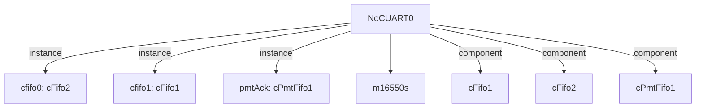

# 模块 `NoCUART0`

- 源文件：`rtl/rtl/IONet/UART/NoCUART0.v`。
- 职责：AI 推断：基于NoC的UART桥接模块，负责将NoC驱动事件与UART核心进行协议转换和同步。
- 说明：模块通过cfifo0接收NoC驱动事件i_drvFNoc，经pmtAck和cfifo1延迟链处理后输出o_drv2Noc，同时连接uart_instance实现串行通信功能，表明其作为NoC与UART之间的适配层

## 1. 层级位置

- Parents：`IONet_slot`。
- Children：`m16550s`。
- Component children：`cFifo1`, `cFifo2`, `cPmtFifo1`。
- Upstream modules：无。
- Downstream modules：无。

### 1.1 本模块结构图



```text
NoCUART0
|-- cfifo0: cFifo2
|-- cfifo1: cFifo1
|-- pmtAck: cPmtFifo1
|-- m16550s
|-- cFifo1
|-- cFifo2
`-- cPmtFifo1
```

## 2. 输入/输出接口摘要

- 接收：drive 输入：`i_drvFNoc`；数据输入：`i_dataFNoc_51`；free 输入：`i_freeFNoc`；其他输入：`BRGE`, `CLOCK`, `NCTS`, `NDCD`, `... +6`。
- 输出：drive 输出：`o_drv2Noc`；数据输出：`o_data2Noc_51`；free 输出：`o_free2Noc`；其他输出：`BAUD`, `IRQ`, `NDTR`, `NOUT1`, `... +3`。

### 2.1 端口分组

| 端口组 | 方向统计 | 代表信号 |
| --- | --- | --- |
| `clock_reset_init` | input:3 | `RCLK`, `RCLK_BAUD`, `rst_finish` |
| `drive_event` | input:1, output:1 | `i_drvFNoc`, `o_drv2Noc` |
| `free_backpressure` | input:1, output:1 | `i_freeFNoc`, `o_free2Noc` |
| `other_ports` | input:8, output:8 | `i_dataFNoc_51`, `o_data2Noc_51`, `BRGE`, `CLOCK`, `NCTS`, `NDCD`, `NDSR`, `NRI`, `SIN`, `BAUD`, `... +6` |

## 3. Drive/Data/Free 契约

| Interface | 方向 | Event | Payload | Free/backpressure |
| --- | --- | --- | --- | --- |
| `i_drvFNoc` | input | `i_drvFNoc` | `i_dataFNoc_51 [50:0]` | 未记录 |
| `o_drv2Noc` | output | `o_drv2Noc` | `o_data2Noc_51 [50:0]` | 未记录 |

## 4. 主要 Drive-centered Flow

### `i_drvFNoc`

- 确定性事实：`i_drvFNoc to o_drv2Noc`；flow_id=`flow_000_NoCUART0_i_drvFNoc`。
- Payload：`i_drvFNoc` -> `i_dataFNoc_51 [50:0]`, `o_drv2Noc` -> `o_data2Noc_51 [50:0]`。
- 输出/影响：`o_drv2Noc`。
- 结构复杂度：branch=0，join=0，blocking=3。
- AI 推断：事件流仅传递驱动信号，数据打包通过独立赋值完成，两者在输出端口o_drv2Noc处结合。


## 5. 内部组件与 assign 影响

### 5.1 内部组件

| 实例 | 类型 | 输入事件 | 输出事件 |
| --- | --- | --- | --- |
| `cfifo0` | `cFifo2` | `i_drvFNoc` | `w_drv2Pmt` |
| `cfifo1` | `cFifo1` | `w_drv2fifo1_delay` | `w_drv2Noc_delay` |
| `pmtAck` | `cPmtFifo1` | `w_drv2Pmt` | `w_drv2fifo1` |

### 5.2 assign 影响

| Assign | Impact area | LHS | RHS 摘要 | 解释状态 |
| --- | --- | --- | --- | --- |
| `assign_0` | data_path | `o_data2Noc_51` | {r_dataFNoc_51[50],r_dataFNoc_51[49:42],r_dataHigh,ReceiveData,r_X,r_Y} | 证据不足：No Semantic Layer assignment interpretation is available. |
