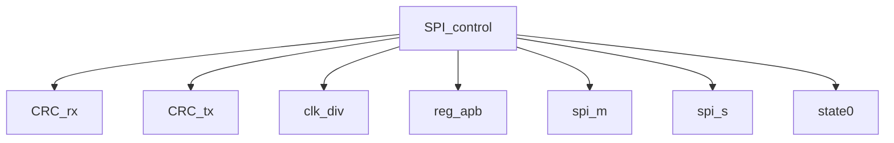

# 模块 `SPI_control`

- 源文件：`rtl/rtl/IONet/SPI/SPI1/SPI_control.v`。
- 职责：AI 推断：SPI 主从控制器，通过 APB 接口配置寄存器，管理 SPI 协议时序、时钟分频、CRC 校验及中断生成。。
- 说明：模块通过 reg_apb_u 实例接收 APB 总线配置，内部包含 spi_m_u（主模式）、spi_s_u（从模式）、clk_div_u（时钟分频）、CRC_rx_u/CRC_tx_u（CRC 校验）和 MODF_u/OVR_u（错误检测）子模块，共同实现 SPI 协议控制。

## 1. 层级位置

- Parents：`SPI2NoC`。
- Children：`CRC_rx`, `CRC_tx`, `clk_div`, `reg_apb`, `spi_m`, `spi_s`, `state0`。
- Component children：无。
- Upstream modules：无。
- Downstream modules：无。

### 1.1 本模块结构图



```text
SPI_control
|-- CRC_rx
|-- CRC_tx
|-- clk_div
|-- reg_apb
|-- spi_m
|-- spi_s
`-- state0
```

## 2. 输入/输出接口摘要

- 接收：数据输入：`PADDR`, `PWDATA`；其他输入：`PENABLE`, `PSEL`, `PWRITE`, `clk`, `... +5`。
- 输出：数据输出：`PRDATA`；其他输出：`PREADY`, `PSLVERR`, `SPI_interrupt`, `io_ctl_miso`, `... +8`。

### 2.1 端口分组

| 端口组 | 方向统计 | 代表信号 |
| --- | --- | --- |
| `clock_reset_init` | input:3, output:2 | `clk`, `rst_n`, `sclk_in`, `io_ctl_sclk`, `sclk_out` |
| `other_ports` | input:8, output:11 | `PADDR`, `PWDATA`, `PRDATA`, `PENABLE`, `PSEL`, `PWRITE`, `miso_in`, `mosi_in`, `nss_in`, `PREADY`, `... +9` |

## 3. Drive/Data/Free 契约

| Interface | 方向 | Event | Payload | Free/backpressure |
| --- | --- | --- | --- | --- |
| `data_inputs` | input | - | `PADDR [7:0]`, `PWDATA [31:0]` | 未记录 |
| `data_outputs` | output | - | `PRDATA [31:0]` | 未记录 |

## 4. 主要 Drive-centered Flow

- 证据不足：Manual Context 未提供本模块 drive flow。

## 5. 内部组件与 assign 影响

### 5.1 内部组件

| 实例 | 类型 | 输入事件 | 输出事件 |
| --- | --- | --- | --- |
| - | - | - | Manual Context 未提供 primary internal component |

### 5.2 assign 影响

| Assign | Impact area | LHS | RHS 摘要 | 解释状态 |
| --- | --- | --- | --- | --- |
| `assign_1` | unknown | `io_ctl_sclk` | MSTR ? 1'b1 : 1'b0 | AI 推断：根据 MSTR 和双向模式配置，控制 SPI IO 方向选择。 |
| `assign_2` | unknown | `io_ctl_miso` | MSTR ? 1'b0 : ((BIDIMODE & !BIDIOE) ? 1'b0 : 1'b1) | AI 推断：根据 MSTR 和双向模式配置，控制 SPI IO 方向选择。 |
| `assign_3` | unknown | `io_ctl_mosi` | MSTR ? ((BIDIMODE & !BIDIOE) ? 1'b0 : 1'b1) : 1'b0 | AI 推断：根据 MSTR 和双向模式配置，控制 SPI IO 方向选择。 |
| `assign_4` | unknown | `io_ctl_nss` | (MSTR & SSOE) ? 1'b1 : 1'b0 | AI 推断：根据 MSTR 和双向模式配置，控制 SPI IO 方向选择。 |
| `assign_5` | unknown | `nss_reg` | SSM ? SSI : nss_in | AI 推断：软件 NSS 管理，通过 SSM 和 SSI 寄存器选择内部或外部 NSS 信号。 |
| `assign_6` | unknown | `mosi_out` | (BIDIMODE & !BIDIOE) ? 1'b0 : tx_m | AI 推断：双向模式下控制 MOSI 输出数据，非双向模式直接输出 tx_m。 |
| `assign_12` | unknown | `SPI_interrupt` | (RXNE & RXNEIE) \| ((MODF \| OVR \| CRCERR) & ERRIE) \| (TXE & TXEIE) \| 1'b0 | AI 推断：组合多个中断源生成 SPI 中断信号，包括接收、发送、错误状态。 |
| `assign_0` | unknown | `sclk_out` | CPOL ? ~sclk_out_div : sclk_out_div | AI 推断：根据 CPOL 极性选择分频时钟，生成 SPI 串行时钟输出。 |
