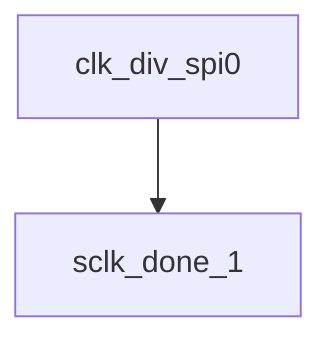

# 模块 `clk_div_spi0`

- 源文件：`rtl/rtl/IONet/SPI/SPI0/clk_div_spi0.v`。
- 职责：AI 推断：sclk_m由nss_out和cnt[BR]决定，实现片选使能下的可编程分频；sclk_out由bit8_out门控，确保仅在数据窗口输出时钟。。
- 说明：assign sclk_m = nss_out ? 1'b0 : cnt[BR]（slice5 line105）直接使用组合逻辑，当nss_out为1时强制为0，否则输出cnt中由BR选择的位置。assign sclk_out = bit8_out ? sclk_m : 1'b0（slice5 line106）用bit8_out门控sclk_m，bit8_out由sclk_cnt != 0组合生成（slice5 line104），实现了数据传输窗口内的时钟门控，符合结构责任声明。

## 1. 层级位置

- Parents：`spi_master_spi0`。
- Children：`sclk_done_1`。
- Component children：无。
- Upstream modules：无。
- Downstream modules：无。

### 1.1 本模块结构图



```text
clk_div_spi0
`-- sclk_done_1
```

## 2. 输入/输出接口摘要

- 接收：数据输入：`BR`；其他输入：`M_en`, `clk`, `rst_n`。
- 输出：数据输出：`sclk_cnt`；其他输出：`nss_out`, `sclk_m`, `sclk_out`。

### 2.1 端口分组

| 端口组 | 方向统计 | 代表信号 |
| --- | --- | --- |
| `clock_reset_init` | input:2, output:3 | `sclk_cnt`, `clk`, `rst_n`, `sclk_m`, `sclk_out` |
| `other_ports` | input:2, output:1 | `BR`, `M_en`, `nss_out` |

## 3. Drive/Data/Free 契约

| Interface | 方向 | Event | Payload | Free/backpressure |
| --- | --- | --- | --- | --- |
| `data_inputs` | input | - | `BR [2:0]` | 未记录 |
| `data_outputs` | output | - | `sclk_cnt [5:0]` | 未记录 |

## 4. 主要 Drive-centered Flow

- 证据不足：Manual Context 未提供本模块 drive flow。

## 5. 内部组件与 assign 影响

### 5.1 内部组件

| 实例 | 类型 | 输入事件 | 输出事件 |
| --- | --- | --- | --- |
| - | - | - | Manual Context 未提供 primary internal component |

### 5.2 assign 影响

| Assign | Impact area | LHS | RHS 摘要 | 解释状态 |
| --- | --- | --- | --- | --- |
| `assign_1` | unknown | `sclk_m` | nss_out ? 1'b0 : cnt[BR] | AI 推断：最终SPI主时钟输出，由bit8_out使能信号门控sclk_m，仅在数据传输位期间输出有效时钟。 |
| `assign_2` | unknown | `sclk_out` | bit8_out ? sclk_m : 1'b0 | AI 推断：该信号作为数据传输使能标志，当sclk_cnt非零时有效，用于门控sclk_out的输出。 |
| `assign_0` | unknown | `bit8_out` | (sclk_cnt != 0) ? 1'b1 : 1'b0 | AI 推断：该信号作为数据传输使能标志，当sclk_cnt非零时有效，用于门控sclk_out的输出。 |
