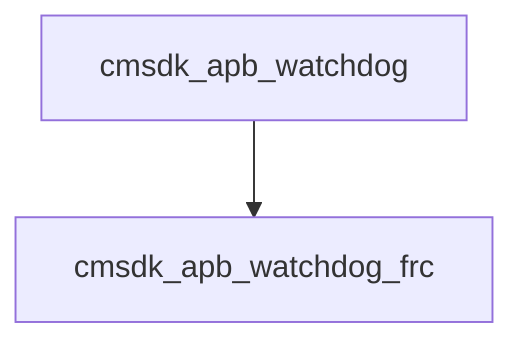

# 模块 `cmsdk_apb_watchdog`

- 源文件：`rtl/rtl/IONet/Watchdog/cmsdk_apb_watchdog.v`。
- 职责：AI 推断：该模块是APB总线接口的看门狗定时器顶层，负责将APB总线协议转换为内部看门狗功能子模块的控制与数据。。
- 说明：模块通过assign逻辑将APB地址、数据和控制信号解码为内部写使能信号（如wdog_lock_wr_en、wdog_itcr_wr_en），并驱动子模块u_apb_watchdog_frc。输出WDOGINT和WDOGRES通过wdog_itcr选择来自子模块的真实中断/复位或测试模式信号。

## 1. 层级位置

- Parents：`wd2noc`。
- Children：`cmsdk_apb_watchdog_frc`。
- Component children：无。
- Upstream modules：无。
- Downstream modules：无。

### 1.1 本模块结构图



```text
cmsdk_apb_watchdog
`-- cmsdk_apb_watchdog_frc
```

## 2. 输入/输出接口摘要

- 接收：数据输入：`ECOREVNUM`, `PADDR`, `PWDATA`；其他输入：`PCLK`, `PENABLE`, `PRESETn`, `PSEL`, `... +4`。
- 输出：数据输出：`PRDATA`；其他输出：`WDOGINT`, `WDOGRES`。

### 2.1 端口分组

| 端口组 | 方向统计 | 代表信号 |
| --- | --- | --- |
| `clock_reset_init` | input:4 | `PCLK`, `PRESETn`, `WDOGCLK`, `WDOGCLKEN` |
| `other_ports` | input:7, output:3 | `ECOREVNUM`, `PADDR`, `PWDATA`, `PRDATA`, `PENABLE`, `PSEL`, `PWRITE`, `WDOGRESn`, `WDOGINT`, `WDOGRES` |

## 3. Drive/Data/Free 契约

| Interface | 方向 | Event | Payload | Free/backpressure |
| --- | --- | --- | --- | --- |
| `data_inputs` | input | - | `ECOREVNUM [3:0]`, `PADDR [11:2]`, `PWDATA [31:0]` | 未记录 |
| `data_outputs` | output | - | `PRDATA [31:0]` | 未记录 |

## 4. 主要 Drive-centered Flow

- 证据不足：Manual Context 未提供本模块 drive flow。

## 5. 内部组件与 assign 影响

### 5.1 内部组件

| 实例 | 类型 | 输入事件 | 输出事件 |
| --- | --- | --- | --- |
| - | - | - | Manual Context 未提供 primary internal component |

### 5.2 assign 影响

| Assign | Impact area | LHS | RHS 摘要 | 解释状态 |
| --- | --- | --- | --- | --- |
| `assign_1` | control_path | `wdog_lock_wr_en` | (PADDR == {`ARM_WDOGLA,`ARM_WDOGLOCKA}) ? ((PSEL & PWRITE) & (~PENABLE)) : 1'b0 | AI 推断：该assign生成看门狗锁定寄存器的写使能，用于保护关键配置不被意外修改。 |
| `assign_2` | control_path | `wdog_lock_wr_val` | (PWDATA == 32'h1ACCE551) ? 1'b0 : 1'b1 | AI 推断：该assign生成看门狗锁定寄存器的写使能，用于保护关键配置不被意外修改。 |
| `assign_3` | control_path | `wdog_itcr_wr_en` | (PADDR == {`ARM_WDOGIA,`ARM_WDOGTCRA}) ? (PSEL & PWRITE & (~PENABLE) & (~wdog_lock)) : 1'b0 | AI 推断：该assign生成中断测试控制寄存器的写使能，仅在看门狗未锁定时允许写入。 |
| `assign_4` | control_path | `wdog_itop_wr_en` | (PADDR == {`ARM_WDOGIA,`ARM_WDOGTOPA}) ? (PSEL & PWRITE & (~PENABLE) & (~wdog_lock)) : 1'b0 | AI 推断：该assign生成中断测试输出寄存器的写使能，同样受锁定保护。 |
| `assign_5` | control_path | `prdata_next_en` | PSEL & (~PWRITE) & (~PENABLE) | 证据不足：No Semantic Layer assignment interpretation is available. |
| `assign_6` | data_path | `PRDATA` | i_prdata | 证据不足：No Semantic Layer assignment interpretation is available. |
| `assign_7` | unknown | `WDOGINT` | (wdog_itcr == 1'b0) ? i_wdogint : wdog_itop[1] | AI 推断：该assign生成中断测试输出寄存器的写使能，同样受锁定保护。 |
| `assign_8` | unknown | `WDOGRES` | (wdog_itcr == 1'b0) ? i_wdogres : wdog_itop[0] | AI 推断：该assign生成中断测试输出寄存器的写使能，同样受锁定保护。 |
| `assign_0` | control_path | `frc_sel` | (PSEL & (PADDR [11:5] == `ARM_WDOG1A)) ? 1'b1 : 1'b0 | 证据不足：No Semantic Layer assignment interpretation is available. |
