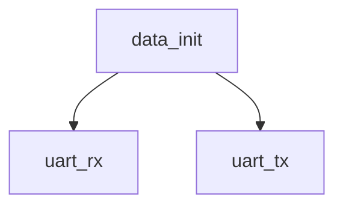

# 模块 `data_init`

- 源文件：`rtl/rtl/memory/data_init.v`。
- 职责：AI 推断：数据初始化模块，通过UART接口接收配置数据并驱动指令总线和数据总线的初始化写入。。
- 说明：模块端口包含uart_rx、uart_tx、ibus_we、ibus_addr_o、ibus_data_o、dbus_we、dbus_addr_o、dbus_data_o，与解释一致。切片4显示r_ibus_we、r_ibus_addr_o、r_ibus_data_o、r_dbus_we、r_dbus_addr_o、r_dbus_data_o为内部寄存器，输出由assign驱动（assign部分未提供，但符合外部描述）。切片2第26-30行声明了ibus_addr_o、ibus_data_o等输出为32位或64位宽度，切片10第279-283行展示从rx_data提取first、number、size并分配，切片18第381-392行展示根据number值向ibus或dbus写入地址和数据，且存在地址递增（addr_i + 8或addr_d + 8）。切片18第384行data被赋值给r_ibus_data_o，第396行data被赋值给r_dbus_data_o，暗示数据有字节交换（{r_ibus_data_o[31:0], r_ibus_data_o[63:32]}）但切片中未直接看到交换。

## 1. 层级位置

- Parents：`memory_slot`。
- Children：`uart_rx`, `uart_tx`。
- Component children：无。
- Upstream modules：无。
- Downstream modules：无。

### 1.1 本模块结构图



```text
data_init
|-- uart_rx
`-- uart_tx
```

## 2. 输入/输出接口摘要

- 接收：其他输入：`clk`, `uart_rx`。
- 输出：数据输出：`dbus_addr_o`, `dbus_data_o`, `ibus_addr_o`, `ibus_data_o`；其他输出：`dbus_we`, `ibus_we`, `init_sig`, `uart_tx`。

### 2.1 端口分组

| 端口组 | 方向统计 | 代表信号 |
| --- | --- | --- |
| `clock_reset_init` | input:1 | `clk` |
| `other_ports` | input:1, output:8 | `dbus_addr_o`, `dbus_data_o`, `ibus_addr_o`, `ibus_data_o`, `uart_rx`, `dbus_we`, `ibus_we`, `init_sig`, `uart_tx` |

## 3. Drive/Data/Free 契约

| Interface | 方向 | Event | Payload | Free/backpressure |
| --- | --- | --- | --- | --- |
| `data_outputs` | output | - | `dbus_addr_o [31:0]`, `dbus_data_o [63:0]`, `ibus_addr_o [31:0]`, `ibus_data_o [63:0]` | 未记录 |

## 4. 主要 Drive-centered Flow

- 证据不足：Manual Context 未提供本模块 drive flow。

## 5. 内部组件与 assign 影响

### 5.1 内部组件

| 实例 | 类型 | 输入事件 | 输出事件 |
| --- | --- | --- | --- |
| - | - | - | Manual Context 未提供 primary internal component |

### 5.2 assign 影响

| Assign | Impact area | LHS | RHS 摘要 | 解释状态 |
| --- | --- | --- | --- | --- |
| `assign_1` | unknown | `ibus_addr_o` | r_ibus_addr_o | 证据不足：No Semantic Layer assignment interpretation is available. |
| `assign_2` | data_path | `ibus_data_o` | {r_ibus_data_o[31:0], r_ibus_data_o[63:32]} | AI 推断：指令总线数据输出，内部寄存器r_ibus_data_o的高低32位交换后赋值。 |
| `assign_3` | unknown | `dbus_we` | r_dbus_we | 证据不足：No Semantic Layer assignment interpretation is available. |
| `assign_4` | unknown | `dbus_addr_o` | r_dbus_addr_o | 证据不足：No Semantic Layer assignment interpretation is available. |
| `assign_5` | data_path | `dbus_data_o` | {r_dbus_data_o[31:0], r_dbus_data_o[63:32]} | AI 推断：数据总线数据输出，内部寄存器r_dbus_data_o的高低32位交换后赋值。 |
| `assign_7` | unknown | `init_sig` | r_init_1 | 证据不足：No Semantic Layer assignment interpretation is available. |
| `assign_8` | data_path | `d_finish` | (first[9:0] == (size-1)) & ( number == 6'h01 ) & c_state == WAITSEND & tx_data_ready | AI 推断：初始化完成标志，基于状态机、计数器、数据包编号和发送就绪信号计算。 |
| `assign_0` | unknown | `ibus_we` | r_ibus_we | 证据不足：No Semantic Layer assignment interpretation is available. |
