# 模块 `execute`

- 源文件：`rtl/rtl/Execute/execute.v`。
- 职责：AI 推断：执行模块是处理器流水线的执行阶段，负责接收来自发射阶段（Launch）的指令，从通用寄存器组（GRF）和加载存储单元（LSU）获取操作数，执行算术逻辑运算，并将结果写回或发送给后续阶段。。
- 说明：模块通过事件驱动接口接收来自发射、GRF和LSU的驱动信号，并输出驱动信号到发射、异常处理、GRF和LSU。数据输入包括来自GRF的64位数据、来自发射的207位指令数据和来自LSU的64位数据。内部包含大量用于操作数选择、运算执行和结果合并的组件，如exeSelector、adder、muller等。

## 1. 层级位置

- Parents：`cpu_top_all`。
- Children：`adder`, `align`, `ander`, `contTap`, `div`, `eor`, `hsb`, `muller`, `orrer`, `reverse`, `satQ`, `shifter`。
- Component children：`cFifo1`, `cFifo1_32b_exe`, `cFifo1_33b_exe`, `cFifo1_64b_exe`, `cFifo1_66b_exe`, `cMutexMerge10_64b_exe`, `cMutexMerge2_1b`, `cMutexMerge2_32b_exe`, `cMutexMerge2_64b_exe`, `cMutexMerge5_128b_exe`, `cSelector11_68b_exe`, `cSelector2_1b`, `cSelector2_33b_exe`, `cSelector2_65b_exe`, `cSelector3_42b_exe`, `cSelector5_36b_exe`, `cSelector6_36b_exe`, `cSplitter2_12_4_8b_exe`, `cSplitter2_64b_exe`, `cSplitter3_169_41_4_132b_exe`, `cSplitter4_4b_exe`, `cWaitMerge2_128b_exe`, `cWaitMerge2_163b_exe`, `cWaitMerge2_32_1_33b_exe`, `cWaitMerge2_64b_exe`。
- Upstream modules：无。
- Downstream modules：无。

### 1.1 本模块结构图

```mermaid
flowchart TB
  execute["execute"] -->|instance| AddWaitMerge_cWaitMerge2_64b_exe["AddWaitMerge: cWaitMerge2_64b_exe"]
  execute["execute"] -->|instance| AndWaitMerge_cWaitMerge2_64b_exe["AndWaitMerge: cWaitMerge2_64b_exe"]
  execute["execute"] -->|instance| EorWaitMerge_cWaitMerge2_64b_exe["EorWaitMerge: cWaitMerge2_64b_exe"]
  execute["execute"] -->|instance| OrWaitMerge_cWaitMerge2_64b_exe["OrWaitMerge: cWaitMerge2_64b_exe"]
  execute["execute"] -->|instance| SatQWaitMerge_cWaitMerge2_64b_exe["SatQWaitMerge: cWaitMerge2_64b_exe"]
  execute["execute"] -->|instance| finalWaitMerge_cWaitMerge2_163b_exe["finalWaitMerge: cWaitMerge2_163b_exe"]
  execute["execute"] -->|instance| mulWaitMerge_cWaitMerge2_128b_exe["mulWaitMerge: cWaitMerge2_128b_exe"]
  execute["execute"] -->|instance| regMerge_cWaitMerge2_64b_exe["regMerge: cWaitMerge2_64b_exe"]
  execute["execute"] -->|instance| rele0Merge_cWaitMerge2_32_1_33b_exe["rele0Merge: cWaitMerge2_32_1_33b_exe"]
  execute["execute"] -->|instance| rele1Merge_cWaitMerge2_32_1_33b_exe["rele1Merge: cWaitMerge2_32_1_33b_exe"]
  execute["execute"] -->|instance| rele2Merge_cWaitMerge2_32_1_33b_exe["rele2Merge: cWaitMerge2_32_1_33b_exe"]
  execute["execute"] -->|instance| rele3Merge_cWaitMerge2_32_1_33b_exe["rele3Merge: cWaitMerge2_32_1_33b_exe"]
  execute["execute"] -->|instance| addMutexMerge_cMutexMerge5_128b_exe["addMutexMerge: cMutexMerge5_128b_exe"]
  execute["execute"] -->|instance| andMutexMerge_cMutexMerge2_64b_exe["andMutexMerge: cMutexMerge2_64b_exe"]
  execute["execute"] -->|instance| eorMutexMerge_cMutexMerge2_64b_exe["eorMutexMerge: cMutexMerge2_64b_exe"]
  execute["execute"] -->|instance| lsuMerge_cMutexMerge2_1b["lsuMerge: cMutexMerge2_1b"]
  execute["execute"] -->|instance| orMutexMerge_cMutexMerge2_64b_exe["orMutexMerge: cMutexMerge2_64b_exe"]
  execute["execute"] -->|instance| resMutexMerge_cMutexMerge10_64b_exe["resMutexMerge: cMutexMerge10_64b_exe"]
  execute["execute"] -->|instance| rs1Merge_cMutexMerge2_32b_exe["rs1Merge: cMutexMerge2_32b_exe"]
  execute["execute"] -->|instance| rs2Merge_cMutexMerge2_32b_exe["rs2Merge: cMutexMerge2_32b_exe"]
  execute["execute"] --> adder["adder"]
  execute["execute"] --> align["align"]
  execute["execute"] --> ander["ander"]
  execute["execute"] --> contTap["contTap"]
```



```text
execute
|-- AddWaitMerge: cWaitMerge2_64b_exe
|-- AndWaitMerge: cWaitMerge2_64b_exe
|-- EorWaitMerge: cWaitMerge2_64b_exe
|-- OrWaitMerge: cWaitMerge2_64b_exe
|-- SatQWaitMerge: cWaitMerge2_64b_exe
|-- finalWaitMerge: cWaitMerge2_163b_exe
|-- mulWaitMerge: cWaitMerge2_128b_exe
|-- regMerge: cWaitMerge2_64b_exe
|-- rele0Merge: cWaitMerge2_32_1_33b_exe
|-- rele1Merge: cWaitMerge2_32_1_33b_exe
|-- rele2Merge: cWaitMerge2_32_1_33b_exe
|-- rele3Merge: cWaitMerge2_32_1_33b_exe
|-- addMutexMerge: cMutexMerge5_128b_exe
|-- andMutexMerge: cMutexMerge2_64b_exe
|-- eorMutexMerge: cMutexMerge2_64b_exe
|-- lsuMerge: cMutexMerge2_1b
|-- orMutexMerge: cMutexMerge2_64b_exe
|-- resMutexMerge: cMutexMerge10_64b_exe
|-- rs1Merge: cMutexMerge2_32b_exe
|-- rs2Merge: cMutexMerge2_32b_exe
|-- adder
|-- align
|-- ander
`-- contTap
```
- 图中仅展示前 24 个结构节点，其余 33 个节点见层级字段或组件表。

## 2. 输入/输出接口摘要

- 接收：drive 输入：`i_LsuDriveToExe_1`, `i_grfDriveToExecute_1`, `i_launchDriveToExecute_1`, `i_launchDrive_1`；数据输入：`i_grfToExecuteData_64`, `i_launchDataToExe_207`, `i_lsuToExeData_64`；控制输入：`i_wen_2`；free 输入：`i_executeFreeFromExcp_1`, `i_executeFreeFromGrf_1`, `i_executeFreeFromLaunchByPath_1`, `i_executeFreeFromLsu_1`。
- 输出：drive 输出：`o_exeByPathDriveToLaunch_1`, `o_exeDriveToExcp_1`, `o_executeDriveToGrf_1`, `o_executeDriveToLsu_1`；数据输出：`o_exeToExcpData_36`, `o_exeToLaunchData_96`, `o_executeDataToLsu_163`, `o_executeToGrfData_8`；控制输出：`o_executeInUseFlag_1`, `o_grfFlag_1`, `o_wen_2`；free 输出：`o_executeFreeToGrf_1`, `o_executeFreeToLaunch_1`, `o_lsuFreeFromExecute_1`。

### 2.1 端口分组

| 端口组 | 方向统计 | 代表信号 |
| --- | --- | --- |
| `drive_event` | input:4, output:4 | `i_LsuDriveToExe_1`, `i_grfDriveToExecute_1`, `i_launchDriveToExecute_1`, `i_launchDrive_1`, `o_exeByPathDriveToLaunch_1`, `o_exeDriveToExcp_1`, `o_executeDriveToGrf_1`, `o_executeDriveToLsu_1` |
| `free_backpressure` | input:4, output:3 | `i_executeFreeFromExcp_1`, `i_executeFreeFromGrf_1`, `i_executeFreeFromLaunchByPath_1`, `i_executeFreeFromLsu_1`, `o_executeFreeToGrf_1`, `o_executeFreeToLaunch_1`, `o_lsuFreeFromExecute_1` |
| `other_ports` | input:4, output:7 | `i_grfToExecuteData_64`, `i_launchDataToExe_207`, `i_lsuToExeData_64`, `o_exeToExcpData_36`, `o_exeToLaunchData_96`, `o_executeDataToLsu_163`, `o_executeToGrfData_8`, `i_wen_2`, `o_executeInUseFlag_1`, `o_grfFlag_1`, `... +1` |

## 3. Drive/Data/Free 契约

| Interface | 方向 | Event | Payload | Free/backpressure |
| --- | --- | --- | --- | --- |
| `i_LsuDriveToExe_1` | input | `i_LsuDriveToExe_1` | `i_lsuToExeData_64 [63:0]` | `o_lsuFreeFromExecute_1` |
| `i_grfDriveToExecute_1` | input | `i_grfDriveToExecute_1` | `i_grfToExecuteData_64 [63:0]` | `o_executeFreeToGrf_1` |
| `i_launchDriveToExecute_1` | input | `i_launchDriveToExecute_1` | `i_launchDataToExe_207 [206:0]` | `o_executeFreeToLaunch_1` |
| `i_launchDrive_1` | input | `i_launchDrive_1` | `i_launchDataToExe_207 [206:0]` | `o_executeFreeToLaunch_1` |
| `o_exeByPathDriveToLaunch_1` | output | `o_exeByPathDriveToLaunch_1` | `o_exeToLaunchData_96 [95:0]` | `i_executeFreeFromLaunchByPath_1` |
| `o_exeDriveToExcp_1` | output | `o_exeDriveToExcp_1` | `o_exeToExcpData_36 [35:0]` | `i_executeFreeFromExcp_1` |
| `o_executeDriveToGrf_1` | output | `o_executeDriveToGrf_1` | `o_executeToGrfData_8 [7:0]` | `i_executeFreeFromGrf_1` |
| `o_executeDriveToLsu_1` | output | `o_executeDriveToLsu_1` | `o_executeDataToLsu_163 [162:0]` | `i_executeFreeFromLsu_1` |

## 4. 主要 Drive-centered Flow

### `i_LsuDriveToExe_1`

- 确定性事实：`execute flow from i_LsuDriveToExe_1`；flow_id=`flow_002_execute_i_LsuDriveToExe_1`。
- Payload：`i_LsuDriveToExe_1` -> `i_lsuToExeData_64 [63:0]`。
- 输出/影响：证据不足：Knowledge IR did not find a module output endpoint for this flow.。
- 结构复杂度：branch=2，join=8，blocking=6。
- AI 推断：最终手册应重点描述LSU驱动事件如何通过合并器、选择器和拆分器形成多路径分发，以及数据负载的关联方式。

### `i_grfDriveToExecute_1`

- 确定性事实：`execute flow from i_grfDriveToExecute_1`；flow_id=`flow_001_execute_i_grfDriveToExecute_1`。
- Payload：`i_grfDriveToExecute_1` -> `i_grfToExecuteData_64 [63:0]`。
- 输出/影响：证据不足：Knowledge IR did not find a module output endpoint for this flow.。
- 结构复杂度：branch=3，join=7，blocking=5。
- AI 推断：64 位数据信号 i_grfToExecuteData_64 作为 GRF 驱动事件的伴随载荷，随事件流传播。

### `i_launchDriveToExecute_1`

- 确定性事实：`execute flow from i_launchDriveToExecute_1`；flow_id=`flow_000_execute_i_launchDriveToExecute_1`。
- Payload：`i_launchDriveToExecute_1` -> `i_launchDataToExe_207 [206:0]`。
- 输出/影响：证据不足：Knowledge IR did not find a module output endpoint for this flow.。
- 结构复杂度：branch=7，join=18，blocking=16。
- AI 推断：数据信号与驱动事件并行输入，数据解包为后续所有运算提供指令上下文

### `i_launchDrive_1`

- 确定性事实：`execute flow from i_launchDrive_1`；flow_id=`flow_003_execute_i_launchDrive_1`。
- Payload：`i_launchDrive_1` -> `i_launchDataToExe_207 [206:0]`。
- 输出/影响：证据不足：Knowledge IR did not find a module output endpoint for this flow.。
- 结构复杂度：branch=0，join=0，blocking=0。
- AI 推断：207位载荷i_launchDataToExe_207是此流中唯一的控制与数据载体，其解包结果直接驱动执行阶段的所有后续操作。


## 5. 内部组件与 assign 影响

### 5.1 内部组件

| 实例 | 类型 | 输入事件 | 输出事件 |
| --- | --- | --- | --- |
| `AddWaitMerge` | `cWaitMerge2_64b_exe` | 无 | 无 |
| `AndWaitMerge` | `cWaitMerge2_64b_exe` | 无 | 无 |
| `EorWaitMerge` | `cWaitMerge2_64b_exe` | 无 | 无 |
| `OrWaitMerge` | `cWaitMerge2_64b_exe` | 无 | 无 |
| `SatQWaitMerge` | `cWaitMerge2_64b_exe` | 无 | 无 |
| `finalWaitMerge` | `cWaitMerge2_163b_exe` | 无 | `w_executeDriveToLsu_1` |
| `mulWaitMerge` | `cWaitMerge2_128b_exe` | 无 | 无 |
| `regMerge` | `cWaitMerge2_64b_exe` | `w_rs1MergeDriveToRegMerge_1`, `w_rs2MergeDriveToRegMerge_1` | 无 |
| `rele0Merge` | `cWaitMerge2_32_1_33b_exe` | `w_LsuDriveToExe_1`, `w_rele4SplitterDriveToRelo0Merge_1` | `w_rele0MergeDriveToRele0Selector_1` |
| `rele1Merge` | `cWaitMerge2_32_1_33b_exe` | `w_grfResSplitterDriveToRelo1Merge_1`, `w_rele4SplitterDriveToRelo1Merge_1` | `w_rele1MergeDriveToRele1Selector_1` |
| `rele2Merge` | `cWaitMerge2_32_1_33b_exe` | `w_LsuDriveToExe_1`, `w_rele4SplitterDriveToRelo2Merge_1` | `w_rele2MergeDriveToRele2Selector_1` |
| `rele3Merge` | `cWaitMerge2_32_1_33b_exe` | `w_grfResSplitterDriveToRelo3Merge_1`, `w_rele4SplitterDriveToRelo3Merge_1` | `w_rele3MergeDriveToRele3Selector_1` |
| ... | ... | ... | ... | 其余 8 个组件省略 |

### 5.2 assign 影响

| Assign | Impact area | LHS | RHS 摘要 | 解释状态 |
| --- | --- | --- | --- | --- |
| `assign_1` | control_path | `{w_c_1,w_addtype1_3,w_msr_1,w_bfi_1,w_bfc_1,w_sbfx_1,w_ubfx_1,w_msbit_5,w_lsbit_5, w_isMultiLS_1,w_n_4,w_registerList_16, w_pc_32, w_load_1, w_loadStoreWidth_2, w_loadSign_1, w_isLS_1, w_writeRd_1, w_dHi_4, w_dLo_4, w_shift_3, w_P_1, w_W_1, w_U_1, w_S_1, w_grfFlag_1, w_opNot_1, w_isXt_1, w_shiftC_1, w_shiftS_1, w_shiftNum_1, w_revType_2, w_satqS_1, w_mulDivS_1, w_insPath_8, w_op3_32, w_op2_32, w_op1_32}` | i_launchDataToExe_207 | AI 推断：将207位发射数据解析为多个控制信号和操作数。 |
| `assign_2` | control_path | `o_grfFlag_1` | w_grfFlag_1 | 证据不足：No Semantic Layer assignment interpretation is available. |
| `assign_38` | data_path | `w_lsuR1Data_32` | w_rs1Addr_4 == w_preRdHiAddr_4 ? i_lsuToExeData_64[63:32] : i_lsuToExeData_64[31:0] | 证据不足：No Semantic Layer assignment interpretation is available. |
| `assign_39` | data_path | `w_lsuR2Data_32` | w_rs2Addr_4 == w_preRdHiAddr_4 ? i_lsuToExeData_64[63:32] : i_lsuToExeData_64[31:0] | 证据不足：No Semantic Layer assignment interpretation is available. |
| `assign_53` | data_path | `o_exeToLaunchData_96` | {w_nzcv_4,{28{1'b0}},r_resMutexMergeToFinalWaitMergeData_64} | AI 推断：构造发送到发射阶段的结果数据，包含NZCV标志和64位运算结果。 |
| `assign_56` | data_path | `w_address_32` | w_P_1 == 1'b1 ? o_executeDataToLsu_163[31:0] : o_executeDataToLsu_163[63:32] | 证据不足：No Semantic Layer assignment interpretation is available. |
| `assign_58` | data_path | `o_exeToExcpData_36` | {w_pc_32,w_excNum_4} | AI 推断：构造发送到异常处理单元的数据，包含PC和异常编号。 |
| `assign_0` | control_path | `o_wen_2` | i_wen_2 | 证据不足：No Semantic Layer assignment interpretation is available. |
