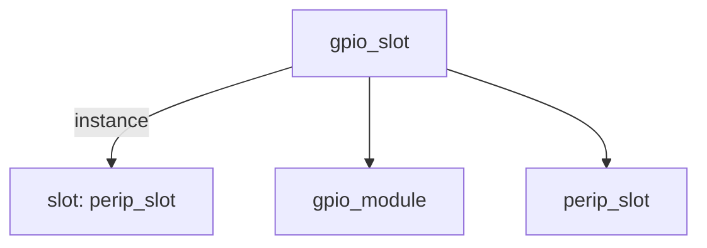

# 模块 `gpio_slot`

- 源文件：`rtl/rtl/IONet/GPIO/gpio_slot.v`。
- 职责：AI 推断：该模块是GPIO外设的槽位封装，负责将Mesh网络的事件驱动与自由信号路由到内部GPIO模块和外围槽位控制器。。
- 说明：模块通过i_driveFrmMesh事件触发，将data_from载荷转发至slot实例，同时将io_pin_i连接到gpio_module，并输出gpio_ctrl_o和gpio_data_o。o_driveNextToMesh和o_freeToMesh信号表明其参与Mesh网络的驱动链和自由链。

## 1. 层级位置

- Parents：`IONet_slot`。
- Children：`gpio_module`, `perip_slot`。
- Component children：无。
- Upstream modules：无。
- Downstream modules：无。

### 1.1 本模块结构图



```text
gpio_slot
|-- slot: perip_slot
|-- gpio_module
`-- perip_slot
```

## 2. 输入/输出接口摘要

- 接收：drive 输入：`i_driveFrmMesh`；数据输入：`data_from`, `io_pin_i`；free 输入：`i_freeNextFrmMesh`；其他输入：`clk`, `rst_finish`。
- 输出：drive 输出：`o_driveNextToMesh`；数据输出：`data_to`, `gpio_ctrl_o`, `gpio_data_o`；free 输出：`o_freeToMesh`；其他输出：`irq`。

### 2.1 端口分组

| 端口组 | 方向统计 | 代表信号 |
| --- | --- | --- |
| `clock_reset_init` | input:2 | `clk`, `rst_finish` |
| `gpio` | input:1, output:2 | `io_pin_i`, `gpio_ctrl_o`, `gpio_data_o` |
| `drive_event` | input:1, output:1 | `i_driveFrmMesh`, `o_driveNextToMesh` |
| `free_backpressure` | input:1, output:1 | `i_freeNextFrmMesh`, `o_freeToMesh` |
| `other_ports` | input:1, output:2 | `data_from`, `data_to`, `irq` |

## 3. Drive/Data/Free 契约

| Interface | 方向 | Event | Payload | Free/backpressure |
| --- | --- | --- | --- | --- |
| `i_driveFrmMesh` | input | `i_driveFrmMesh` | 未记录 | `o_freeToMesh` |
| `o_driveNextToMesh` | output | `o_driveNextToMesh` | 未记录 | `i_freeNextFrmMesh` |

## 4. 主要 Drive-centered Flow

### `i_driveFrmMesh`

- 确定性事实：`i_driveFrmMesh to o_driveNextToMesh`；flow_id=`flow_000_gpio_slot_i_driveFrmMesh`。
- Payload：未记录。
- 输出/影响：`o_driveNextToMesh`。
- 结构复杂度：branch=0，join=0，blocking=0。
- AI 推断：此流为纯控制事件流，不携带任何数据负载。


## 5. 内部组件与 assign 影响

### 5.1 内部组件

| 实例 | 类型 | 输入事件 | 输出事件 |
| --- | --- | --- | --- |
| `slot` | `perip_slot` | `i_driveFrmMesh` | `o_driveNextToMesh` |

### 5.2 assign 影响

| Assign | Impact area | LHS | RHS 摘要 | 解释状态 |
| --- | --- | --- | --- | --- |
| `assign_0` | data_path | `data_to` | {w_data_to[50:10],XY} | AI 推断：该赋值将w_data_to的高位与XY拼接，形成最终的data_to输出，用于Mesh网络的数据回传。 |
