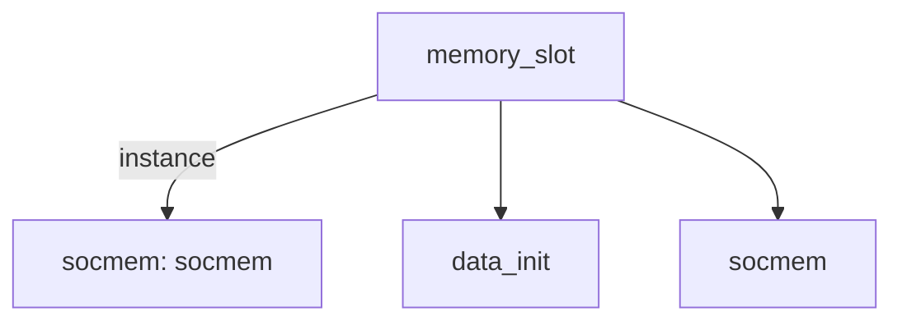

# 模块 `memory_slot`

- 源文件：`rtl/rtl/slot/memory_slot.v`。
- 职责：AI 推断：该模块是SoC内存子系统的顶层插槽，负责仲裁和转发来自IF（指令取指）和LSU（加载存储单元）的驱动事件，并管理数据初始化通道。。
- 说明：模块接收两个事件输入i_driveFrmIf和i_driveFrmLsu，并产生两个事件输出o_driveNextToIf和o_driveNextToLsu，表明其作为事件转发节点。同时，它包含一个数据初始化实例u_data_init，并通过assign逻辑在初始化模式与正常总线访问之间进行数据路径选择。

## 1. 层级位置

- Parents：`cpu_slot`。
- Children：`data_init`, `socmem`。
- Component children：无。
- Upstream modules：无。
- Downstream modules：无。

### 1.1 本模块结构图



```text
memory_slot
|-- socmem: socmem
|-- data_init
`-- socmem
```

## 2. 输入/输出接口摘要

- 接收：drive 输入：`i_driveFrmIf`, `i_driveFrmLsu`；数据输入：`i_dbus_addr`, `i_dbus_data`, `i_dbus_we`, `i_ibus_addr`, `... +2`；free 输入：`i_freeNextFrmIf`, `i_freeNextFrmLsu`；其他输入：`UART_INIT_SEL`, `clk`, `init_rx`, `rst_finish`。
- 输出：drive 输出：`o_driveNextToIf`, `o_driveNextToLsu`；数据输出：`o_dbus_data`, `o_ibus_data`；free 输出：`o_freeToIf`, `o_freeToLsu`；其他输出：`init_sig`, `init_tx`。

### 2.1 端口分组

| 端口组 | 方向统计 | 代表信号 |
| --- | --- | --- |
| `clock_reset_init` | input:2 | `clk`, `rst_finish` |
| `drive_event` | input:2, output:2 | `i_driveFrmIf`, `i_driveFrmLsu`, `o_driveNextToIf`, `o_driveNextToLsu` |
| `free_backpressure` | input:2, output:2 | `i_freeNextFrmIf`, `i_freeNextFrmLsu`, `o_freeToIf`, `o_freeToLsu` |
| `other_ports` | input:8, output:4 | `i_dbus_addr`, `i_dbus_data`, `i_dbus_we`, `i_ibus_addr`, `i_ibus_data`, `i_ibus_we`, `o_dbus_data`, `o_ibus_data`, `UART_INIT_SEL`, `init_rx`, `... +2` |

## 3. Drive/Data/Free 契约

| Interface | 方向 | Event | Payload | Free/backpressure |
| --- | --- | --- | --- | --- |
| `i_driveFrmIf` | input | `i_driveFrmIf` | 未记录 | `o_freeToIf` |
| `i_driveFrmLsu` | input | `i_driveFrmLsu` | 未记录 | `o_freeToLsu` |
| `o_driveNextToIf` | output | `o_driveNextToIf` | 未记录 | `i_freeNextFrmIf` |
| `o_driveNextToLsu` | output | `o_driveNextToLsu` | 未记录 | `i_freeNextFrmLsu` |

## 4. 主要 Drive-centered Flow

### `i_driveFrmIf`

- 确定性事实：`i_driveFrmIf to o_driveNextToIf, o_driveNextToLsu`；flow_id=`flow_000_memory_slot_i_driveFrmIf`。
- Payload：未记录。
- 输出/影响：`o_driveNextToIf`, `o_driveNextToLsu`。
- 结构复杂度：branch=1，join=1，blocking=0。
- AI 推断：最终手册应重点说明 socmem 实例如何接收来自 IF 的驱动事件，并将其转发或分支至 IF 和 LSU 下游路径。

### `i_driveFrmLsu`

- 确定性事实：`i_driveFrmLsu to o_driveNextToIf, o_driveNextToLsu`；flow_id=`flow_001_memory_slot_i_driveFrmLsu`。
- Payload：未记录。
- 输出/影响：`o_driveNextToIf`, `o_driveNextToLsu`。
- 结构复杂度：branch=1，join=1，blocking=0。
- AI 推断：应强调socmem作为事件分支节点的角色，并注明数据载荷和背压机制需RTL源码确认


## 5. 内部组件与 assign 影响

### 5.1 内部组件

| 实例 | 类型 | 输入事件 | 输出事件 |
| --- | --- | --- | --- |
| `socmem` | `socmem` | `i_driveFrmIf`, `i_driveFrmLsu` | `o_driveNextToIf`, `o_driveNextToLsu` |

### 5.2 assign 影响

| Assign | Impact area | LHS | RHS 摘要 | 解释状态 |
| --- | --- | --- | --- | --- |
| `assign_1` | unknown | `memory_ibus_we` | init_sig_temp2 ? {8{init_ibus_we}} : i_ibus_we | AI 推断：这些assign实现初始化模式下的写使能信号选择。 |
| `assign_2` | unknown | `memory_ibus_addr_i` | init_sig_temp2 ? {init_ibus_addr,1'b0}: i_ibus_addr | AI 推断：这些assign实现初始化模式下的地址信号选择。 |
| `assign_3` | data_path | `memory_ibus_data_i` | init_sig_temp2 ? init_ibus_data : i_ibus_data | AI 推断：这些assign实现初始化模式下的数据信号选择。 |
| `assign_4` | unknown | `memory_dbus_we` | init_sig_temp2 ? {8{init_dbus_we}} : i_dbus_we | AI 推断：这些assign实现初始化模式下的写使能信号选择。 |
| `assign_5` | unknown | `memory_dbus_addr_i` | init_sig_temp2 ? init_dbus_addr : i_dbus_addr | AI 推断：这些assign实现初始化模式下的地址信号选择。 |
| `assign_6` | data_path | `memory_dbus_data_i` | init_sig_temp2 ? init_dbus_data : i_dbus_data | AI 推断：这些assign实现初始化模式下的数据信号选择。 |
| `assign_7` | data_path | `o_ibus_data` | memory_ibus_data_o | AI 推断：这些assign将socmem的输出数据直接连接到模块输出。 |
| `assign_8` | data_path | `o_dbus_data` | memory_dbus_data_o | AI 推断：这些assign将socmem的输出数据直接连接到模块输出。 |
| `assign_0` | unknown | `init_sig` | init_sig_temp | 证据不足：No Semantic Layer assignment interpretation is available. |
