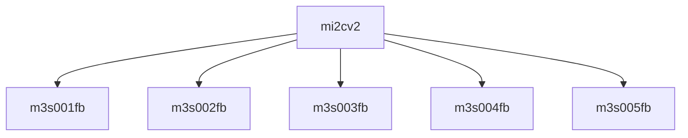

# 模块 `mi2cv2`

- 源文件：`rtl/rtl/IONet/IIC/mi2cv2.v`。
- 职责：AI 推断：mi2cv2 是 IONet IIC 子系统内的一个顶层模块，负责将 APB 总线接口（ADDRESS、WDATA、RDATA）转换为 I2C 总线协议（ISCL、ISDA、OSCL、OSDA），并管理电源隔离（CKISO、DAISO、DAGND）和驱动使能（ENDRV）。。
- 说明：模块通过实例化 U3 (m3s003fb) 和 U4 (m3s004fb) 处理 APB 寄存器读写（ADDRESS、WDATA、RDATA），通过 U2 和 U5 处理 I2C 总线信号（ISCL、ISDA、OSCL、OSDA），并通过 U4 输出电源隔离和驱动控制信号（CKISO、DAISO、DAGND、ENDRV），表明其核心角色是 APB-to-I2C 桥接与电源域管理。

## 1. 层级位置

- Parents：`I2C2NoC`。
- Children：`m3s001fb`, `m3s002fb`, `m3s003fb`, `m3s004fb`, `m3s005fb`。
- Component children：无。
- Upstream modules：无。
- Downstream modules：无。

### 1.1 本模块结构图



```text
mi2cv2
|-- m3s001fb
|-- m3s002fb
|-- m3s003fb
|-- m3s004fb
`-- m3s005fb
```

## 2. 输入/输出接口摘要

- 接收：数据输入：`ADDRESS`, `WDATA`；其他输入：`CLOCK`, `FSEN`, `HSEN`, `IFSDA`, `... +5`。
- 输出：数据输出：`RDATA`；其他输出：`CKISO`, `DAGND`, `DAISO`, `ENDRV`, `... +3`。

### 2.1 端口分组

| 端口组 | 方向统计 | 代表信号 |
| --- | --- | --- |
| `clock_reset_init` | input:1 | `RESETN` |
| `drive_event` | output:1 | `ENDRV` |
| `other_ports` | input:10, output:7 | `ADDRESS`, `WDATA`, `RDATA`, `CLOCK`, `FSEN`, `HSEN`, `IFSDA`, `ISCL`, `ISDA`, `RD`, `... +7` |

## 3. Drive/Data/Free 契约

| Interface | 方向 | Event | Payload | Free/backpressure |
| --- | --- | --- | --- | --- |
| `data_inputs` | input | - | `ADDRESS [2:0]`, `WDATA [7:0]` | 未记录 |
| `data_outputs` | output | - | `RDATA [7:0]` | 未记录 |

## 4. 主要 Drive-centered Flow

- 证据不足：Manual Context 未提供本模块 drive flow。

## 5. 内部组件与 assign 影响

### 5.1 内部组件

| 实例 | 类型 | 输入事件 | 输出事件 |
| --- | --- | --- | --- |
| - | - | - | Manual Context 未提供 primary internal component |

### 5.2 assign 影响

| Assign | Impact area | LHS | RHS 摘要 | 解释状态 |
| --- | --- | --- | --- | --- |
| - | - | - | - | Manual Context 未提供 primary assign 影响 |
