# 模块 `nodeTop`

- 源文件：`rtl/rtl/IONet/IONetwork_9.24/nodeTop.v`。
- 职责：AI 推断：五方向网络节点路由器，负责将来自东、西、南、北、本地五个方向的输入消息路由到目标方向输出。。
- 说明：模块具有五个方向的驱动事件输入和输出，以及对应的消息数据输入和输出，内部由五个方向的路由器（routeMsg）和仲裁器（arbMsg）实例组成，形成完整的交叉路由结构。

## 1. 层级位置

- Parents：`IONetwork`。
- Children：`arbMsg`, `routeMsg`。
- Component children：无。
- Upstream modules：无。
- Downstream modules：无。

### 1.1 本模块结构图

```mermaid
flowchart TB
  nodeTop["nodeTop"] -->|instance| eastArbMsg_arbMsg["eastArbMsg: arbMsg"]
  nodeTop["nodeTop"] -->|instance| eastRouteMsg_routeMsg["eastRouteMsg: routeMsg"]
  nodeTop["nodeTop"] -->|instance| localArbMsg_arbMsg["localArbMsg: arbMsg"]
  nodeTop["nodeTop"] -->|instance| localRouteMsg_routeMsg["localRouteMsg: routeMsg"]
  nodeTop["nodeTop"] -->|instance| northArbMsg_arbMsg["northArbMsg: arbMsg"]
  nodeTop["nodeTop"] -->|instance| northRouteMsg_routeMsg["northRouteMsg: routeMsg"]
  nodeTop["nodeTop"] -->|instance| southArbMsg_arbMsg["southArbMsg: arbMsg"]
  nodeTop["nodeTop"] -->|instance| southRouteMsg_routeMsg["southRouteMsg: routeMsg"]
  nodeTop["nodeTop"] -->|instance| westArbMsg_arbMsg["westArbMsg: arbMsg"]
  nodeTop["nodeTop"] -->|instance| westRouteMsg_routeMsg["westRouteMsg: routeMsg"]
  nodeTop["nodeTop"] --> arbMsg["arbMsg"]
  nodeTop["nodeTop"] --> routeMsg["routeMsg"]
```



```text
nodeTop
|-- eastArbMsg: arbMsg
|-- eastRouteMsg: routeMsg
|-- localArbMsg: arbMsg
|-- localRouteMsg: routeMsg
|-- northArbMsg: arbMsg
|-- northRouteMsg: routeMsg
|-- southArbMsg: arbMsg
|-- southRouteMsg: routeMsg
|-- westArbMsg: arbMsg
|-- westRouteMsg: routeMsg
|-- arbMsg
`-- routeMsg
```

## 2. 输入/输出接口摘要

- 接收：drive 输入：`i_driveEast`, `i_driveLocal`, `i_driveNorth`, `i_driveSouth`, `... +1`；数据输入：`i_eastInMsg_51`, `i_localInMsg_51`, `i_northInMsg_51`, `i_southInMsg_51`, `... +1`；free 输入：`i_freeEast`, `i_freeLocal`, `i_freeNorth`, `i_freeSouth`, `... +1`。
- 输出：drive 输出：`o_driveEast`, `o_driveLocal`, `o_driveNorth`, `o_driveSouth`, `... +1`；数据输出：`o_eastMsg_51`, `o_localMsg_51`, `o_northMsg_51`, `o_southMsg_51`, `... +1`；free 输出：`o_freeEast`, `o_freeLocal`, `o_freeNorth`, `o_freeSouth`, `... +1`。

### 2.1 端口分组

| 端口组 | 方向统计 | 代表信号 |
| --- | --- | --- |
| `drive_event` | input:5, output:5 | `i_driveEast`, `i_driveLocal`, `i_driveNorth`, `i_driveSouth`, `i_driveWest`, `o_driveEast`, `o_driveLocal`, `o_driveNorth`, `o_driveSouth`, `o_driveWest` |
| `free_backpressure` | input:5, output:5 | `i_freeEast`, `i_freeLocal`, `i_freeNorth`, `i_freeSouth`, `i_freeWest`, `o_freeEast`, `o_freeLocal`, `o_freeNorth`, `o_freeSouth`, `o_freeWest` |
| `other_ports` | input:5, output:5 | `i_eastInMsg_51`, `i_localInMsg_51`, `i_northInMsg_51`, `i_southInMsg_51`, `i_westInMsg_51`, `o_eastMsg_51`, `o_localMsg_51`, `o_northMsg_51`, `o_southMsg_51`, `o_westMsg_51` |

## 3. Drive/Data/Free 契约

| Interface | 方向 | Event | Payload | Free/backpressure |
| --- | --- | --- | --- | --- |
| `i_driveEast` | input | `i_driveEast` | `i_eastInMsg_51 [50:0]` | `o_freeEast` |
| `i_driveLocal` | input | `i_driveLocal` | `i_localInMsg_51 [50:0]` | `o_freeLocal` |
| `i_driveNorth` | input | `i_driveNorth` | `i_northInMsg_51 [50:0]` | `o_freeNorth` |
| `i_driveSouth` | input | `i_driveSouth` | `i_southInMsg_51 [50:0]` | `o_freeSouth` |
| `i_driveWest` | input | `i_driveWest` | `i_westInMsg_51 [50:0]` | `o_freeWest` |
| `o_driveEast` | output | `o_driveEast` | `o_eastMsg_51 [50:0]` | `i_freeEast` |
| `o_driveLocal` | output | `o_driveLocal` | `o_localMsg_51 [50:0]` | `i_freeLocal` |
| `o_driveNorth` | output | `o_driveNorth` | `o_northMsg_51 [50:0]` | `i_freeNorth` |
| `o_driveSouth` | output | `o_driveSouth` | `o_southMsg_51 [50:0]` | `i_freeSouth` |
| `o_driveWest` | output | `o_driveWest` | `o_westMsg_51 [50:0]` | `i_freeWest` |

## 4. 主要 Drive-centered Flow

### `i_driveEast`

- 确定性事实：`i_driveEast to o_driveEast, o_driveLocal, o_driveNorth`；flow_id=`flow_000_nodeTop_i_driveEast`。
- Payload：`i_driveEast` -> `i_eastInMsg_51 [50:0]`, `o_driveEast` -> `o_eastMsg_51 [50:0]`, `o_driveLocal` -> `o_localMsg_51 [50:0]`, `o_driveNorth` -> `o_northMsg_51 [50:0]`, `o_driveSouth` -> `o_southMsg_51 [50:0]`, `o_driveWest` -> `o_westMsg_51 [50:0]`。
- 输出/影响：`o_driveEast`, `o_driveLocal`, `o_driveNorth`, `o_driveSouth`, `o_driveWest`。
- 结构复杂度：branch=1，join=5，blocking=0。
- AI 推断：文档应重点描述从东向输入到五个方向输出的路由和仲裁过程

### `i_driveLocal`

- 确定性事实：`i_driveLocal to o_driveEast, o_driveLocal, o_driveNorth`；flow_id=`flow_001_nodeTop_i_driveLocal`。
- Payload：`i_driveLocal` -> `i_localInMsg_51 [50:0]`, `o_driveEast` -> `o_eastMsg_51 [50:0]`, `o_driveLocal` -> `o_localMsg_51 [50:0]`, `o_driveNorth` -> `o_northMsg_51 [50:0]`, `o_driveSouth` -> `o_southMsg_51 [50:0]`, `o_driveWest` -> `o_westMsg_51 [50:0]`。
- 输出/影响：`o_driveEast`, `o_driveLocal`, `o_driveNorth`, `o_driveSouth`, `o_driveWest`。
- 结构复杂度：branch=1，join=5，blocking=0。
- AI 推断：手册应重点描述本地事件如何经路由决策扇出到五个方向仲裁器

### `i_driveNorth`

- 确定性事实：`i_driveNorth to o_driveEast, o_driveLocal, o_driveNorth`；flow_id=`flow_002_nodeTop_i_driveNorth`。
- Payload：`i_driveNorth` -> `i_northInMsg_51 [50:0]`, `o_driveEast` -> `o_eastMsg_51 [50:0]`, `o_driveLocal` -> `o_localMsg_51 [50:0]`, `o_driveNorth` -> `o_northMsg_51 [50:0]`, `o_driveSouth` -> `o_southMsg_51 [50:0]`, `o_driveWest` -> `o_westMsg_51 [50:0]`。
- 输出/影响：`o_driveEast`, `o_driveLocal`, `o_driveNorth`, `o_driveSouth`, `o_driveWest`。
- 结构复杂度：branch=1，join=5，blocking=0。
- AI 推断：最终手册应重点描述从北向输入到五个方向输出的完整分发路径，以及路由和仲裁组件的角色。

### `i_driveSouth`

- 确定性事实：`i_driveSouth to o_driveEast, o_driveLocal, o_driveNorth`；flow_id=`flow_003_nodeTop_i_driveSouth`。
- Payload：`i_driveSouth` -> `i_southInMsg_51 [50:0]`, `o_driveEast` -> `o_eastMsg_51 [50:0]`, `o_driveLocal` -> `o_localMsg_51 [50:0]`, `o_driveNorth` -> `o_northMsg_51 [50:0]`, `o_driveSouth` -> `o_southMsg_51 [50:0]`, `o_driveWest` -> `o_westMsg_51 [50:0]`。
- 输出/影响：`o_driveEast`, `o_driveLocal`, `o_driveNorth`, `o_driveSouth`, `o_driveWest`。
- 结构复杂度：branch=1，join=5，blocking=0。
- AI 推断：南向输入事件携带 51 位数据负载，事件驱动与数据同步输入

### `i_driveWest`

- 确定性事实：`i_driveWest to o_driveEast, o_driveLocal, o_driveNorth`；flow_id=`flow_004_nodeTop_i_driveWest`。
- Payload：`i_driveWest` -> `i_westInMsg_51 [50:0]`, `o_driveEast` -> `o_eastMsg_51 [50:0]`, `o_driveLocal` -> `o_localMsg_51 [50:0]`, `o_driveNorth` -> `o_northMsg_51 [50:0]`, `o_driveSouth` -> `o_southMsg_51 [50:0]`, `o_driveWest` -> `o_westMsg_51 [50:0]`。
- 输出/影响：`o_driveEast`, `o_driveLocal`, `o_driveNorth`, `o_driveSouth`, `o_driveWest`。
- 结构复杂度：branch=1，join=5，blocking=0。
- AI 推断：手册应重点描述从西侧输入到五个方向输出的路由分发与仲裁路径，并强调数据载荷的同步传输。


## 5. 内部组件与 assign 影响

### 5.1 内部组件

| 实例 | 类型 | 输入事件 | 输出事件 |
| --- | --- | --- | --- |
| `eastArbMsg` | `arbMsg` | 无 | `o_driveEast` |
| `eastRouteMsg` | `routeMsg` | `i_driveEast` | 无 |
| `localArbMsg` | `arbMsg` | 无 | `o_driveLocal` |
| `localRouteMsg` | `routeMsg` | `i_driveLocal` | 无 |
| `northArbMsg` | `arbMsg` | 无 | `o_driveNorth` |
| `northRouteMsg` | `routeMsg` | `i_driveNorth` | 无 |
| `southArbMsg` | `arbMsg` | 无 | `o_driveSouth` |
| `southRouteMsg` | `routeMsg` | `i_driveSouth` | 无 |
| `westArbMsg` | `arbMsg` | 无 | `o_driveWest` |
| `westRouteMsg` | `routeMsg` | `i_driveWest` | 无 |

### 5.2 assign 影响

| Assign | Impact area | LHS | RHS 摘要 | 解释状态 |
| --- | --- | --- | --- | --- |
| - | - | - | - | Manual Context 未提供 primary assign 影响 |
