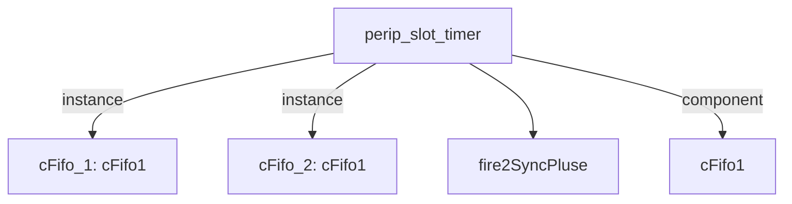

# 模块 `perip_slot_timer`

- 源文件：`rtl/rtl/IONet/IONetwork_9.24/perip_slot_timer.v`。
- 职责：AI 推断：该模块是一个基于事件驱动的时隙定时器，用于在网格网络中控制数据包的传输时序。。
- 说明：模块通过输入事件 `i_driveFrmMesh` 触发内部处理，经过两级 FIFO 和延迟单元后，输出事件 `o_driveNextToMesh`，并伴随有对应的释放信号 `o_freeToMesh` 和 `i_freeNextFrmMesh`，表明其负责管理数据包在网格中的传输与释放时序。

## 1. 层级位置

- Parents：`timer_slot`。
- Children：`fire2SyncPluse`。
- Component children：`cFifo1`。
- Upstream modules：无。
- Downstream modules：无。

### 1.1 本模块结构图



```text
perip_slot_timer
|-- cFifo_1: cFifo1
|-- cFifo_2: cFifo1
|-- fire2SyncPluse
`-- cFifo1
```

## 2. 输入/输出接口摘要

- 接收：drive 输入：`i_driveFrmMesh`；数据输入：`data_from`, `data_o`；free 输入：`i_freeNextFrmMesh`；其他输入：`clk`。
- 输出：drive 输出：`o_driveNextToMesh`；数据输出：`addr_i`, `data_i`, `data_to`；free 输出：`o_freeToMesh`；其他输出：`we`。

### 2.1 端口分组

| 端口组 | 方向统计 | 代表信号 |
| --- | --- | --- |
| `clock_reset_init` | input:1 | `clk` |
| `drive_event` | input:1, output:1 | `i_driveFrmMesh`, `o_driveNextToMesh` |
| `free_backpressure` | input:1, output:1 | `i_freeNextFrmMesh`, `o_freeToMesh` |
| `other_ports` | input:2, output:4 | `data_from`, `data_o`, `addr_i`, `data_i`, `data_to`, `we` |

## 3. Drive/Data/Free 契约

| Interface | 方向 | Event | Payload | Free/backpressure |
| --- | --- | --- | --- | --- |
| `i_driveFrmMesh` | input | `i_driveFrmMesh` | 未记录 | `o_freeToMesh` |
| `o_driveNextToMesh` | output | `o_driveNextToMesh` | 未记录 | `i_freeNextFrmMesh` |

## 4. 主要 Drive-centered Flow

### `i_driveFrmMesh`

- 确定性事实：`i_driveFrmMesh to o_driveNextToMesh`；flow_id=`flow_000_perip_slot_timer_i_driveFrmMesh`。
- Payload：未记录。
- 输出/影响：`o_driveNextToMesh`。
- 结构复杂度：branch=0，join=0，blocking=2。
- AI 推断：该流为纯事件驱动流，无数据负载，控制仅体现在FIFO的门控行为


## 5. 内部组件与 assign 影响

### 5.1 内部组件

| 实例 | 类型 | 输入事件 | 输出事件 |
| --- | --- | --- | --- |
| `cFifo_1` | `cFifo1` | `i_driveFrmMesh` | `w_drv2Fifo2` |
| `cFifo_2` | `cFifo1` | `w_drv2Fifo2_delay2` | `o_driveNextToMesh` |

### 5.2 assign 影响

| Assign | Impact area | LHS | RHS 摘要 | 解释状态 |
| --- | --- | --- | --- | --- |
| `assign_0` | unknown | `we` | (!we_r) & rise | AI 推断：该赋值用于生成写使能信号，可能用于控制数据写入或事件锁存。 |
