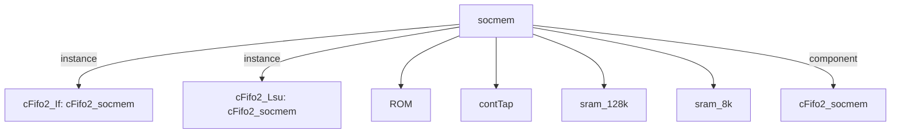

# 模块 `socmem`

- 源文件：`rtl/rtl/memory/socmem.v`。
- 职责：AI 推断：片上存储器子系统，为指令和数据访问提供缓存、ROM和栈存储，并通过事件驱动流与IF和LSU单元交互。。
- 说明：模块通过事件输入i_driveFrmIf和i_driveFrmLsu接收来自IF和LSU的驱动请求，内部包含ICache、DCache、ROM和stack实例，并通过事件输出o_driveNextToIf和o_driveNextToLsu返回处理完成信号。事件流经过Fifo1族组件和延迟链，表明存在流水线或握手机制。

## 1. 层级位置

- Parents：`memory_slot`。
- Children：`ROM`, `contTap`, `sram_128k`, `sram_8k`。
- Component children：`cFifo2_socmem`。
- Upstream modules：无。
- Downstream modules：无。

### 1.1 本模块结构图



```text
socmem
|-- cFifo2_If: cFifo2_socmem
|-- cFifo2_Lsu: cFifo2_socmem
|-- ROM
|-- contTap
|-- sram_128k
|-- sram_8k
`-- cFifo2_socmem
```

## 2. 输入/输出接口摘要

- 接收：drive 输入：`i_driveFrmIf`, `i_driveFrmLsu`；数据输入：`i_daddress_32`, `i_ddataW_64`, `i_iaddress_33`, `i_idataW_64`；控制输入：`i_dwen_8`, `i_iwen_8`；free 输入：`i_freeNextFrmIf`, `i_freeNextFrmLsu`；其他输入：`clk`, `init_sig`。
- 输出：drive 输出：`o_driveNextToIf`, `o_driveNextToLsu`；数据输出：`o_ddataR_64`, `o_idataR_65`；free 输出：`o_freeToIf`, `o_freeToLsu`。

### 2.1 端口分组

| 端口组 | 方向统计 | 代表信号 |
| --- | --- | --- |
| `clock_reset_init` | input:1 | `clk` |
| `drive_event` | input:2, output:2 | `i_driveFrmIf`, `i_driveFrmLsu`, `o_driveNextToIf`, `o_driveNextToLsu` |
| `free_backpressure` | input:2, output:2 | `i_freeNextFrmIf`, `i_freeNextFrmLsu`, `o_freeToIf`, `o_freeToLsu` |
| `other_ports` | input:7, output:2 | `i_daddress_32`, `i_ddataW_64`, `i_iaddress_33`, `i_idataW_64`, `o_ddataR_64`, `o_idataR_65`, `i_dwen_8`, `i_iwen_8`, `init_sig` |

## 3. Drive/Data/Free 契约

| Interface | 方向 | Event | Payload | Free/backpressure |
| --- | --- | --- | --- | --- |
| `i_driveFrmIf` | input | `i_driveFrmIf` | 未记录 | `o_freeToIf` |
| `i_driveFrmLsu` | input | `i_driveFrmLsu` | 未记录 | `o_freeToLsu` |
| `o_driveNextToIf` | output | `o_driveNextToIf` | 未记录 | `i_freeNextFrmIf` |
| `o_driveNextToLsu` | output | `o_driveNextToLsu` | 未记录 | `i_freeNextFrmLsu` |

## 4. 主要 Drive-centered Flow

### `i_driveFrmIf`

- 确定性事实：`i_driveFrmIf to o_driveNextToIf`；flow_id=`flow_000_socmem_i_driveFrmIf`。
- Payload：未记录。
- 输出/影响：`o_driveNextToIf`。
- 结构复杂度：branch=0，join=0，blocking=1。
- AI 推断：最终手册应重点解释事件流路径、FIFO 缓冲作用，以及输出事件与空闲信号之间的耦合关系。

### `i_driveFrmLsu`

- 确定性事实：`i_driveFrmLsu to o_driveNextToLsu`；flow_id=`flow_001_socmem_i_driveFrmLsu`。
- Payload：未记录。
- 输出/影响：`o_driveNextToLsu`。
- 结构复杂度：branch=0，join=0，blocking=1。
- AI 推断：该流为纯事件驱动流，无有效载荷信号


## 5. 内部组件与 assign 影响

### 5.1 内部组件

| 实例 | 类型 | 输入事件 | 输出事件 |
| --- | --- | --- | --- |
| `cFifo2_If` | `cFifo2_socmem` | `w_driveFrmIfDelay_1` | `w_driveNextToIf[0]` |
| `cFifo2_Lsu` | `cFifo2_socmem` | `i_driveFrmLsu` | `w_driveNextToLsu[0]` |

### 5.2 assign 影响

| Assign | Impact area | LHS | RHS 摘要 | 解释状态 |
| --- | --- | --- | --- | --- |
| `assign_2` | control_path | `o_freeToIf` | o_driveNextToIf | 证据不足：No Semantic Layer assignment interpretation is available. |
| `assign_3` | control_path | `o_idataR_65` | (routeSelect==1) ? {o_idataR_t_64,r_iaddrcarry} : {w_idataROM_64,r_iaddrcarry} | AI 推断：根据routeSelect选择指令数据输出源，routeSelect为1时来自ICache，否则来自ROM。 |
| `assign_4` | control_path | `o_freeToLsu` | o_driveNextToLsu | 证据不足：No Semantic Layer assignment interpretation is available. |
| `assign_5` | data_path | `o_ddataR_64` | (r_daddress_32<32'h00041200) ? o_ddataR_t_64 : o_ddataR_tStack_64 | AI 推断：根据数据地址r_daddress_32选择数据输出源，地址低于0x41200时来自DCache，否则来自stack。 |
