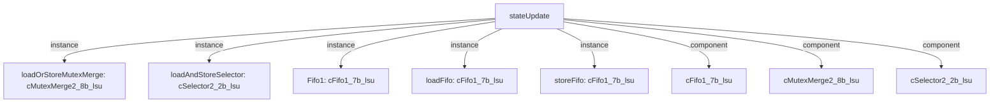

# 模块 `stateUpdate`

- 源文件：`rtl/rtl/Lsu/stateUpdate.v`。
- 职责：AI 推断：状态更新与分发模块，负责将来自更新拆分器的请求进行缓冲、类型识别（加载/存储）并分发至对应的加载或存储FIFO，最终合并输出。。
- 说明：模块接收一个事件驱动输入和7位数据，通过Fifo1缓冲后，由loadAndStoreSelector根据数据内容（w_isLoad_1/w_isStore_1）将请求分发至loadFifo或storeFifo，再经loadOrStoreMutexMerge合并输出。同时输出12位状态有效信号和未对齐指示。

## 1. 层级位置

- Parents：`lsu`。
- Children：无。
- Component children：`cFifo1_7b_lsu`, `cMutexMerge2_8b_lsu`, `cSelector2_2b_lsu`。
- Upstream modules：无。
- Downstream modules：无。

### 1.1 本模块结构图



```text
stateUpdate
|-- loadOrStoreMutexMerge: cMutexMerge2_8b_lsu
|-- loadAndStoreSelector: cSelector2_2b_lsu
|-- Fifo1: cFifo1_7b_lsu
|-- loadFifo: cFifo1_7b_lsu
|-- storeFifo: cFifo1_7b_lsu
|-- cFifo1_7b_lsu
|-- cMutexMerge2_8b_lsu
`-- cSelector2_2b_lsu
```

## 2. 输入/输出接口摘要

- 接收：drive 输入：`i_driveFromUpdateSplitter_1`；数据输入：`i_fromUpdateSplitterData_7`；free 输入：`i_freeFromStateUpdateSelector_1`。
- 输出：drive 输出：`o_driveToStateUpdateSelector_1`；控制输出：`o_stateValid_12`；free 输出：`o_freeToUpdateSplitter_1`；其他输出：`o_misaligned_1`。

### 2.1 端口分组

| 端口组 | 方向统计 | 代表信号 |
| --- | --- | --- |
| `drive_event` | input:1, output:1 | `i_driveFromUpdateSplitter_1`, `o_driveToStateUpdateSelector_1` |
| `free_backpressure` | input:1, output:1 | `i_freeFromStateUpdateSelector_1`, `o_freeToUpdateSplitter_1` |
| `other_ports` | input:1, output:2 | `i_fromUpdateSplitterData_7`, `o_stateValid_12`, `o_misaligned_1` |

## 3. Drive/Data/Free 契约

| Interface | 方向 | Event | Payload | Free/backpressure |
| --- | --- | --- | --- | --- |
| `i_driveFromUpdateSplitter_1` | input | `i_driveFromUpdateSplitter_1` | `i_fromUpdateSplitterData_7 [6:0]` | `o_freeToUpdateSplitter_1` |
| `o_driveToStateUpdateSelector_1` | output | `o_driveToStateUpdateSelector_1` | 未记录 | `i_freeFromStateUpdateSelector_1` |

## 4. 主要 Drive-centered Flow

### `i_driveFromUpdateSplitter_1`

- 确定性事实：`i_driveFromUpdateSplitter_1 to o_driveToStateUpdateSelector_1`；flow_id=`flow_000_stateUpdate_i_driveFromUpdateSplitter_1`。
- Payload：`i_driveFromUpdateSplitter_1` -> `i_fromUpdateSplitterData_7 [6:0]`。
- 输出/影响：`o_driveToStateUpdateSelector_1`。
- 结构复杂度：branch=1，join=1，blocking=4。
- AI 推断：文档应重点描述事件从输入到输出的完整路径，包括分支、合并和阻塞点，并明确反压机制。


## 5. 内部组件与 assign 影响

### 5.1 内部组件

| 实例 | 类型 | 输入事件 | 输出事件 |
| --- | --- | --- | --- |
| `loadOrStoreMutexMerge` | `cMutexMerge2_8b_lsu` | `w_loadFifoDrive_1`, `w_storeFifoDrive_1` | `o_driveToStateUpdateSelector_1` |
| `loadAndStoreSelector` | `cSelector2_2b_lsu` | `w_driveToLoadAndStoreSelector_1` | 无 |
| `Fifo1` | `cFifo1_7b_lsu` | `i_driveFromUpdateSplitter_1` | `w_driveToLoadAndStoreSelector_1` |
| `loadFifo` | `cFifo1_7b_lsu` | 无 | `w_loadFifoDrive_1` |
| `storeFifo` | `cFifo1_7b_lsu` | 无 | `w_storeFifoDrive_1` |

### 5.2 assign 影响

| Assign | Impact area | LHS | RHS 摘要 | 解释状态 |
| --- | --- | --- | --- | --- |
| `assign_12` | control_path | `LoadIdleValid` | w_isLoad_1 & idle | AI 推断：下一状态计算逻辑，根据当前操作类型和有效标志确定状态机的下一个状态。 |
| `assign_13` | control_path | `StoreIdleValid` | w_isStore_1 & idle | AI 推断：下一状态计算逻辑，根据当前操作类型和有效标志确定状态机的下一个状态。 |
| `assign_14` | control_path | `w_nextState_4` | {4{w_isLoad_1 & LoadIdleValid}} & r_nextLoadState_4 \| {4{w_isStore_1 & StoreIdleValid}} & r_n... | AI 推断：下一状态计算逻辑，根据当前操作类型和有效标志确定状态机的下一个状态。 |
| `assign_17` | unknown | `o_misaligned_1` | w_misaligned_1 | 证据不足：No Semantic Layer assignment interpretation is available. |
| `assign_18` | control_path | `o_stateValid_12` | r_stateValid_12 | AI 推断：12位状态有效输出，反映内部状态机的当前状态。 |
