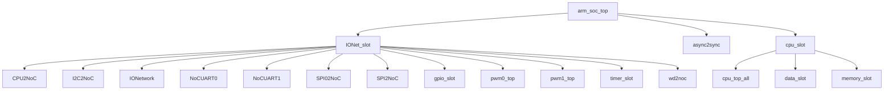

# arm_soc_top RTL 代码手册

本手册采用“主手册 + 模块页”的结构，主手册用于快速定位系统结构，模块页用于查看具体接口和 flow 细节。

## 如何阅读本手册

- 先看“项目总览”和“顶层模块”两节，确认工程用途、RTL 入口和顶层直接实例化关系。
- 再看“顶层结构图”和“完整模块层级结构”，用它们定位父子模块关系。
- 需要查看某个模块细节时，进入 `arm_soc_top_generated_modules/` 下对应的模块页。
- 对 AI 推断内容保持复核意识；确定事实优先来自 Parser、Knowledge IR 和 Manual Context。
- 如需检查生成质量，查看 `arm_soc_top_generated_review.md` 审查报告。

## 1. 项目总览

- 项目用途：AI 推断：顶层SoC集成模块，连接CPU核心与IO网络，实现处理器与外部IO之间的驱动事件交换。
- RTL 目录：`rtl/rtl`。
- 顶层文件：`rtl/rtl/SoC/arm_soc_top.v`。

## 2. 顶层模块 `arm_soc_top`

- 顶层直接实例化模块：`IONet_slot`, `async2sync`, `cpu_slot`。

### 2.1 外部端口分组

端口分组按 pad/信号命名和方向归类，用于快速识别顶层对外边界。

| 端口组 | 方向统计 | 代表信号 |
| --- | --- | --- |
| `clock_reset_init` | inout:1, input:7, output:1 | `initMode_pad`, `RCLK_BAUD_UART0_pad`, `RCLK_BAUD_UART1_pad`, `RCLK_UART0_pad`, `RCLK_UART1_pad`, `clk_pad`, `rst_pad`, `sclk_SPI0_pad`, `... +1` |
| `serial_boot_uart` | input:1, output:1 | `rx_pin_pad`, `tx_pin_pad` |
| `uart0` | input:6, output:6 | `BREG_UART0_pad`, `NCTS_UART0_pad`, `NDCD_UART0_pad`, `NDSR_UART0_pad`, `NRI_UART0_pad`, `SIN_UART0_pad`, `BAUD_UART0_pad`, `NDTR_UART0_pad`, `... +4` |
| `uart1` | input:6, output:6 | `BREG_UART1_pad`, `NCTS_UART1_pad`, `NDCD_UART1_pad`, `NDSR_UART1_pad`, `NRI_UART1_pad`, `SIN_UART1_pad`, `BAUD_UART1_pad`, `NDTR_UART1_pad`, `... +4` |
| `iic0` | input:5, output:6 | `FSEN_IIC0_pad`, `HSEN_IIC0_pad`, `IFSDA_IIC0_pad`, `ISCL_IIC0_pad`, `ISDA_IIC0_pad`, `CKISO_IIC0_pad`, `DAGND_IIC0_pad`, `DAISO_IIC0_pad`, `... +3` |
| `spi0` | input:1, output:3 | `miso_SPI0_pad`, `cs_n_SPI0_pad`, `mosi_SPI0_pad`, `startRead_SPI0_pad` |
| `spi1` | inout:3 | `miso_SPI1_pad`, `mosi_SPI1_pad`, `nss_SPI1_pad` |
| `pwm0` | output:1 | `PWM0_OUT_pad` |
| `pwm1` | output:1 | `PWM1_OUT_pad` |
| `gpio` | inout:1 | `io_pin_pad` |

### 2.2 顶层组成

| 子模块 | 职责 | 接收 | 输出 | 模块页 |
| --- | --- | --- | --- | --- |
| `IONet_slot` | AI 推断：该模块是SoC中CPU与片上网络(NoC)之间的桥接与外围设备汇聚节点，负责将CPU的驱动事件和数据分发到各外围设备，并收集外围设备的响应返回CPU。 | drive 输入：`i_drvFCPU`；数据输入：`i_dataFCPU_51`, `io_pin`；free 输入：`i_freeFCPU`；其他输入：`BREG_UART0`, `BREG_UART1`, `FSEN_IIC0`, `HSEN_IIC0`, `... +24` | drive 输出：`o_drv2CPU`；数据输出：`INT_TIMER`, `gpio_ctrl_o`, `gpio_data_o`, `o_data2CPU_51`；free 输出：`o_free2CPU`；其他输出：`BAUD_UART0`, `BAUD_UART1`, `CKISO_IIC0`, `DAGND_IIC0`, `... +36` | [打开](arm_soc_top_generated_modules/IONet_slot.md) |
| `async2sync` | AI 推断：RTL 实现确认该模块是异步复位同步释放（复位同步器），输出同步复位信号 | 其他输入：`clk`, `rst_async_n` | 其他输出：`rst_sync_n` | [打开](arm_soc_top_generated_modules/async2sync.md) |
| `cpu_slot` | AI 推断：该模块是CPU核心与片上网络Mesh之间的数据与事件桥接槽位，负责路由驱动事件、数据负载和初始化控制流。 | drive 输入：`i_driveFromMesh`；数据输入：`i_IntSig`, `i_dataFMesh`；控制输入：`initMode`；free 输入：`i_freeFMesh`；其他输入：`clk`, `init_rx`, `soc_start` | drive 输出：`o_driveToMesh`；数据输出：`o_data2Mesh`；free 输出：`o_free2Mesh`；其他输出：`init_sig`, `init_tx` | [打开](arm_soc_top_generated_modules/cpu_slot.md) |

### 2.3 顶层结构图

下图只展示顶层向下的有限层级，完整父子关系见后续层级表。



```text
arm_soc_top
|-- IONet_slot
|   |-- CPU2NoC
|   |-- I2C2NoC
|   |-- IONetwork
|   |-- NoCUART0
|   |-- NoCUART1
|   |-- SPI02NoC
|   |-- SPI2NoC
|   |-- gpio_slot
|   |-- pwm0_top
|   |-- pwm1_top
|   |-- timer_slot
|   `-- wd2noc
|-- async2sync
`-- cpu_slot
    |-- cpu_top_all
    |-- data_slot
    `-- memory_slot
```
- 图中已截断，未展开 26 条后续层级边。

## 3. 完整模块层级结构

- 模块数：106。
- 层级边数：114。

| Parent | Child | Relationship |
| --- | --- | --- |
| `I2C2NoC` | `mi2cv2` | instantiates |
| `IONet_slot` | `CPU2NoC` | instantiates |
| `IONet_slot` | `I2C2NoC` | instantiates |
| `IONet_slot` | `IONetwork` | instantiates |
| `IONet_slot` | `NoCUART0` | instantiates |
| `IONet_slot` | `NoCUART1` | instantiates |
| `IONet_slot` | `SPI02NoC` | instantiates |
| `IONet_slot` | `SPI2NoC` | instantiates |
| `IONet_slot` | `gpio_slot` | instantiates |
| `IONet_slot` | `pwm0_top` | instantiates |
| `IONet_slot` | `pwm1_top` | instantiates |
| `IONet_slot` | `timer_slot` | instantiates |
| `IONet_slot` | `wd2noc` | instantiates |
| `IONetwork` | `nodeTop` | instantiates |
| `NoCUART0` | `m16550s` | instantiates |
| `NoCUART1` | `m16550s` | instantiates |
| `SPI02NoC` | `fire2SyncPluse` | instantiates |
| `SPI02NoC` | `flash_state` | instantiates |
| `SPI2NoC` | `SPI_control` | instantiates |
| `SPI_control` | `CRC_rx` | instantiates |
| `SPI_control` | `CRC_tx` | instantiates |
| `SPI_control` | `clk_div` | instantiates |
| `SPI_control` | `reg_apb` | instantiates |
| `SPI_control` | `spi_m` | instantiates |
| `SPI_control` | `spi_s` | instantiates |
| `SPI_control` | `state0` | instantiates |
| `adder` | `adder32` | instantiates |
| `adder` | `adder5` | instantiates |
| `adder` | `adder64` | instantiates |
| `arm_soc_top` | `IONet_slot` | instantiates |
| `arm_soc_top` | `async2sync` | instantiates |
| `arm_soc_top` | `cpu_slot` | instantiates |
| `clk_div_spi0` | `sclk_done_1` | instantiates |
| `cmsdk_apb_watchdog` | `cmsdk_apb_watchdog_frc` | instantiates |
| `cpu_slot` | `cpu_top_all` | instantiates |
| `cpu_slot` | `data_slot` | instantiates |
| `cpu_slot` | `memory_slot` | instantiates |
| `cpu_top_all` | `contTap` | instantiates |
| `cpu_top_all` | `decoder` | instantiates |
| `cpu_top_all` | `execute` | instantiates |
| `cpu_top_all` | `fetch` | instantiates |
| `cpu_top_all` | `grf` | instantiates |
| `cpu_top_all` | `intAndExc` | instantiates |
| `cpu_top_all` | `launch` | instantiates |
| `cpu_top_all` | `lsu` | instantiates |
| `cpu_top_all` | `prf` | instantiates |
| `cpu_top_all` | `wb` | instantiates |
| `data_init` | `uart_rx` | instantiates |
| `data_init` | `uart_tx` | instantiates |
| `decoder` | `decoder_16` | instantiates |
| `decoder` | `decoder_32` | instantiates |
| `execute` | `adder` | instantiates |
| `execute` | `align` | instantiates |
| `execute` | `ander` | instantiates |
| `execute` | `contTap` | instantiates |
| `execute` | `div` | instantiates |
| `execute` | `eor` | instantiates |
| `execute` | `hsb` | instantiates |
| `execute` | `muller` | instantiates |
| `execute` | `orrer` | instantiates |
| `execute` | `reverse` | instantiates |
| `execute` | `satQ` | instantiates |
| `execute` | `shifter` | instantiates |
| `fetch` | `instSplit` | instantiates |
| `flash_state` | `spi_master_spi0` | instantiates |
| `gpio_slot` | `gpio_module` | instantiates |
| `gpio_slot` | `perip_slot` | instantiates |
| `intAndExc` | `contTap` | instantiates |
| `intAndExc` | `inStack` | instantiates |
| `intAndExc` | `intAndExc_pop` | instantiates |
| `lsu` | `contTap` | instantiates |
| `lsu` | `dataUpdate` | instantiates |
| `lsu` | `multiLoadDataUpate` | instantiates |
| `lsu` | `multiStoreDataUpate` | instantiates |
| `lsu` | `stateUpdate` | instantiates |
| `m16550s` | `m3s001fd` | instantiates |
| `m16550s` | `m3s002fd` | instantiates |
| `m16550s` | `m3s003fd` | instantiates |
| `m16550s` | `m3s004fd` | instantiates |
| `m16550s` | `m3s005fd` | instantiates |
| `m16550s` | `m3s006fd` | instantiates |
| `m16550s` | `m3s007fd` | instantiates |
| `m16550s` | `m3s008fd` | instantiates |
| `m16550s` | `m3s009fd` | instantiates |
| `m16550s` | `m3s010fd` | instantiates |
| `m16550s` | `m3s011fd` | instantiates |
| `m3s009fd` | `m3s012fd` | instantiates |
| `m3s010fd` | `m3s012fd` | instantiates |
| `m3s011fd` | `m3s013fd` | instantiates |
| `m3s013fd` | `m3s014fd` | instantiates |
| `memory_slot` | `data_init` | instantiates |
| `memory_slot` | `socmem` | instantiates |
| `mi2cv2` | `m3s001fb` | instantiates |
| `mi2cv2` | `m3s002fb` | instantiates |
| `mi2cv2` | `m3s003fb` | instantiates |
| `mi2cv2` | `m3s004fb` | instantiates |
| `mi2cv2` | `m3s005fb` | instantiates |
| `nodeTop` | `arbMsg` | instantiates |
| `nodeTop` | `routeMsg` | instantiates |
| `perip_slot` | `fire2SyncPluse` | instantiates |
| `perip_slot_timer` | `fire2SyncPluse` | instantiates |
| `pwm0_top` | `pwm` | instantiates |
| `pwm1_top` | `pwm` | instantiates |
| `routeMsg` | `routeMsgEW` | instantiates |
| `routeMsg` | `routeMsgSN` | instantiates |
| `routeMsg` | `subtr4b` | instantiates |
| `socmem` | `ROM` | instantiates |
| `socmem` | `contTap` | instantiates |
| `socmem` | `sram_128k` | instantiates |
| `socmem` | `sram_8k` | instantiates |
| `spi_master_spi0` | `clk_div_spi0` | instantiates |
| `timer_slot` | `perip_slot_timer` | instantiates |
| `timer_slot` | `timer_module` | instantiates |
| `wd2noc` | `cmsdk_apb_watchdog` | instantiates |

## 4. 子系统与模块索引

每个 reachable module 都有独立模块页；关键模块详写，helper/leaf 模块使用压缩卡片。

| 模块 | 区域 | 职责摘要 | 模块页 |
| --- | --- | --- | --- |
| `CPU2NoC` | cpu | AI 推断：事件 i_drvFNoCChannel0 与数据载荷 i_dataFNoCChannel0_51 同步进入合并器 mutexRead。 | [打开](arm_soc_top_generated_modules/CPU2NoC.md) |
| `cpu_slot` | cpu | AI 推断：该模块是CPU核心与片上网络Mesh之间的数据与事件桥接槽位，负责路由驱动事件、数据负载和初始化控制流。 | [打开](arm_soc_top_generated_modules/cpu_slot.md) |
| `cpu_top_all` | cpu | AI 推断：顶层CPU流水线集成模块，负责指令获取、译码、执行、访存、写回及异常/中断处理的完整流水线控制与数据通路汇聚。 | [打开](arm_soc_top_generated_modules/cpu_top_all.md) |
| `dataUpdate` | cpu | AI 推断：数据更新模块，负责将加载数据按类型（lb/lhw/lw/ldw/lwm/lhwm/ldwm）对齐并合并，同时处理存储数据的字节选通和地址偏移，最终向存储器和写回通路输出驱动事件。 | [打开](arm_soc_top_generated_modules/dataUpdate.md) |
| `decoder` | cpu | AI 推断：指令解码与分发核心模块，负责将取指阶段传入的PC和指令数据解码为控制信号，并分发至发射和异常处理阶段。 | [打开](arm_soc_top_generated_modules/decoder.md) |
| `decoder_16` | cpu | AI 推断：16位Thumb指令解码器，将16位指令字解码为187位内部微操作控制字 | [打开](arm_soc_top_generated_modules/decoder_16.md) |
| `decoder_32` | cpu | AI 推断：32位Thumb指令解码器，将输入的32位指令字解码为执行单元所需的控制与数据字段。 | [打开](arm_soc_top_generated_modules/decoder_32.md) |
| `fetch` | cpu | AI 推断：取指模块，负责接收来自顶层、调度器和ICache的驱动事件，经过内部流水线仲裁、数据合并与异常处理，最终向译码、异常、中断和ICache输出驱动事件及指令/PC数据。 | [打开](arm_soc_top_generated_modules/fetch.md) |
| `grf` | cpu | AI 推断：通用寄存器文件模块，为处理器流水线各阶段提供寄存器读写访问与数据转发路径。 | [打开](arm_soc_top_generated_modules/grf.md) |
| `intAndExc` | cpu | AI 推断：中断与异常集中仲裁与分发单元，负责收集来自流水线各阶段的中断/异常事件，仲裁优先级，并驱动后续的栈操作、数据路由和PC更新。 | [打开](arm_soc_top_generated_modules/intAndExc.md) |
| `intAndExc_pop` | cpu | AI 推断：中断与异常出栈调度器，负责将来自DR和Top的驱动事件分发为指向SP、DR、WGRF、WPSR的出栈操作，并管理对应的数据地址生成与释放反馈。 | [打开](arm_soc_top_generated_modules/intAndExc_pop.md) |
| `launch` | cpu | AI 推断：指令发射与数据准备中心，负责接收来自解码器、执行单元、加载存储单元、通用寄存器文件、系统寄存器文件和程序状态寄存器的事件，仲裁数据依赖，生成操作数，并最终将准备好的指令发射到执行单元、通... | [打开](arm_soc_top_generated_modules/launch.md) |
| `lsu` | cpu | AI 推断：加载存储单元，负责执行内存访问指令（加载/存储）并管理数据在处理器核心与内存/外设之间的传输。 | [打开](arm_soc_top_generated_modules/lsu.md) |
| `prf` | cpu | AI 推断：物理寄存器文件模块，负责存储和转发通用寄存器（PRF）和程序状态寄存器（PSR）的值，并管理驱动事件与释放信号的握手。 | [打开](arm_soc_top_generated_modules/prf.md) |
| `stateUpdate` | cpu | AI 推断：状态更新与分发模块，负责将来自更新拆分器的请求进行缓冲、类型识别（加载/存储）、状态机转换，并通过互斥合并后输出到状态更新选择器。 | [打开](arm_soc_top_generated_modules/stateUpdate.md) |
| `wb` | cpu | AI 推断：写回阶段模块，负责将执行结果分发并写入到通用寄存器组、程序计数器、谓词寄存器、XPSR等架构状态单元。 | [打开](arm_soc_top_generated_modules/wb.md) |
| `adder` | execution_pipeline | AI 推断：多宽度算术加法器，根据操作类型选择32位、5位或64位加法结果 | [打开](arm_soc_top_generated_modules/adder.md) |
| `adder32` | execution_pipeline | AI 推断：32位算术加法器，支持有符号/无符号模式选择，生成进位和溢出标志 | [打开](arm_soc_top_generated_modules/adder32.md) |
| `adder5` | execution_pipeline | AI 推断：5位加法器模块，支持有符号和无符号加法运算，并生成进位和溢出标志。 | [打开](arm_soc_top_generated_modules/adder5.md) |
| `adder64` | execution_pipeline | AI 推断：64位加法器，支持有符号/无符号模式选择，并生成进位和溢出标志 | [打开](arm_soc_top_generated_modules/adder64.md) |
| `align` | execution_pipeline | AI 推断：该模块负责将输入的32位操作数地址对齐到4字节边界，并输出对齐后的结果。 | [打开](arm_soc_top_generated_modules/align.md) |
| `ander` | execution_pipeline | AI 推断：该模块执行两个32位操作数的按位与运算，并输出结果。 | [打开](arm_soc_top_generated_modules/ander.md) |
| `clk_div` | execution_pipeline | AI 推断：该模块根据波特率选择信号和配置模式，从系统时钟生成SPI串行时钟（sclk）及其完成指示信号。 | [打开](arm_soc_top_generated_modules/clk_div.md) |
| `clk_div_spi0` | execution_pipeline | AI 推断：该模块根据波特率选择信号BR和片选信号nss_out，从内部计数器cnt生成SPI主时钟sclk_out。 | [打开](arm_soc_top_generated_modules/clk_div_spi0.md) |
| `div` | execution_pipeline | AI 推断：该模块执行32位有符号或无符号整数除法运算，根据symbolFlag信号选择运算模式。 | [打开](arm_soc_top_generated_modules/div.md) |
| `eor` | execution_pipeline | AI 推断：执行按位异或运算的组合逻辑模块 | [打开](arm_soc_top_generated_modules/eor.md) |
| `execute` | execution_pipeline | AI 推断：执行模块是处理器流水线的执行阶段，负责接收来自发射（Launch）、通用寄存器堆（GRF）和加载存储单元（LSU）的指令与数据，完成算术逻辑运算，并将结果写回或转发。 | [打开](arm_soc_top_generated_modules/execute.md) |
| `hsb` | execution_pipeline | AI 推断：算术结果符号判断模块，根据操作数和标志位生成结果 | [打开](arm_soc_top_generated_modules/hsb.md) |
| `muller` | execution_pipeline | AI 推断：32位有符号/无符号乘法器模块，支持结果取反控制 | [打开](arm_soc_top_generated_modules/muller.md) |
| `multiLoadDataUpate` | execution_pipeline | AI 推断：多加载数据更新与写回控制模块，负责从加载数据路由中选择并组合数据，生成写回使能、结束标志及下一轮地址/寄存器列表。 | [打开](arm_soc_top_generated_modules/multiLoadDataUpate.md) |
| `multiStoreDataUpate` | execution_pipeline | AI 推断：该模块负责根据输入地址和寄存器列表，生成多存储操作所需的下一地址、下一寄存器列表、数据写入使能以及写回控制信号。 | [打开](arm_soc_top_generated_modules/multiStoreDataUpate.md) |
| `orrer` | execution_pipeline | AI 推断：执行按位逻辑或运算的组合逻辑单元 | [打开](arm_soc_top_generated_modules/orrer.md) |
| `reverse` | execution_pipeline | AI 推断：该模块根据 reverseType 选择信号，对 32 位操作数 oprand 执行位反转、字节反转、半字反转或带符号扩展的半字反转操作，并输出结果 result。 | [打开](arm_soc_top_generated_modules/reverse.md) |
| `satQ` | execution_pipeline | AI 推断：饱和量化单元，根据符号标志选择有符号或无符号饱和算法对操作数进行饱和处理。 | [打开](arm_soc_top_generated_modules/satQ.md) |
| `shifter` | execution_pipeline | AI 推断：移位与扩展运算单元，根据操作码和类型选择执行逻辑/算术/循环移位及位宽扩展，并输出移位进位。 | [打开](arm_soc_top_generated_modules/shifter.md) |
| `CRC_rx` | noc | AI 推断：该模块根据输入数据计算并输出CRC校验值，支持16位和8位两种模式。 | [打开](arm_soc_top_generated_modules/CRC_rx.md) |
| `CRC_tx` | noc | AI 推断：该模块根据输入数据计算并输出CRC校验值，支持16位和8位两种模式。 | [打开](arm_soc_top_generated_modules/CRC_tx.md) |
| `I2C2NoC` | noc | AI 推断：该模块作为I2C主控制器（mi2cv2）与片上网络（NoC）之间的桥接与数据同步模块，负责将I2C总线事件转换为NoC兼容的驱动事件，并管理数据路径的延迟与同步。 | [打开](arm_soc_top_generated_modules/I2C2NoC.md) |
| `IONet_slot` | noc | AI 推断：该模块是SoC中CPU与片上网络(NoC)之间的桥接与外围设备汇聚节点，负责将CPU的驱动事件和数据分发到各外围设备，并收集外围设备的响应返回CPU。 | [打开](arm_soc_top_generated_modules/IONet_slot.md) |
| `IONetwork` | noc | AI 推断：2x2 片上网络路由器节点阵列，负责在四个节点之间路由事件驱动信号和51位消息负载。 | [打开](arm_soc_top_generated_modules/IONetwork.md) |
| `NoCUART0` | noc | AI 推断：NoCUART0 是一个 UART 桥接模块，负责在 NoC 协议接口与标准 UART 内核 (m16550s) 之间进行事件驱动的数据和控制信号转换与同步。 | [打开](arm_soc_top_generated_modules/NoCUART0.md) |
| `NoCUART1` | noc | AI 推断：该模块是UART实例与片上网络(NoC)之间的驱动事件与数据转发桥接层，负责将NoC侧的驱动事件经FIFO和确认管道转发至UART，并将UART的响应数据打包回NoC。 | [打开](arm_soc_top_generated_modules/NoCUART1.md) |
| `SPI02NoC` | noc | AI 推断：作为SPI模块与片上网络(NoC)之间的桥接与数据转换接口，负责将NoC的驱动事件和数据转换为SPI Flash控制器的读写操作，并将结果返回NoC。 | [打开](arm_soc_top_generated_modules/SPI02NoC.md) |
| `SPI2NoC` | noc | AI 推断：输入 i_drvFNoc 连接到 cfifo0 的 i_drive，输入数据 i_dataFNoc_51 在 w_firefifo0[0] 上升沿加载到 r_dataFNoc_51。 | [打开](arm_soc_top_generated_modules/SPI2NoC.md) |
| `SPI_control` | noc | AI 推断：SPI 主从控制器，通过 APB 接口配置寄存器并驱动 SPI 协议引擎 | [打开](arm_soc_top_generated_modules/SPI_control.md) |
| `arbMsg` | noc | AI 推断：五路输入消息仲裁与合并模块，将来自东、本地、北、南、西五个方向的消息请求合并为单一输出。 | [打开](arm_soc_top_generated_modules/arbMsg.md) |
| `cmsdk_apb_watchdog` | noc | AI 推断：该模块是APB总线从设备，负责看门狗定时器的寄存器接口与中断/复位输出控制。 | [打开](arm_soc_top_generated_modules/cmsdk_apb_watchdog.md) |
| `cmsdk_apb_watchdog_frc` | noc | AI 推断：该模块是一个基于APB接口的强制看门狗定时器，用于在系统锁定或故障时触发复位或中断。 | [打开](arm_soc_top_generated_modules/cmsdk_apb_watchdog_frc.md) |
| `fire2SyncPluse` | noc | AI 推断：边沿检测同步器，将输入脉冲信号同步到本地时钟域并检测上升沿 | [打开](arm_soc_top_generated_modules/fire2SyncPluse.md) |
| `flash_state` | noc | AI 推断：flash_state 是 SPI 主控制器与外部 Flash 存储器之间的状态驱动桥接模块，负责管理 SPI 事务的启动、数据路由和完成指示。 | [打开](arm_soc_top_generated_modules/flash_state.md) |
| `gpio_module` | noc | AI 推断：通用输入输出控制模块，提供寄存器映射的GPIO引脚控制与中断管理功能 | [打开](arm_soc_top_generated_modules/gpio_module.md) |
| `gpio_slot` | noc | AI 推断：GPIO槽位模块，负责将Mesh网络驱动事件路由到内部GPIO外设，并返回驱动完成事件。 | [打开](arm_soc_top_generated_modules/gpio_slot.md) |
| `m16550s` | noc | AI 推断：该模块是一个UART控制器，负责处理地址、写数据和读数据接口，实现串行通信的寄存器访问与控制。 | [打开](arm_soc_top_generated_modules/m16550s.md) |
| `m3s001fb` | noc | AI 推断：该模块是一个基于时钟选择的多路复用器，用于在两种I2C时钟参考源之间进行选择。 | [打开](arm_soc_top_generated_modules/m3s001fb.md) |
| `m3s001fd` | noc | AI 推断：该模块是UART发送路径中的发送缓冲加载控制单元，负责将并行数据加载到发送FIFO。 | [打开](arm_soc_top_generated_modules/m3s001fd.md) |
| `m3s002fb` | noc | AI 推断：该模块在当前上下文中缺乏明确的接口和内部结构信息，无法推断其设计角色。 | [打开](arm_soc_top_generated_modules/m3s002fb.md) |
| `m3s002fd` | noc | AI 推断：该模块是UART接收路径中的数据缓冲与同步单元，负责将FIFO输出的8位数据转换为两个独立的接收数据输出。 | [打开](arm_soc_top_generated_modules/m3s002fd.md) |
| `m3s003fb` | noc | AI 推断：该模块是I2C总线接口的寄存器映射与数据缓冲单元，负责将APB总线访问转换为内部寄存器读写，并管理I2C控制/状态寄存器组。 | [打开](arm_soc_top_generated_modules/m3s003fb.md) |
| `m3s003fd` | noc | AI 推断：该模块是UART内部寄存器访问与数据桥接单元，负责将总线地址映射到内部寄存器并转发收发数据。 | [打开](arm_soc_top_generated_modules/m3s003fd.md) |
| `m3s004fb` | noc | AI 推断：该模块是一个IIC总线接口的从设备数据与状态寄存器模块，负责存储和输出从设备地址匹配后的数据与状态信息。 | [打开](arm_soc_top_generated_modules/m3s004fb.md) |
| `m3s004fd` | noc | AI 推断：该模块是一个UART中断使能寄存器(IER)和中断标识寄存器(IIR)的寄存器接口单元，负责将4位数据输入映射到两个状态输出。 | [打开](arm_soc_top_generated_modules/m3s004fd.md) |
| `m3s005fb` | noc | AI 推断：该模块是一个单比特写数据缓冲或直通单元，用于将外部写入数据传递至内部逻辑。 | [打开](arm_soc_top_generated_modules/m3s005fb.md) |
| `m3s005fd` | noc | AI 推断：该模块是一个UART波特率分频器，将输入的8位数据转换为16位分频值输出。 | [打开](arm_soc_top_generated_modules/m3s005fd.md) |
| `m3s006fd` | noc | AI 推断：该模块是一个5位数据输入接口的简单数据接收或缓冲单元，可能用于UART子系统的数据路径前端。 | [打开](arm_soc_top_generated_modules/m3s006fd.md) |
| `m3s007fd` | noc | AI 推断：该模块是一个仅包含数据输出的无输入逻辑单元，可能是一个常数生成器或状态编码器。 | [打开](arm_soc_top_generated_modules/m3s007fd.md) |
| `m3s008fd` | noc | AI 推断：该模块是一个纯数据输出模块，可能用于UART接口的状态或数据回读。 | [打开](arm_soc_top_generated_modules/m3s008fd.md) |
| `m3s009fd` | noc | AI 推断：该模块是一个基于地址映射的寄存器读取多路选择器，根据输入地址选择内部信号并输出数据。 | [打开](arm_soc_top_generated_modules/m3s009fd.md) |
| `m3s010fd` | noc | AI 推断：该模块是一个基于地址映射的多路选择器，用于从多个内部信号中选择一个输出到数据总线。 | [打开](arm_soc_top_generated_modules/m3s010fd.md) |
| `m3s011fd` | noc | AI 推断：该模块是一个窄位宽数据转换或路由单元，将两个4位输入映射为一个3位输出。 | [打开](arm_soc_top_generated_modules/m3s011fd.md) |
| `m3s012fd` | noc | AI 推断：该模块是一个简单的数据通道，将输入数据直接传递到输出，可能用于UART子系统中的信号重定时或缓冲。 | [打开](arm_soc_top_generated_modules/m3s012fd.md) |
| `m3s013fd` | noc | AI 推断：该模块是一个基于地址映射的多路选择器，用于从16个内部信号中选择一个输出到OP_D。 | [打开](arm_soc_top_generated_modules/m3s013fd.md) |
| `m3s014fd` | noc | AI 推断：该模块是一个简单的3位数据通路节点，可能用于UART子系统内的数据重映射或位宽转换。 | [打开](arm_soc_top_generated_modules/m3s014fd.md) |
| `mi2cv2` | noc | AI 推断：mi2cv2 是 IONet IIC 子系统内的一个顶层模块，负责将 APB 总线接口（ADDRESS、WDATA、RDATA）桥接到 I2C 总线物理层（ISCL、ISDA、OSCL、... | [打开](arm_soc_top_generated_modules/mi2cv2.md) |
| `nodeTop` | noc | AI 推断：五端口网络节点，负责将来自五个方向（东、本地、北、南、西）的输入消息路由并仲裁到对应的输出方向。 | [打开](arm_soc_top_generated_modules/nodeTop.md) |
| `perip_slot` | noc | AI 推断：外围设备插槽模块，通过两级FIFO和延迟链实现Mesh网络驱动的流水线转发与释放同步。 | [打开](arm_soc_top_generated_modules/perip_slot.md) |
| `perip_slot_timer` | noc | AI 推断：该模块作为外围设备槽位定时器，在IONet网络中负责驱动事件的延迟与转发控制。 | [打开](arm_soc_top_generated_modules/perip_slot_timer.md) |
| `pwm` | noc | AI 推断：脉宽调制（PWM）信号生成器，根据输入的占空比和频率参数产生PWM输出。 | [打开](arm_soc_top_generated_modules/pwm.md) |
| `pwm0_top` | noc | AI 推断：该模块是一个PWM控制器的顶层封装，负责通过事件驱动流水线处理PWM配置消息并输出PWM波形。 | [打开](arm_soc_top_generated_modules/pwm0_top.md) |
| `pwm1_top` | noc | AI 推断：该模块是一个PWM驱动事件流水线中的中间级，负责通过两个Fifo1组件串联传递驱动事件和自由事件，并输出PWM信号。 | [打开](arm_soc_top_generated_modules/pwm1_top.md) |
| `reg_apb` | noc | AI 推断：reg_apb 是 SPI 模块的 APB 从接口寄存器桥，负责将 APB 总线协议转换为 SPI 内部寄存器读写控制信号。 | [打开](arm_soc_top_generated_modules/reg_apb.md) |
| `routeMsg` | noc | AI 推断：路由消息分发模块，将输入消息根据方向选择分发到五个方向（东、本地、北、南、西）的发送FIFO。 | [打开](arm_soc_top_generated_modules/routeMsg.md) |
| `routeMsgEW` | noc | AI 推断：坐标有效性检测与消息有效信号生成模块 | [打开](arm_soc_top_generated_modules/routeMsgEW.md) |
| `routeMsgSN` | noc | AI 推断：坐标有效性检测与消息有效信号生成模块 | [打开](arm_soc_top_generated_modules/routeMsgSN.md) |
| `sclk_done_1` | noc | AI 推断：该模块通过组合逻辑生成SPI串行时钟完成指示信号。 | [打开](arm_soc_top_generated_modules/sclk_done_1.md) |
| `spi_m` | noc | AI 推断：SPI主设备控制器，负责管理SPI总线的发送、接收和CRC校验时序 | [打开](arm_soc_top_generated_modules/spi_m.md) |
| `spi_master_spi0` | noc | AI 推断：SPI主控制器模块，负责生成SPI时钟、片选信号并完成数据收发。 | [打开](arm_soc_top_generated_modules/spi_master_spi0.md) |
| `spi_s` | noc | AI 推断：该模块是SPI从机核心控制器，负责在SPI从机模式下处理数据收发、时钟同步和CRC校验。 | [打开](arm_soc_top_generated_modules/spi_s.md) |
| `state0` | noc | AI 推断：状态机核心模块，负责SPI接口的状态转换与内部事件驱动 | [打开](arm_soc_top_generated_modules/state0.md) |
| `subtr4b` | noc | AI 推断：4位二进制减法器，通过逐位异或和借位传播链实现无符号减法 | [打开](arm_soc_top_generated_modules/subtr4b.md) |
| `timer_module` | noc | AI 推断：该模块是一个基于内存映射寄存器接口的定时器单元，提供可编程定时计数和软件中断功能。 | [打开](arm_soc_top_generated_modules/timer_module.md) |
| `timer_slot` | noc | AI 推断：作为定时器外设的槽位封装层，负责将网格驱动事件路由到内部定时器外设并返回结果。 | [打开](arm_soc_top_generated_modules/timer_slot.md) |
| `wd2noc` | noc | AI 推断：看门狗中断与复位信号到NoC的同步与分发桥接模块 | [打开](arm_soc_top_generated_modules/wd2noc.md) |
| `arm_soc_top` | other | AI 推断：顶层SoC集成模块，连接CPU核心与IO网络，实现处理器与外部IO之间的驱动事件交换。 | [打开](arm_soc_top_generated_modules/arm_soc_top.md) |
| `async2sync` | other | AI 推断：RTL 实现确认该模块是异步复位同步释放（复位同步器），输出同步复位信号 | [打开](arm_soc_top_generated_modules/async2sync.md) |
| `contTap` | other | AI 推断：该模块是一个控制路径上的“轻触”或“脉冲”生成器，用于在特定条件下产生一个或多个时钟周期的控制脉冲。 | [打开](arm_soc_top_generated_modules/contTap.md) |
| `inStack` | other | AI 推断：入栈数据打包与地址计算模块，负责将来自RGRF和RPSR的寄存器数据与PC值合并，并基于SP计算四个入栈槽位的地址，最终通过选择器输出一组96位数据（64位数据+32位地址）。 | [打开](arm_soc_top_generated_modules/inStack.md) |
| `instSplit` | other | AI 推断：指令拆分与分发模块，将取回的64位指令包拆分为最多4条指令，并管理指令FIFO的驱动与释放。 | [打开](arm_soc_top_generated_modules/instSplit.md) |
| `ROM` | storage | AI 推断：只读存储器模块，提供基于地址的固定数据查找功能 | [打开](arm_soc_top_generated_modules/ROM.md) |
| `data_init` | storage | AI 推断：数据初始化模块通过UART接口接收配置数据并驱动指令总线和数据总线进行初始化写入。 | [打开](arm_soc_top_generated_modules/data_init.md) |
| `data_slot` | storage | AI 推断：从切片确认了i_driveFromDcache经过delay单元后连接至MutexMerge输入。 | [打开](arm_soc_top_generated_modules/data_slot.md) |
| `memory_slot` | storage | AI 推断：该模块是SoC内存子系统的槽位，负责仲裁来自IF和LSU的驱动事件，并将数据/地址/写使能信号转发给内部socmem实例。 | [打开](arm_soc_top_generated_modules/memory_slot.md) |
| `socmem` | storage | AI 推断：片上存储器子系统，仲裁并路由指令和数据访问到缓存、ROM和栈存储器 | [打开](arm_soc_top_generated_modules/socmem.md) |
| `sram_128k` | storage | AI 推断：该模块是一个128KB的同步SRAM控制器，通过地址高位解码将访问请求分发到四个32KB的子存储体。 | [打开](arm_soc_top_generated_modules/sram_128k.md) |
| `sram_8k` | storage | AI 推断：该模块是一个容量为8K的同步静态随机存取存储器（SRAM）宏单元，提供单端口读写访问。 | [打开](arm_soc_top_generated_modules/sram_8k.md) |
| `uart_rx` | storage | AI 推断：UART接收模块，负责将串行输入数据转换为并行数据并输出 | [打开](arm_soc_top_generated_modules/uart_rx.md) |
| `uart_tx` | storage | AI 推断：该模块负责将并行数据转换为串行比特流，并通过单线 tx_pin 发送，实现 UART 发送功能。 | [打开](arm_soc_top_generated_modules/uart_tx.md) |
