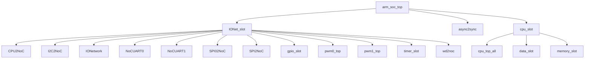

# arm_soc_top RTL 代码手册

本手册采用“主手册 + 模块页”的结构，主手册用于快速定位系统结构，模块页用于查看具体接口和 flow 细节。

## 1. 项目总览

- 项目用途：AI 推断：顶层模块仅通过两个实例u_cpu和io_slot实现驱动事件桥接，驱动信号确有双向连接
- RTL 目录：`rtl/rtl`。
- 顶层文件：`rtl\rtl\SoC\arm_soc_top.v`。

## 2. 顶层模块 `arm_soc_top`

- 顶层直接实例化模块：`IONet_slot`, `async2sync`, `cpu_slot`。

### 2.1 外部端口分组

端口分组按 pad/信号命名和方向归类，用于快速识别顶层对外边界。

| 端口组 | 方向统计 | 代表信号 |
| --- | --- | --- |
| `clock_reset_init` | inout:1, input:7, output:1 | `initMode_pad`, `RCLK_BAUD_UART0_pad`, `RCLK_BAUD_UART1_pad`, `RCLK_UART0_pad`, `RCLK_UART1_pad`, `clk_pad`, `rst_pad`, `sclk_SPI0_pad`, `... +1` |
| `serial_boot_uart` | input:1, output:1 | `rx_pin_pad`, `tx_pin_pad` |
| `uart0` | input:6, output:6 | `BREG_UART0_pad`, `NCTS_UART0_pad`, `NDCD_UART0_pad`, `NDSR_UART0_pad`, `NRI_UART0_pad`, `SIN_UART0_pad`, `BAUD_UART0_pad`, `NDTR_UART0_pad`, `... +4` |
| `uart1` | input:6, output:6 | `BREG_UART1_pad`, `NCTS_UART1_pad`, `NDCD_UART1_pad`, `NDSR_UART1_pad`, `NRI_UART1_pad`, `SIN_UART1_pad`, `BAUD_UART1_pad`, `NDTR_UART1_pad`, `... +4` |
| `iic0` | input:5, output:6 | `FSEN_IIC0_pad`, `HSEN_IIC0_pad`, `IFSDA_IIC0_pad`, `ISCL_IIC0_pad`, `ISDA_IIC0_pad`, `CKISO_IIC0_pad`, `DAGND_IIC0_pad`, `DAISO_IIC0_pad`, `... +3` |
| `spi0` | input:1, output:3 | `miso_SPI0_pad`, `cs_n_SPI0_pad`, `mosi_SPI0_pad`, `startRead_SPI0_pad` |
| `spi1` | inout:3 | `miso_SPI1_pad`, `mosi_SPI1_pad`, `nss_SPI1_pad` |
| `pwm0` | output:1 | `PWM0_OUT_pad` |
| `pwm1` | output:1 | `PWM1_OUT_pad` |
| `gpio` | inout:1 | `io_pin_pad` |

### 2.2 顶层组成

| 子模块 | 职责 | 接收 | 输出 | 模块页 |
| --- | --- | --- | --- | --- |
| `IONet_slot` | AI 推断：端口i_drvFCPU与i_dataFCPU_51共同接入CPU2NoC实例，事件驱动伴有数据载荷。 | drive 输入：`i_drvFCPU`；数据输入：`i_dataFCPU_51`, `io_pin`；free 输入：`i_freeFCPU`；其他输入：`BREG_UART0`, `BREG_UART1`, `FSEN_IIC0`, `HSEN_IIC0`, `... +24` | drive 输出：`o_drv2CPU`；数据输出：`INT_TIMER`, `gpio_ctrl_o`, `gpio_data_o`, `o_data2CPU_51`；free 输出：`o_free2CPU`；其他输出：`BAUD_UART0`, `BAUD_UART1`, `CKISO_IIC0`, `DAGND_IIC0`, `... +36` | [打开](arm_soc_top_generated_modules/IONet_slot.md) |
| `async2sync` | AI 推断：异步复位同步释放模块，用于将异步复位信号同步到目标时钟域 | 其他输入：`clk`, `rst_async_n` | 其他输出：`rst_sync_n` | [打开](arm_soc_top_generated_modules/async2sync.md) |
| `cpu_slot` | AI 推断：该模块是SoC中一个CPU槽位的顶层容器，负责管理CPU核心与Mesh网络及本地存储之间的数据与事件交互。 | drive 输入：`i_driveFromMesh`；数据输入：`i_IntSig`, `i_dataFMesh`；控制输入：`initMode`；free 输入：`i_freeFMesh`；其他输入：`clk`, `init_rx`, `soc_start` | drive 输出：`o_driveToMesh`；数据输出：`o_data2Mesh`；free 输出：`o_free2Mesh`；其他输出：`init_sig`, `init_tx` | [打开](arm_soc_top_generated_modules/cpu_slot.md) |

### 2.3 顶层结构图

下图只展示顶层向下的有限层级，完整父子关系见后续层级表。



```text
arm_soc_top
|-- IONet_slot
|   |-- CPU2NoC
|   |-- I2C2NoC
|   |-- IONetwork
|   |-- NoCUART0
|   |-- NoCUART1
|   |-- SPI02NoC
|   |-- SPI2NoC
|   |-- gpio_slot
|   |-- pwm0_top
|   |-- pwm1_top
|   |-- timer_slot
|   `-- wd2noc
|-- async2sync
`-- cpu_slot
    |-- cpu_top_all
    |-- data_slot
    `-- memory_slot
```
- 图中已截断，未展开 26 条后续层级边。

## 3. 完整模块层级结构

- 模块数：106。
- 层级边数：114。

| Parent | Child | Relationship |
| --- | --- | --- |
| `adder` | `adder32` | instantiates |
| `adder` | `adder5` | instantiates |
| `adder` | `adder64` | instantiates |
| `arm_soc_top` | `IONet_slot` | instantiates |
| `arm_soc_top` | `async2sync` | instantiates |
| `arm_soc_top` | `cpu_slot` | instantiates |
| `clk_div_spi0` | `sclk_done_1` | instantiates |
| `cmsdk_apb_watchdog` | `cmsdk_apb_watchdog_frc` | instantiates |
| `cpu_slot` | `cpu_top_all` | instantiates |
| `cpu_slot` | `data_slot` | instantiates |
| `cpu_slot` | `memory_slot` | instantiates |
| `cpu_top_all` | `contTap` | instantiates |
| `cpu_top_all` | `decoder` | instantiates |
| `cpu_top_all` | `execute` | instantiates |
| `cpu_top_all` | `fetch` | instantiates |
| `cpu_top_all` | `grf` | instantiates |
| `cpu_top_all` | `intAndExc` | instantiates |
| `cpu_top_all` | `launch` | instantiates |
| `cpu_top_all` | `lsu` | instantiates |
| `cpu_top_all` | `prf` | instantiates |
| `cpu_top_all` | `wb` | instantiates |
| `data_init` | `uart_rx` | instantiates |
| `data_init` | `uart_tx` | instantiates |
| `decoder` | `decoder_16` | instantiates |
| `decoder` | `decoder_32` | instantiates |
| `execute` | `adder` | instantiates |
| `execute` | `align` | instantiates |
| `execute` | `ander` | instantiates |
| `execute` | `contTap` | instantiates |
| `execute` | `div` | instantiates |
| `execute` | `eor` | instantiates |
| `execute` | `hsb` | instantiates |
| `execute` | `muller` | instantiates |
| `execute` | `orrer` | instantiates |
| `execute` | `reverse` | instantiates |
| `execute` | `satQ` | instantiates |
| `execute` | `shifter` | instantiates |
| `fetch` | `instSplit` | instantiates |
| `flash_state` | `spi_master_spi0` | instantiates |
| `gpio_slot` | `gpio_module` | instantiates |
| `gpio_slot` | `perip_slot` | instantiates |
| `I2C2NoC` | `mi2cv2` | instantiates |
| `intAndExc` | `contTap` | instantiates |
| `intAndExc` | `inStack` | instantiates |
| `intAndExc` | `intAndExc_pop` | instantiates |
| `IONet_slot` | `CPU2NoC` | instantiates |
| `IONet_slot` | `I2C2NoC` | instantiates |
| `IONet_slot` | `IONetwork` | instantiates |
| `IONet_slot` | `NoCUART0` | instantiates |
| `IONet_slot` | `NoCUART1` | instantiates |
| `IONet_slot` | `SPI02NoC` | instantiates |
| `IONet_slot` | `SPI2NoC` | instantiates |
| `IONet_slot` | `gpio_slot` | instantiates |
| `IONet_slot` | `pwm0_top` | instantiates |
| `IONet_slot` | `pwm1_top` | instantiates |
| `IONet_slot` | `timer_slot` | instantiates |
| `IONet_slot` | `wd2noc` | instantiates |
| `IONetwork` | `nodeTop` | instantiates |
| `lsu` | `contTap` | instantiates |
| `lsu` | `dataUpdate` | instantiates |
| `lsu` | `multiLoadDataUpate` | instantiates |
| `lsu` | `multiStoreDataUpate` | instantiates |
| `lsu` | `stateUpdate` | instantiates |
| `m16550s` | `m3s001fd` | instantiates |
| `m16550s` | `m3s002fd` | instantiates |
| `m16550s` | `m3s003fd` | instantiates |
| `m16550s` | `m3s004fd` | instantiates |
| `m16550s` | `m3s005fd` | instantiates |
| `m16550s` | `m3s006fd` | instantiates |
| `m16550s` | `m3s007fd` | instantiates |
| `m16550s` | `m3s008fd` | instantiates |
| `m16550s` | `m3s009fd` | instantiates |
| `m16550s` | `m3s010fd` | instantiates |
| `m16550s` | `m3s011fd` | instantiates |
| `m3s009fd` | `m3s012fd` | instantiates |
| `m3s010fd` | `m3s012fd` | instantiates |
| `m3s011fd` | `m3s013fd` | instantiates |
| `m3s013fd` | `m3s014fd` | instantiates |
| `memory_slot` | `data_init` | instantiates |
| `memory_slot` | `socmem` | instantiates |
| `mi2cv2` | `m3s001fb` | instantiates |
| `mi2cv2` | `m3s002fb` | instantiates |
| `mi2cv2` | `m3s003fb` | instantiates |
| `mi2cv2` | `m3s004fb` | instantiates |
| `mi2cv2` | `m3s005fb` | instantiates |
| `NoCUART0` | `m16550s` | instantiates |
| `NoCUART1` | `m16550s` | instantiates |
| `nodeTop` | `arbMsg` | instantiates |
| `nodeTop` | `routeMsg` | instantiates |
| `perip_slot` | `fire2SyncPluse` | instantiates |
| `perip_slot_timer` | `fire2SyncPluse` | instantiates |
| `pwm0_top` | `pwm` | instantiates |
| `pwm1_top` | `pwm` | instantiates |
| `routeMsg` | `routeMsgEW` | instantiates |
| `routeMsg` | `routeMsgSN` | instantiates |
| `routeMsg` | `subtr4b` | instantiates |
| `socmem` | `ROM` | instantiates |
| `socmem` | `contTap` | instantiates |
| `socmem` | `sram_128k` | instantiates |
| `socmem` | `sram_8k` | instantiates |
| `SPI02NoC` | `fire2SyncPluse` | instantiates |
| `SPI02NoC` | `flash_state` | instantiates |
| `SPI2NoC` | `SPI_control` | instantiates |
| `SPI_control` | `CRC_rx` | instantiates |
| `SPI_control` | `CRC_tx` | instantiates |
| `SPI_control` | `clk_div` | instantiates |
| `SPI_control` | `reg_apb` | instantiates |
| `SPI_control` | `spi_m` | instantiates |
| `SPI_control` | `spi_s` | instantiates |
| `SPI_control` | `state0` | instantiates |
| `spi_master_spi0` | `clk_div_spi0` | instantiates |
| `timer_slot` | `perip_slot_timer` | instantiates |
| `timer_slot` | `timer_module` | instantiates |
| `wd2noc` | `cmsdk_apb_watchdog` | instantiates |

## 4. 子系统与模块索引

每个 reachable module 都有独立模块页；关键模块详写，helper/leaf 模块使用压缩卡片。

| 模块 | 区域 | 职责摘要 | 模块页 |
| --- | --- | --- | --- |
| `CPU2NoC` | cpu | AI 推断：CPU2NoC 是 CPU 与 NoC 之间的双向事件驱动桥接模块，负责将 CPU 的驱动事件分发至两个 NoC 通道，并将两个 NoC 通道的驱动事件合并后转发至 CPU。 | [打开](arm_soc_top_generated_modules/CPU2NoC.md) |
| `cpu_slot` | cpu | AI 推断：该模块是SoC中一个CPU槽位的顶层容器，负责管理CPU核心与Mesh网络及本地存储之间的数据与事件交互。 | [打开](arm_soc_top_generated_modules/cpu_slot.md) |
| `cpu_top_all` | cpu | AI 推断：顶层CPU流水线集成模块，负责指令获取、译码、执行、访存、写回及异常中断处理的完整流水线控制与数据通路汇聚。 | [打开](arm_soc_top_generated_modules/cpu_top_all.md) |
| `dataUpdate` | cpu | AI 推断：数据更新模块，负责在 LSU 内部协调加载和存储操作的数据流，并驱动最终的内存访问和写回路径。 | [打开](arm_soc_top_generated_modules/dataUpdate.md) |
| `decoder` | cpu | AI 推断：从RTL切片确认，i_driveFromIF经decoderSele选择后，驱动decoder16和decoder32实例，形成解码数据流，最终通过decoderData_187等输出流... | [打开](arm_soc_top_generated_modules/decoder.md) |
| `decoder_16` | cpu | AI 推断：16位Thumb指令解码器，将输入的64位指令数据包解码为187位的发射数据和控制信号 | [打开](arm_soc_top_generated_modules/decoder_16.md) |
| `decoder_32` | cpu | AI 推断：32位指令解码器，将输入的64位指令数据解码为187位发射数据及多个控制/立即数字段 | [打开](arm_soc_top_generated_modules/decoder_32.md) |
| `fetch` | cpu | AI 推断：指令获取与预解码核心，负责接收来自ICache、Top和Dispatch的驱动事件，将原始指令数据与PC组合，并分发至解码、异常、中断和ICache下游。 | [打开](arm_soc_top_generated_modules/fetch.md) |
| `grf` | cpu | AI 推断：通用寄存器文件（GRF），作为处理器核心的寄存器堆，负责存储和提供操作数，并处理来自执行、访存、写回等流水级的数据写回。 | [打开](arm_soc_top_generated_modules/grf.md) |
| `intAndExc` | cpu | AI 推断：中断与异常集中仲裁与分发单元，负责收集来自流水线各阶段的中断/异常事件，仲裁优先级，生成目标PC和类型，并分发驱动信号至写回、数据路由、寄存器堆等目标模块。 | [打开](arm_soc_top_generated_modules/intAndExc.md) |
| `intAndExc_pop` | cpu | AI 推断：中断与异常出栈调度器，负责将来自DR（数据RAM）和Top（顶层）的出栈请求分发到SP、DR、WGRF、WPSR四个目标，并管理对应的地址/数据负载与释放信号。 | [打开](arm_soc_top_generated_modules/intAndExc_pop.md) |
| `launch` | cpu | AI 推断：指令发射与数据准备中心，负责收集来自译码、执行、加载、通用寄存器、系统寄存器等多个功能单元的驱动事件，仲裁并合并数据，最终向执行、通用寄存器、程序计数器、程序状态寄存器、系统寄存器等目标... | [打开](arm_soc_top_generated_modules/launch.md) |
| `lsu` | cpu | AI 推断：加载存储单元，负责仲裁和执行来自执行单元、通用寄存器文件和缓存的数据加载/存储操作，并管理写回、异常和状态更新。 | [打开](arm_soc_top_generated_modules/lsu.md) |
| `prf` | cpu | AI 推断：物理寄存器文件模块，负责存储和转发通用寄存器（PRF）和程序状态寄存器（PSR）的值，并管理来自发射、写回和异常阶段的驱动与释放事件。 | [打开](arm_soc_top_generated_modules/prf.md) |
| `stateUpdate` | cpu | AI 推断：状态更新模块，负责将来自更新分割器的请求根据负载类型（加载/存储）分发到对应的FIFO，并通过互斥合并后输出驱动信号。 | [打开](arm_soc_top_generated_modules/stateUpdate.md) |
| `wb` | cpu | AI 推断：写回阶段模块，负责将执行结果分发到通用寄存器组、程序计数器、物理寄存器组和异常状态寄存器。 | [打开](arm_soc_top_generated_modules/wb.md) |
| `adder` | execution_pipeline | AI 推断：多宽度算术加法器，根据操作类型选择32位、5位或64位加法结果 | [打开](arm_soc_top_generated_modules/adder.md) |
| `adder32` | execution_pipeline | AI 推断：32位算术加法器，支持有符号和无符号加法模式选择 | [打开](arm_soc_top_generated_modules/adder32.md) |
| `adder5` | execution_pipeline | AI 推断：5位加法器模块，支持有符号/无符号加法模式选择，并生成进位和溢出标志 | [打开](arm_soc_top_generated_modules/adder5.md) |
| `adder64` | execution_pipeline | AI 推断：64位加法器，支持有符号/无符号加法模式选择，并生成进位和溢出标志 | [打开](arm_soc_top_generated_modules/adder64.md) |
| `align` | execution_pipeline | AI 推断：该模块执行操作数地址对齐，将输入操作数向上对齐到4字节边界。 | [打开](arm_soc_top_generated_modules/align.md) |
| `ander` | execution_pipeline | AI 推断：纯组合逻辑按位与运算单元，执行两个32位操作数的按位与操作并输出结果 | [打开](arm_soc_top_generated_modules/ander.md) |
| `clk_div` | execution_pipeline | AI 推断：该模块根据波特率选择信号和SPI模式控制信号，从系统时钟分频产生SPI主时钟和输出时钟，并生成时钟完成指示信号。 | [打开](arm_soc_top_generated_modules/clk_div.md) |
| `clk_div_spi0` | execution_pipeline | AI 推断：RTL中通过组合逻辑将cnt[BR]与nss_out组合生成sclk_m，再经bit8_out门控输出sclk_out，与模块角色描述一致。 | [打开](arm_soc_top_generated_modules/clk_div_spi0.md) |
| `div` | execution_pipeline | AI 推断：该模块执行有符号或无符号的32位整数除法运算，根据symbolFlag信号选择运算模式。 | [打开](arm_soc_top_generated_modules/div.md) |
| `eor` | execution_pipeline | AI 推断：执行按位异或运算的组合逻辑模块 | [打开](arm_soc_top_generated_modules/eor.md) |
| `execute` | execution_pipeline | AI 推断：执行模块是处理器流水线的执行阶段核心，负责接收来自发射（Launch）、通用寄存器堆（GRF）和加载存储单元（LSU）的指令与数据，完成算术逻辑运算、移位、饱和、乘法、除法等操作，并将结... | [打开](arm_soc_top_generated_modules/execute.md) |
| `hsb` | execution_pipeline | AI 推断：算术移位或位操作单元，对操作数进行条件性移位或变换并输出结果 | [打开](arm_soc_top_generated_modules/hsb.md) |
| `muller` | execution_pipeline | AI 推断：32位有符号/无符号乘法器，支持符号选择与按位取反输出 | [打开](arm_soc_top_generated_modules/muller.md) |
| `multiLoadDataUpate` | execution_pipeline | AI 推断：多加载数据更新模块，负责在加载指令执行后，根据寄存器列表和地址偏移，生成下一拍地址、寄存器列表、写回数据及写回使能信号。 | [打开](arm_soc_top_generated_modules/multiLoadDataUpate.md) |
| `multiStoreDataUpate` | execution_pipeline | AI 推断：该模块负责管理多存储（multi-store）操作中数据更新的地址、寄存器列表和写使能控制，并生成下一拍的状态信息。 | [打开](arm_soc_top_generated_modules/multiStoreDataUpate.md) |
| `orrer` | execution_pipeline | AI 推断：按位逻辑或运算单元，执行两个32位操作数的按位或操作并输出结果 | [打开](arm_soc_top_generated_modules/orrer.md) |
| `reverse` | execution_pipeline | AI 推断：该模块根据 reverseType 选择信号，对 32 位操作数 oprand 执行位反转、字节反转、半字反转或带符号扩展的半字反转操作，并输出结果 result。 | [打开](arm_soc_top_generated_modules/reverse.md) |
| `satQ` | execution_pipeline | AI 推断：饱和量化单元，根据符号标志选择有符号或无符号饱和路径，将输入操作数1量化到由操作数2指定的位宽范围内。 | [打开](arm_soc_top_generated_modules/satQ.md) |
| `shifter` | execution_pipeline | AI 推断：移位与扩展单元，根据操作码和类型选择执行逻辑/算术移位、循环移位或位扩展，并输出移位结果和进位。 | [打开](arm_soc_top_generated_modules/shifter.md) |
| `CRC_rx` | noc | AI 推断：该模块根据输入数据流和多项式配置计算并输出CRC校验值。 | [打开](arm_soc_top_generated_modules/CRC_rx.md) |
| `CRC_tx` | noc | AI 推断：该模块根据输入数据计算并输出CRC校验值，支持16位和8位两种CRC模式。 | [打开](arm_soc_top_generated_modules/CRC_tx.md) |
| `I2C2NoC` | noc | AI 推断：该模块作为I2C主控制器（mi2cv2）与片上网络（NoC）之间的桥接与事件驱动接口适配器。 | [打开](arm_soc_top_generated_modules/I2C2NoC.md) |
| `IONet_slot` | noc | AI 推断：端口i_drvFCPU与i_dataFCPU_51共同接入CPU2NoC实例，事件驱动伴有数据载荷。 | [打开](arm_soc_top_generated_modules/IONet_slot.md) |
| `IONetwork` | noc | AI 推断：2x2片上网络路由器，负责在四个节点（node_00、node_01、node_10、node_11）之间转发驱动事件和51位消息载荷。 | [打开](arm_soc_top_generated_modules/IONetwork.md) |
| `NoCUART0` | noc | AI 推断：事件流从i_drvFNoc经两级FIFO与延迟链驱动o_drv2Noc。 | [打开](arm_soc_top_generated_modules/NoCUART0.md) |
| `NoCUART1` | noc | AI 推断：切片显示delay8为64周期延迟，delay9为32周期延迟，delay10为8周期延迟，但未显示delay11 | [打开](arm_soc_top_generated_modules/NoCUART1.md) |
| `SPI02NoC` | noc | AI 推断：fire2SyncPluse_u 将 startRead_fire 同步转换为 startRead 脉冲。 | [打开](arm_soc_top_generated_modules/SPI02NoC.md) |
| `SPI2NoC` | noc | AI 推断：r_apbrdata 在复位时清零，并在 APB 读周期的 FINISH 状态被赋值为 PRDATA。 | [打开](arm_soc_top_generated_modules/SPI2NoC.md) |
| `SPI_control` | noc | AI 推断：SPI 主从控制器，通过 APB 接口配置寄存器，管理 SPI 协议时序、时钟分频、CRC 校验及中断生成。 | [打开](arm_soc_top_generated_modules/SPI_control.md) |
| `arbMsg` | noc | AI 推断：五路输入到一路输出的消息仲裁与合并模块，用于片上网络（IONet）的路由节点。 | [打开](arm_soc_top_generated_modules/arbMsg.md) |
| `cmsdk_apb_watchdog` | noc | AI 推断：该模块是APB总线上的看门狗定时器顶层，负责将APB总线协议转换为内部看门狗计数器控制逻辑，并输出中断和复位信号。 | [打开](arm_soc_top_generated_modules/cmsdk_apb_watchdog.md) |
| `cmsdk_apb_watchdog_frc` | noc | AI 推断：该模块是一个基于APB接口的可编程看门狗定时器，提供中断和复位输出。 | [打开](arm_soc_top_generated_modules/cmsdk_apb_watchdog_frc.md) |
| `fire2SyncPluse` | noc | AI 推断：该模块用于将异步脉冲信号同步到本地时钟域，并检测其上升沿。 | [打开](arm_soc_top_generated_modules/fire2SyncPluse.md) |
| `flash_state` | noc | AI 推断：flash_state 是 SPI 闪存控制器状态机模块，负责管理 SPI 主设备与外部闪存之间的读写事务序列。 | [打开](arm_soc_top_generated_modules/flash_state.md) |
| `gpio_module` | noc | AI 推断：通用输入输出控制模块，提供寄存器映射的GPIO引脚控制与中断管理功能 | [打开](arm_soc_top_generated_modules/gpio_module.md) |
| `gpio_slot` | noc | AI 推断：GPIO 插槽模块，作为网格驱动事件与 GPIO 功能模块之间的桥接层，负责事件传递和数据路径的重新映射。 | [打开](arm_soc_top_generated_modules/gpio_slot.md) |
| `m16550s` | noc | AI 推断：该模块是一个UART内部寄存器文件，用于存储配置、状态和数据，并通过地址和数据总线与外部交互。 | [打开](arm_soc_top_generated_modules/m16550s.md) |
| `m3s001fb` | noc | AI 推断：该模块是一个基于时钟选择的分频系数多路复用器，用于IIC总线时钟分频。 | [打开](arm_soc_top_generated_modules/m3s001fb.md) |
| `m3s001fd` | noc | AI 推断：该模块是UART发送路径中的发送缓冲加载控制单元，负责将并行数据加载到发送FIFO。 | [打开](arm_soc_top_generated_modules/m3s001fd.md) |
| `m3s002fb` | noc | AI 推断：该模块在顶层设计中未发现明确的接口连接或内部事件流，可能是一个预留或未使用的模块，或者其功能完全依赖于外部配置或顶层连接。 | [打开](arm_soc_top_generated_modules/m3s002fb.md) |
| `m3s002fd` | noc | AI 推断：该模块是UART接收路径中的数据缓冲与转发单元，负责将串行接收的FIFO数据转换为并行输出。 | [打开](arm_soc_top_generated_modules/m3s002fd.md) |
| `m3s003fb` | noc | AI 推断：该模块是IIC总线接口的寄存器文件与地址译码单元，负责从APB总线接收配置数据并生成IIC控制/状态寄存器值。 | [打开](arm_soc_top_generated_modules/m3s003fb.md) |
| `m3s003fd` | noc | AI 推断：该模块是UART内部寄存器文件与数据通路控制单元，负责地址译码、寄存器读写以及接收数据缓冲。 | [打开](arm_soc_top_generated_modules/m3s003fd.md) |
| `m3s004fb` | noc | AI 推断：该模块是一个IIC总线接口的从设备数据与状态寄存器模块，负责存储和输出从设备地址匹配后的数据与状态。 | [打开](arm_soc_top_generated_modules/m3s004fb.md) |
| `m3s004fd` | noc | AI 推断：该模块是一个UART中断使能寄存器(IER)和中断标识寄存器(IIR)的只读状态输出单元，根据4位数据输入DataIn生成两个独立的4位状态输出。 | [打开](arm_soc_top_generated_modules/m3s004fd.md) |
| `m3s005fb` | noc | AI 推断：该模块是一个单比特写数据缓冲或直通单元，用于IIC子系统的数据写入路径。 | [打开](arm_soc_top_generated_modules/m3s005fb.md) |
| `m3s005fd` | noc | AI 推断：该模块是一个UART波特率分频器，负责将输入的8位数据转换为16位分频值输出。 | [打开](arm_soc_top_generated_modules/m3s005fd.md) |
| `m3s006fd` | noc | AI 推断：该模块是一个仅接收5位数据输入的简单数据接收或配置接口单元，无事件、控制或输出信号。 | [打开](arm_soc_top_generated_modules/m3s006fd.md) |
| `m3s007fd` | noc | AI 推断：该模块是一个纯数据输出单元，提供两个4位并行数据总线TIP_A和TOP_A，无任何事件、控制或复位接口。 | [打开](arm_soc_top_generated_modules/m3s007fd.md) |
| `m3s008fd` | noc | AI 推断：该模块是一个纯数据输出模块，仅提供两个4位数据输出端口，无任何事件、控制或数据输入。 | [打开](arm_soc_top_generated_modules/m3s008fd.md) |
| `m3s009fd` | noc | AI 推断：该模块是一个基于地址映射的寄存器选择与数据输出组合逻辑单元，用于UART子系统内部。 | [打开](arm_soc_top_generated_modules/m3s009fd.md) |
| `m3s010fd` | noc | AI 推断：该模块是一个基于地址映射的寄存器读取多路选择器，用于从多个内部寄存器中选择一个输出到数据总线。 | [打开](arm_soc_top_generated_modules/m3s010fd.md) |
| `m3s011fd` | noc | AI 推断：该模块是一个窄位宽数据组合转换单元，将两个4位输入数据合并为一个3位输出数据。 | [打开](arm_soc_top_generated_modules/m3s011fd.md) |
| `m3s012fd` | noc | AI 推断：该模块是一个简单的数据通道或缓冲单元，仅包含8位数据输入和输出，无事件或控制信号。 | [打开](arm_soc_top_generated_modules/m3s012fd.md) |
| `m3s013fd` | noc | AI 推断：该模块是一个基于地址映射的位选择或数据聚合单元，将多个内部信号（OP0-OP15）按位或运算后输出到OP_D。 | [打开](arm_soc_top_generated_modules/m3s013fd.md) |
| `m3s014fd` | noc | AI 推断：该模块是一个3位数据直通或简单转换单元，无事件或控制交互。 | [打开](arm_soc_top_generated_modules/m3s014fd.md) |
| `mi2cv2` | noc | AI 推断：mi2cv2 是 I2C 主控制器模块，负责通过 APB 类总线接口与系统总线交互，并驱动 I2C 总线协议引擎。 | [打开](arm_soc_top_generated_modules/mi2cv2.md) |
| `nodeTop` | noc | AI 推断：五方向网络节点，负责将来自东、本地、北、南、西五个方向的消息进行路由和仲裁，并输出到对应方向。 | [打开](arm_soc_top_generated_modules/nodeTop.md) |
| `perip_slot` | noc | AI 推断：外围设备插槽模块，负责在Mesh网络与外围设备之间进行事件驱动的数据转发与同步。 | [打开](arm_soc_top_generated_modules/perip_slot.md) |
| `perip_slot_timer` | noc | AI 推断：该模块是一个基于事件驱动的槽位定时器，用于在网格网络中管理数据包的传输时序和释放。 | [打开](arm_soc_top_generated_modules/perip_slot_timer.md) |
| `pwm` | noc | AI 推断：脉冲宽度调制（PWM）信号生成器，根据输入的占空比和频率参数产生PWM输出。 | [打开](arm_soc_top_generated_modules/pwm.md) |
| `pwm0_top` | noc | AI 推断：该模块是PWM子系统的事件驱动型顶层模块，负责通过两级FIFO流水线传递驱动事件和关联消息，并输出PWM波形。 | [打开](arm_soc_top_generated_modules/pwm0_top.md) |
| `pwm1_top` | noc | AI 推断：该模块是一个基于事件驱动的PWM控制通路，通过两级FIFO流水线处理驱动事件并输出PWM波形。 | [打开](arm_soc_top_generated_modules/pwm1_top.md) |
| `reg_apb` | noc | AI 推断：APB从设备寄存器接口模块，负责SPI控制/状态/数据寄存器的地址译码与读写访问 | [打开](arm_soc_top_generated_modules/reg_apb.md) |
| `routeMsg` | noc | AI 推断：路由模块，将输入消息根据方向选择分发到五个输出方向（东、本地、北、南、西）。 | [打开](arm_soc_top_generated_modules/routeMsg.md) |
| `routeMsgEW` | noc | AI 推断：该模块是一个基于坐标输入的消息有效信号生成器，用于判断是否应发送东向消息。 | [打开](arm_soc_top_generated_modules/routeMsgEW.md) |
| `routeMsgSN` | noc | AI 推断：坐标有效性检测与消息有效信号生成模块 | [打开](arm_soc_top_generated_modules/routeMsgSN.md) |
| `sclk_done_1` | noc | AI 推断：该模块通过组合逻辑生成SPI时钟完成标志信号。 | [打开](arm_soc_top_generated_modules/sclk_done_1.md) |
| `spi_m` | noc | AI 推断：SPI主设备控制器，负责管理SPI总线上的数据传输、接收和CRC校验。 | [打开](arm_soc_top_generated_modules/spi_m.md) |
| `spi_master_spi0` | noc | AI 推断：SPI主控制器模块，负责将并行数据转换为串行SPI协议输出，并接收串行数据转换为并行输出。 | [打开](arm_soc_top_generated_modules/spi_master_spi0.md) |
| `spi_s` | noc | AI 推断：SPI从机核心数据收发与CRC校验控制模块 | [打开](arm_soc_top_generated_modules/spi_s.md) |
| `state0` | noc | AI 推断：状态机核心模块，管理SPI接口的主状态转换与内部事件生成 | [打开](arm_soc_top_generated_modules/state0.md) |
| `subtr4b` | noc | AI 推断：4位二进制减法器，计算 a - b 并输出差值 differ 和内部借位链 | [打开](arm_soc_top_generated_modules/subtr4b.md) |
| `timer_module` | noc | AI 推断：该模块是一个基于寄存器映射的定时器单元，提供可配置的计时、中断生成和软件中断功能。 | [打开](arm_soc_top_generated_modules/timer_module.md) |
| `timer_slot` | noc | AI 推断：定时器槽位模块，作为网格驱动事件流中的定时器外围设备插槽，负责接收驱动事件并转发至下一级，同时管理定时器模块的数据交互与释放信号。 | [打开](arm_soc_top_generated_modules/timer_slot.md) |
| `wd2noc` | noc | AI 推断：看门狗事件到NoC的同步与转发模块，将看门狗中断和复位事件通过7级Fifo1链传递到NoC域 | [打开](arm_soc_top_generated_modules/wd2noc.md) |
| `arm_soc_top` | other | AI 推断：顶层模块仅通过两个实例u_cpu和io_slot实现驱动事件桥接，驱动信号确有双向连接 | [打开](arm_soc_top_generated_modules/arm_soc_top.md) |
| `async2sync` | other | AI 推断：异步复位同步释放模块，用于将异步复位信号同步到目标时钟域 | [打开](arm_soc_top_generated_modules/async2sync.md) |
| `contTap` | other | AI 推断：该模块是一个控制逻辑单元，用于生成或处理与“tap”相关的内部事件或控制信号。 | [打开](arm_soc_top_generated_modules/contTap.md) |
| `inStack` | other | AI 推断：入栈数据路径仲裁与地址生成模块，负责将来自RGRF和RPSR的驱动事件合并，生成栈数据并计算栈地址，最终输出选中的栈条目。 | [打开](arm_soc_top_generated_modules/inStack.md) |
| `instSplit` | other | AI 推断：指令拆分与分发模块，将取指单元提供的64位指令包拆分为最多4条32位指令，并管理指令计数与下一PC计算。 | [打开](arm_soc_top_generated_modules/instSplit.md) |
| `ROM` | storage | AI 推断：该模块是一个只读存储器（ROM），用于根据输入地址提供固定数据输出。 | [打开](arm_soc_top_generated_modules/ROM.md) |
| `data_init` | storage | AI 推断：模块通过UART接收外部数据，解析后生成指令总线和数据总线的地址与数据输出。 | [打开](arm_soc_top_generated_modules/data_init.md) |
| `data_slot` | storage | AI 推断：数据槽模块，作为CPU、Dcache和Mesh之间的数据通路仲裁与转发中心 | [打开](arm_soc_top_generated_modules/data_slot.md) |
| `memory_slot` | storage | AI 推断：该模块是SoC内存槽，负责在IF和LSU两个总线主控之间仲裁并转发内存访问请求，同时支持通过UART进行初始化数据加载。 | [打开](arm_soc_top_generated_modules/memory_slot.md) |
| `socmem` | storage | AI 推断：片上存储器子系统，仲裁并路由来自IF和LSU的访存请求到DCache、ICache、ROM和Stack。 | [打开](arm_soc_top_generated_modules/socmem.md) |
| `sram_128k` | storage | AI 推断：该模块是一个128KB的片上SRAM存储器，通过地址译码将128KB空间划分为4个32KB的bank进行访问。 | [打开](arm_soc_top_generated_modules/sram_128k.md) |
| `sram_8k` | storage | AI 推断：该模块是一个8KB的同步静态随机存取存储器（SRAM）宏单元，提供单端口读写访问。 | [打开](arm_soc_top_generated_modules/sram_8k.md) |
| `uart_rx` | storage | AI 推断：UART接收模块，负责将串行输入数据转换为并行数据并输出 | [打开](arm_soc_top_generated_modules/uart_rx.md) |
| `uart_tx` | storage | AI 推断：UART发送模块，负责将并行数据转换为串行比特流并通过单线输出 | [打开](arm_soc_top_generated_modules/uart_tx.md) |
