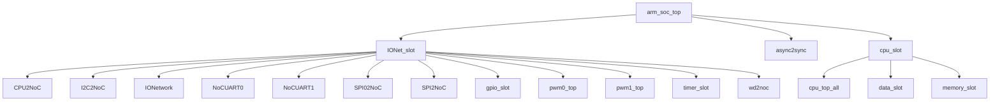

# arm_soc_top RTL 代码手册

本手册采用“主手册 + 模块页”的结构，主手册用于快速定位系统结构，模块页用于查看具体接口和 flow 细节。

## 如何阅读本手册

- 先看“项目总览”和“顶层模块”两节，确认工程用途、RTL 入口和顶层直接实例化关系。
- 再看“顶层结构图”和“完整模块层级结构”，用它们定位父子模块关系。
- 需要查看某个模块细节时，进入 `arm_soc_top_generated_modules/` 下对应的模块页。
- 对 AI 推断内容保持复核意识；确定事实优先来自 Parser、Knowledge IR 和 Manual Context。
- 如需检查生成质量，查看 `arm_soc_top_generated_review.md` 审查报告。

## 1. 项目总览

- 项目用途：AI 推断：顶层SoC模块仅包含u_cpu和io_slot两个关键实例，通过w_driveFrmCPU和w_driveToCPU驱动事件信号双向交互，符合驱动事件桥接层角色
- RTL 目录：`rtl/rtl`。
- 顶层文件：`rtl/rtl/SoC/arm_soc_top.v`。

## 2. 顶层模块 `arm_soc_top`

- 顶层直接实例化模块：`IONet_slot`, `async2sync`, `cpu_slot`。

### 2.1 外部端口分组

端口分组按 pad/信号命名和方向归类，用于快速识别顶层对外边界。

| 端口组 | 方向统计 | 代表信号 |
| --- | --- | --- |
| `clock_reset_init` | inout:1, input:7, output:1 | `initMode_pad`, `RCLK_BAUD_UART0_pad`, `RCLK_BAUD_UART1_pad`, `RCLK_UART0_pad`, `RCLK_UART1_pad`, `clk_pad`, `rst_pad`, `sclk_SPI0_pad`, `... +1` |
| `serial_boot_uart` | input:1, output:1 | `rx_pin_pad`, `tx_pin_pad` |
| `uart0` | input:6, output:6 | `BREG_UART0_pad`, `NCTS_UART0_pad`, `NDCD_UART0_pad`, `NDSR_UART0_pad`, `NRI_UART0_pad`, `SIN_UART0_pad`, `BAUD_UART0_pad`, `NDTR_UART0_pad`, `... +4` |
| `uart1` | input:6, output:6 | `BREG_UART1_pad`, `NCTS_UART1_pad`, `NDCD_UART1_pad`, `NDSR_UART1_pad`, `NRI_UART1_pad`, `SIN_UART1_pad`, `BAUD_UART1_pad`, `NDTR_UART1_pad`, `... +4` |
| `iic0` | input:5, output:6 | `FSEN_IIC0_pad`, `HSEN_IIC0_pad`, `IFSDA_IIC0_pad`, `ISCL_IIC0_pad`, `ISDA_IIC0_pad`, `CKISO_IIC0_pad`, `DAGND_IIC0_pad`, `DAISO_IIC0_pad`, `... +3` |
| `spi0` | input:1, output:3 | `miso_SPI0_pad`, `cs_n_SPI0_pad`, `mosi_SPI0_pad`, `startRead_SPI0_pad` |
| `spi1` | inout:3 | `miso_SPI1_pad`, `mosi_SPI1_pad`, `nss_SPI1_pad` |
| `pwm0` | output:1 | `PWM0_OUT_pad` |
| `pwm1` | output:1 | `PWM1_OUT_pad` |
| `gpio` | inout:1 | `io_pin_pad` |

### 2.2 顶层组成

| 子模块 | 职责 | 接收 | 输出 | 模块页 |
| --- | --- | --- | --- | --- |
| `IONet_slot` | AI 推断：该模块是SoC内部CPU与外围设备（UART、SPI、I2C、PWM、Timer、GPIO、WatchDog）之间的NoC（片上网络）桥接与路由节点。 | drive 输入：`i_drvFCPU`；数据输入：`i_dataFCPU_51`, `io_pin`；free 输入：`i_freeFCPU`；其他输入：`BREG_UART0`, `BREG_UART1`, `FSEN_IIC0`, `HSEN_IIC0`, `... +24` | drive 输出：`o_drv2CPU`；数据输出：`INT_TIMER`, `gpio_ctrl_o`, `gpio_data_o`, `o_data2CPU_51`；free 输出：`o_free2CPU`；其他输出：`BAUD_UART0`, `BAUD_UART1`, `CKISO_IIC0`, `DAGND_IIC0`, `... +36` | [打开](arm_soc_top_generated_modules/IONet_slot.md) |
| `async2sync` | AI 推断：确认模块为异步复位同步释放电路，输出同步复位信号 | 其他输入：`clk`, `rst_async_n` | 其他输出：`rst_sync_n` | [打开](arm_soc_top_generated_modules/async2sync.md) |
| `cpu_slot` | AI 推断：i_driveFromMesh 是 data_mux 模块的输入数据驱动信号，代表来自片外 Mesh 网络的数据有效。 | drive 输入：`i_driveFromMesh`；数据输入：`i_IntSig`, `i_dataFMesh`；控制输入：`initMode`；free 输入：`i_freeFMesh`；其他输入：`clk`, `init_rx`, `soc_start` | drive 输出：`o_driveToMesh`；数据输出：`o_data2Mesh`；free 输出：`o_free2Mesh`；其他输出：`init_sig`, `init_tx` | [打开](arm_soc_top_generated_modules/cpu_slot.md) |

### 2.3 顶层结构图

下图只展示顶层向下的有限层级，完整父子关系见后续层级表。



```text
arm_soc_top
|-- IONet_slot
|   |-- CPU2NoC
|   |-- I2C2NoC
|   |-- IONetwork
|   |-- NoCUART0
|   |-- NoCUART1
|   |-- SPI02NoC
|   |-- SPI2NoC
|   |-- gpio_slot
|   |-- pwm0_top
|   |-- pwm1_top
|   |-- timer_slot
|   `-- wd2noc
|-- async2sync
`-- cpu_slot
    |-- cpu_top_all
    |-- data_slot
    `-- memory_slot
```
- 图中已截断，未展开 26 条后续层级边。

## 3. 完整模块层级结构

- 模块数：106。
- 层级边数：114。

| Parent | Child | Relationship |
| --- | --- | --- |
| `I2C2NoC` | `mi2cv2` | instantiates |
| `IONet_slot` | `CPU2NoC` | instantiates |
| `IONet_slot` | `I2C2NoC` | instantiates |
| `IONet_slot` | `IONetwork` | instantiates |
| `IONet_slot` | `NoCUART0` | instantiates |
| `IONet_slot` | `NoCUART1` | instantiates |
| `IONet_slot` | `SPI02NoC` | instantiates |
| `IONet_slot` | `SPI2NoC` | instantiates |
| `IONet_slot` | `gpio_slot` | instantiates |
| `IONet_slot` | `pwm0_top` | instantiates |
| `IONet_slot` | `pwm1_top` | instantiates |
| `IONet_slot` | `timer_slot` | instantiates |
| `IONet_slot` | `wd2noc` | instantiates |
| `IONetwork` | `nodeTop` | instantiates |
| `NoCUART0` | `m16550s` | instantiates |
| `NoCUART1` | `m16550s` | instantiates |
| `SPI02NoC` | `fire2SyncPluse` | instantiates |
| `SPI02NoC` | `flash_state` | instantiates |
| `SPI2NoC` | `SPI_control` | instantiates |
| `SPI_control` | `CRC_rx` | instantiates |
| `SPI_control` | `CRC_tx` | instantiates |
| `SPI_control` | `clk_div` | instantiates |
| `SPI_control` | `reg_apb` | instantiates |
| `SPI_control` | `spi_m` | instantiates |
| `SPI_control` | `spi_s` | instantiates |
| `SPI_control` | `state0` | instantiates |
| `adder` | `adder32` | instantiates |
| `adder` | `adder5` | instantiates |
| `adder` | `adder64` | instantiates |
| `arm_soc_top` | `IONet_slot` | instantiates |
| `arm_soc_top` | `async2sync` | instantiates |
| `arm_soc_top` | `cpu_slot` | instantiates |
| `clk_div_spi0` | `sclk_done_1` | instantiates |
| `cmsdk_apb_watchdog` | `cmsdk_apb_watchdog_frc` | instantiates |
| `cpu_slot` | `cpu_top_all` | instantiates |
| `cpu_slot` | `data_slot` | instantiates |
| `cpu_slot` | `memory_slot` | instantiates |
| `cpu_top_all` | `contTap` | instantiates |
| `cpu_top_all` | `decoder` | instantiates |
| `cpu_top_all` | `execute` | instantiates |
| `cpu_top_all` | `fetch` | instantiates |
| `cpu_top_all` | `grf` | instantiates |
| `cpu_top_all` | `intAndExc` | instantiates |
| `cpu_top_all` | `launch` | instantiates |
| `cpu_top_all` | `lsu` | instantiates |
| `cpu_top_all` | `prf` | instantiates |
| `cpu_top_all` | `wb` | instantiates |
| `data_init` | `uart_rx` | instantiates |
| `data_init` | `uart_tx` | instantiates |
| `decoder` | `decoder_16` | instantiates |
| `decoder` | `decoder_32` | instantiates |
| `execute` | `adder` | instantiates |
| `execute` | `align` | instantiates |
| `execute` | `ander` | instantiates |
| `execute` | `contTap` | instantiates |
| `execute` | `div` | instantiates |
| `execute` | `eor` | instantiates |
| `execute` | `hsb` | instantiates |
| `execute` | `muller` | instantiates |
| `execute` | `orrer` | instantiates |
| `execute` | `reverse` | instantiates |
| `execute` | `satQ` | instantiates |
| `execute` | `shifter` | instantiates |
| `fetch` | `instSplit` | instantiates |
| `flash_state` | `spi_master_spi0` | instantiates |
| `gpio_slot` | `gpio_module` | instantiates |
| `gpio_slot` | `perip_slot` | instantiates |
| `intAndExc` | `contTap` | instantiates |
| `intAndExc` | `inStack` | instantiates |
| `intAndExc` | `intAndExc_pop` | instantiates |
| `lsu` | `contTap` | instantiates |
| `lsu` | `dataUpdate` | instantiates |
| `lsu` | `multiLoadDataUpate` | instantiates |
| `lsu` | `multiStoreDataUpate` | instantiates |
| `lsu` | `stateUpdate` | instantiates |
| `m16550s` | `m3s001fd` | instantiates |
| `m16550s` | `m3s002fd` | instantiates |
| `m16550s` | `m3s003fd` | instantiates |
| `m16550s` | `m3s004fd` | instantiates |
| `m16550s` | `m3s005fd` | instantiates |
| `m16550s` | `m3s006fd` | instantiates |
| `m16550s` | `m3s007fd` | instantiates |
| `m16550s` | `m3s008fd` | instantiates |
| `m16550s` | `m3s009fd` | instantiates |
| `m16550s` | `m3s010fd` | instantiates |
| `m16550s` | `m3s011fd` | instantiates |
| `m3s009fd` | `m3s012fd` | instantiates |
| `m3s010fd` | `m3s012fd` | instantiates |
| `m3s011fd` | `m3s013fd` | instantiates |
| `m3s013fd` | `m3s014fd` | instantiates |
| `memory_slot` | `data_init` | instantiates |
| `memory_slot` | `socmem` | instantiates |
| `mi2cv2` | `m3s001fb` | instantiates |
| `mi2cv2` | `m3s002fb` | instantiates |
| `mi2cv2` | `m3s003fb` | instantiates |
| `mi2cv2` | `m3s004fb` | instantiates |
| `mi2cv2` | `m3s005fb` | instantiates |
| `nodeTop` | `arbMsg` | instantiates |
| `nodeTop` | `routeMsg` | instantiates |
| `perip_slot` | `fire2SyncPluse` | instantiates |
| `perip_slot_timer` | `fire2SyncPluse` | instantiates |
| `pwm0_top` | `pwm` | instantiates |
| `pwm1_top` | `pwm` | instantiates |
| `routeMsg` | `routeMsgEW` | instantiates |
| `routeMsg` | `routeMsgSN` | instantiates |
| `routeMsg` | `subtr4b` | instantiates |
| `socmem` | `ROM` | instantiates |
| `socmem` | `contTap` | instantiates |
| `socmem` | `sram_128k` | instantiates |
| `socmem` | `sram_8k` | instantiates |
| `spi_master_spi0` | `clk_div_spi0` | instantiates |
| `timer_slot` | `perip_slot_timer` | instantiates |
| `timer_slot` | `timer_module` | instantiates |
| `wd2noc` | `cmsdk_apb_watchdog` | instantiates |

## 4. 子系统与模块索引

每个 reachable module 都有独立模块页；关键模块详写，helper/leaf 模块使用压缩卡片。

| 模块 | 区域 | 职责摘要 | 模块页 |
| --- | --- | --- | --- |
| `CPU2NoC` | cpu | AI 推断：CPU2NoC 是 CPU 与 NoC 之间的双向事件驱动桥接模块，负责将 CPU 发起的请求分发到两个 NoC 通道，并将两个 NoC 通道的响应合并后返回给 CPU。 | [打开](arm_soc_top_generated_modules/CPU2NoC.md) |
| `cpu_slot` | cpu | AI 推断：i_driveFromMesh 是 data_mux 模块的输入数据驱动信号，代表来自片外 Mesh 网络的数据有效。 | [打开](arm_soc_top_generated_modules/cpu_slot.md) |
| `cpu_top_all` | cpu | AI 推断：RTL中i_dataRoutDriveToLsu_1作为DR（Data Route）到LSU的驱动信号，数据经选择后输出。 | [打开](arm_soc_top_generated_modules/cpu_top_all.md) |
| `dataUpdate` | cpu | AI 推断：数据更新模块，负责在 LSU 内部对加载和存储操作进行数据选择、字节对齐、合并，并生成最终的内存访问请求和写回数据。 | [打开](arm_soc_top_generated_modules/dataUpdate.md) |
| `decoder` | cpu | AI 推断：指令解码与分发模块，将取指阶段传入的指令按长度分流至16位或32位解码器，合并解码结果并输出至发射与异常处理阶段。 | [打开](arm_soc_top_generated_modules/decoder.md) |
| `decoder_16` | cpu | AI 推断：16位Thumb指令解码器，将输入的16位指令字解码为187位内部微操作控制字，并生成异常编号和条件标志写使能。 | [打开](arm_soc_top_generated_modules/decoder_16.md) |
| `decoder_32` | cpu | AI 推断：32位Thumb指令解码器，将输入的32位指令字解码为187位内部微操作控制字。 | [打开](arm_soc_top_generated_modules/decoder_32.md) |
| `fetch` | cpu | AI 推断：取指模块，负责接收来自ICache、Top和Dispatch的驱动事件，经过内部流水线处理后，向译码、异常、中断和ICache输出驱动事件。 | [打开](arm_soc_top_generated_modules/fetch.md) |
| `grf` | cpu | AI 推断：通用寄存器文件模块，为处理器流水线各阶段提供寄存器读写访问与数据转发 | [打开](arm_soc_top_generated_modules/grf.md) |
| `intAndExc` | cpu | AI 推断：中断与异常集中仲裁与分发核心，负责收集来自流水线各阶段的中断/异常事件，仲裁优先级，并分发处理结果（写回、数据路由、PC跳转）及释放信号。 | [打开](arm_soc_top_generated_modules/intAndExc.md) |
| `intAndExc_pop` | cpu | AI 推断：中断与异常出栈调度器，将来自DR和Top的驱动事件分发到SP、DR、WGRF、WPSR四个目标，并管理对应的数据路径和释放信号。 | [打开](arm_soc_top_generated_modules/intAndExc_pop.md) |
| `launch` | cpu | AI 推断：指令发射与数据准备中心，负责接收来自译码、执行、加载、GRF、SRF、PSR等多个功能模块的驱动事件，仲裁并合并数据，最终向执行、GRF、SRF、IF、PSR等下游模块发射指令及操作数。 | [打开](arm_soc_top_generated_modules/launch.md) |
| `lsu` | cpu | AI 推断：加载存储单元，负责仲裁来自执行单元、通用寄存器文件、数据路由和指令缓存的访存请求，并分发至写回、异常、发射等下游模块。 | [打开](arm_soc_top_generated_modules/lsu.md) |
| `prf` | cpu | AI 推断：物理寄存器文件模块，负责存储和转发来自发射、写回和异常阶段的寄存器数据与程序状态寄存器数据。 | [打开](arm_soc_top_generated_modules/prf.md) |
| `stateUpdate` | cpu | AI 推断：状态更新与分发模块，负责将来自更新拆分器的请求进行缓冲、类型识别（加载/存储）、状态机转换，并通过互斥合并后输出到状态更新选择器。 | [打开](arm_soc_top_generated_modules/stateUpdate.md) |
| `wb` | cpu | AI 推断：写回阶段模块，负责将执行结果分发并写入通用寄存器组、程序计数器、谓词寄存器、XPSR等架构状态单元。 | [打开](arm_soc_top_generated_modules/wb.md) |
| `adder` | execution_pipeline | AI 推断：多宽度算术加法器，根据操作类型选择32位、5位或64位加法结果 | [打开](arm_soc_top_generated_modules/adder.md) |
| `adder32` | execution_pipeline | AI 推断：32位算术加法器，支持有符号/无符号模式选择，并生成进位和溢出标志 | [打开](arm_soc_top_generated_modules/adder32.md) |
| `adder5` | execution_pipeline | AI 推断：5位加法器模块，支持有符号/无符号加法模式选择，并生成进位和溢出标志 | [打开](arm_soc_top_generated_modules/adder5.md) |
| `adder64` | execution_pipeline | AI 推断：64位算术加法器，支持有符号/无符号模式选择，生成进位和溢出标志 | [打开](arm_soc_top_generated_modules/adder64.md) |
| `align` | execution_pipeline | AI 推断：该模块执行地址对齐操作，将输入的32位操作数向上对齐到4字节边界。 | [打开](arm_soc_top_generated_modules/align.md) |
| `ander` | execution_pipeline | AI 推断：该模块执行两个32位操作数的按位与运算，是执行单元中的纯组合逻辑数据通路组件。 | [打开](arm_soc_top_generated_modules/ander.md) |
| `clk_div` | execution_pipeline | AI 推断：该模块根据波特率选择信号和SPI模式配置，从系统时钟生成SPI主时钟和输出时钟，并产生时钟完成指示信号。 | [打开](arm_soc_top_generated_modules/clk_div.md) |
| `clk_div_spi0` | execution_pipeline | AI 推断：模块通过组合逻辑从cnt[BR]与nss_out生成sclk_m，再在bit8_out有效时输出sclk_out，实现了基于BR的分频和片选门控。 | [打开](arm_soc_top_generated_modules/clk_div_spi0.md) |
| `div` | execution_pipeline | AI 推断：该模块执行32位有符号或无符号整数除法运算，根据symbolFlag信号选择运算模式。 | [打开](arm_soc_top_generated_modules/div.md) |
| `eor` | execution_pipeline | AI 推断：执行按位异或运算的组合逻辑模块 | [打开](arm_soc_top_generated_modules/eor.md) |
| `execute` | execution_pipeline | AI 推断：执行模块是处理器流水线的执行阶段，负责接收来自发射阶段（Launch）的指令，从通用寄存器组（GRF）和加载存储单元（LSU）获取操作数，执行算术逻辑运算，并将结果写回或转发。 | [打开](arm_soc_top_generated_modules/execute.md) |
| `hsb` | execution_pipeline | AI 推断：该模块是一个简单的算术逻辑单元，接收操作数并输出结果，受条件信号控制。 | [打开](arm_soc_top_generated_modules/hsb.md) |
| `muller` | execution_pipeline | AI 推断：32位有符号/无符号乘法器，支持结果按位取反输出 | [打开](arm_soc_top_generated_modules/muller.md) |
| `multiLoadDataUpate` | execution_pipeline | AI 推断：多加载数据更新与写回控制模块，负责从加载数据路由中选择并组合数据，生成写回使能、结束标志及下一轮地址/寄存器列表。 | [打开](arm_soc_top_generated_modules/multiLoadDataUpate.md) |
| `multiStoreDataUpate` | execution_pipeline | AI 推断：该模块负责根据输入地址和寄存器列表，生成多存储操作所需的更新数据、写使能、下一地址和结束标志。 | [打开](arm_soc_top_generated_modules/multiStoreDataUpate.md) |
| `orrer` | execution_pipeline | AI 推断：执行按位逻辑或运算的组合逻辑单元 | [打开](arm_soc_top_generated_modules/orrer.md) |
| `reverse` | execution_pipeline | AI 推断：该模块根据 reverseType 选择信号，对输入操作数 oprand 执行位反转、字节反转、半字反转或带符号扩展的半字反转操作，并输出结果 result。 | [打开](arm_soc_top_generated_modules/reverse.md) |
| `satQ` | execution_pipeline | AI 推断：饱和量化单元，根据符号标志选择有符号或无符号饱和路径，将输入操作数1量化到由操作数2指定的位宽范围内。 | [打开](arm_soc_top_generated_modules/satQ.md) |
| `shifter` | execution_pipeline | AI 推断：执行多种移位和扩展操作的组合逻辑数据通路模块 | [打开](arm_soc_top_generated_modules/shifter.md) |
| `CRC_rx` | noc | AI 推断：该模块根据输入数据流和多项式计算CRC校验值，并输出16位CRC结果。 | [打开](arm_soc_top_generated_modules/CRC_rx.md) |
| `CRC_tx` | noc | AI 推断：该模块根据输入数据计算并输出CRC校验值，支持16位和8位两种模式。 | [打开](arm_soc_top_generated_modules/CRC_tx.md) |
| `I2C2NoC` | noc | AI 推断：验证了模块将输入数据拆解并重组输出数据，其中插入I2C读数据（RDATA）。 | [打开](arm_soc_top_generated_modules/I2C2NoC.md) |
| `IONet_slot` | noc | AI 推断：该模块是SoC内部CPU与外围设备（UART、SPI、I2C、PWM、Timer、GPIO、WatchDog）之间的NoC（片上网络）桥接与路由节点。 | [打开](arm_soc_top_generated_modules/IONet_slot.md) |
| `IONetwork` | noc | AI 推断：IONetwork 模块通过实例化四个 nodeTop 并利用内部连线构成 2x2 网格拓扑。 | [打开](arm_soc_top_generated_modules/IONetwork.md) |
| `NoCUART0` | noc | AI 推断：NoCUART0 是一个 UART 桥接模块，负责在 NoC 协议域和标准 UART 外设之间进行事件驱动的数据转发与握手同步。 | [打开](arm_soc_top_generated_modules/NoCUART0.md) |
| `NoCUART1` | noc | AI 推断：延迟链由三个级联延迟单元组成具体延迟深度由各延迟单元名称隐含。 | [打开](arm_soc_top_generated_modules/NoCUART1.md) |
| `SPI02NoC` | noc | AI 推断：w_fire_2 是一个 2 位线网，其每一位分别由两个 cFifo 实例的 o_fire_1 输出驱动。 | [打开](arm_soc_top_generated_modules/SPI02NoC.md) |
| `SPI2NoC` | noc | AI 推断：SPI2NoC 是一个桥接模块，负责将 SPI 控制器的驱动事件和数据通过一对 FIFO 转换为 NoC 接口的驱动事件和数据，并处理 NoC 的空闲信号回传。 | [打开](arm_soc_top_generated_modules/SPI2NoC.md) |
| `SPI_control` | noc | AI 推断：SPI 主从控制器，通过 APB 接口配置寄存器并驱动 SPI 协议引擎 | [打开](arm_soc_top_generated_modules/SPI_control.md) |
| `arbMsg` | noc | AI 推断：五路消息输入仲裁与合并模块，将来自东、本地、北、南、西五个方向的消息请求合并为单一输出。 | [打开](arm_soc_top_generated_modules/arbMsg.md) |
| `cmsdk_apb_watchdog` | noc | AI 推断：该模块是APB总线上的看门狗定时器控制器，负责管理看门狗定时器的配置、锁定、中断和复位输出。 | [打开](arm_soc_top_generated_modules/cmsdk_apb_watchdog.md) |
| `cmsdk_apb_watchdog_frc` | noc | AI 推断：该模块是一个基于APB接口的强制看门狗定时器，用于在系统锁死或软件失效时产生复位或中断。 | [打开](arm_soc_top_generated_modules/cmsdk_apb_watchdog_frc.md) |
| `fire2SyncPluse` | noc | AI 推断：该模块是一个脉冲边沿检测同步器，用于将输入脉冲信号同步到本地时钟域并检测其上升沿。 | [打开](arm_soc_top_generated_modules/fire2SyncPluse.md) |
| `flash_state` | noc | AI 推断：flash_state 是 SPI 闪存协议的状态控制器，负责管理 SPI 主设备与外部闪存之间的读写操作序列。 | [打开](arm_soc_top_generated_modules/flash_state.md) |
| `gpio_module` | noc | AI 推断：通用输入输出控制模块，提供寄存器映射的GPIO引脚控制和中断管理功能 | [打开](arm_soc_top_generated_modules/gpio_module.md) |
| `gpio_slot` | noc | AI 推断：GPIO槽位模块，负责将Mesh网络驱动事件路由到GPIO外设，并返回驱动完成事件。 | [打开](arm_soc_top_generated_modules/gpio_slot.md) |
| `m16550s` | noc | AI 推断：该模块是一个UART控制器核心，负责处理器总线与串行通信之间的数据桥接与寄存器配置。 | [打开](arm_soc_top_generated_modules/m16550s.md) |
| `m3s001fb` | noc | AI 推断：该模块是一个时钟选择分频器，根据时钟选择信号CKISO从两个输入时钟分频值中选择一个作为内部计数分频值。 | [打开](arm_soc_top_generated_modules/m3s001fb.md) |
| `m3s001fd` | noc | AI 推断：该模块是UART发送路径中的发送缓冲加载控制单元，负责将并行数据加载到发送FIFO。 | [打开](arm_soc_top_generated_modules/m3s001fd.md) |
| `m3s002fb` | noc | AI 推断：该模块在当前上下文中缺乏明确的接口信号和内部连接，其角色无法从现有证据中推断。 | [打开](arm_soc_top_generated_modules/m3s002fb.md) |
| `m3s002fd` | noc | AI 推断：该模块是UART接收路径中的数据缓冲与同步单元，负责将FIFO输出的8位数据转换为内部接收缓冲和直接数据输出。 | [打开](arm_soc_top_generated_modules/m3s002fd.md) |
| `m3s003fb` | noc | AI 推断：该模块是I2C总线接口的寄存器映射与数据缓冲单元，负责将APB总线访问转换为内部寄存器读写操作。 | [打开](arm_soc_top_generated_modules/m3s003fb.md) |
| `m3s003fd` | noc | AI 推断：该模块是UART内部寄存器访问与数据桥接单元，负责将总线地址映射到内部寄存器并完成读写数据转发。 | [打开](arm_soc_top_generated_modules/m3s003fd.md) |
| `m3s004fb` | noc | AI 推断：该模块是一个IIC总线接口的从设备数据与状态寄存器模块，负责存储从机地址和读写数据，并输出状态信息。 | [打开](arm_soc_top_generated_modules/m3s004fb.md) |
| `m3s004fd` | noc | AI 推断：该模块是UART中断使能寄存器(IER)和中断标识寄存器(IIR)的生成逻辑，负责将外部输入的4位数据(DataIn)转换为两个独立的4位寄存器输出。 | [打开](arm_soc_top_generated_modules/m3s004fd.md) |
| `m3s005fb` | noc | AI 推断：该模块是一个单比特写数据缓冲或直通单元，用于将外部写入数据传递至内部逻辑。 | [打开](arm_soc_top_generated_modules/m3s005fb.md) |
| `m3s005fd` | noc | AI 推断：该模块是一个数据宽度转换或寄存器映射单元，将8位输入数据转换为16位输出数据。 | [打开](arm_soc_top_generated_modules/m3s005fd.md) |
| `m3s006fd` | noc | AI 推断：该模块是一个5位数据输入接口的简单数据接收或缓冲单元，可能用于UART子系统的数据路径前端。 | [打开](arm_soc_top_generated_modules/m3s006fd.md) |
| `m3s007fd` | noc | AI 推断：该模块是一个纯数据输出单元，仅提供两个4位数据输出端口TIP_A和TOP_A，无任何事件、控制或数据输入。 | [打开](arm_soc_top_generated_modules/m3s007fd.md) |
| `m3s008fd` | noc | AI 推断：该模块是一个仅包含数据输出的简单组合逻辑或寄存器输出单元，可能用于提供状态或配置信息。 | [打开](arm_soc_top_generated_modules/m3s008fd.md) |
| `m3s009fd` | noc | AI 推断：该模块是一个基于地址映射的寄存器读取多路选择器，根据输入地址选择内部信号输出到数据总线。 | [打开](arm_soc_top_generated_modules/m3s009fd.md) |
| `m3s010fd` | noc | AI 推断：该模块是一个基于地址映射的多路选择器，用于从多个内部信号中选择一个输出到数据总线。 | [打开](arm_soc_top_generated_modules/m3s010fd.md) |
| `m3s011fd` | noc | AI 推断：该模块是一个窄位宽数据转换或路由单元，将两个4位输入映射为一个3位输出。 | [打开](arm_soc_top_generated_modules/m3s011fd.md) |
| `m3s012fd` | noc | AI 推断：该模块是一个简单的数据通路模块，负责将8位输入数据直接传递到8位输出。 | [打开](arm_soc_top_generated_modules/m3s012fd.md) |
| `m3s013fd` | noc | AI 推断：该模块是一个基于地址映射的多路选择器，用于从16个内部信号中选择一个输出到OP_D。 | [打开](arm_soc_top_generated_modules/m3s013fd.md) |
| `m3s014fd` | noc | AI 推断：该模块是一个简单的3位数据通路节点，可能用于UART子系统内的数据重映射或位宽转换。 | [打开](arm_soc_top_generated_modules/m3s014fd.md) |
| `mi2cv2` | noc | AI 推断：mi2cv2 是 IONet IIC 子系统内的一个顶层模块，负责将 APB 总线接口（通过 ADDRESS、WDATA、RDATA）桥接到 I2C 总线物理层（通过 ISCL、ISDA... | [打开](arm_soc_top_generated_modules/mi2cv2.md) |
| `nodeTop` | noc | AI 推断：nodeTop 是一个五方向（东、本地、北、南、西）网络节点路由器，负责将来自五个输入方向的消息路由到五个输出方向。 | [打开](arm_soc_top_generated_modules/nodeTop.md) |
| `perip_slot` | noc | AI 推断：外围设备插槽模块，负责在Mesh网络与外围设备之间进行驱动事件和释放事件的流水线缓冲与延迟同步。 | [打开](arm_soc_top_generated_modules/perip_slot.md) |
| `perip_slot_timer` | noc | AI 推断：该模块作为外围设备槽位定时器，负责在网格网络中延迟和转发驱动事件，并管理对应的释放信号。 | [打开](arm_soc_top_generated_modules/perip_slot_timer.md) |
| `pwm` | noc | AI 推断：该模块是一个PWM波形生成器，根据输入的占空比和频率参数产生脉宽调制输出。 | [打开](arm_soc_top_generated_modules/pwm.md) |
| `pwm0_top` | noc | AI 推断：该模块是PWM子系统的事件驱动型顶层，负责将输入事件通过两级FIFO流水线转发至PWM核心，并输出处理后的驱动事件。 | [打开](arm_soc_top_generated_modules/pwm0_top.md) |
| `pwm1_top` | noc | AI 推断：该模块是一个PWM驱动事件流水线中的中间级，负责通过两级FIFO缓冲和转发驱动事件及关联消息，并输出PWM信号。 | [打开](arm_soc_top_generated_modules/pwm1_top.md) |
| `reg_apb` | noc | AI 推断：该模块是APB从接口与SPI寄存器文件的桥接器，负责将APB总线协议转换为内部寄存器读写选通信号。 | [打开](arm_soc_top_generated_modules/reg_apb.md) |
| `routeMsg` | noc | AI 推断：路由消息分发模块，将输入消息根据方向选择分发到五个方向（东、本地、北、南、西）的发送FIFO。 | [打开](arm_soc_top_generated_modules/routeMsg.md) |
| `routeMsgEW` | noc | AI 推断：坐标有效性检测与消息有效信号生成模块 | [打开](arm_soc_top_generated_modules/routeMsgEW.md) |
| `routeMsgSN` | noc | AI 推断：坐标有效性检测与消息有效信号生成模块 | [打开](arm_soc_top_generated_modules/routeMsgSN.md) |
| `sclk_done_1` | noc | AI 推断：该模块通过组合逻辑生成SPI串行时钟完成指示信号。 | [打开](arm_soc_top_generated_modules/sclk_done_1.md) |
| `spi_m` | noc | AI 推断：SPI主设备控制器，负责管理SPI总线上的数据传输、CRC校验和状态指示 | [打开](arm_soc_top_generated_modules/spi_m.md) |
| `spi_master_spi0` | noc | AI 推断：SPI主控制器模块，负责生成SPI时钟、片选信号并完成数据收发。 | [打开](arm_soc_top_generated_modules/spi_master_spi0.md) |
| `spi_s` | noc | AI 推断：该模块是SPI从设备控制器，负责在SPI总线上作为从机接收和发送数据，并支持CRC校验。 | [打开](arm_soc_top_generated_modules/spi_s.md) |
| `state0` | noc | AI 推断：状态机核心模块，负责SPI接口的内部状态转换与事件驱动控制 | [打开](arm_soc_top_generated_modules/state0.md) |
| `subtr4b` | noc | AI 推断：4位二进制减法器，计算输入a与b的差值并输出借位链结果 | [打开](arm_soc_top_generated_modules/subtr4b.md) |
| `timer_module` | noc | AI 推断：该模块是一个基于内存映射寄存器（MMIO）的定时器单元，提供可编程的计时、计数和软件中断功能。 | [打开](arm_soc_top_generated_modules/timer_module.md) |
| `timer_slot` | noc | AI 推断：作为片上网络(NoC)中定时器外设的槽位封装模块，负责将定时器模块接入Mesh网络的事件驱动与数据通道。 | [打开](arm_soc_top_generated_modules/timer_slot.md) |
| `wd2noc` | noc | AI 推断：看门狗中断与复位信号到片上网络（NoC）的桥接与同步模块 | [打开](arm_soc_top_generated_modules/wd2noc.md) |
| `arm_soc_top` | other | AI 推断：顶层SoC模块仅包含u_cpu和io_slot两个关键实例，通过w_driveFrmCPU和w_driveToCPU驱动事件信号双向交互，符合驱动事件桥接层角色 | [打开](arm_soc_top_generated_modules/arm_soc_top.md) |
| `async2sync` | other | AI 推断：确认模块为异步复位同步释放电路，输出同步复位信号 | [打开](arm_soc_top_generated_modules/async2sync.md) |
| `contTap` | other | AI 推断：该模块是一个控制路径中的“轻触”或“脉冲”生成器，用于产生特定宽度的控制脉冲。 | [打开](arm_soc_top_generated_modules/contTap.md) |
| `inStack` | other | AI 推断：入栈数据合并与选择模块，负责将来自RGRF和RPSR的驱动事件及数据合并，并依据选择逻辑输出到SPDec或回送至RGRF/RPSR。 | [打开](arm_soc_top_generated_modules/inStack.md) |
| `instSplit` | other | AI 推断：指令拆分与分发单元，将64位指令包拆分为最多4条32位指令，并管理指令流控制。 | [打开](arm_soc_top_generated_modules/instSplit.md) |
| `ROM` | storage | AI 推断：只读存储器模块，提供基于地址的固定数据查找功能 | [打开](arm_soc_top_generated_modules/ROM.md) |
| `data_init` | storage | AI 推断：模块通过UART接收数据，驱动指令总线和数据总线，完成初始化写入。 | [打开](arm_soc_top_generated_modules/data_init.md) |
| `data_slot` | storage | AI 推断：数据槽模块，作为CPU、Dcache和Mesh之间的数据通路仲裁与分发中心 | [打开](arm_soc_top_generated_modules/data_slot.md) |
| `memory_slot` | storage | AI 推断：该模块是SoC内存子系统的槽位，负责仲裁来自IF和LSU的驱动事件，并将数据/地址/写使能信号转发给内部socmem实例。 | [打开](arm_soc_top_generated_modules/memory_slot.md) |
| `socmem` | storage | AI 推断：片上存储器子系统，为指令和数据访问提供缓存、ROM和栈存储，并管理IF和LSU接口的驱动与释放握手。 | [打开](arm_soc_top_generated_modules/socmem.md) |
| `sram_128k` | storage | AI 推断：该模块是一个128KB的同步SRAM控制器，通过地址高位解码将访问请求分发到四个32KB的SRAM子bank。 | [打开](arm_soc_top_generated_modules/sram_128k.md) |
| `sram_8k` | storage | AI 推断：该模块是一个8K比特容量的同步SRAM存储体，提供单端口读写访问。 | [打开](arm_soc_top_generated_modules/sram_8k.md) |
| `uart_rx` | storage | AI 推断：UART接收模块，负责将串行输入数据转换为并行数据并输出 | [打开](arm_soc_top_generated_modules/uart_rx.md) |
| `uart_tx` | storage | AI 推断：UART发送模块，负责将并行数据转换为串行比特流并通过tx_pin输出 | [打开](arm_soc_top_generated_modules/uart_tx.md) |
