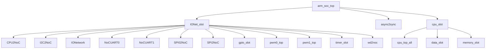

# arm_soc_top RTL 代码手册

本手册采用“主手册 + 模块页”的结构，主手册用于快速定位系统结构，模块页用于查看具体接口和 flow 细节。

## 如何阅读本手册

- 先看“项目总览”和“顶层模块”两节，确认工程用途、RTL 入口和顶层直接实例化关系。
- 再看“顶层结构图”和“完整模块层级结构”，用它们定位父子模块关系。
- 需要查看某个模块细节时，进入 `arm_soc_top_generated_modules/` 下对应的模块页。
- 对 AI 推断内容保持复核意识；确定事实优先来自 Parser、Knowledge IR 和 Manual Context。
- 如需检查生成质量，查看 `arm_soc_top_generated_review.md` 审查报告。

## 1. 项目总览

- 项目用途：AI 推断：切片 5‑6 证实 CPU 与 IO 网络之间存在直接的事件驱动转发和数据通路，没有发现数据转换逻辑。
- RTL 目录：`rtl/rtl`。
- 顶层文件：`rtl\rtl\SoC\arm_soc_top.v`。

## 2. 顶层模块 `arm_soc_top`

`arm_soc_top` 是 SoC 顶层集成模块，将 CPU 子系统与 IO 驱动网络耦合，并提供初始化模式控制。  
顶层直接实例化的子模块为：`IONet_slot`、`async2sync`、`cpu_slot`。

### 2.1 外部端口分组

端口分组按 pad/信号命名和方向归类，用于快速识别顶层对外边界。

| 端口组 | 方向统计 | 代表信号 |
| --- | --- | --- |
| `clock_reset_init` | inout:1, input:7, output:1 | `initMode_pad`, `RCLK_BAUD_UART0_pad`, `RCLK_BAUD_UART1_pad`, `RCLK_UART0_pad`, `RCLK_UART1_pad`, `clk_pad`, `rst_pad`, `sclk_SPI0_pad`, `... +1` |
| `serial_boot_uart` | input:1, output:1 | `rx_pin_pad`, `tx_pin_pad` |
| `uart0` | input:6, output:6 | `BREG_UART0_pad`, `NCTS_UART0_pad`, `NDCD_UART0_pad`, `NDSR_UART0_pad`, `NRI_UART0_pad`, `SIN_UART0_pad`, `BAUD_UART0_pad`, `NDTR_UART0_pad`, `... +4` |
| `uart1` | input:6, output:6 | `BREG_UART1_pad`, `NCTS_UART1_pad`, `NDCD_UART1_pad`, `NDSR_UART1_pad`, `NRI_UART1_pad`, `SIN_UART1_pad`, `BAUD_UART1_pad`, `NDTR_UART1_pad`, `... +4` |
| `iic0` | input:5, output:6 | `FSEN_IIC0_pad`, `HSEN_IIC0_pad`, `IFSDA_IIC0_pad`, `ISCL_IIC0_pad`, `ISDA_IIC0_pad`, `CKISO_IIC0_pad`, `DAGND_IIC0_pad`, `DAISO_IIC0_pad`, `... +3` |
| `spi0` | input:1, output:3 | `miso_SPI0_pad`, `cs_n_SPI0_pad`, `mosi_SPI0_pad`, `startRead_SPI0_pad` |
| `spi1` | inout:3 | `miso_SPI1_pad`, `mosi_SPI1_pad`, `nss_SPI1_pad` |
| `pwm0` | output:1 | `PWM0_OUT_pad` |
| `pwm1` | output:1 | `PWM1_OUT_pad` |
| `gpio` | inout:1 | `io_pin_pad` |

### 2.2 顶层组成

| 子模块 | 职责 | 接收 | 输出 | 模块页 |
| --- | --- | --- | --- | --- |
| `IONet_slot` | AI 推断：IONet_slot 是一个外设集成槽位，将来自CPU的事件和数据通过片上网络（NoC）多路分发至UART、I2C、PWM、定时器、GPIO、SPI及看门狗等外设，并汇聚外设中断与状态直连信号送交顶层。 | drive 输入：`i_drvFCPU`；数据输入：`i_dataFCPU_51`, `io_pin`；free 输入：`i_freeFCPU`；其他输入：`BREG_UART0`, `BREG_UART1`, `FSEN_IIC0`, `HSEN_IIC0`, `... +24` | drive 输出：`o_drv2CPU`；数据输出：`INT_TIMER`, `gpio_ctrl_o`, `gpio_data_o`, `o_data2CPU_51`；free 输出：`o_free2CPU`；其他输出：`BAUD_UART0`, `BAUD_UART1`, `CKISO_IIC0`, `DAGND_IIC0`, `... +36` | [打开](arm_soc_top_generated_modules/IONet_slot.md) |
| `async2sync` | AI 推断：模块 async2sync 是一个异步复位同步器，产生同步后的复位输出 | 其他输入：`clk`, `rst_async_n` | 其他输出：`rst_sync_n` | [打开](arm_soc_top_generated_modules/async2sync.md) |
| `cpu_slot` | AI 推断：init_rx 和 init_tx 直接连接到 memory_slot 的 UART 接口，init_sig 由 memory_slot 输出并用作事件源 UARTInitStart 的开关。 | drive 输入：`i_driveFromMesh`；数据输入：`i_IntSig`, `i_dataFMesh`；控制输入：`initMode`；free 输入：`i_freeFMesh`；其他输入：`clk`, `init_rx`, `soc_start` | drive 输出：`o_driveToMesh`；数据输出：`o_data2Mesh`；free 输出：`o_free2Mesh`；其他输出：`init_sig`, `init_tx` | [打开](arm_soc_top_generated_modules/cpu_slot.md) |

### 2.3 顶层结构图

下图只展示顶层向下的有限层级，完整父子关系见后续层级表。



```text
arm_soc_top
|-- IONet_slot
|   |-- CPU2NoC
|   |-- I2C2NoC
|   |-- IONetwork
|   |-- NoCUART0
|   |-- NoCUART1
|   |-- SPI02NoC
|   |-- SPI2NoC
|   |-- gpio_slot
|   |-- pwm0_top
|   |-- pwm1_top
|   |-- timer_slot
|   `-- wd2noc
|-- async2sync
`-- cpu_slot
    |-- cpu_top_all
    |-- data_slot
    `-- memory_slot
```
- 图中已截断，未展开 26 条后续层级边。

## 3. 完整模块层级结构

- 模块数：106。
- 层级边数：114。

以下表格列出了所有模块间的实例化关系，证据来源于系统拓扑的 hierarchy_edges 分析。

| Parent | Child | Relationship |
| --- | --- | --- |
| `adder` | `adder32` | instantiates |
| `adder` | `adder5` | instantiates |
| `adder` | `adder64` | instantiates |
| `arm_soc_top` | `IONet_slot` | instantiates |
| `arm_soc_top` | `async2sync` | instantiates |
| `arm_soc_top` | `cpu_slot` | instantiates |
| `clk_div_spi0` | `sclk_done_1` | instantiates |
| `cmsdk_apb_watchdog` | `cmsdk_apb_watchdog_frc` | instantiates |
| `cpu_slot` | `cpu_top_all` | instantiates |
| `cpu_slot` | `data_slot` | instantiates |
| `cpu_slot` | `memory_slot` | instantiates |
| `cpu_top_all` | `contTap` | instantiates |
| `cpu_top_all` | `decoder` | instantiates |
| `cpu_top_all` | `execute` | instantiates |
| `cpu_top_all` | `fetch` | instantiates |
| `cpu_top_all` | `grf` | instantiates |
| `cpu_top_all` | `intAndExc` | instantiates |
| `cpu_top_all` | `launch` | instantiates |
| `cpu_top_all` | `lsu` | instantiates |
| `cpu_top_all` | `prf` | instantiates |
| `cpu_top_all` | `wb` | instantiates |
| `data_init` | `uart_rx` | instantiates |
| `data_init` | `uart_tx` | instantiates |
| `decoder` | `decoder_16` | instantiates |
| `decoder` | `decoder_32` | instantiates |
| `execute` | `adder` | instantiates |
| `execute` | `align` | instantiates |
| `execute` | `ander` | instantiates |
| `execute` | `contTap` | instantiates |
| `execute` | `div` | instantiates |
| `execute` | `eor` | instantiates |
| `execute` | `hsb` | instantiates |
| `execute` | `muller` | instantiates |
| `execute` | `orrer` | instantiates |
| `execute` | `reverse` | instantiates |
| `execute` | `satQ` | instantiates |
| `execute` | `shifter` | instantiates |
| `fetch` | `instSplit` | instantiates |
| `flash_state` | `spi_master_spi0` | instantiates |
| `gpio_slot` | `gpio_module` | instantiates |
| `gpio_slot` | `perip_slot` | instantiates |
| `I2C2NoC` | `mi2cv2` | instantiates |
| `intAndExc` | `contTap` | instantiates |
| `intAndExc` | `inStack` | instantiates |
| `intAndExc` | `intAndExc_pop` | instantiates |
| `IONet_slot` | `CPU2NoC` | instantiates |
| `IONet_slot` | `I2C2NoC` | instantiates |
| `IONet_slot` | `IONetwork` | instantiates |
| `IONet_slot` | `NoCUART0` | instantiates |
| `IONet_slot` | `NoCUART1` | instantiates |
| `IONet_slot` | `SPI02NoC` | instantiates |
| `IONet_slot` | `SPI2NoC` | instantiates |
| `IONet_slot` | `gpio_slot` | instantiates |
| `IONet_slot` | `pwm0_top` | instantiates |
| `IONet_slot` | `pwm1_top` | instantiates |
| `IONet_slot` | `timer_slot` | instantiates |
| `IONet_slot` | `wd2noc` | instantiates |
| `IONetwork` | `nodeTop` | instantiates |
| `lsu` | `contTap` | instantiates |
| `lsu` | `dataUpdate` | instantiates |
| `lsu` | `multiLoadDataUpate` | instantiates |
| `lsu` | `multiStoreDataUpate` | instantiates |
| `lsu` | `stateUpdate` | instantiates |
| `m16550s` | `m3s001fd` | instantiates |
| `m16550s` | `m3s002fd` | instantiates |
| `m16550s` | `m3s003fd` | instantiates |
| `m16550s` | `m3s004fd` | instantiates |
| `m16550s` | `m3s005fd` | instantiates |
| `m16550s` | `m3s006fd` | instantiates |
| `m16550s` | `m3s007fd` | instantiates |
| `m16550s` | `m3s008fd` | instantiates |
| `m16550s` | `m3s009fd` | instantiates |
| `m16550s` | `m3s010fd` | instantiates |
| `m16550s` | `m3s011fd` | instantiates |
| `m3s009fd` | `m3s012fd` | instantiates |
| `m3s010fd` | `m3s012fd` | instantiates |
| `m3s011fd` | `m3s013fd` | instantiates |
| `m3s013fd` | `m3s014fd` | instantiates |
| `memory_slot` | `data_init` | instantiates |
| `memory_slot` | `socmem` | instantiates |
| `mi2cv2` | `m3s001fb` | instantiates |
| `mi2cv2` | `m3s002fb` | instantiates |
| `mi2cv2` | `m3s003fb` | instantiates |
| `mi2cv2` | `m3s004fb` | instantiates |
| `mi2cv2` | `m3s005fb` | instantiates |
| `NoCUART0` | `m16550s` | instantiates |
| `NoCUART1` | `m16550s` | instantiates |
| `nodeTop` | `arbMsg` | instantiates |
| `nodeTop` | `routeMsg` | instantiates |
| `perip_slot` | `fire2SyncPluse` | instantiates |
| `perip_slot_timer` | `fire2SyncPluse` | instantiates |
| `pwm0_top` | `pwm` | instantiates |
| `pwm1_top` | `pwm` | instantiates |
| `routeMsg` | `routeMsgEW` | instantiates |
| `routeMsg` | `routeMsgSN` | instantiates |
| `routeMsg` | `subtr4b` | instantiates |
| `socmem` | `ROM` | instantiates |
| `socmem` | `contTap` | instantiates |
| `socmem` | `sram_128k` | instantiates |
| `socmem` | `sram_8k` | instantiates |
| `SPI02NoC` | `fire2SyncPluse` | instantiates |
| `SPI02NoC` | `flash_state` | instantiates |
| `SPI2NoC` | `SPI_control` | instantiates |
| `SPI_control` | `CRC_rx` | instantiates |
| `SPI_control` | `CRC_tx` | instantiates |
| `SPI_control` | `clk_div` | instantiates |
| `SPI_control` | `reg_apb` | instantiates |
| `SPI_control` | `spi_m` | instantiates |
| `SPI_control` | `spi_s` | instantiates |
| `SPI_control` | `state0` | instantiates |
| `spi_master_spi0` | `clk_div_spi0` | instantiates |
| `timer_slot` | `perip_slot_timer` | instantiates |
| `timer_slot` | `timer_module` | instantiates |
| `wd2noc` | `cmsdk_apb_watchdog` | instantiates |

## 4. 子系统与模块索引

每个 reachable module 都有独立模块页；关键模块详写，helper/leaf 模块使用压缩卡片。

| 模块 | 区域 | 职责摘要 | 模块页 |
| --- | --- | --- | --- |
| `CPU2NoC` | cpu | AI 推断：CPU2NoC 是一个连接 CPU 与双通道 NoC 的双向适配器桥接模块，负责将 CPU 发起的写事务根据 IO 地址选择性路由至目标 NoC 通道，并将两个 NoC 通道返回的读响应... | [打开](arm_soc_top_generated_modules/CPU2NoC.md) |
| `cpu_slot` | cpu | AI 推断：init_rx 和 init_tx 直接连接到 memory_slot 的 UART 接口，init_sig 由 memory_slot 输出并用作事件源 UARTInitStart 的开关。 | [打开](arm_soc_top_generated_modules/cpu_slot.md) |
| `cpu_top_all` | cpu | AI 推断：i_dataRoutDriveToLsu_1 通过 DRSelector 将数据路由回复分发为 LSU 驱动与内部驱动两条路径。 | [打开](arm_soc_top_generated_modules/cpu_top_all.md) |
| `dataUpdate` | cpu | AI 推断：负责将LSU发出的加载/存储请求按操作类型拆分为多条数据通路，对齐与符号扩展后经FIFO缓存，最终合并产生内存访问和写回的总线事务。 | [打开](arm_soc_top_generated_modules/dataUpdate.md) |
| `decoder` | cpu | AI 推断：模块通过选择器根据 i_is16_1 将输入驱动路由至对应译码器，译码驱动经合并和延迟链路后由分离器产生 o_driveToLaunch_1 和 o_driveToExc_1，同时提取译... | [打开](arm_soc_top_generated_modules/decoder.md) |
| `decoder_16` | cpu | AI 推断：16位Thumb指令解码器，将输入的指令和PC组合分解为寄存器地址、立即数、操作类型等控制信号，并打包输出到执行级。 | [打开](arm_soc_top_generated_modules/decoder_16.md) |
| `decoder_32` | cpu | AI 推断：将64位输入数据(指令与PC)解码为发射级所需的187位控制数据包，同时产生分支偏移、异常号、条件码写使能，并以i_drive事件驱动流水。 | [打开](arm_soc_top_generated_modules/decoder_32.md) |
| `fetch` | cpu | AI 推断：取指阶段的事件仲裁与多路分发中心，负责接收来自多上游源的指令事件及载荷，经过缓冲、选择和合并后向解码、异常、中断、I‑Cache 等下游有序发送驱动。 | [打开](arm_soc_top_generated_modules/fetch.md) |
| `grf` | cpu | AI 推断：为多执行单元提供寄存器文件读/写仲裁与流水线化的访存接口 | [打开](arm_soc_top_generated_modules/grf.md) |
| `intAndExc` | cpu | AI 推断：中断与异常仲裁、分发及上下文保存/恢复控制模块 | [打开](arm_soc_top_generated_modules/intAndExc.md) |
| `intAndExc_pop` | cpu | AI 推断：中断/异常返回（pop）模块，负责恢复处理器状态：弹出栈帧，更新栈指针（SP），恢复工作寄存器（WGRF）和处理器状态寄存器（WPSR），并支持从特权模式（Top）触发的直接数据通路（D... | [打开](arm_soc_top_generated_modules/intAndExc_pop.md) |
| `launch` | cpu | AI 推断：launch 是处理器流水线中负责指令发射与操作数准备的调度级，接收多个来源的解码数据、执行结果和寄存器值，经内部分发、合并与握手逻辑后，向执行单元（Exe）、GRF、SRF、IF、PS... | [打开](arm_soc_top_generated_modules/launch.md) |
| `lsu` | cpu | AI 推断：加载/存储单元（LSU），负责执行处理器中的加载和存储指令，处理地址生成、数据路由、多加载/多存储序列以及异常检测。 | [打开](arm_soc_top_generated_modules/lsu.md) |
| `prf` | cpu | AI 推断：流水线中负责PRF（物理寄存器文件）和PSR（程序状态寄存器）的驱动事件路由与数据暂存/中转模块。 | [打开](arm_soc_top_generated_modules/prf.md) |
| `stateUpdate` | cpu | AI 推断：管理LSU中load/store指令的状态序列，接收更新触发、对指令分类后推动状态迁移，对外输出当前状态有效向量和错位指示。 | [打开](arm_soc_top_generated_modules/stateUpdate.md) |
| `wb` | cpu | AI 推断：写回结果分发模块，将来自LSU和互斥合并通道的写回事件及数据路由至GRF、PC、PRF、XPSR等目标寄存器组，并协调写使能握手。 | [打开](arm_soc_top_generated_modules/wb.md) |
| `adder` | execution_pipeline | AI 推断：adder5 操作数 w_oprand1_5 和 w_oprand2_5 为5位宽信号，通过 assign 语句从 i_oprand1_64[31:0] 和 i_oprand2_64[3... | [打开](arm_soc_top_generated_modules/adder.md) |
| `adder32` | execution_pipeline | AI 推断：此模块是一个组合逻辑的32位加法器，支持通过symbol控制位在无符号与带符号算术间切换，并生成进位输出与有符号溢出标志。 | [打开](arm_soc_top_generated_modules/adder32.md) |
| `adder5` | execution_pipeline | AI 推断：组合逻辑5位双模加法器，根据symbol信号选择无符号或有符号运算，提供进位输入/输出和溢出检测 | [打开](arm_soc_top_generated_modules/adder5.md) |
| `adder64` | execution_pipeline | AI 推断：模块实现64位加法运算，可动态选择有符号或无符号计算模式，并提供进位和溢出标志。 | [打开](arm_soc_top_generated_modules/adder64.md) |
| `align` | execution_pipeline | AI 推断：地址预对齐单元，将输入操作数递增4并对齐到4字节边界，生成下一个顺序对齐地址。 | [打开](arm_soc_top_generated_modules/align.md) |
| `ander` | execution_pipeline | AI 推断：该模块对两个32位数据输入执行按位与逻辑操作，产生一个数据输出。 | [打开](arm_soc_top_generated_modules/ander.md) |
| `clk_div` | execution_pipeline | AI 推断：该模块可能是一个可配置的SPI时钟发生器，根据波特率选择输入BR生成串行时钟sclk_out，并在时钟周期完成时输出脉冲sclk_done。 | [打开](arm_soc_top_generated_modules/clk_div.md) |
| `clk_div_spi0` | execution_pipeline | AI 推断：SPI0 的时钟生成模块，根据位速率选择 BR 和片选使能生成受两级门控的分频时钟 sclk_out，并提供实时时钟计数 sclk_cnt 供外部监控。 | [打开](arm_soc_top_generated_modules/clk_div_spi0.md) |
| `div` | execution_pipeline | AI 推断：模块 div 是一个组合逻辑或时序除法器，根据有符号/无符号标志计算 32 位整数除法结果。 | [打开](arm_soc_top_generated_modules/div.md) |
| `eor` | execution_pipeline | AI 推断：纯组合逻辑的位异或运算模块，用于数据通路中的算术或逻辑运算 | [打开](arm_soc_top_generated_modules/eor.md) |
| `execute` | execution_pipeline | AI 推断：execute 模块是处理器的执行级，负责接收指令包和操作数，完成算术/逻辑/移位/乘除等运算，并将结果分发给异常、LSU、GRF及下级流水线。 | [打开](arm_soc_top_generated_modules/execute.md) |
| `hsb` | execution_pipeline | AI 推断：hsb 模块可能为一个条件位操作单元，根据 notFlag 信号对 32 位输入 oprand 执行位操作（如取反或直接通过）并输出至 result | [打开](arm_soc_top_generated_modules/hsb.md) |
| `muller` | execution_pipeline | AI 推断：一个可配置有符号/无符号的乘法器，带输出取反控制 | [打开](arm_soc_top_generated_modules/muller.md) |
| `multiLoadDataUpate` | execution_pipeline | AI 推断：该模块可能作为多负载操作的数据更新与回写控制单元，根据寄存器掩码和来自数据路由的返回数据生成下一状态信息及写回数据。 | [打开](arm_soc_top_generated_modules/multiLoadDataUpate.md) |
| `multiStoreDataUpate` | execution_pipeline | AI 推断：多笔存储数据更新的步进状态分解器，根据当前地址对齐与待更新寄存器列表生成下次操作的地址、列表及控制信号 | [打开](arm_soc_top_generated_modules/multiStoreDataUpate.md) |
| `orrer` | execution_pipeline | AI 推断：在ALU/执行数据通路中实现按位逻辑“或”运算，将两个32位操作数组合产生结果。 | [打开](arm_soc_top_generated_modules/orrer.md) |
| `reverse` | execution_pipeline | AI 推断：根据控制信号对输入操作数执行四种数据反转操作的组合逻辑模块 | [打开](arm_soc_top_generated_modules/reverse.md) |
| `satQ` | execution_pipeline | AI 推断：组合逻辑饱和运算模块，根据位宽参数对输入数据进行有符号或无符号饱和处理。 | [打开](arm_soc_top_generated_modules/satQ.md) |
| `shifter` | execution_pipeline | AI 推断：一种组合逻辑移位器和旋转器，支持多种移位类型并可根据控制标志进行符号/零扩展和按位取反。 | [打开](arm_soc_top_generated_modules/shifter.md) |
| `CRC_rx` | noc | AI 推断：该模块根据输入数据和多项式并行计算 CRC 值，并通过选择信号在 16 位和 8 位 CRC 结果间切换，最终输出到 CRC_out。 | [打开](arm_soc_top_generated_modules/CRC_rx.md) |
| `CRC_tx` | noc | AI 推断：可配置的CRC计算模块，根据内部控制信号选择输出8位或16位CRC校验值。 | [打开](arm_soc_top_generated_modules/CRC_tx.md) |
| `I2C2NoC` | noc | AI 推断：i_drvFNoc 被用作 cFifo3_I2C_1 的输入驱动信号，切片确认了其连接。 | [打开](arm_soc_top_generated_modules/I2C2NoC.md) |
| `IONet_slot` | noc | AI 推断：IONet_slot 是一个外设集成槽位，将来自CPU的事件和数据通过片上网络（NoC）多路分发至UART、I2C、PWM、定时器、GPIO、SPI及看门狗等外设，并汇聚外设中断与状态直... | [打开](arm_soc_top_generated_modules/IONet_slot.md) |
| `IONetwork` | noc | AI 推断：i_driveEast_10直接连接到node_10的i_driveEast端口，无中间逻辑。 | [打开](arm_soc_top_generated_modules/IONetwork.md) |
| `NoCUART0` | noc | AI 推断：NoC与UART外设之间的桥接模块，实现NoC数据包到UART串行接口的协议转换。 | [打开](arm_soc_top_generated_modules/NoCUART0.md) |
| `NoCUART1` | noc | AI 推断：作为 UART 外设与 NoC 之间的事件驱动数据桥接，将 UART 接收数据转化为 NoC 格式的输出数据包。 | [打开](arm_soc_top_generated_modules/NoCUART1.md) |
| `SPI02NoC` | noc | AI 推断：w_fire_2[1] 由 i_driveFrmMesh 经两级 cFifo1 与 delay4U 产生，当写使能且地址为 TDR 时，startRead_fire 直接复用该脉冲，逻辑清晰。 | [打开](arm_soc_top_generated_modules/SPI02NoC.md) |
| `SPI2NoC` | noc | AI 推断：i_drvFNoc与i_dataFNoc_51可以推断为同时有效，数据随事件被捕获到模块内部，形成关联。 | [打开](arm_soc_top_generated_modules/SPI2NoC.md) |
| `SPI_control` | noc | AI 推断：SPI外设顶层集成模块，通过APB接口提供寄存器级配置，整合SPI主/从收发、时钟生成、CRC校验、错误检测和中断管理功能。 | [打开](arm_soc_top_generated_modules/SPI_control.md) |
| `arbMsg` | noc | AI 推断：i_driveEast信号直接连接至arbMerge输入，模块内无其他逻辑 | [打开](arm_soc_top_generated_modules/arbMsg.md) |
| `cmsdk_apb_watchdog` | noc | AI 推断：基于APB总线接口的看门狗外设控制器，负责寄存器访问、锁定保护、中断/复位输出的生成和路由。 | [打开](arm_soc_top_generated_modules/cmsdk_apb_watchdog.md) |
| `cmsdk_apb_watchdog_frc` | noc | AI 推断：功能寄存器控制逻辑，负责根据 APB 写事务解码生成看门狗控制、加载和中断清除使能，并转发写数据及中断/复位状态。 | [打开](arm_soc_top_generated_modules/cmsdk_apb_watchdog_frc.md) |
| `fire2SyncPluse` | noc | AI 推断：一个将输入信号电平变化转换为同步脉冲输出的边沿检测模块。 | [打开](arm_soc_top_generated_modules/fire2SyncPluse.md) |
| `flash_state` | noc | AI 推断：该模块是SPI主控的结构化状态机封装层，负责管理面向SPI Flash的读写传输状态与使能时序。 | [打开](arm_soc_top_generated_modules/flash_state.md) |
| `gpio_module` | noc | AI 推断：基于地址译码的GPIO寄存器外设，通过总线接口提供GPIO控制、数据与中断管理功能。 | [打开](arm_soc_top_generated_modules/gpio_module.md) |
| `gpio_slot` | noc | AI 推断：将GPIO外设集成到Mesh总线的封装模块，负责总线协议握手与数据路径转换，同时直接暴露GPIO控制、数据、引脚状态和中断信号。 | [打开](arm_soc_top_generated_modules/gpio_slot.md) |
| `m16550s` | noc | AI 推断：推测为16550 UART寄存器文件的组合地址解码及读数据通路模块 | [打开](arm_soc_top_generated_modules/m16550s.md) |
| `m3s001fb` | noc | AI 推断：该模块可能是一个时钟分频值多路复用器，根据内部信号CKISO选择CCRH[2:0]或CCRFS[2:0]输出到Count1_DIV[2:0] | [打开](arm_soc_top_generated_modules/m3s001fb.md) |
| `m3s001fd` | noc | AI 推断：模块疑似封装UART发送缓冲加载的启动信号传递，将Start映射为LoadTxBuff | [打开](arm_soc_top_generated_modules/m3s001fd.md) |
| `m3s002fb` | noc | 证据不足：Manual Context 未提供职责摘要 | [打开](arm_soc_top_generated_modules/m3s002fb.md) |
| `m3s002fd` | noc | AI 推断：可能为UART接收数据缓冲与分发模块，将RxFIFO输入同时驱动至RxBuff和RxData两个输出。 | [打开](arm_soc_top_generated_modules/m3s002fd.md) |
| `m3s003fb` | noc | AI 推断：IIC从机接口的组合数据路径与控制信号生成逻辑。 | [打开](arm_soc_top_generated_modules/m3s003fb.md) |
| `m3s003fd` | noc | AI 推断：模块 m3s003fd 很可能是一个 UART 外设的寄存器接口桥接逻辑，根据地址输入 ADDRESS 将写数据 WDATA 路由或解码为内部各个控制/数据寄存器（DIV, IER, I... | [打开](arm_soc_top_generated_modules/m3s003fd.md) |
| `m3s004fb` | noc | 证据不足：Manual Context 未提供职责摘要 | [打开](arm_soc_top_generated_modules/m3s004fb.md) |
| `m3s004fd` | noc | AI 推断：该模块可能实现UART中断控制通路，处理中断使能配置和状态识别 | [打开](arm_soc_top_generated_modules/m3s004fd.md) |
| `m3s005fb` | noc | AI 推断：模块接口极简，无法从提供上下文中确定其结构角色或设计意图，需审查完整RTL源。 | [打开](arm_soc_top_generated_modules/m3s005fb.md) |
| `m3s005fd` | noc | AI 推断：推测为一个将 8 位输入 DataIn 映射为 16 位输出 DIV 的组合逻辑除法或固定查找表模块 | [打开](arm_soc_top_generated_modules/m3s005fd.md) |
| `m3s006fd` | noc | AI 推断：手册应明确当前提取上下文严重不足，模块仅暴露一位宽输入DataIn[4:0]而无任何输出或内部行为，避免生成确定性功能描述；需要基于完整RTL进行人工审查与补充。 | [打开](arm_soc_top_generated_modules/m3s006fd.md) |
| `m3s007fd` | noc | AI 推断：可能是一个固定值驱动器，将预定义的配置常数或硬件编码值输出到 TIP_A 和 TOP_A 引脚 | [打开](arm_soc_top_generated_modules/m3s007fd.md) |
| `m3s008fd` | noc | AI 推断：该模块可能是一个无输入驱动的常量生成器或极性配置源，为 UART 相关电路提供固定的 4‑bit 电平指示 | [打开](arm_soc_top_generated_modules/m3s008fd.md) |
| `m3s009fd` | noc | AI 推断：该模块可能实现一种地址译码或多路选择功能，但其内部信号 OP0–OP15 的生成逻辑在上下文中缺失，无法确认实际意图。 | [打开](arm_soc_top_generated_modules/m3s009fd.md) |
| `m3s010fd` | noc | AI 推断：组合逻辑模块，推测将 16 个内部信号进行逻辑或，生成单个输出数据，可能用于 UART 域的状态合并或中断汇总。 | [打开](arm_soc_top_generated_modules/m3s010fd.md) |
| `m3s011fd` | noc | AI 推断：在获得RTL源代码前，模块手册仅应描述接口规范，内部行为解释需要源代码验证。 | [打开](arm_soc_top_generated_modules/m3s011fd.md) |
| `m3s012fd` | noc | 证据不足：Manual Context 未提供职责摘要 | [打开](arm_soc_top_generated_modules/m3s012fd.md) |
| `m3s013fd` | noc | AI 推断：模块 m3s013fd 是一个纯组合逻辑单元，用于将16个内部信号（OP0~OP15）通过按位逻辑或汇聚为单一输出 OP_D。 | [打开](arm_soc_top_generated_modules/m3s013fd.md) |
| `m3s014fd` | noc | AI 推断：可能是一个简单的I/O缓冲单元，直接将3位输入传递到输出，不引入控制或事件逻辑。 | [打开](arm_soc_top_generated_modules/m3s014fd.md) |
| `mi2cv2` | noc | AI 推断：I2C 总线接口宏，集成数字协议引擎、输入滤波、输出驱动和电源隔离控制，实现完整的 I2C 通信功能。 | [打开](arm_soc_top_generated_modules/mi2cv2.md) |
| `nodeTop` | noc | AI 推断：五方向（东、南、西、北、本地）片上网络路由节点，基于事件驱动‑消息载荷握手协议接收来自任一方向的输入包，通过Route‑Arb内部流水线将包转发至一个或多个输出方向。 | [打开](arm_soc_top_generated_modules/nodeTop.md) |
| `perip_slot` | noc | AI 推断：用作Mesh互连与外设之间的槽位适配器，将Mesh的驱动事件和数据转发至外设，并对外提供符合本地时序的访问信号，同时实现流控与缓冲。 | [打开](arm_soc_top_generated_modules/perip_slot.md) |
| `perip_slot_timer` | noc | AI 推断：在 IO 网格中为外设访问提供固定延迟槽的异步事件驱动流水线，可能用于匹配外设时序或实现总线流水级。 | [打开](arm_soc_top_generated_modules/perip_slot_timer.md) |
| `pwm` | noc | AI 推断：推测为基于输入的占空比和频率生成脉宽调制波形的核心模块，但当前上下文未提供输出端口与内部驱动逻辑，实际功能待确认。 | [打开](arm_soc_top_generated_modules/pwm.md) |
| `pwm0_top` | noc | AI 推断：作为PWM配置消息的流水线缓冲拓扑，在外部handshake接口与内部PWM生成模块之间提供两级FIFO解耦。 | [打开](arm_soc_top_generated_modules/pwm0_top.md) |
| `pwm1_top` | noc | AI 推断：作为PWM外设的顶层流控包装模块，将输入配置数据的有效/就绪握手流水线化后驱动内部PWM发生器，并提供波形输出 | [打开](arm_soc_top_generated_modules/pwm1_top.md) |
| `reg_apb` | noc | AI 推断：作为 APB 从设备接口，负责将 APB 总线传输解析为 SPI 外设寄存器的读写选通信号，并收集外设数据以生成读响应。 | [打开](arm_soc_top_generated_modules/reg_apb.md) |
| `routeMsg` | noc | AI 推断：routeMsg 是 NoC 二维网格中的一个消息路由节点，将单个入口消息根据外部方向有效性信号选择性地转发至东、西、北、南或本地端口。 | [打开](arm_soc_top_generated_modules/routeMsg.md) |
| `routeMsgEW` | noc | AI 推断：基于 4-bit 坐标输入生成单比特消息有效指示的组合逻辑单元 | [打开](arm_soc_top_generated_modules/routeMsgEW.md) |
| `routeMsgSN` | noc | AI 推断：将多比特坐标输入转换为有效标志的组合逻辑模块。 | [打开](arm_soc_top_generated_modules/routeMsgSN.md) |
| `sclk_done_1` | noc | AI 推断：该模块最可能用于生成 SPI 串行时钟（SCLK）完成指示信号，依据计数器的第5位与缓冲状态给出完成标记 | [打开](arm_soc_top_generated_modules/sclk_done_1.md) |
| `spi_m` | noc | AI 推断：该模块实现了一个集成了CRC计算/校验功能的SPI主机控制器，负责数据的收发和传输完成状态管理。 | [打开](arm_soc_top_generated_modules/spi_m.md) |
| `spi_master_spi0` | noc | AI 推断：该模块是SPI主机控制器，负责生成SPI串行时钟、片选信号并管理数据收发。 | [打开](arm_soc_top_generated_modules/spi_master_spi0.md) |
| `spi_s` | noc | AI 推断：SPI 从设备或协议处理单元，负责 SPI 数据帧的发送、接收及 CRC 生成/校验。 | [打开](arm_soc_top_generated_modules/spi_s.md) |
| `state0` | noc | AI 推断：当前上下文未提供模块接口信息，无法推断设计意图或结构角色。 | [打开](arm_soc_top_generated_modules/state0.md) |
| `subtr4b` | noc | AI 推断：纯组合逻辑的4位减法运算模块，输出差值differ[3:0]。 | [打开](arm_soc_top_generated_modules/subtr4b.md) |
| `timer_module` | noc | AI 推断：实现了一个内存映射的定时器外设，负责寄存器读访问与软件中断信号合成。 | [打开](arm_soc_top_generated_modules/timer_module.md) |
| `timer_slot` | noc | AI 推断：作为外部Mesh事件驱动接口与内部定时器模块之间的适配封装层 | [打开](arm_soc_top_generated_modules/timer_slot.md) |
| `wd2noc` | noc | AI 推断：看门狗到NoC的跨时钟域桥接与封装模块，集成CMSDK APB看门狗，将其事件、状态通过FIFO链同步输出。 | [打开](arm_soc_top_generated_modules/wd2noc.md) |
| `arm_soc_top` | other | AI 推断：切片 5‑6 证实 CPU 与 IO 网络之间存在直接的事件驱动转发和数据通路，没有发现数据转换逻辑。 | [打开](arm_soc_top_generated_modules/arm_soc_top.md) |
| `async2sync` | other | AI 推断：模块 async2sync 是一个异步复位同步器，产生同步后的复位输出 | [打开](arm_soc_top_generated_modules/async2sync.md) |
| `contTap` | other | AI 推断：无法从紧凑型 AI 上下文中推断模块结构角色，信号列表全部为空 | [打开](arm_soc_top_generated_modules/contTap.md) |
| `inStack` | other | AI 推断：硬件上下文保存/恢复堆栈管理器，支持向量中断时将RGRF、RPSR、PC打包成栈帧并生成写入地址与数据，或在返回时从栈帧中提取数据分发到相应寄存器。 | [打开](arm_soc_top_generated_modules/inStack.md) |
| `instSplit` | other | AI 推断：取指指令拆分模块，将指令缓存吐出的一包指令拆解为多条独立指令并分配对应PC，同时管理取指流控。 | [打开](arm_soc_top_generated_modules/instSplit.md) |
| `ROM` | storage | AI 推断：ROM作为只读存储器模块，依据地址输入提供指令或常量数据输出，服务于 SoC 的取指或常量表访问。 | [打开](arm_soc_top_generated_modules/ROM.md) |
| `data_init` | storage | AI 推断：模块通过UART接收配置命令和数据，驱动指令总线与数据总线，承担初始化接口角色。 | [打开](arm_soc_top_generated_modules/data_init.md) |
| `data_slot` | storage | AI 推断：RTL 清楚展示了从 Dcache 到 CPU 的事件路径，包括 8 周期延迟、MutexMerge 仲裁及后续 8 周期延迟，与语义描述一致。 | [打开](arm_soc_top_generated_modules/data_slot.md) |
| `memory_slot` | storage | AI 推断：系统内存访问插槽，将外部指令和数据总线请求转发给内部 socmem，并支持通过 UART 进行内存初始化。 | [打开](arm_soc_top_generated_modules/memory_slot.md) |
| `socmem` | storage | AI 推断：作为SoC内存子系统，集成指令与数据缓存、堆栈及ROM，并通过双通道流水线握手协议管理访问请求和响应 | [打开](arm_soc_top_generated_modules/socmem.md) |
| `sram_128k` | storage | AI 推断：实现一个128KB异步SRAM存储宏单元，提供64位数据宽度与字节写使能，内部通过地址高两位划分为4个Bank并组合输出读数据。 | [打开](arm_soc_top_generated_modules/sram_128k.md) |
| `sram_8k` | storage | AI 推断：基于 10 位地址、64 位数据通路和 8 位字节写使能的 8KB 同步 SRAM 存储模块 | [打开](arm_soc_top_generated_modules/sram_8k.md) |
| `uart_rx` | storage | AI 推断：可能作为 UART 接收数据缓冲器，将内部收到的字节通过简单的就绪/有效握手接口提供给下游。 | [打开](arm_soc_top_generated_modules/uart_rx.md) |
| `uart_tx` | storage | AI 推断：UART 串行发送器，将并行数据字节转换为串行数据比特流并通过 tx_pin 输出 | [打开](arm_soc_top_generated_modules/uart_tx.md) |
