# 模块 `CPU2NoC`

- 源文件：`rtl/rtl/IONet/IONetwork_9.24/CPU2NoC.v`。
- 职责：AI 推断：事件 i_drvFNoCChannel0 与数据载荷 i_dataFNoCChannel0_51 同步进入合并器 mutexRead。。
- 说明：切片3显示 i_drvFNoCChannel0 连接到 mutexRead 的 i_drive0，i_dataFNoCChannel0_51 连接到 i_data0_51，数据与事件在同一合并器端口同步输入。

## 1. 层级位置

- Parents：`IONet_slot`。
- Children：无。
- Component children：`cFifo1`, `cMutexMerge2_51b`, `cSelector2_1b`, `cSelector2_41b`, `cSplitter2_51b`。
- Upstream modules：无。
- Downstream modules：无。

### 1.1 本模块结构图

```mermaid
flowchart TB
  CPU2NoC["CPU2NoC"] -->|instance| mutexRead_cMutexMerge2_51b["mutexRead: cMutexMerge2_51b"]
  CPU2NoC["CPU2NoC"] -->|instance| mutexWrite_cMutexMerge2_51b["mutexWrite: cMutexMerge2_51b"]
  CPU2NoC["CPU2NoC"] -->|instance| select0_cSelector2_41b["select0: cSelector2_41b"]
  CPU2NoC["CPU2NoC"] -->|instance| select2_cSelector2_1b["select2: cSelector2_1b"]
  CPU2NoC["CPU2NoC"] -->|instance| select3_cSelector2_1b["select3: cSelector2_1b"]
  CPU2NoC["CPU2NoC"] -->|instance| splitterChannel0_cSplitter2_51b["splitterChannel0: cSplitter2_51b"]
  CPU2NoC["CPU2NoC"] -->|instance| splitterChannel1_cSplitter2_51b["splitterChannel1: cSplitter2_51b"]
  CPU2NoC["CPU2NoC"] -->|instance| cfifo0_cFifo1["cfifo0: cFifo1"]
  CPU2NoC["CPU2NoC"] -->|instance| cfifo1_cFifo1["cfifo1: cFifo1"]
  CPU2NoC["CPU2NoC"] -->|instance| cfifo2_cFifo1["cfifo2: cFifo1"]
  CPU2NoC["CPU2NoC"] -->|instance| cfifoOut_cFifo1["cfifoOut: cFifo1"]
  CPU2NoC["CPU2NoC"] -->|component| cFifo1["cFifo1"]
  CPU2NoC["CPU2NoC"] -->|component| cMutexMerge2_51b["cMutexMerge2_51b"]
  CPU2NoC["CPU2NoC"] -->|component| cSelector2_1b["cSelector2_1b"]
  CPU2NoC["CPU2NoC"] -->|component| cSelector2_41b["cSelector2_41b"]
  CPU2NoC["CPU2NoC"] -->|component| cSplitter2_51b["cSplitter2_51b"]
```



```text
CPU2NoC
|-- mutexRead: cMutexMerge2_51b
|-- mutexWrite: cMutexMerge2_51b
|-- select0: cSelector2_41b
|-- select2: cSelector2_1b
|-- select3: cSelector2_1b
|-- splitterChannel0: cSplitter2_51b
|-- splitterChannel1: cSplitter2_51b
|-- cfifo0: cFifo1
|-- cfifo1: cFifo1
|-- cfifo2: cFifo1
|-- cfifoOut: cFifo1
|-- cFifo1
|-- cMutexMerge2_51b
|-- cSelector2_1b
|-- cSelector2_41b
`-- cSplitter2_51b
```

## 2. 输入/输出接口摘要

- 接收：drive 输入：`i_drvFCPU`, `i_drvFNoCChannel0`, `i_drvFNoCChannel1`；数据输入：`i_dataFCPU_51`, `i_dataFNoCChannel0_51`, `i_dataFNoCChannel1_51`；free 输入：`i_freeFCPU`, `i_freeFNoCChanel0`, `i_freeFNoCChanel1`。
- 输出：drive 输出：`o_drv2CPU`, `o_drv2NoCChanel0`, `o_drv2NoCChanel1`；数据输出：`o_data2CPU_51`, `o_data2NoCChanel0_51`, `o_data2NoCChanel1_51`；free 输出：`o_free2CPU`, `o_free2NocChannel0`, `o_free2NocChannel1`。

### 2.1 端口分组

| 端口组 | 方向统计 | 代表信号 |
| --- | --- | --- |
| `drive_event` | input:3, output:3 | `i_drvFCPU`, `i_drvFNoCChannel0`, `i_drvFNoCChannel1`, `o_drv2CPU`, `o_drv2NoCChanel0`, `o_drv2NoCChanel1` |
| `free_backpressure` | input:3, output:3 | `i_freeFCPU`, `i_freeFNoCChanel0`, `i_freeFNoCChanel1`, `o_free2CPU`, `o_free2NocChannel0`, `o_free2NocChannel1` |
| `other_ports` | input:3, output:3 | `i_dataFCPU_51`, `i_dataFNoCChannel0_51`, `i_dataFNoCChannel1_51`, `o_data2CPU_51`, `o_data2NoCChanel0_51`, `o_data2NoCChanel1_51` |

## 3. Drive/Data/Free 契约

| Interface | 方向 | Event | Payload | Free/backpressure |
| --- | --- | --- | --- | --- |
| `i_drvFCPU` | input | `i_drvFCPU` | `i_dataFCPU_51 [50:0]` | 未记录 |
| `i_drvFNoCChannel0` | input | `i_drvFNoCChannel0` | `i_dataFNoCChannel0_51 [50:0]` | 未记录 |
| `i_drvFNoCChannel1` | input | `i_drvFNoCChannel1` | `i_dataFNoCChannel1_51 [50:0]` | 未记录 |
| `o_drv2CPU` | output | `o_drv2CPU` | 未记录 | 未记录 |
| `o_drv2NoCChanel0` | output | `o_drv2NoCChanel0` | `o_data2NoCChanel0_51 [50:0]` | `i_freeFNoCChanel0` |
| `o_drv2NoCChanel1` | output | `o_drv2NoCChanel1` | `o_data2NoCChanel1_51 [50:0]` | `i_freeFNoCChanel1` |

## 4. 主要 Drive-centered Flow

### `i_drvFCPU`

- 确定性事实：`i_drvFCPU to o_drv2NoCChanel0, o_drv2NoCChanel1`；flow_id=`flow_000_CPU2NoC_i_drvFCPU`。
- Payload：`i_drvFCPU` -> `i_dataFCPU_51 [50:0]`, `o_drv2NoCChanel0` -> `o_data2NoCChanel0_51 [50:0]`, `o_drv2NoCChanel1` -> `o_data2NoCChanel1_51 [50:0]`。
- 输出/影响：`o_drv2NoCChanel0`, `o_drv2NoCChanel1`。
- 结构复杂度：branch=5，join=1，blocking=3。
- AI 推断：事件i_drvFCPU携带51位数据载荷i_dataFCPU_51，该载荷随事件流传播，最终在splitterChannel0/1处输出为o_data2NoCChanel0_51和o_data2NoCChanel1_51。

### `i_drvFNoCChannel0`

- 确定性事实：`i_drvFNoCChannel0 to o_drv2CPU`；flow_id=`flow_001_CPU2NoC_i_drvFNoCChannel0`。
- Payload：`i_drvFNoCChannel0` -> `i_dataFNoCChannel0_51 [50:0]`。
- 输出/影响：`o_drv2CPU`。
- 结构复杂度：branch=0，join=1，blocking=3。
- AI 推断：输入数据载荷 i_dataFNoCChannel0_51 与驱动事件 i_drvFNoCChannel0 相关联，并随事件流传递。

### `i_drvFNoCChannel1`

- 确定性事实：`i_drvFNoCChannel1 to o_drv2CPU`；flow_id=`flow_002_CPU2NoC_i_drvFNoCChannel1`。
- Payload：`i_drvFNoCChannel1` -> `i_dataFNoCChannel1_51 [50:0]`。
- 输出/影响：`o_drv2CPU`。
- 结构复杂度：branch=0，join=1，blocking=3。
- AI 推断：数据信号 i_dataFNoCChannel1_51 作为事件 i_drvFNoCChannel1 的伴随载荷，随事件流同步传递。


## 5. 内部组件与 assign 影响

### 5.1 内部组件

| 实例 | 类型 | 输入事件 | 输出事件 |
| --- | --- | --- | --- |
| `mutexRead` | `cMutexMerge2_51b` | `i_drvFNoCChannel0`, `i_drvFNoCChannel1` | `w_drvMutexRead2select1` |
| `mutexWrite` | `cMutexMerge2_51b` | `w_drv2Mutex0Channel0`, `w_drv2Mutex0Channel1` | `w_drv2CPUStore_dalay1` |
| `select0` | `cSelector2_41b` | `w_drvSelect0` | `w_drv2Channel0`, `w_drv2Channel1` |
| `select2` | `cSelector2_1b` | `w_drv2select2` | `w_drv2Mutex0Channel0` |
| `select3` | `cSelector2_1b` | `w_drv2select3` | `w_drv2Mutex0Channel1` |
| `splitterChannel0` | `cSplitter2_51b` | `w_drv2Channel0` | `w_drv2NoCChanel0`, `w_drv2select2` |
| `splitterChannel1` | `cSplitter2_51b` | `w_drv2Channel1` | `w_drv2NoCChanel1`, `w_drv2select3` |
| `cfifo0` | `cFifo1` | `i_drvFCPU` | `w_drv2fifo2` |
| `cfifo1` | `cFifo1` | `w_drvMutexRead2select1` | `w_drvCPULoad` |
| `cfifo2` | `cFifo1` | `w_drv2fifo2_dalay` | `w_drvSelect0` |
| `cfifoOut` | `cFifo1` | `w_drvCPULoad` | `o_drv2CPU` |

### 5.2 assign 影响

| Assign | Impact area | LHS | RHS 摘要 | 解释状态 |
| --- | --- | --- | --- | --- |
| `assign_1` | data_path | `o_data2CPU_51` | r_data2CPU_51 | 证据不足：No Semantic Layer assignment interpretation is available. |
| `assign_0` | control_path | `o_free2CPU` | o_drv2CPU | 证据不足：No Semantic Layer assignment interpretation is available. |
