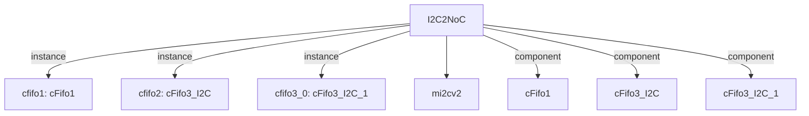

# 模块 `I2C2NoC`

- 源文件：`rtl/rtl/IONet/IIC/I2C2NoC.v`。
- 职责：AI 推断：该模块作为I2C主控制器（mi2cv2）与片上网络（NoC）之间的桥接与数据同步模块，负责将I2C总线事件转换为NoC兼容的驱动事件，并管理数据路径的延迟与同步。。
- 说明：模块通过事件驱动接口（i_drvFNoc/o_drv2Noc）与NoC交互，内部使用多个延迟单元（delay*）和FIFO（cfifo1/cfifo2/cfifo3_0）对I2C主控制器（U1）的驱动事件进行流水线延迟和同步，最终输出到NoC。数据路径（i_dataFNoc_51/o_data2Noc_51）通过组合逻辑重组（assign index 2）实现数据映射。

## 1. 层级位置

- Parents：`IONet_slot`。
- Children：`mi2cv2`。
- Component children：`cFifo1`, `cFifo3_I2C`, `cFifo3_I2C_1`。
- Upstream modules：无。
- Downstream modules：无。

### 1.1 本模块结构图



```text
I2C2NoC
|-- cfifo1: cFifo1
|-- cfifo2: cFifo3_I2C
|-- cfifo3_0: cFifo3_I2C_1
|-- mi2cv2
|-- cFifo1
|-- cFifo3_I2C
`-- cFifo3_I2C_1
```

## 2. 输入/输出接口摘要

- 接收：drive 输入：`i_drvFNoc`；数据输入：`i_dataFNoc_51`；free 输入：`i_freeFNoc`；其他输入：`CLOCK`, `FSEN`, `HSEN`, `IFSDA`, `... +3`。
- 输出：drive 输出：`o_drv2Noc`；数据输出：`o_data2Noc_51`；free 输出：`o_free2Noc`；其他输出：`CKISO`, `DAGND`, `DAISO`, `ENDRV`, `... +3`。

### 2.1 端口分组

| 端口组 | 方向统计 | 代表信号 |
| --- | --- | --- |
| `clock_reset_init` | input:1 | `rst_finish` |
| `drive_event` | input:1, output:2 | `i_drvFNoc`, `o_drv2Noc`, `ENDRV` |
| `free_backpressure` | input:1, output:1 | `i_freeFNoc`, `o_free2Noc` |
| `other_ports` | input:7, output:7 | `i_dataFNoc_51`, `o_data2Noc_51`, `CLOCK`, `FSEN`, `HSEN`, `IFSDA`, `ISCL`, `ISDA`, `CKISO`, `DAGND`, `... +4` |

## 3. Drive/Data/Free 契约

| Interface | 方向 | Event | Payload | Free/backpressure |
| --- | --- | --- | --- | --- |
| `i_drvFNoc` | input | `i_drvFNoc` | `i_dataFNoc_51 [50:0]` | 未记录 |
| `o_drv2Noc` | output | `o_drv2Noc` | `o_data2Noc_51 [50:0]` | 未记录 |

## 4. 主要 Drive-centered Flow

### `i_drvFNoc`

- 确定性事实：`i_drvFNoc to o_drv2Noc`；flow_id=`flow_000_I2C2NoC_i_drvFNoc`。
- Payload：`i_drvFNoc` -> `i_dataFNoc_51 [50:0]`, `o_drv2Noc` -> `o_data2Noc_51 [50:0]`。
- 输出/影响：`o_drv2Noc`。
- 结构复杂度：branch=0，join=0，blocking=3。
- AI 推断：事件i_drvFNoc的到达触发数据i_dataFNoc_51的采样和传播，但数据路径与事件路径在FIFO和延迟链中保持同步。


## 5. 内部组件与 assign 影响

### 5.1 内部组件

| 实例 | 类型 | 输入事件 | 输出事件 |
| --- | --- | --- | --- |
| `cfifo1` | `cFifo1` | `w_drv2fifo1` | `w_drv2delay16` |
| `cfifo2` | `cFifo3_I2C` | `w_drv2fifo2` | `w_drv2Noc1` |
| `cfifo3_0` | `cFifo3_I2C_1` | `i_drvFNoc` | `w_drv2delay1` |

### 5.2 assign 影响

| Assign | Impact area | LHS | RHS 摘要 | 解释状态 |
| --- | --- | --- | --- | --- |
| `assign_1` | control_path | `o_free2Noc` | w_freeFfifo2 | AI 推断：输出释放信号，直接由内部释放链信号w_freeFfifo2驱动。 |
| `assign_2` | data_path | `o_data2Noc_51` | {r_dataFNoc[50],r_dataFNoc[49:42],r_middle_24,RDATA,r_last_10} | AI 推断：输出数据重组，将内部数据信号（r_dataFNoc, r_middle_24, RDATA, r_last_10）按位拼接为51位输出数据。 |
| `assign_0` | unknown | `RESETN` | rst | 证据不足：No Semantic Layer assignment interpretation is available. |
