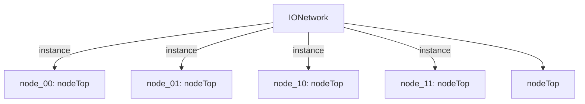

# 模块 `IONetwork`

- 源文件：`rtl/rtl/IONet/IONetwork_9.24/IONetwork.v`。
- 职责：AI 推断：2x2 片上网络路由器节点阵列，负责在四个节点之间路由事件驱动信号和51位消息负载。。
- 说明：模块实例化四个nodeTop实例（node_00, node_01, node_10, node_11），形成2x2网格。每个节点通过事件驱动信号（i_drive*）和消息负载（*InMsg_51）与外部及相邻节点连接。事件流分析显示每个输入事件可到达所有12个输出事件，表明模块实现全连通或广播路由。

## 1. 层级位置

- Parents：`IONet_slot`。
- Children：`nodeTop`。
- Component children：无。
- Upstream modules：无。
- Downstream modules：无。

### 1.1 本模块结构图



```text
IONetwork
|-- node_00: nodeTop
|-- node_01: nodeTop
|-- node_10: nodeTop
|-- node_11: nodeTop
`-- nodeTop
```

## 2. 输入/输出接口摘要

- 接收：drive 输入：`i_driveEast_10`, `i_driveEast_11`, `i_driveLocal_00`, `i_driveLocal_01`, `... +8`；数据输入：`i_eastInMsg_51_10`, `i_eastInMsg_51_11`, `i_localInMsg_51_00`, `i_localInMsg_51_01`, `... +8`；free 输入：`i_freeEast_10`, `i_freeEast_11`, `i_freeLocal_00`, `i_freeLocal_01`, `... +8`。
- 输出：drive 输出：`o_driveEast_10`, `o_driveEast_11`, `o_driveLocal_00`, `o_driveLocal_01`, `... +8`；数据输出：`o_eastMsg_51_10`, `o_eastMsg_51_11`, `o_localMsg_51_00`, `o_localMsg_51_01`, `... +8`；free 输出：`o_freeEast_10`, `o_freeEast_11`, `o_freeLocal_00`, `o_freeLocal_01`, `... +8`。

### 2.1 端口分组

| 端口组 | 方向统计 | 代表信号 |
| --- | --- | --- |
| `drive_event` | input:12, output:12 | `i_driveEast_10`, `i_driveEast_11`, `i_driveLocal_00`, `i_driveLocal_01`, `i_driveLocal_10`, `i_driveLocal_11`, `i_driveNorth_01`, `i_driveNorth_11`, `i_driveSouth_00`, `i_driveSouth_10`, `... +14` |
| `free_backpressure` | input:12, output:12 | `i_freeEast_10`, `i_freeEast_11`, `i_freeLocal_00`, `i_freeLocal_01`, `i_freeLocal_10`, `i_freeLocal_11`, `i_freeNorth_01`, `i_freeNorth_11`, `i_freeSouth_00`, `i_freeSouth_10`, `... +14` |
| `other_ports` | input:12, output:12 | `i_eastInMsg_51_10`, `i_eastInMsg_51_11`, `i_localInMsg_51_00`, `i_localInMsg_51_01`, `i_localInMsg_51_10`, `i_localInMsg_51_11`, `i_northInMsg_51_01`, `i_northInMsg_51_11`, `i_southInMsg_51_00`, `i_southInMsg_51_10`, `... +14` |

## 3. Drive/Data/Free 契约

| Interface | 方向 | Event | Payload | Free/backpressure |
| --- | --- | --- | --- | --- |
| `i_driveEast_10` | input | `i_driveEast_10` | `i_eastInMsg_51_10 [50:0]`, `i_eastInMsg_51_11 [50:0]` | `o_freeEast_10` |
| `i_driveEast_11` | input | `i_driveEast_11` | `i_eastInMsg_51_10 [50:0]`, `i_eastInMsg_51_11 [50:0]` | `o_freeEast_10` |
| `i_driveLocal_00` | input | `i_driveLocal_00` | `i_localInMsg_51_00 [50:0]`, `i_localInMsg_51_01 [50:0]`, `i_localInMsg_51_10 [50:0]` | `o_freeLocal_00` |
| `i_driveLocal_01` | input | `i_driveLocal_01` | `i_localInMsg_51_00 [50:0]`, `i_localInMsg_51_01 [50:0]`, `i_localInMsg_51_10 [50:0]` | `o_freeLocal_00` |
| `i_driveLocal_10` | input | `i_driveLocal_10` | `i_localInMsg_51_00 [50:0]`, `i_localInMsg_51_01 [50:0]`, `i_localInMsg_51_10 [50:0]` | `o_freeLocal_00` |
| `i_driveLocal_11` | input | `i_driveLocal_11` | `i_localInMsg_51_00 [50:0]`, `i_localInMsg_51_01 [50:0]`, `i_localInMsg_51_10 [50:0]` | `o_freeLocal_00` |
| `i_driveNorth_01` | input | `i_driveNorth_01` | `i_northInMsg_51_01 [50:0]`, `i_northInMsg_51_11 [50:0]` | `o_freeNorth_01` |
| `i_driveNorth_11` | input | `i_driveNorth_11` | `i_northInMsg_51_01 [50:0]`, `i_northInMsg_51_11 [50:0]` | `o_freeNorth_01` |
| `i_driveSouth_00` | input | `i_driveSouth_00` | `i_southInMsg_51_00 [50:0]`, `i_southInMsg_51_10 [50:0]` | `o_freeSouth_00` |
| `i_driveSouth_10` | input | `i_driveSouth_10` | `i_southInMsg_51_00 [50:0]`, `i_southInMsg_51_10 [50:0]` | `o_freeSouth_00` |
| `i_driveWest_00` | input | `i_driveWest_00` | `i_westInMsg_51_00 [50:0]`, `i_westInMsg_51_01 [50:0]` | `o_freeWest_00` |
| `i_driveWest_01` | input | `i_driveWest_01` | `i_westInMsg_51_00 [50:0]`, `i_westInMsg_51_01 [50:0]` | `o_freeWest_00` |

## 4. 主要 Drive-centered Flow

### `i_driveEast_10`

- 确定性事实：`i_driveEast_10 to o_driveEast_10, o_driveLocal_10, o_driveSouth_10`；flow_id=`flow_000_IONetwork_i_driveEast_10`。
- Payload：`i_driveEast_10` -> `i_eastInMsg_51_10 [50:0]`, `i_driveEast_10` -> `i_eastInMsg_51_11 [50:0]`, `o_driveEast_10` -> `o_eastMsg_51_10 [50:0]`, `o_driveEast_10` -> `o_eastMsg_51_11 [50:0]`, `o_driveEast_11` -> `o_eastMsg_51_10 [50:0]`, `o_driveEast_11` -> `o_eastMsg_51_11 [50:0]`, `o_driveLocal_00` -> `o_localMsg_51_00 [50:0]`, `o_driveLocal_00` -> `o_localMsg_51_01 [50:0]`, ... +22。
- 输出/影响：`o_driveEast_10`, `o_driveLocal_10`, `o_driveSouth_10`, `o_driveLocal_00`, `o_driveSouth_00`, `o_driveWest_00`, `o_driveEast_11`, `o_driveLocal_11`, `o_driveNorth_11`, `o_driveLocal_01`, `o_driveNorth_01`, `o_driveWest_01`。
- 结构复杂度：branch=4，join=4，blocking=0。
- AI 推断：最终手册应重点描述 i_driveEast_10 如何通过 2x2 节点阵列扇出至所有输出端口，并强调节点间的内部连线关系。

### `i_driveEast_11`

- 确定性事实：`i_driveEast_11 to o_driveEast_11, o_driveLocal_11, o_driveNorth_11`；flow_id=`flow_001_IONetwork_i_driveEast_11`。
- Payload：`i_driveEast_11` -> `i_eastInMsg_51_10 [50:0]`, `i_driveEast_11` -> `i_eastInMsg_51_11 [50:0]`, `o_driveEast_10` -> `o_eastMsg_51_10 [50:0]`, `o_driveEast_10` -> `o_eastMsg_51_11 [50:0]`, `o_driveEast_11` -> `o_eastMsg_51_10 [50:0]`, `o_driveEast_11` -> `o_eastMsg_51_11 [50:0]`, `o_driveLocal_00` -> `o_localMsg_51_00 [50:0]`, `o_driveLocal_00` -> `o_localMsg_51_01 [50:0]`, ... +22。
- 输出/影响：`o_driveEast_11`, `o_driveLocal_11`, `o_driveNorth_11`, `o_driveLocal_01`, `o_driveNorth_01`, `o_driveWest_01`, `o_driveEast_10`, `o_driveLocal_10`, `o_driveSouth_10`, `o_driveLocal_00`, `o_driveSouth_00`, `o_driveWest_00`。
- 结构复杂度：branch=4，join=4，blocking=0。
- AI 推断：最终手册应重点描述此流作为从单一输入到所有输出的全扇出事件传播路径的结构，并明确指出数据载荷与事件驱动信号之间的路由关系是未知的。

### `i_driveLocal_00`

- 确定性事实：`i_driveLocal_00 to o_driveLocal_00, o_driveSouth_00, o_driveWest_00`；flow_id=`flow_002_IONetwork_i_driveLocal_00`。
- Payload：`i_driveLocal_00` -> `i_localInMsg_51_00 [50:0]`, `i_driveLocal_00` -> `i_localInMsg_51_01 [50:0]`, `i_driveLocal_00` -> `i_localInMsg_51_10 [50:0]`, `o_driveEast_10` -> `o_eastMsg_51_10 [50:0]`, `o_driveEast_10` -> `o_eastMsg_51_11 [50:0]`, `o_driveEast_11` -> `o_eastMsg_51_10 [50:0]`, `o_driveEast_11` -> `o_eastMsg_51_11 [50:0]`, `o_driveLocal_00` -> `o_localMsg_51_00 [50:0]`, ... +23。
- 输出/影响：`o_driveLocal_00`, `o_driveSouth_00`, `o_driveWest_00`, `o_driveLocal_01`, `o_driveNorth_01`, `o_driveWest_01`, `o_driveEast_10`, `o_driveLocal_10`, `o_driveSouth_10`, `o_driveEast_11`, `o_driveLocal_11`, `o_driveNorth_11`。
- 结构复杂度：branch=4，join=4，blocking=0。
- AI 推断：从模块顶层输入端口 i_driveLocal_00 注入的驱动事件，通过 2x2 节点阵列进行扇出和路由，最终到达所有 12 个输出驱动端口。

### `i_driveLocal_01`

- 确定性事实：`i_driveLocal_01 to o_driveLocal_01, o_driveNorth_01, o_driveWest_01`；flow_id=`flow_003_IONetwork_i_driveLocal_01`。
- Payload：`i_driveLocal_01` -> `i_localInMsg_51_00 [50:0]`, `i_driveLocal_01` -> `i_localInMsg_51_01 [50:0]`, `i_driveLocal_01` -> `i_localInMsg_51_10 [50:0]`, `o_driveEast_10` -> `o_eastMsg_51_10 [50:0]`, `o_driveEast_10` -> `o_eastMsg_51_11 [50:0]`, `o_driveEast_11` -> `o_eastMsg_51_10 [50:0]`, `o_driveEast_11` -> `o_eastMsg_51_11 [50:0]`, `o_driveLocal_00` -> `o_localMsg_51_00 [50:0]`, ... +23。
- 输出/影响：`o_driveLocal_01`, `o_driveNorth_01`, `o_driveWest_01`, `o_driveLocal_00`, `o_driveSouth_00`, `o_driveWest_00`, `o_driveEast_11`, `o_driveLocal_11`, `o_driveNorth_11`, `o_driveEast_10`, `o_driveLocal_10`, `o_driveSouth_10`。
- 结构复杂度：branch=4，join=4，blocking=0。
- AI 推断：驱动事件 i_driveLocal_01 可能携带一个 51 位宽的本地输入消息 i_localInMsg_51_01。

### `i_driveLocal_10`

- 确定性事实：`i_driveLocal_10 to o_driveEast_10, o_driveLocal_10, o_driveSouth_10`；flow_id=`flow_004_IONetwork_i_driveLocal_10`。
- Payload：`i_driveLocal_10` -> `i_localInMsg_51_00 [50:0]`, `i_driveLocal_10` -> `i_localInMsg_51_01 [50:0]`, `i_driveLocal_10` -> `i_localInMsg_51_10 [50:0]`, `o_driveEast_10` -> `o_eastMsg_51_10 [50:0]`, `o_driveEast_10` -> `o_eastMsg_51_11 [50:0]`, `o_driveEast_11` -> `o_eastMsg_51_10 [50:0]`, `o_driveEast_11` -> `o_eastMsg_51_11 [50:0]`, `o_driveLocal_00` -> `o_localMsg_51_00 [50:0]`, ... +23。
- 输出/影响：`o_driveEast_10`, `o_driveLocal_10`, `o_driveSouth_10`, `o_driveLocal_00`, `o_driveSouth_00`, `o_driveWest_00`, `o_driveEast_11`, `o_driveLocal_11`, `o_driveNorth_11`, `o_driveLocal_01`, `o_driveNorth_01`, `o_driveWest_01`。
- 结构复杂度：branch=4，join=4，blocking=0。
- AI 推断：文档应重点描述事件从 node_10 注入后，如何通过内部连线在四个节点之间进行扇出、路由和汇聚，最终驱动所有方向输出。

### `i_driveLocal_11`

- 确定性事实：`i_driveLocal_11 to o_driveEast_11, o_driveLocal_11, o_driveNorth_11`；flow_id=`flow_005_IONetwork_i_driveLocal_11`。
- Payload：`i_driveLocal_11` -> `i_localInMsg_51_00 [50:0]`, `i_driveLocal_11` -> `i_localInMsg_51_01 [50:0]`, `i_driveLocal_11` -> `i_localInMsg_51_10 [50:0]`, `o_driveEast_10` -> `o_eastMsg_51_10 [50:0]`, `o_driveEast_10` -> `o_eastMsg_51_11 [50:0]`, `o_driveEast_11` -> `o_eastMsg_51_10 [50:0]`, `o_driveEast_11` -> `o_eastMsg_51_11 [50:0]`, `o_driveLocal_00` -> `o_localMsg_51_00 [50:0]`, ... +23。
- 输出/影响：`o_driveEast_11`, `o_driveLocal_11`, `o_driveNorth_11`, `o_driveLocal_01`, `o_driveNorth_01`, `o_driveWest_01`, `o_driveEast_10`, `o_driveLocal_10`, `o_driveSouth_10`, `o_driveLocal_00`, `o_driveSouth_00`, `o_driveWest_00`。
- 结构复杂度：branch=4，join=4，blocking=0。
- AI 推断：手册应重点描述 i_driveLocal_11 事件如何通过 2x2 节点阵列进行扇出，并强调所有 12 个模块输出端点都可能被此单一事件驱动。

### `i_driveNorth_01`

- 确定性事实：`i_driveNorth_01 to o_driveLocal_01, o_driveNorth_01, o_driveWest_01`；flow_id=`flow_006_IONetwork_i_driveNorth_01`。
- Payload：`i_driveNorth_01` -> `i_northInMsg_51_01 [50:0]`, `i_driveNorth_01` -> `i_northInMsg_51_11 [50:0]`, `o_driveEast_10` -> `o_eastMsg_51_10 [50:0]`, `o_driveEast_10` -> `o_eastMsg_51_11 [50:0]`, `o_driveEast_11` -> `o_eastMsg_51_10 [50:0]`, `o_driveEast_11` -> `o_eastMsg_51_11 [50:0]`, `o_driveLocal_00` -> `o_localMsg_51_00 [50:0]`, `o_driveLocal_00` -> `o_localMsg_51_01 [50:0]`, ... +22。
- 输出/影响：`o_driveLocal_01`, `o_driveNorth_01`, `o_driveWest_01`, `o_driveLocal_00`, `o_driveSouth_00`, `o_driveWest_00`, `o_driveEast_11`, `o_driveLocal_11`, `o_driveNorth_11`, `o_driveEast_10`, `o_driveLocal_10`, `o_driveSouth_10`。
- 结构复杂度：branch=4，join=4，blocking=0。
- AI 推断：最终手册应重点描述 i_driveNorth_01 事件如何通过 2x2 节点阵列进行扇出和路由，并明确每个节点在此过程中的角色。

### `i_driveNorth_11`

- 确定性事实：`i_driveNorth_11 to o_driveEast_11, o_driveLocal_11, o_driveNorth_11`；flow_id=`flow_007_IONetwork_i_driveNorth_11`。
- Payload：`i_driveNorth_11` -> `i_northInMsg_51_01 [50:0]`, `i_driveNorth_11` -> `i_northInMsg_51_11 [50:0]`, `o_driveEast_10` -> `o_eastMsg_51_10 [50:0]`, `o_driveEast_10` -> `o_eastMsg_51_11 [50:0]`, `o_driveEast_11` -> `o_eastMsg_51_10 [50:0]`, `o_driveEast_11` -> `o_eastMsg_51_11 [50:0]`, `o_driveLocal_00` -> `o_localMsg_51_00 [50:0]`, `o_driveLocal_00` -> `o_localMsg_51_01 [50:0]`, ... +22。
- 输出/影响：`o_driveEast_11`, `o_driveLocal_11`, `o_driveNorth_11`, `o_driveLocal_01`, `o_driveNorth_01`, `o_driveWest_01`, `o_driveEast_10`, `o_driveLocal_10`, `o_driveSouth_10`, `o_driveLocal_00`, `o_driveSouth_00`, `o_driveWest_00`。
- 结构复杂度：branch=4，join=4，blocking=0。
- AI 推断：i_driveNorth_11 事件触发时，可能携带 i_northInMsg_51_01 和 i_northInMsg_51_11 数据，这些数据通过网格节点路由到对应的输出消息端口。

### `i_driveSouth_00`

- 确定性事实：`i_driveSouth_00 to o_driveLocal_00, o_driveSouth_00, o_driveWest_00`；flow_id=`flow_008_IONetwork_i_driveSouth_00`。
- Payload：`i_driveSouth_00` -> `i_southInMsg_51_00 [50:0]`, `i_driveSouth_00` -> `i_southInMsg_51_10 [50:0]`, `o_driveEast_10` -> `o_eastMsg_51_10 [50:0]`, `o_driveEast_10` -> `o_eastMsg_51_11 [50:0]`, `o_driveEast_11` -> `o_eastMsg_51_10 [50:0]`, `o_driveEast_11` -> `o_eastMsg_51_11 [50:0]`, `o_driveLocal_00` -> `o_localMsg_51_00 [50:0]`, `o_driveLocal_00` -> `o_localMsg_51_01 [50:0]`, ... +22。
- 输出/影响：`o_driveLocal_00`, `o_driveSouth_00`, `o_driveWest_00`, `o_driveLocal_01`, `o_driveNorth_01`, `o_driveWest_01`, `o_driveEast_10`, `o_driveLocal_10`, `o_driveSouth_10`, `o_driveEast_11`, `o_driveLocal_11`, `o_driveNorth_11`。
- 结构复杂度：branch=4，join=4，blocking=0。
- AI 推断：最终手册应重点描述 i_driveSouth_00 事件如何通过 2x2 网格拓扑进行广播，并明确每个节点实例的转发和输出行为。

### `i_driveSouth_10`

- 确定性事实：`i_driveSouth_10 to o_driveEast_10, o_driveLocal_10, o_driveSouth_10`；flow_id=`flow_009_IONetwork_i_driveSouth_10`。
- Payload：`i_driveSouth_10` -> `i_southInMsg_51_00 [50:0]`, `i_driveSouth_10` -> `i_southInMsg_51_10 [50:0]`, `o_driveEast_10` -> `o_eastMsg_51_10 [50:0]`, `o_driveEast_10` -> `o_eastMsg_51_11 [50:0]`, `o_driveEast_11` -> `o_eastMsg_51_10 [50:0]`, `o_driveEast_11` -> `o_eastMsg_51_11 [50:0]`, `o_driveLocal_00` -> `o_localMsg_51_00 [50:0]`, `o_driveLocal_00` -> `o_localMsg_51_01 [50:0]`, ... +22。
- 输出/影响：`o_driveEast_10`, `o_driveLocal_10`, `o_driveSouth_10`, `o_driveLocal_00`, `o_driveSouth_00`, `o_driveWest_00`, `o_driveEast_11`, `o_driveLocal_11`, `o_driveNorth_11`, `o_driveLocal_01`, `o_driveNorth_01`, `o_driveWest_01`。
- 结构复杂度：branch=4，join=4，blocking=0。
- AI 推断：驱动事件 i_driveSouth_10 与一个 51 位宽的输入消息 i_southInMsg_51_10 相关联，该消息可能作为事件的有效载荷被携带和路由。

### `i_driveWest_00`

- 确定性事实：`i_driveWest_00 to o_driveLocal_00, o_driveSouth_00, o_driveWest_00`；flow_id=`flow_010_IONetwork_i_driveWest_00`。
- Payload：`i_driveWest_00` -> `i_westInMsg_51_00 [50:0]`, `i_driveWest_00` -> `i_westInMsg_51_01 [50:0]`, `o_driveEast_10` -> `o_eastMsg_51_10 [50:0]`, `o_driveEast_10` -> `o_eastMsg_51_11 [50:0]`, `o_driveEast_11` -> `o_eastMsg_51_10 [50:0]`, `o_driveEast_11` -> `o_eastMsg_51_11 [50:0]`, `o_driveLocal_00` -> `o_localMsg_51_00 [50:0]`, `o_driveLocal_00` -> `o_localMsg_51_01 [50:0]`, ... +22。
- 输出/影响：`o_driveLocal_00`, `o_driveSouth_00`, `o_driveWest_00`, `o_driveLocal_01`, `o_driveNorth_01`, `o_driveWest_01`, `o_driveEast_10`, `o_driveLocal_10`, `o_driveSouth_10`, `o_driveEast_11`, `o_driveLocal_11`, `o_driveNorth_11`。
- 结构复杂度：branch=4，join=4，blocking=0。
- AI 推断：i_driveWest_00 事件驱动信号与 i_westInMsg_51_00 和 i_westInMsg_51_01 数据载荷信号相关联，表明事件触发时伴随有数据传递。

### `i_driveWest_01`

- 确定性事实：`i_driveWest_01 to o_driveLocal_01, o_driveNorth_01, o_driveWest_01`；flow_id=`flow_011_IONetwork_i_driveWest_01`。
- Payload：`i_driveWest_01` -> `i_westInMsg_51_00 [50:0]`, `i_driveWest_01` -> `i_westInMsg_51_01 [50:0]`, `o_driveEast_10` -> `o_eastMsg_51_10 [50:0]`, `o_driveEast_10` -> `o_eastMsg_51_11 [50:0]`, `o_driveEast_11` -> `o_eastMsg_51_10 [50:0]`, `o_driveEast_11` -> `o_eastMsg_51_11 [50:0]`, `o_driveLocal_00` -> `o_localMsg_51_00 [50:0]`, `o_driveLocal_00` -> `o_localMsg_51_01 [50:0]`, ... +22。
- 输出/影响：`o_driveLocal_01`, `o_driveNorth_01`, `o_driveWest_01`, `o_driveLocal_00`, `o_driveSouth_00`, `o_driveWest_00`, `o_driveEast_11`, `o_driveLocal_11`, `o_driveNorth_11`, `o_driveEast_10`, `o_driveLocal_10`, `o_driveSouth_10`。
- 结构复杂度：branch=4，join=4，blocking=0。
- AI 推断：最终手册应强调该流是一个事件广播流，事件信号与数据消息的传播路径可能不同，且反压机制需要单独说明。


## 5. 内部组件与 assign 影响

### 5.1 内部组件

| 实例 | 类型 | 输入事件 | 输出事件 |
| --- | --- | --- | --- |
| `node_00` | `nodeTop` | `i_driveLocal_00`, `i_driveSouth_00`, `i_driveWest_00`, `w_drive01200`, `w_drive10200` | `o_driveLocal_00`, `o_driveSouth_00`, `o_driveWest_00`, `w_drive00201`, `w_drive00210` |
| `node_01` | `nodeTop` | `i_driveLocal_01`, `i_driveNorth_01`, `i_driveWest_01`, `w_drive00201`, `w_drive11201` | `o_driveLocal_01`, `o_driveNorth_01`, `o_driveWest_01`, `w_drive01200`, `w_drive01211` |
| `node_10` | `nodeTop` | `i_driveEast_10`, `i_driveLocal_10`, `i_driveSouth_10`, `w_drive00210`, `w_drive11210` | `o_driveEast_10`, `o_driveLocal_10`, `o_driveSouth_10`, `w_drive10200`, `w_drive10211` |
| `node_11` | `nodeTop` | `i_driveEast_11`, `i_driveLocal_11`, `i_driveNorth_11`, `w_drive01211`, `w_drive10211` | `o_driveEast_11`, `o_driveLocal_11`, `o_driveNorth_11`, `w_drive11201`, `w_drive11210` |

### 5.2 assign 影响

| Assign | Impact area | LHS | RHS 摘要 | 解释状态 |
| --- | --- | --- | --- | --- |
| - | - | - | - | Manual Context 未提供 primary assign 影响 |
