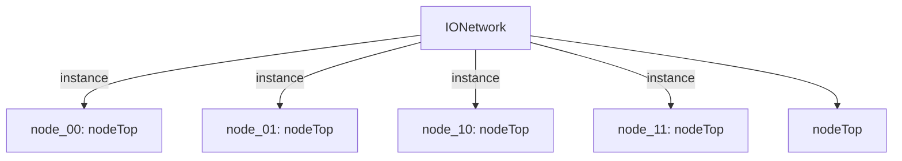

# 模块 `IONetwork`

- 源文件：`rtl/rtl/IONet/IONetwork_9.24/IONetwork.v`。
- 职责：AI 推断：IONetwork 模块通过实例化四个 nodeTop 并利用内部连线构成 2x2 网格拓扑。。
- 说明：从提供的 RTL 切片可以观察到：模块顶层声明了节点(0,0)、(1,0)、(1,1)、(0,1) 的端口，并实例化了 node_00、node_10、node_11、node_01。在切片 3-6 中，这些 nodeTop 实例通过内部 wire 相连，例如 node_11 的 .i_driveNorth 连接至 i_driveNorth_11（顶层输入），而其 .o_driveWest 连接至 w_drive11201（内部连线），该连线被 node_01 用作 .i_driveEast。类似地，其他方向（东、西、南、北）也通过内部连线互联，形成网格拓扑。

## 1. 层级位置

- Parents：`IONet_slot`。
- Children：`nodeTop`。
- Component children：无。
- Upstream modules：无。
- Downstream modules：无。

### 1.1 本模块结构图



```text
IONetwork
|-- node_00: nodeTop
|-- node_01: nodeTop
|-- node_10: nodeTop
|-- node_11: nodeTop
`-- nodeTop
```

## 2. 输入/输出接口摘要

- 接收：drive 输入：`i_driveEast_10`, `i_driveEast_11`, `i_driveLocal_00`, `i_driveLocal_01`, `... +8`；数据输入：`i_eastInMsg_51_10`, `i_eastInMsg_51_11`, `i_localInMsg_51_00`, `i_localInMsg_51_01`, `... +8`；free 输入：`i_freeEast_10`, `i_freeEast_11`, `i_freeLocal_00`, `i_freeLocal_01`, `... +8`。
- 输出：drive 输出：`o_driveEast_10`, `o_driveEast_11`, `o_driveLocal_00`, `o_driveLocal_01`, `... +8`；数据输出：`o_eastMsg_51_10`, `o_eastMsg_51_11`, `o_localMsg_51_00`, `o_localMsg_51_01`, `... +8`；free 输出：`o_freeEast_10`, `o_freeEast_11`, `o_freeLocal_00`, `o_freeLocal_01`, `... +8`。

### 2.1 端口分组

| 端口组 | 方向统计 | 代表信号 |
| --- | --- | --- |
| `drive_event` | input:12, output:12 | `i_driveEast_10`, `i_driveEast_11`, `i_driveLocal_00`, `i_driveLocal_01`, `i_driveLocal_10`, `i_driveLocal_11`, `i_driveNorth_01`, `i_driveNorth_11`, `i_driveSouth_00`, `i_driveSouth_10`, `... +14` |
| `free_backpressure` | input:12, output:12 | `i_freeEast_10`, `i_freeEast_11`, `i_freeLocal_00`, `i_freeLocal_01`, `i_freeLocal_10`, `i_freeLocal_11`, `i_freeNorth_01`, `i_freeNorth_11`, `i_freeSouth_00`, `i_freeSouth_10`, `... +14` |
| `other_ports` | input:12, output:12 | `i_eastInMsg_51_10`, `i_eastInMsg_51_11`, `i_localInMsg_51_00`, `i_localInMsg_51_01`, `i_localInMsg_51_10`, `i_localInMsg_51_11`, `i_northInMsg_51_01`, `i_northInMsg_51_11`, `i_southInMsg_51_00`, `i_southInMsg_51_10`, `... +14` |

## 3. Drive/Data/Free 契约

| Interface | 方向 | Event | Payload | Free/backpressure |
| --- | --- | --- | --- | --- |
| `i_driveEast_10` | input | `i_driveEast_10` | `i_eastInMsg_51_10 [50:0]`, `i_eastInMsg_51_11 [50:0]` | `o_freeEast_10` |
| `i_driveEast_11` | input | `i_driveEast_11` | `i_eastInMsg_51_10 [50:0]`, `i_eastInMsg_51_11 [50:0]` | `o_freeEast_10` |
| `i_driveLocal_00` | input | `i_driveLocal_00` | `i_localInMsg_51_00 [50:0]`, `i_localInMsg_51_01 [50:0]`, `i_localInMsg_51_10 [50:0]` | `o_freeLocal_00` |
| `i_driveLocal_01` | input | `i_driveLocal_01` | `i_localInMsg_51_00 [50:0]`, `i_localInMsg_51_01 [50:0]`, `i_localInMsg_51_10 [50:0]` | `o_freeLocal_00` |
| `i_driveLocal_10` | input | `i_driveLocal_10` | `i_localInMsg_51_00 [50:0]`, `i_localInMsg_51_01 [50:0]`, `i_localInMsg_51_10 [50:0]` | `o_freeLocal_00` |
| `i_driveLocal_11` | input | `i_driveLocal_11` | `i_localInMsg_51_00 [50:0]`, `i_localInMsg_51_01 [50:0]`, `i_localInMsg_51_10 [50:0]` | `o_freeLocal_00` |
| `i_driveNorth_01` | input | `i_driveNorth_01` | `i_northInMsg_51_01 [50:0]`, `i_northInMsg_51_11 [50:0]` | `o_freeNorth_01` |
| `i_driveNorth_11` | input | `i_driveNorth_11` | `i_northInMsg_51_01 [50:0]`, `i_northInMsg_51_11 [50:0]` | `o_freeNorth_01` |
| `i_driveSouth_00` | input | `i_driveSouth_00` | `i_southInMsg_51_00 [50:0]`, `i_southInMsg_51_10 [50:0]` | `o_freeSouth_00` |
| `i_driveSouth_10` | input | `i_driveSouth_10` | `i_southInMsg_51_00 [50:0]`, `i_southInMsg_51_10 [50:0]` | `o_freeSouth_00` |
| `i_driveWest_00` | input | `i_driveWest_00` | `i_westInMsg_51_00 [50:0]`, `i_westInMsg_51_01 [50:0]` | `o_freeWest_00` |
| `i_driveWest_01` | input | `i_driveWest_01` | `i_westInMsg_51_00 [50:0]`, `i_westInMsg_51_01 [50:0]` | `o_freeWest_00` |

## 4. 主要 Drive-centered Flow

### `i_driveEast_10`

- 确定性事实：`i_driveEast_10 to o_driveEast_10, o_driveLocal_10, o_driveSouth_10`；flow_id=`flow_000_IONetwork_i_driveEast_10`。
- Payload：`i_driveEast_10` -> `i_eastInMsg_51_10 [50:0]`, `i_driveEast_10` -> `i_eastInMsg_51_11 [50:0]`, `o_driveEast_10` -> `o_eastMsg_51_10 [50:0]`, `o_driveEast_10` -> `o_eastMsg_51_11 [50:0]`, `o_driveEast_11` -> `o_eastMsg_51_10 [50:0]`, `o_driveEast_11` -> `o_eastMsg_51_11 [50:0]`, `o_driveLocal_00` -> `o_localMsg_51_00 [50:0]`, `o_driveLocal_00` -> `o_localMsg_51_01 [50:0]`, ... +22。
- 输出/影响：`o_driveEast_10`, `o_driveLocal_10`, `o_driveSouth_10`, `o_driveLocal_00`, `o_driveSouth_00`, `o_driveWest_00`, `o_driveEast_11`, `o_driveLocal_11`, `o_driveNorth_11`, `o_driveLocal_01`, `o_driveNorth_01`, `o_driveWest_01`。
- 结构复杂度：branch=4，join=4，blocking=0。
- AI 推断：驱动事件 i_driveEast_10 与 51 位宽的数据载荷 i_eastInMsg_51_10 相关联，表明该事件携带数据。

### `i_driveEast_11`

- 确定性事实：`i_driveEast_11 to o_driveEast_11, o_driveLocal_11, o_driveNorth_11`；flow_id=`flow_001_IONetwork_i_driveEast_11`。
- Payload：`i_driveEast_11` -> `i_eastInMsg_51_10 [50:0]`, `i_driveEast_11` -> `i_eastInMsg_51_11 [50:0]`, `o_driveEast_10` -> `o_eastMsg_51_10 [50:0]`, `o_driveEast_10` -> `o_eastMsg_51_11 [50:0]`, `o_driveEast_11` -> `o_eastMsg_51_10 [50:0]`, `o_driveEast_11` -> `o_eastMsg_51_11 [50:0]`, `o_driveLocal_00` -> `o_localMsg_51_00 [50:0]`, `o_driveLocal_00` -> `o_localMsg_51_01 [50:0]`, ... +22。
- 输出/影响：`o_driveEast_11`, `o_driveLocal_11`, `o_driveNorth_11`, `o_driveLocal_01`, `o_driveNorth_01`, `o_driveWest_01`, `o_driveEast_10`, `o_driveLocal_10`, `o_driveSouth_10`, `o_driveLocal_00`, `o_driveSouth_00`, `o_driveWest_00`。
- 结构复杂度：branch=4，join=4，blocking=0。
- AI 推断：输入驱动事件 i_driveEast_11 与 51 位宽的输入消息 i_eastInMsg_51_11 相关联，表明该驱动事件可能携带或触发一个数据消息的传输。

### `i_driveLocal_00`

- 确定性事实：`i_driveLocal_00 to o_driveLocal_00, o_driveSouth_00, o_driveWest_00`；flow_id=`flow_002_IONetwork_i_driveLocal_00`。
- Payload：`i_driveLocal_00` -> `i_localInMsg_51_00 [50:0]`, `i_driveLocal_00` -> `i_localInMsg_51_01 [50:0]`, `i_driveLocal_00` -> `i_localInMsg_51_10 [50:0]`, `o_driveEast_10` -> `o_eastMsg_51_10 [50:0]`, `o_driveEast_10` -> `o_eastMsg_51_11 [50:0]`, `o_driveEast_11` -> `o_eastMsg_51_10 [50:0]`, `o_driveEast_11` -> `o_eastMsg_51_11 [50:0]`, `o_driveLocal_00` -> `o_localMsg_51_00 [50:0]`, ... +23。
- 输出/影响：`o_driveLocal_00`, `o_driveSouth_00`, `o_driveWest_00`, `o_driveLocal_01`, `o_driveNorth_01`, `o_driveWest_01`, `o_driveEast_10`, `o_driveLocal_10`, `o_driveSouth_10`, `o_driveEast_11`, `o_driveLocal_11`, `o_driveNorth_11`。
- 结构复杂度：branch=4，join=4，blocking=0。
- AI 推断：最终手册应重点描述 i_driveLocal_00 事件如何在 node_00 内部被扇出，以及如何通过节点间互联网络传播到所有输出端口。

### `i_driveLocal_01`

- 确定性事实：`i_driveLocal_01 to o_driveLocal_01, o_driveNorth_01, o_driveWest_01`；flow_id=`flow_003_IONetwork_i_driveLocal_01`。
- Payload：`i_driveLocal_01` -> `i_localInMsg_51_00 [50:0]`, `i_driveLocal_01` -> `i_localInMsg_51_01 [50:0]`, `i_driveLocal_01` -> `i_localInMsg_51_10 [50:0]`, `o_driveEast_10` -> `o_eastMsg_51_10 [50:0]`, `o_driveEast_10` -> `o_eastMsg_51_11 [50:0]`, `o_driveEast_11` -> `o_eastMsg_51_10 [50:0]`, `o_driveEast_11` -> `o_eastMsg_51_11 [50:0]`, `o_driveLocal_00` -> `o_localMsg_51_00 [50:0]`, ... +23。
- 输出/影响：`o_driveLocal_01`, `o_driveNorth_01`, `o_driveWest_01`, `o_driveLocal_00`, `o_driveSouth_00`, `o_driveWest_00`, `o_driveEast_11`, `o_driveLocal_11`, `o_driveNorth_11`, `o_driveEast_10`, `o_driveLocal_10`, `o_driveSouth_10`。
- 结构复杂度：branch=4，join=4，blocking=0。
- AI 推断：最终手册应重点描述 i_driveLocal_01 如何通过 2x2 节点阵列扇出到所有输出端点，并强调节点间的内部连线 (w_drive*) 作为传播路径。

### `i_driveLocal_10`

- 确定性事实：`i_driveLocal_10 to o_driveEast_10, o_driveLocal_10, o_driveSouth_10`；flow_id=`flow_004_IONetwork_i_driveLocal_10`。
- Payload：`i_driveLocal_10` -> `i_localInMsg_51_00 [50:0]`, `i_driveLocal_10` -> `i_localInMsg_51_01 [50:0]`, `i_driveLocal_10` -> `i_localInMsg_51_10 [50:0]`, `o_driveEast_10` -> `o_eastMsg_51_10 [50:0]`, `o_driveEast_10` -> `o_eastMsg_51_11 [50:0]`, `o_driveEast_11` -> `o_eastMsg_51_10 [50:0]`, `o_driveEast_11` -> `o_eastMsg_51_11 [50:0]`, `o_driveLocal_00` -> `o_localMsg_51_00 [50:0]`, ... +23。
- 输出/影响：`o_driveEast_10`, `o_driveLocal_10`, `o_driveSouth_10`, `o_driveLocal_00`, `o_driveSouth_00`, `o_driveWest_00`, `o_driveEast_11`, `o_driveLocal_11`, `o_driveNorth_11`, `o_driveLocal_01`, `o_driveNorth_01`, `o_driveWest_01`。
- 结构复杂度：branch=4，join=4，blocking=0。
- AI 推断：事件驱动信号i_driveLocal_10与数据负载i_localInMsg_51_10相关联，表明该事件携带本地输入消息。

### `i_driveLocal_11`

- 确定性事实：`i_driveLocal_11 to o_driveEast_11, o_driveLocal_11, o_driveNorth_11`；flow_id=`flow_005_IONetwork_i_driveLocal_11`。
- Payload：`i_driveLocal_11` -> `i_localInMsg_51_00 [50:0]`, `i_driveLocal_11` -> `i_localInMsg_51_01 [50:0]`, `i_driveLocal_11` -> `i_localInMsg_51_10 [50:0]`, `o_driveEast_10` -> `o_eastMsg_51_10 [50:0]`, `o_driveEast_10` -> `o_eastMsg_51_11 [50:0]`, `o_driveEast_11` -> `o_eastMsg_51_10 [50:0]`, `o_driveEast_11` -> `o_eastMsg_51_11 [50:0]`, `o_driveLocal_00` -> `o_localMsg_51_00 [50:0]`, ... +23。
- 输出/影响：`o_driveEast_11`, `o_driveLocal_11`, `o_driveNorth_11`, `o_driveLocal_01`, `o_driveNorth_01`, `o_driveWest_01`, `o_driveEast_10`, `o_driveLocal_10`, `o_driveSouth_10`, `o_driveLocal_00`, `o_driveSouth_00`, `o_driveWest_00`。
- 结构复杂度：branch=4，join=4，blocking=0。
- AI 推断：最终手册应重点描述 i_driveLocal_11 事件如何通过节点阵列进行扇出和路由，并强调其作为单一输入驱动所有输出的能力。

### `i_driveNorth_01`

- 确定性事实：`i_driveNorth_01 to o_driveLocal_01, o_driveNorth_01, o_driveWest_01`；flow_id=`flow_006_IONetwork_i_driveNorth_01`。
- Payload：`i_driveNorth_01` -> `i_northInMsg_51_01 [50:0]`, `i_driveNorth_01` -> `i_northInMsg_51_11 [50:0]`, `o_driveEast_10` -> `o_eastMsg_51_10 [50:0]`, `o_driveEast_10` -> `o_eastMsg_51_11 [50:0]`, `o_driveEast_11` -> `o_eastMsg_51_10 [50:0]`, `o_driveEast_11` -> `o_eastMsg_51_11 [50:0]`, `o_driveLocal_00` -> `o_localMsg_51_00 [50:0]`, `o_driveLocal_00` -> `o_localMsg_51_01 [50:0]`, ... +22。
- 输出/影响：`o_driveLocal_01`, `o_driveNorth_01`, `o_driveWest_01`, `o_driveLocal_00`, `o_driveSouth_00`, `o_driveWest_00`, `o_driveEast_11`, `o_driveLocal_11`, `o_driveNorth_11`, `o_driveEast_10`, `o_driveLocal_10`, `o_driveSouth_10`。
- 结构复杂度：branch=4，join=4，blocking=0。
- AI 推断：驱动事件 i_driveNorth_01 与 51 位宽的数据消息 i_northInMsg_51_01 相关联，表明该驱动事件可能携带或控制一个数据负载。

### `i_driveNorth_11`

- 确定性事实：`i_driveNorth_11 to o_driveEast_11, o_driveLocal_11, o_driveNorth_11`；flow_id=`flow_007_IONetwork_i_driveNorth_11`。
- Payload：`i_driveNorth_11` -> `i_northInMsg_51_01 [50:0]`, `i_driveNorth_11` -> `i_northInMsg_51_11 [50:0]`, `o_driveEast_10` -> `o_eastMsg_51_10 [50:0]`, `o_driveEast_10` -> `o_eastMsg_51_11 [50:0]`, `o_driveEast_11` -> `o_eastMsg_51_10 [50:0]`, `o_driveEast_11` -> `o_eastMsg_51_11 [50:0]`, `o_driveLocal_00` -> `o_localMsg_51_00 [50:0]`, `o_driveLocal_00` -> `o_localMsg_51_01 [50:0]`, ... +22。
- 输出/影响：`o_driveEast_11`, `o_driveLocal_11`, `o_driveNorth_11`, `o_driveLocal_01`, `o_driveNorth_01`, `o_driveWest_01`, `o_driveEast_10`, `o_driveLocal_10`, `o_driveSouth_10`, `o_driveLocal_00`, `o_driveSouth_00`, `o_driveWest_00`。
- 结构复杂度：branch=4，join=4，blocking=0。
- AI 推断：最终手册应重点描述该流作为 2x2 网格中一个广播式事件注入点的角色，以及其数据负载的关联性。

### `i_driveSouth_00`

- 确定性事实：`i_driveSouth_00 to o_driveLocal_00, o_driveSouth_00, o_driveWest_00`；flow_id=`flow_008_IONetwork_i_driveSouth_00`。
- Payload：`i_driveSouth_00` -> `i_southInMsg_51_00 [50:0]`, `i_driveSouth_00` -> `i_southInMsg_51_10 [50:0]`, `o_driveEast_10` -> `o_eastMsg_51_10 [50:0]`, `o_driveEast_10` -> `o_eastMsg_51_11 [50:0]`, `o_driveEast_11` -> `o_eastMsg_51_10 [50:0]`, `o_driveEast_11` -> `o_eastMsg_51_11 [50:0]`, `o_driveLocal_00` -> `o_localMsg_51_00 [50:0]`, `o_driveLocal_00` -> `o_localMsg_51_01 [50:0]`, ... +22。
- 输出/影响：`o_driveLocal_00`, `o_driveSouth_00`, `o_driveWest_00`, `o_driveLocal_01`, `o_driveNorth_01`, `o_driveWest_01`, `o_driveEast_10`, `o_driveLocal_10`, `o_driveSouth_10`, `o_driveEast_11`, `o_driveLocal_11`, `o_driveNorth_11`。
- 结构复杂度：branch=4，join=4，blocking=0。
- AI 推断：最终手册应重点描述 i_driveSouth_00 事件如何通过 2x2 节点阵列扇出到所有 12 个输出方向，并明确其与数据载荷 (i_southInMsg_51_00) 的关联。

### `i_driveSouth_10`

- 确定性事实：`i_driveSouth_10 to o_driveEast_10, o_driveLocal_10, o_driveSouth_10`；flow_id=`flow_009_IONetwork_i_driveSouth_10`。
- Payload：`i_driveSouth_10` -> `i_southInMsg_51_00 [50:0]`, `i_driveSouth_10` -> `i_southInMsg_51_10 [50:0]`, `o_driveEast_10` -> `o_eastMsg_51_10 [50:0]`, `o_driveEast_10` -> `o_eastMsg_51_11 [50:0]`, `o_driveEast_11` -> `o_eastMsg_51_10 [50:0]`, `o_driveEast_11` -> `o_eastMsg_51_11 [50:0]`, `o_driveLocal_00` -> `o_localMsg_51_00 [50:0]`, `o_driveLocal_00` -> `o_localMsg_51_01 [50:0]`, ... +22。
- 输出/影响：`o_driveEast_10`, `o_driveLocal_10`, `o_driveSouth_10`, `o_driveLocal_00`, `o_driveSouth_00`, `o_driveWest_00`, `o_driveEast_11`, `o_driveLocal_11`, `o_driveNorth_11`, `o_driveLocal_01`, `o_driveNorth_01`, `o_driveWest_01`。
- 结构复杂度：branch=4，join=4，blocking=0。
- AI 推断：文档应强调该流是一个从单一输入到所有输出的广播式事件传播，并明确指出其透明路由特性，同时警告数据载荷与事件的耦合关系不明确。

### `i_driveWest_00`

- 确定性事实：`i_driveWest_00 to o_driveLocal_00, o_driveSouth_00, o_driveWest_00`；flow_id=`flow_010_IONetwork_i_driveWest_00`。
- Payload：`i_driveWest_00` -> `i_westInMsg_51_00 [50:0]`, `i_driveWest_00` -> `i_westInMsg_51_01 [50:0]`, `o_driveEast_10` -> `o_eastMsg_51_10 [50:0]`, `o_driveEast_10` -> `o_eastMsg_51_11 [50:0]`, `o_driveEast_11` -> `o_eastMsg_51_10 [50:0]`, `o_driveEast_11` -> `o_eastMsg_51_11 [50:0]`, `o_driveLocal_00` -> `o_localMsg_51_00 [50:0]`, `o_driveLocal_00` -> `o_localMsg_51_01 [50:0]`, ... +22。
- 输出/影响：`o_driveLocal_00`, `o_driveSouth_00`, `o_driveWest_00`, `o_driveLocal_01`, `o_driveNorth_01`, `o_driveWest_01`, `o_driveEast_10`, `o_driveLocal_10`, `o_driveSouth_10`, `o_driveEast_11`, `o_driveLocal_11`, `o_driveNorth_11`。
- 结构复杂度：branch=4，join=4，blocking=0。
- AI 推断：事件 i_driveWest_00 的触发伴随着一个 51 位宽的载荷信号 i_westInMsg_51_00 的输入，该载荷可能包含事件相关的数据或控制信息。

### `i_driveWest_01`

- 确定性事实：`i_driveWest_01 to o_driveLocal_01, o_driveNorth_01, o_driveWest_01`；flow_id=`flow_011_IONetwork_i_driveWest_01`。
- Payload：`i_driveWest_01` -> `i_westInMsg_51_00 [50:0]`, `i_driveWest_01` -> `i_westInMsg_51_01 [50:0]`, `o_driveEast_10` -> `o_eastMsg_51_10 [50:0]`, `o_driveEast_10` -> `o_eastMsg_51_11 [50:0]`, `o_driveEast_11` -> `o_eastMsg_51_10 [50:0]`, `o_driveEast_11` -> `o_eastMsg_51_11 [50:0]`, `o_driveLocal_00` -> `o_localMsg_51_00 [50:0]`, `o_driveLocal_00` -> `o_localMsg_51_01 [50:0]`, ... +22。
- 输出/影响：`o_driveLocal_01`, `o_driveNorth_01`, `o_driveWest_01`, `o_driveLocal_00`, `o_driveSouth_00`, `o_driveWest_00`, `o_driveEast_11`, `o_driveLocal_11`, `o_driveNorth_11`, `o_driveEast_10`, `o_driveLocal_10`, `o_driveSouth_10`。
- 结构复杂度：branch=4，join=4，blocking=0。
- AI 推断：事件驱动 i_driveWest_01 与两个 51 位宽的输入消息载荷 i_westInMsg_51_00 和 i_westInMsg_51_01 相关联。


## 5. 内部组件与 assign 影响

### 5.1 内部组件

| 实例 | 类型 | 输入事件 | 输出事件 |
| --- | --- | --- | --- |
| `node_00` | `nodeTop` | `i_driveLocal_00`, `i_driveSouth_00`, `i_driveWest_00`, `w_drive01200`, `w_drive10200` | `o_driveLocal_00`, `o_driveSouth_00`, `o_driveWest_00`, `w_drive00201`, `w_drive00210` |
| `node_01` | `nodeTop` | `i_driveLocal_01`, `i_driveNorth_01`, `i_driveWest_01`, `w_drive00201`, `w_drive11201` | `o_driveLocal_01`, `o_driveNorth_01`, `o_driveWest_01`, `w_drive01200`, `w_drive01211` |
| `node_10` | `nodeTop` | `i_driveEast_10`, `i_driveLocal_10`, `i_driveSouth_10`, `w_drive00210`, `w_drive11210` | `o_driveEast_10`, `o_driveLocal_10`, `o_driveSouth_10`, `w_drive10200`, `w_drive10211` |
| `node_11` | `nodeTop` | `i_driveEast_11`, `i_driveLocal_11`, `i_driveNorth_11`, `w_drive01211`, `w_drive10211` | `o_driveEast_11`, `o_driveLocal_11`, `o_driveNorth_11`, `w_drive11201`, `w_drive11210` |

### 5.2 assign 影响

| Assign | Impact area | LHS | RHS 摘要 | 解释状态 |
| --- | --- | --- | --- | --- |
| - | - | - | - | Manual Context 未提供 primary assign 影响 |
