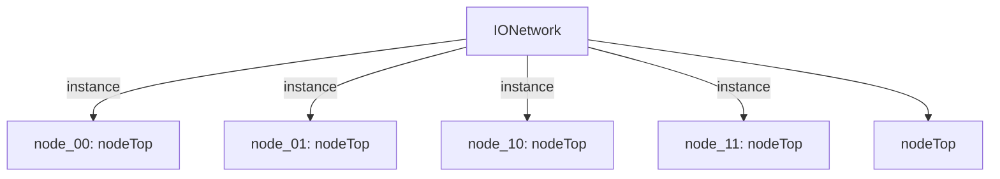

# 模块 `IONetwork`

- **源文件**：`rtl\rtl\IONet\IONetwork_9.24\IONetwork.v`
- **职责**：AI 推断：`i_driveEast_10` 直接连接到 `node_10` 的 `i_driveEast` 端口，无中间逻辑。
- **说明**：根据切片4（lines 116–124），`IONetwork` 将输入端口 `i_driveEast_10` 直接连至 `nodeTop` 实例 `node_10` 的 `.i_driveEast` 端口，中间不经过任何门控或组合逻辑。

## 1. 层级位置

- **Parents**：`IONet_slot`
- **Children**：`nodeTop`
- **Component children**：无
- **Upstream modules**：无
- **Downstream modules**：无

### 1.1 本模块结构图



```text
IONetwork
|-- node_00: nodeTop
|-- node_01: nodeTop
|-- node_10: nodeTop
|-- node_11: nodeTop
`-- nodeTop
```

## 2. 输入/输出接口摘要

- **接收**：驱动事件输入：`i_driveEast_10`、`i_driveEast_11`、`i_driveLocal_00`、`i_driveLocal_01`、… +8；数据输入：`i_eastInMsg_51_10`、`i_eastInMsg_51_11`、`i_localInMsg_51_00`、`i_localInMsg_51_01`、… +8；流控（free）输入：`i_freeEast_10`、`i_freeEast_11`、`i_freeLocal_00`、`i_freeLocal_01`、… +8。
- **输出**：驱动事件输出：`o_driveEast_10`、`o_driveEast_11`、`o_driveLocal_00`、`o_driveLocal_01`、… +8；数据输出：`o_eastMsg_51_10`、`o_eastMsg_51_11`、`o_localMsg_51_00`、`o_localMsg_51_01`、… +8；流控（free）输出：`o_freeEast_10`、`o_freeEast_11`、`o_freeLocal_00`、`o_freeLocal_01`、… +8。

### 2.1 端口分组

| 端口组 | 方向统计 | 代表信号 |
| --- | --- | --- |
| `drive_event` | input:12, output:12 | `i_driveEast_10`、`i_driveEast_11`、`i_driveLocal_00`、`i_driveLocal_01`、`i_driveLocal_10`、`i_driveLocal_11`、`i_driveNorth_01`、`i_driveNorth_11`、`i_driveSouth_00`、`i_driveSouth_10`、… +14 |
| `free_backpressure` | input:12, output:12 | `i_freeEast_10`、`i_freeEast_11`、`i_freeLocal_00`、`i_freeLocal_01`、`i_freeLocal_10`、`i_freeLocal_11`、`i_freeNorth_01`、`i_freeNorth_11`、`i_freeSouth_00`、`i_freeSouth_10`、… +14 |
| `other_ports` | input:12, output:12 | `i_eastInMsg_51_10`、`i_eastInMsg_51_11`、`i_localInMsg_51_00`、`i_localInMsg_51_01`、`i_localInMsg_51_10`、`i_localInMsg_51_11`、`i_northInMsg_51_01`、`i_northInMsg_51_11`、`i_southInMsg_51_00`、`i_southInMsg_51_10`、… +14 |

## 3. Drive/Data/Free 契约

| Interface | 方向 | Event | Payload | Free/backpressure |
| --- | --- | --- | --- | --- |
| `i_driveEast_10` | input | `i_driveEast_10` | `i_eastInMsg_51_10 [50:0]`、`i_eastInMsg_51_11 [50:0]` | `o_freeEast_10` |
| `i_driveEast_11` | input | `i_driveEast_11` | `i_eastInMsg_51_10 [50:0]`、`i_eastInMsg_51_11 [50:0]` | `o_freeEast_10` |
| `i_driveLocal_00` | input | `i_driveLocal_00` | `i_localInMsg_51_00 [50:0]`、`i_localInMsg_51_01 [50:0]`、`i_localInMsg_51_10 [50:0]` | `o_freeLocal_00` |
| `i_driveLocal_01` | input | `i_driveLocal_01` | `i_localInMsg_51_00 [50:0]`、`i_localInMsg_51_01 [50:0]`、`i_localInMsg_51_10 [50:0]` | `o_freeLocal_00` |
| `i_driveLocal_10` | input | `i_driveLocal_10` | `i_localInMsg_51_00 [50:0]`、`i_localInMsg_51_01 [50:0]`、`i_localInMsg_51_10 [50:0]` | `o_freeLocal_00` |
| `i_driveLocal_11` | input | `i_driveLocal_11` | `i_localInMsg_51_00 [50:0]`、`i_localInMsg_51_01 [50:0]`、`i_localInMsg_51_10 [50:0]` | `o_freeLocal_00` |
| `i_driveNorth_01` | input | `i_driveNorth_01` | `i_northInMsg_51_01 [50:0]`、`i_northInMsg_51_11 [50:0]` | `o_freeNorth_01` |
| `i_driveNorth_11` | input | `i_driveNorth_11` | `i_northInMsg_51_01 [50:0]`、`i_northInMsg_51_11 [50:0]` | `o_freeNorth_01` |
| `i_driveSouth_00` | input | `i_driveSouth_00` | `i_southInMsg_51_00 [50:0]`、`i_southInMsg_51_10 [50:0]` | `o_freeSouth_00` |
| `i_driveSouth_10` | input | `i_driveSouth_10` | `i_southInMsg_51_00 [50:0]`、`i_southInMsg_51_10 [50:0]` | `o_freeSouth_00` |
| `i_driveWest_00` | input | `i_driveWest_00` | `i_westInMsg_51_00 [50:0]`、`i_westInMsg_51_01 [50:0]` | `o_freeWest_00` |
| `i_driveWest_01` | input | `i_driveWest_01` | `i_westInMsg_51_00 [50:0]`、`i_westInMsg_51_01 [50:0]` | `o_freeWest_00` |

## 4. 主要 Drive‑centered Flow

### `i_driveEast_10`

- **确定性事实**：`i_driveEast_10` → `o_driveEast_10`、`o_driveLocal_10`、`o_driveSouth_10`；flow_id = `flow_000_IONetwork_i_driveEast_10`。
- **Payload**：`i_driveEast_10` → `i_eastInMsg_51_10 [50:0]`、`i_driveEast_10` → `i_eastInMsg_51_11 [50:0]`，`o_driveEast_10` → `o_eastMsg_51_10 [50:0]`、`o_driveEast_10` → `o_eastMsg_51_11 [50:0]`，`o_driveEast_11` → `o_eastMsg_51_10 [50:0]`、`o_driveEast_11` → `o_eastMsg_51_11 [50:0]`，`o_driveLocal_00` → `o_localMsg_51_00 [50:0]`、`o_driveLocal_00` → `o_localMsg_51_01 [50:0]`，… +22。
- **输出/影响**：`o_driveEast_10`、`o_driveLocal_10`、`o_driveSouth_10`、`o_driveLocal_00`、`o_driveSouth_00`、`o_driveWest_00`、`o_driveEast_11`、`o_driveLocal_11`、`o_driveNorth_11`、`o_driveLocal_01`、`o_driveNorth_01`、`o_driveWest_01`。
- **结构复杂度**：branch = 4，join = 4，blocking = 0。
- **AI 推断**：手册应强调以 `i_driveEast_10` 为起点的全方向驱动事件分发拓扑，说明数据与流控信号的对应关系；暂不强调内部路由决策细节和时序参数，待 RTL 审查后补充。

### `i_driveEast_11`

- **确定性事实**：`i_driveEast_11` → `o_driveEast_11`、`o_driveLocal_11`、`o_driveNorth_11`；flow_id = `flow_001_IONetwork_i_driveEast_11`。
- **Payload**：`i_driveEast_11` → `i_eastInMsg_51_10 [50:0]`、`i_driveEast_11` → `i_eastInMsg_51_11 [50:0]`，`o_driveEast_10` → `o_eastMsg_51_10 [50:0]`、`o_driveEast_10` → `o_eastMsg_51_11 [50:0]`，`o_driveEast_11` → `o_eastMsg_51_10 [50:0]`、`o_driveEast_11` → `o_eastMsg_51_11 [50:0]`，`o_driveLocal_00` → `o_localMsg_51_00 [50:0]`、`o_driveLocal_00` → `o_localMsg_51_01 [50:0]`，… +22。
- **输出/影响**：`o_driveEast_11`、`o_driveLocal_11`、`o_driveNorth_11`、`o_driveLocal_01`、`o_driveNorth_01`、`o_driveWest_01`、`o_driveEast_10`、`o_driveLocal_10`、`o_driveSouth_10`、`o_driveLocal_00`、`o_driveSouth_00`、`o_driveWest_00`。
- **结构复杂度**：branch = 4，join = 4，blocking = 0。
- **AI 推断**：手册宜突出该流是一种全局驱动事件多播机制：由单个东向入口触发后，在 2×2 节点网格中生成所有方向的输出驱动；可简要说明节点互连拓扑，但应避免猜测节点内部的路由或仲裁逻辑。

### `i_driveLocal_00`

- **确定性事实**：`i_driveLocal_00` → `o_driveLocal_00`、`o_driveSouth_00`、`o_driveWest_00`；flow_id = `flow_002_IONetwork_i_driveLocal_00`。
- **Payload**：`i_driveLocal_00` → `i_localInMsg_51_00 [50:0]`、`i_driveLocal_00` → `i_localInMsg_51_01 [50:0]`、`i_driveLocal_00` → `i_localInMsg_51_10 [50:0]`，`o_driveEast_10` → `o_eastMsg_51_10 [50:0]`、`o_driveEast_10` → `o_eastMsg_51_11 [50:0]`，`o_driveEast_11` → `o_eastMsg_51_10 [50:0]`、`o_driveEast_11` → `o_eastMsg_51_11 [50:0]`，`o_driveLocal_00` → `o_localMsg_51_00 [50:0]`，… +23。
- **输出/影响**：`o_driveLocal_00`、`o_driveSouth_00`、`o_driveWest_00`、`o_driveLocal_01`、`o_driveNorth_01`、`o_driveWest_01`、`o_driveEast_10`、`o_driveLocal_10`、`o_driveSouth_10`、`o_driveEast_11`、`o_driveLocal_11`、`o_driveNorth_11`。
- **结构复杂度**：branch = 4，join = 4，blocking = 0。
- **AI 推断**：应侧重描述驱动事件从 `i_driveLocal_00` 进入后可到达的输出端口集合、网格拓扑以及流控规则，而非断言确定性传播顺序或必达端点。

### `i_driveLocal_01`

- **确定性事实**：`i_driveLocal_01` → `o_driveLocal_01`、`o_driveNorth_01`、`o_driveWest_01`；flow_id = `flow_003_IONetwork_i_driveLocal_01`。
- **Payload**：`i_driveLocal_01` → `i_localInMsg_51_00 [50:0]`、`i_driveLocal_01` → `i_localInMsg_51_01 [50:0]`、`i_driveLocal_01` → `i_localInMsg_51_10 [50:0]`，`o_driveEast_10` → `o_eastMsg_51_10 [50:0]`、`o_driveEast_10` → `o_eastMsg_51_11 [50:0]`，`o_driveEast_11` → `o_eastMsg_51_10 [50:0]`、`o_driveEast_11` → `o_eastMsg_51_11 [50:0]`，`o_driveLocal_00` → `o_localMsg_51_00 [50:0]`，… +23。
- **输出/影响**：`o_driveLocal_01`、`o_driveNorth_01`、`o_driveWest_01`、`o_driveLocal_00`、`o_driveSouth_00`、`o_driveWest_00`、`o_driveEast_11`、`o_driveLocal_11`、`o_driveNorth_11`、`o_driveEast_10`、`o_driveLocal_10`、`o_driveSouth_10`。
- **结构复杂度**：branch = 4，join = 4，blocking = 0。
- **AI 推断**：手册宜突出本流是一种网格全域扇出事件，并在架构层面说明其传播路径，但应弱化内部路由实现细节和缺乏证据的背压行为。

### `i_driveLocal_10`

- **确定性事实**：`i_driveLocal_10` → `o_driveEast_10`、`o_driveLocal_10`、`o_driveSouth_10`；flow_id = `flow_004_IONetwork_i_driveLocal_10`。
- **Payload**：`i_driveLocal_10` → `i_localInMsg_51_00 [50:0]`、`i_driveLocal_10` → `i_localInMsg_51_01 [50:0]`、`i_driveLocal_10` → `i_localInMsg_51_10 [50:0]`，`o_driveEast_10` → `o_eastMsg_51_10 [50:0]`、`o_driveEast_10` → `o_eastMsg_51_11 [50:0]`，`o_driveEast_11` → `o_eastMsg_51_10 [50:0]`、`o_driveEast_11` → `o_eastMsg_51_11 [50:0]`，`o_driveLocal_00` → `o_localMsg_51_00 [50:0]`，… +23。
- **输出/影响**：`o_driveEast_10`、`o_driveLocal_10`、`o_driveSouth_10`、`o_driveLocal_00`、`o_driveSouth_00`、`o_driveWest_00`、`o_driveEast_11`、`o_driveLocal_11`、`o_driveNorth_11`、`o_driveLocal_01`、`o_driveNorth_01`、`o_driveWest_01`。
- **结构复杂度**：branch = 4，join = 4，blocking = 0。
- **AI 推断**：手册应突出 2×2 网格的广播拓扑、事件传播的方向约束、数据与背压信号的依赖关系，并明确标注缺失的内部实现细节。

### `i_driveLocal_11`

- **确定性事实**：`i_driveLocal_11` → `o_driveEast_11`、`o_driveLocal_11`、`o_driveNorth_11`；flow_id = `flow_005_IONetwork_i_driveLocal_11`。
- **Payload**：`i_driveLocal_11` → `i_localInMsg_51_00 [50:0]`、`i_driveLocal_11` → `i_localInMsg_51_01 [50:0]`、`i_driveLocal_11` → `i_localInMsg_51_10 [50:0]`，`o_driveEast_10` → `o_eastMsg_51_10 [50:0]`、`o_driveEast_10` → `o_eastMsg_51_11 [50:0]`，`o_driveEast_11` → `o_eastMsg_51_10 [50:0]`、`o_driveEast_11` → `o_eastMsg_51_11 [50:0]`，`o_driveLocal_00` → `o_localMsg_51_00 [50:0]`，… +23。
- **输出/影响**：`o_driveEast_11`、`o_driveLocal_11`、`o_driveNorth_11`、`o_driveLocal_01`、`o_driveNorth_01`、`o_driveWest_01`、`o_driveEast_10`、`o_driveLocal_10`、`o_driveSouth_10`、`o_driveLocal_00`、`o_driveSouth_00`、`o_driveWest_00`。
- **结构复杂度**：branch = 4，join = 4，blocking = 0。
- **AI 推断**：`i_driveLocal_11` 驱动事件验证了传入的消息数据（`i_localInMsg_51_00/01/10`），这些数据随驱动事件传播，最终在输出驱动事件有效时通过输出消息总线（如 `o_localMsg_51_00/01/10`）送出，并由空闲信号（如 `i_freeLocal_00`）控制数据流动。

### `i_driveNorth_01`

- **确定性事实**：`i_driveNorth_01` → `o_driveLocal_01`、`o_driveNorth_01`、`o_driveWest_01`；flow_id = `flow_006_IONetwork_i_driveNorth_01`。
- **Payload**：`i_driveNorth_01` → `i_northInMsg_51_01 [50:0]`、`i_driveNorth_01` → `i_northInMsg_51_11 [50:0]`，`o_driveEast_10` → `o_eastMsg_51_10 [50:0]`、`o_driveEast_10` → `o_eastMsg_51_11 [50:0]`，`o_driveEast_11` → `o_eastMsg_51_10 [50:0]`、`o_driveEast_11` → `o_eastMsg_51_11 [50:0]`，`o_driveLocal_00` → `o_localMsg_51_00 [50:0]`、`o_driveLocal_00` → `o_localMsg_51_01 [50:0]`，… +22。
- **输出/影响**：`o_driveLocal_01`、`o_driveNorth_01`、`o_driveWest_01`、`o_driveLocal_00`、`o_driveSouth_00`、`o_driveWest_00`、`o_driveEast_11`、`o_driveLocal_11`、`o_driveNorth_11`、`o_driveEast_10`、`o_driveLocal_10`、`o_driveSouth_10`。
- **结构复杂度**：branch = 4，join = 4，blocking = 0。
- **AI 推断**：手册应强调该流实现无阻塞全网格广播的行为，并描述网格结构；应淡化内部仲裁、流控细节及消息内容处理，除非后续获得 RTL 显式证据。

### `i_driveNorth_11`

- **确定性事实**：`i_driveNorth_11` → `o_driveEast_11`、`o_driveLocal_11`、`o_driveNorth_11`；flow_id = `flow_007_IONetwork_i_driveNorth_11`。
- **Payload**：`i_driveNorth_11` → `i_northInMsg_51_01 [50:0]`、`i_driveNorth_11` → `i_northInMsg_51_11 [50:0]`，`o_driveEast_10` → `o_eastMsg_51_10 [50:0]`、`o_driveEast_10` → `o_eastMsg_51_11 [50:0]`，`o_driveEast_11` → `o_eastMsg_51_10 [50:0]`、`o_driveEast_11` → `o_eastMsg_51_11 [50:0]`，`o_driveLocal_00` → `o_localMsg_51_00 [50:0]`、`o_driveLocal_00` → `o_localMsg_51_01 [50:0]`，… +22。
- **输出/影响**：`o_driveEast_11`、`o_driveLocal_11`、`o_driveNorth_11`、`o_driveLocal_01`、`o_driveNorth_01`、`o_driveWest_01`、`o_driveEast_10`、`o_driveLocal_10`、`o_driveSouth_10`、`o_driveLocal_00`、`o_driveSouth_00`、`o_driveWest_00`。
- **结构复杂度**：branch = 4，join = 4，blocking = 0。
- **AI 推断**：手册应突出北向输入触发全网格扇出的拓扑结构、各节点的输出方向，弱化内部仲裁和时序细节。

### `i_driveSouth_00`

- **确定性事实**：`i_driveSouth_00` → `o_driveLocal_00`、`o_driveSouth_00`、`o_driveWest_00`；flow_id = `flow_008_IONetwork_i_driveSouth_00`。
- **Payload**：`i_driveSouth_00` → `i_southInMsg_51_00 [50:0]`、`i_driveSouth_00` → `i_southInMsg_51_10 [50:0]`，`o_driveEast_10` → `o_eastMsg_51_10 [50:0]`、`o_driveEast_10` → `o_eastMsg_51_11 [50:0]`，`o_driveEast_11` → `o_eastMsg_51_10 [50:0]`、`o_driveEast_11` → `o_eastMsg_51_11 [50:0]`，`o_driveLocal_00` → `o_localMsg_51_00 [50:0]`、`o_driveLocal_00` → `o_localMsg_51_01 [50:0]`，… +22。
- **输出/影响**：`o_driveLocal_00`、`o_driveSouth_00`、`o_driveWest_00`、`o_driveLocal_01`、`o_driveNorth_01`、`o_driveWest_01`、`o_driveEast_10`、`o_driveLocal_10`、`o_driveSouth_10`、`o_driveEast_11`、`o_driveLocal_11`、`o_driveNorth_11`。
- **结构复杂度**：branch = 4，join = 4，blocking = 0。
- **AI 推断**：手册应聚焦 flow_008 所展示的单一驱动源引发的全向输出扇出拓扑，弱化个别端点的细节。

### `i_driveSouth_10`

- **确定性事实**：`i_driveSouth_10` → `o_driveEast_10`、`o_driveLocal_10`、`o_driveSouth_10`；flow_id = `flow_009_IONetwork_i_driveSouth_10`。
- **Payload**：`i_driveSouth_10` → `i_southInMsg_51_00 [50:0]`、`i_driveSouth_10` → `i_southInMsg_51_10 [50:0]`，`o_driveEast_10` → `o_eastMsg_51_10 [50:0]`、`o_driveEast_10` → `o_eastMsg_51_11 [50:0]`，`o_driveEast_11` → `o_eastMsg_51_10 [50:0]`、`o_driveEast_11` → `o_eastMsg_51_11 [50:0]`，`o_driveLocal_00` → `o_localMsg_51_00 [50:0]`、`o_driveLocal_00` → `o_localMsg_51_01 [50:0]`，… +22。
- **输出/影响**：`o_driveEast_10`、`o_driveLocal_10`、`o_driveSouth_10`、`o_driveLocal_00`、`o_driveSouth_00`、`o_driveWest_00`、`o_driveEast_11`、`o_driveLocal_11`、`o_driveNorth_11`、`o_driveLocal_01`、`o_driveNorth_01`、`o_driveWest_01`。
- **结构复杂度**：branch = 4，join = 4，blocking = 0。
- **AI 推断**：强调从南向入口 `i_driveSouth_10` 开始的多跳扇出拓扑及其在所有输出方向上的最终可见性。

### `i_driveWest_00`

- **确定性事实**：`i_driveWest_00` → `o_driveLocal_00`、`o_driveSouth_00`、`o_driveWest_00`；flow_id = `flow_010_IONetwork_i_driveWest_00`。
- **Payload**：`i_driveWest_00` → `i_westInMsg_51_00 [50:0]`、`i_driveWest_00` → `i_westInMsg_51_01 [50:0]`，`o_driveEast_10` → `o_eastMsg_51_10 [50:0]`、`o_driveEast_10` → `o_eastMsg_51_11 [50:0]`，`o_driveEast_11` → `o_eastMsg_51_10 [50:0]`、`o_driveEast_11` → `o_eastMsg_51_11 [50:0]`，`o_driveLocal_00` → `o_localMsg_51_00 [50:0]`、`o_driveLocal_00` → `o_localMsg_51_01 [50:0]`，… +22。
- **输出/影响**：`o_driveLocal_00`、`o_driveSouth_00`、`o_driveWest_00`、`o_driveLocal_01`、`o_driveNorth_01`、`o_driveWest_01`、`o_driveEast_10`、`o_driveLocal_10`、`o_driveSouth_10`、`o_driveEast_11`、`o_driveLocal_11`、`o_driveNorth_11`。
- **结构复杂度**：branch = 4，join = 4，blocking = 0。
- **AI 推断**：输入驱动事件 `i_driveWest_00` 关联两条 51 位消息总线 `i_westInMsg_51_00` 和 `i_westInMsg_51_01`，事件有效期间数据必须稳定；流控信号 `o_freeWest_00` 表示 `IONetwork` 侧是否准备好接收。

### `i_driveWest_01`

- **确定性事实**：`i_driveWest_01` → `o_driveLocal_01`、`o_driveNorth_01`、`o_driveWest_01`；flow_id = `flow_011_IONetwork_i_driveWest_01`。
- **Payload**：`i_driveWest_01` → `i_westInMsg_51_00 [50:0]`、`i_driveWest_01` → `i_westInMsg_51_01 [50:0]`，`o_driveEast_10` → `o_eastMsg_51_10 [50:0]`、`o_driveEast_10` → `o_eastMsg_51_11 [50:0]`，`o_driveEast_11` → `o_eastMsg_51_10 [50:0]`、`o_driveEast_11` → `o_eastMsg_51_11 [50:0]`，`o_driveLocal_00` → `o_localMsg_51_00 [50:0]`、`o_driveLocal_00` → `o_localMsg_51_01 [50:0]`，… +22。
- **输出/影响**：`o_driveLocal_01`、`o_driveNorth_01`、`o_driveWest_01`、`o_driveLocal_00`、`o_driveSouth_00`、`o_driveWest_00`、`o_driveEast_11`、`o_driveLocal_11`、`o_driveNorth_11`、`o_driveEast_10`、`o_driveLocal_10`、`o_driveSouth_10`。
- **结构复杂度**：branch = 4，join = 4，blocking = 0。
- **AI 推断**：最终手册应强调该流揭示了 `IONetwork` 中西向输入能够抵达所有输出端口的拓扑可达性，但需明确指出路由选择逻辑和实际分发策略依赖于 `nodeTop` 内部实现，本分析未涵盖。

## 5. 内部组件与 assign 影响

### 5.1 内部组件

| 实例 | 类型 | 输入事件 | 输出事件 |
| --- | --- | --- | --- |
| `node_00` | `nodeTop` | `i_driveLocal_00`、`i_driveSouth_00`、`i_driveWest_00`、`w_drive01200`、`w_drive10200` | `o_driveLocal_00`、`o_driveSouth_00`、`o_driveWest_00`、`w_drive00201`、`w_drive00210` |
| `node_01` | `nodeTop` | `i_driveLocal_01`、`i_driveNorth_01`、`i_driveWest_01`、`w_drive00201`、`w_drive11201` | `o_driveLocal_01`、`o_driveNorth_01`、`o_driveWest_01`、`w_drive01200`、`w_drive01211` |
| `node_10` | `nodeTop` | `i_driveEast_10`、`i_driveLocal_10`、`i_driveSouth_10`、`w_drive00210`、`w_drive11210` | `o_driveEast_10`、`o_driveLocal_10`、`o_driveSouth_10`、`w_drive10200`、`w_drive10211` |
| `node_11` | `nodeTop` | `i_driveEast_11`、`i_driveLocal_11`、`i_driveNorth_11`、`w_drive01211`、`w_drive10211` | `o_driveEast_11`、`o_driveLocal_11`、`o_driveNorth_11`、`w_drive11201`、`w_drive11210` |

### 5.2 assign 影响

| Assign | Impact area | LHS | RHS 摘要 | 解释状态 |
| --- | --- | --- | --- | --- |
| - | - | - | - | Manual Context 未提供 primary assign 影响 |
