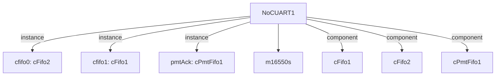

# 模块 `NoCUART1`

- 源文件：`rtl\rtl\IONet\UART\NoCUART1.v`
- 职责：**AI 推断**：作为 UART 外设与 NoC 之间的事件驱动数据桥接，将 UART 接收数据转化为 NoC 格式的输出数据包。
- 说明：模块接收 NoC 事件 `i_drvFNoc` 触发数据输入 `i_dataFNoc_51`（可能为 NoC 发送的数据），但主要流向是输出 `o_drv2Noc` 事件和 `o_data2Noc_51` 数据。内部包含 UART 实例 `m16550s`，其接收数据经处理后构成输出数据包。自由信号 `i_freeFNoc` 和 `o_free2Noc` 分别控制输入流和输出缓冲空间，表明存在背压流控。

## 1. 层级位置

- Parents：`IONet_slot`
- Children：`m16550s`
- Component children：`cFifo1`, `cFifo2`, `cPmtFifo1`
- Upstream modules：无
- Downstream modules：无

### 1.1 本模块结构图



```text
NoCUART1
|-- cfifo0: cFifo2
|-- cfifo1: cFifo1
|-- pmtAck: cPmtFifo1
|-- m16550s
|-- cFifo1
|-- cFifo2
`-- cPmtFifo1
```

## 2. 输入/输出接口摘要

**接收**：
- 驱动事件输入：`i_drvFNoc`
- 数据输入：`i_dataFNoc_51`
- 空闲/背压输入：`i_freeFNoc`
- 其他输入：`BRGE`, `CLOCK`, `NCTS`, `NDCD`, `NDSR`, `NRI`, `RCLK`, `RCLK_BAUD`, `SIN`, `rst_finish`

**输出**：
- 驱动事件输出：`o_drv2Noc`
- 数据输出：`o_data2Noc_51`
- 空闲/背压输出：`o_free2Noc`
- 其他输出：`BAUD`, `IRQ`, `NDTR`, `NOUT1`, `NOUT2`, `NRTS`, `SOUT`

### 2.1 端口分组

| 端口组 | 方向统计 | 代表信号 |
| --- | --- | --- |
| `clock_reset_init` | input:3 | `RCLK`, `RCLK_BAUD`, `rst_finish` |
| `drive_event` | input:1, output:1 | `i_drvFNoc`, `o_drv2Noc` |
| `free_backpressure` | input:1, output:1 | `i_freeFNoc`, `o_free2Noc` |
| `other_ports` | input:8, output:8 | `i_dataFNoc_51`, `o_data2Noc_51`, `BRGE`, `CLOCK`, `NCTS`, `NDCD`, `NDSR`, `NRI`, `SIN`, `BAUD`, `... +6` |

## 3. Drive/Data/Free 契约

| 接口 | 方向 | Event | Payload | Free/backpressure |
| --- | --- | --- | --- | --- |
| `i_drvFNoc` | input | `i_drvFNoc` | `i_dataFNoc_51 [50:0]` | 未记录 |
| `o_drv2Noc` | output | `o_drv2Noc` | `o_data2Noc_51 [50:0]` | 未记录 |

## 4. 主要 Drive‑Centered Flow

### `i_drvFNoc` → `o_drv2Noc`

- **确定性事实**：Flow 标识 `flow_000_NoCUART1_i_drvFNoc`，路径为 `i_drvFNoc` 至 `o_drv2Noc`。
- **Payload 映射**：  
  `i_drvFNoc` ↔ `i_dataFNoc_51 [50:0]`  
  `o_drv2Noc` ↔ `o_data2Noc_51 [50:0]`
- **输出/影响**：`o_drv2Noc`
- **结构复杂度**：branch = 0，join = 0，blocking = 3
- **AI 推断**：手册应强调该流为同步驱动事件的重定时路径，包含三级 FIFO 缓冲和固定延迟，并指出反压依赖 FIFO 实例的未暴露控制信号。

## 5. 内部组件与 assign 影响

### 5.1 内部组件

| 实例 | 类型 | 输入事件 | 输出事件 |
| --- | --- | --- | --- |
| `cfifo0` | `cFifo2` | `i_drvFNoc` | `w_drv2Pmt` |
| `cfifo1` | `cFifo1` | `w_drv2fifo1_delay` | `w_drv2Noc_delay` |
| `pmtAck` | `cPmtFifo1` | `w_drv2Pmt` | `w_drv2fifo1` |

### 5.2 assign 影响

| Assign | 影响区域 | LHS | RHS 摘要 | 解释状态 |
| --- | --- | --- | --- | --- |
| `assign_0` | data_path | `o_data2Noc_51` | {r_dataFNoc_51[50], r_dataFNoc_51[49:42], r_dataHigh, ReceiveData, r_X, r_Y} | **证据不足**：No Semantic Layer assignment interpretation is available. |
