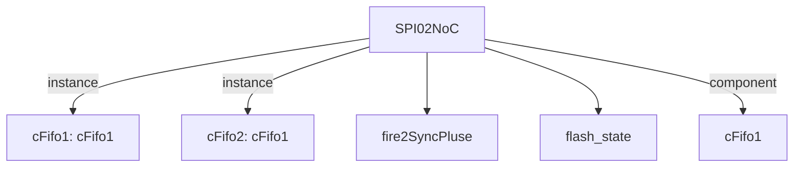

# 模块 `SPI02NoC`

- 源文件：`rtl/rtl/IONet/SPI/SPI0/SPI02NoC.v`。
- 职责：AI 推断：作为SPI模块与片上网络(NoC)之间的桥接与数据转换接口，负责将NoC的驱动事件和数据转换为SPI Flash控制器的读写操作，并将结果返回NoC。。
- 说明：模块接收来自Mesh的驱动事件(i_driveFrmMesh)和NoC数据(i_dataFrmNoc)，通过内部FIFO和延迟单元进行流水线控制，最终输出驱动事件(o_driveNextToMesh)和数据(o_data2Noc)到Mesh。同时，模块内部实例化flash_state控制器(u_flash)处理SPI Flash协议，并输出SPI接口信号(sclk, mosi, cs_n)和状态信号(busy, startRead)。

## 1. 层级位置

- Parents：`IONet_slot`。
- Children：`fire2SyncPluse`, `flash_state`。
- Component children：`cFifo1`。
- Upstream modules：无。
- Downstream modules：无。

### 1.1 本模块结构图



```text
SPI02NoC
|-- cFifo1: cFifo1
|-- cFifo2: cFifo1
|-- fire2SyncPluse
|-- flash_state
`-- cFifo1
```

## 2. 输入/输出接口摘要

- 接收：drive 输入：`i_driveFrmMesh`；数据输入：`i_dataFrmNoc`；free 输入：`i_freeNextFrmMesh`；其他输入：`clk`, `miso`, `rst_finish`。
- 输出：drive 输出：`o_driveNextToMesh`；数据输出：`address`, `o_data2Noc`；free 输出：`o_freeToMesh`；其他输出：`busy`, `cs_n`, `mosi`, `sclk`, `... +1`。

### 2.1 端口分组

| 端口组 | 方向统计 | 代表信号 |
| --- | --- | --- |
| `clock_reset_init` | input:2, output:1 | `clk`, `rst_finish`, `sclk` |
| `drive_event` | input:1, output:1 | `i_driveFrmMesh`, `o_driveNextToMesh` |
| `free_backpressure` | input:1, output:1 | `i_freeNextFrmMesh`, `o_freeToMesh` |
| `other_ports` | input:2, output:6 | `i_dataFrmNoc`, `address`, `o_data2Noc`, `miso`, `busy`, `cs_n`, `mosi`, `startRead` |

## 3. Drive/Data/Free 契约

| Interface | 方向 | Event | Payload | Free/backpressure |
| --- | --- | --- | --- | --- |
| `i_driveFrmMesh` | input | `i_driveFrmMesh` | `i_dataFrmNoc [50:0]` | `o_freeToMesh` |
| `o_driveNextToMesh` | output | `o_driveNextToMesh` | 未记录 | `i_freeNextFrmMesh` |

## 4. 主要 Drive-centered Flow

### `i_driveFrmMesh`

- 确定性事实：`i_driveFrmMesh to o_driveNextToMesh`；flow_id=`flow_000_SPI02NoC_i_driveFrmMesh`。
- Payload：`i_driveFrmMesh` -> `i_dataFrmNoc [50:0]`。
- 输出/影响：`o_driveNextToMesh`。
- 结构复杂度：branch=0，join=0，blocking=2。
- AI 推断：最终手册应重点描述事件如何通过两级FIFO和延迟单元传递，并强调cFifo1和cFifo2作为潜在阻塞点的作用。


## 5. 内部组件与 assign 影响

### 5.1 内部组件

| 实例 | 类型 | 输入事件 | 输出事件 |
| --- | --- | --- | --- |
| `cFifo1` | `cFifo1` | `i_driveFrmMesh` | `w_driveNext` |
| `cFifo2` | `cFifo1` | `w_driveNext_delay` | `o_driveNextToMesh` |

### 5.2 assign 影响

| Assign | Impact area | LHS | RHS 摘要 | 解释状态 |
| --- | --- | --- | --- | --- |
| `assign_1` | data_path | `w_SR` | {dataReady,w_TXE,busy,w_finish,4'b0} | 证据不足：No Semantic Layer assignment interpretation is available. |
| `assign_2` | data_path | `w_data2noc` | (address[3:0] == CR) ? {24'b0,r_CR} : (address[3:0] == SR) ? {24'b0,w_SR} : (address[3:0] == ... | AI 推断：根据地址选择内部寄存器值，组合成返回NoC的数据。 |
| `assign_5` | unknown | `startRead_fire` | ((address[3:0] == TDR) & w_en) ? w_fire_2[1] : 1'b0 | AI 推断：当写使能且地址为TDR时，生成触发信号启动Flash读操作。 |
| `assign_6` | unknown | `w_en_tmp` | w_en & (address == 8'h64) | 证据不足：No Semantic Layer assignment interpretation is available. |
| `assign_0` | data_path | `address` | i_dataFrmNoc[49:42] | AI 推断：从NoC输入数据中提取地址字段，用于内部寄存器选择和Flash操作寻址。 |
