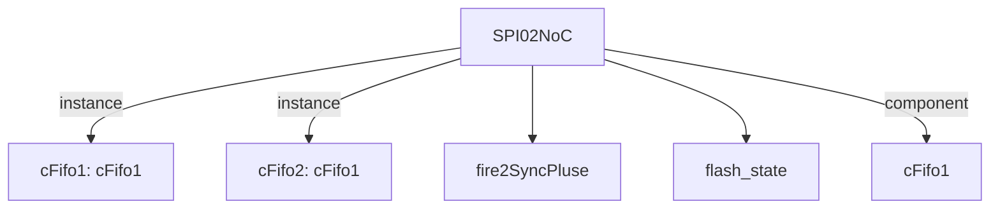

# 模块 `SPI02NoC`

- 源文件：`rtl\rtl\IONet\SPI\SPI0\SPI02NoC.v`
- 职责：AI 推断：w_fire_2[1] 由 i_driveFrmMesh 经两级 cFifo1 与 delay4U 产生，当写使能且地址为 TDR 时，startRead_fire 直接复用该脉冲，逻辑清晰。
- 说明：根据切片，w_fire_2[1] 来自 cFifo2 的 o_fire_1 端口（第80行），其驱动链为：
  i_driveFrmMesh → cFifo1 (.o_driveNext = w_driveNext) → delay4U (输出 w_driveNext_delay) → cFifo2 (.i_drive = w_driveNext_delay, .o_fire_1 = w_fire_2[1])。
  因此 w_fire_2[1] 是输入帧经两级 FIFO 延迟线后产生的写触发脉冲。
  startRead_fire 由连续赋值生成（第169行）：
  `assign startRead_fire = ((address[3:0] == TDR) & w_en) ? w_fire_2[1] : 1'b0;`
  仅在当前访问的目标寄存器为 TDR 且写使能有效时，将 w_fire_2[1] 作为读启动脉冲输出；其他情况保持低电平。
  该逻辑完整，不含边沿检测以外的隐藏依赖。

## 1. 层级位置

- Parents：`IONet_slot`
- Children：`fire2SyncPluse`, `flash_state`
- Component children：`cFifo1`
- Upstream modules：无
- Downstream modules：无

### 1.1 本模块结构图



```text
SPI02NoC
|-- cFifo1: cFifo1
|-- cFifo2: cFifo1
|-- fire2SyncPluse
|-- flash_state
`-- cFifo1
```

## 2. 输入/输出接口摘要

- 接收：
  - drive 输入：`i_driveFrmMesh`
  - 数据输入：`i_dataFrmNoc`
  - free 输入：`i_freeNextFrmMesh`
  - 其他输入：`clk`, `miso`, `rst_finish`
- 输出：
  - drive 输出：`o_driveNextToMesh`
  - 数据输出：`address`, `o_data2Noc`
  - free 输出：`o_freeToMesh`
  - 其他输出：`busy`, `cs_n`, `mosi`, `sclk`, `startRead`

### 2.1 端口分组

| 端口组 | 方向统计 | 代表信号 |
| --- | --- | --- |
| `clock_reset_init` | input:2, output:1 | `clk`, `rst_finish`, `sclk` |
| `drive_event` | input:1, output:1 | `i_driveFrmMesh`, `o_driveNextToMesh` |
| `free_backpressure` | input:1, output:1 | `i_freeNextFrmMesh`, `o_freeToMesh` |
| `other_ports` | input:2, output:6 | `i_dataFrmNoc`, `miso`, `address`, `o_data2Noc`, `busy`, `cs_n`, `mosi`, `startRead` |

## 3. Drive/Data/Free 契约

| Interface | 方向 | Event | Payload | Free/backpressure |
| --- | --- | --- | --- | --- |
| `i_driveFrmMesh` | input | `i_driveFrmMesh` | `i_dataFrmNoc [50:0]` | `o_freeToMesh` |
| `o_driveNextToMesh` | output | `o_driveNextToMesh` | 未记录 | `i_freeNextFrmMesh` |

## 4. 主要 Drive-centered Flow

### `i_driveFrmMesh`

- 确定性事实：`i_driveFrmMesh to o_driveNextToMesh`；flow_id=`flow_000_SPI02NoC_i_driveFrmMesh`
- Payload：`i_driveFrmMesh` → `i_dataFrmNoc [50:0]`
- 输出/影响：`o_driveNextToMesh`
- 结构复杂度：branch=0，join=0，blocking=2
- AI 推断：应突出该流为双 FIFO 延迟线结构，描述背压如何逐级传递，以及透明延迟的量级，但无需过度解释数据地址提取细节。

## 5. 内部组件与 assign 影响

### 5.1 内部组件

| 实例 | 类型 | 输入事件 | 输出事件 |
| --- | --- | --- | --- |
| `cFifo1` | `cFifo1` | `i_driveFrmMesh` | `w_driveNext` |
| `cFifo2` | `cFifo1` | `w_driveNext_delay` | `o_driveNextToMesh` |

### 5.2 assign 影响

| Assign | Impact area | LHS | RHS 摘要 | 解释状态 |
| --- | --- | --- | --- | --- |
| `assign_1` | data_path | `w_SR` | {dataReady,w_TXE,busy,w_finish,4'b0} | AI 推断：根据地址选择对应的寄存器值作为返回给 NoC 的读数据 |
| `assign_2` | data_path | `w_data2noc` | (address[3:0] == CR) ? {24'b0,r_CR} : (address[3:0] == SR) ? {24'b0,w_SR} : (address[3:0] == ... | AI 推断：从输入命令数据帧的高位段直接提取 SPI 寄存器地址 |
| `assign_5` | data_path | `startRead_fire` | ((address[3:0] == TDR) & w_en) ? w_fire_2[1] : 1'b0 | AI 推断：从输入命令数据帧的高位段直接提取 SPI 寄存器地址 |
| `assign_6` | data_path | `w_en_tmp` | w_en & (address == 8'h64) | AI 推断：从输入命令数据帧的高位段直接提取 SPI 寄存器地址 |
| `assign_0` | data_path | `address` | i_dataFrmNoc[49:42] | AI 推断：写使能与特定地址(8'h64)的联合条件，可能用于片选或使能内部逻辑 |
