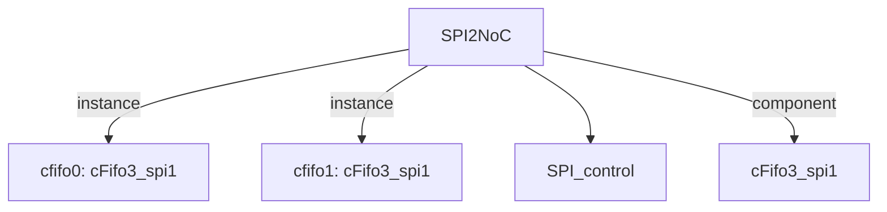

# 模块 `SPI2NoC`

- 源文件：`rtl/rtl/IONet/SPI/SPI1/SPI2NoC.v`。
- 职责：AI 推断：SPI2NoC 是一个桥接模块，负责将 SPI 控制器的驱动事件和数据通过一对 FIFO 转换为 NoC 接口的驱动事件和数据，并处理 NoC 的空闲信号回传。。
- 说明：模块通过 i_drvFNoc 事件驱动输入，携带 i_dataFNoc_51 数据，经过 cfifo0 和 cfifo1 两级 FIFO 流水线，最终输出 o_drv2Noc 事件和 o_data2Noc_51 数据。同时，NoC 侧的空闲信号 i_freeFNoc 直接连接到 cfifo1，而 cfifo0 的输出 o_free2Noc 则作为模块的空闲信号输出，形成完整的背压控制环。

## 1. 层级位置

- Parents：`IONet_slot`。
- Children：`SPI_control`。
- Component children：`cFifo3_spi1`。
- Upstream modules：无。
- Downstream modules：无。

### 1.1 本模块结构图



```text
SPI2NoC
|-- cfifo0: cFifo3_spi1
|-- cfifo1: cFifo3_spi1
|-- SPI_control
`-- cFifo3_spi1
```

## 2. 输入/输出接口摘要

- 接收：drive 输入：`i_drvFNoc`；数据输入：`i_dataFNoc_51`；free 输入：`i_freeFNoc`；其他输入：`clk`, `miso_in`, `mosi_in`, `nss_in`, `... +2`。
- 输出：drive 输出：`o_drv2Noc`；数据输出：`o_data2Noc_51`；free 输出：`o_free2Noc`；其他输出：`SPI_IRQ`, `io_ctl_miso`, `io_ctl_mosi`, `io_ctl_nss`, `... +5`。

### 2.1 端口分组

| 端口组 | 方向统计 | 代表信号 |
| --- | --- | --- |
| `clock_reset_init` | input:3, output:2 | `clk`, `rst_finish`, `sclk_in`, `io_ctl_sclk`, `sclk_out` |
| `drive_event` | input:1, output:1 | `i_drvFNoc`, `o_drv2Noc` |
| `free_backpressure` | input:1, output:1 | `i_freeFNoc`, `o_free2Noc` |
| `other_ports` | input:4, output:8 | `i_dataFNoc_51`, `o_data2Noc_51`, `miso_in`, `mosi_in`, `nss_in`, `SPI_IRQ`, `io_ctl_miso`, `io_ctl_mosi`, `io_ctl_nss`, `miso_out`, `... +2` |

## 3. Drive/Data/Free 契约

| Interface | 方向 | Event | Payload | Free/backpressure |
| --- | --- | --- | --- | --- |
| `i_drvFNoc` | input | `i_drvFNoc` | `i_dataFNoc_51 [50:0]` | 未记录 |
| `o_drv2Noc` | output | `o_drv2Noc` | `o_data2Noc_51 [50:0]` | 未记录 |

## 4. 主要 Drive-centered Flow

### `i_drvFNoc`

- 确定性事实：`SPI2NoC flow from i_drvFNoc`；flow_id=`flow_000_SPI2NoC_i_drvFNoc`。
- Payload：`i_drvFNoc` -> `i_dataFNoc_51 [50:0]`。
- 输出/影响：证据不足：Knowledge IR did not find a module output endpoint for this flow.。
- 结构复杂度：branch=0，join=0，blocking=1。
- AI 推断：最终手册应强调 i_drvFNoc 作为模块外部事件入口的角色，并说明其与 i_dataFNoc_51 的关联，但需避免过度描述内部传播细节。


## 5. 内部组件与 assign 影响

### 5.1 内部组件

| 实例 | 类型 | 输入事件 | 输出事件 |
| --- | --- | --- | --- |
| `cfifo0` | `cFifo3_spi1` | `i_drvFNoc` | `w_drvnext_fifo1` |
| `cfifo1` | `cFifo3_spi1` | `r_drv2fifo1` | `o_drv2Noc` |

### 5.2 assign 影响

| Assign | Impact area | LHS | RHS 摘要 | 解释状态 |
| --- | --- | --- | --- | --- |
| `assign_0` | data_path | `o_data2Noc_51` | {r_dataFNoc_51[50],r_dataFNoc_51[49:42],r_apbrdata,r_X,r_Y} | AI 推断：该赋值将内部寄存器 r_dataFNoc_51、r_apbrdata、r_X、r_Y 拼接成 51 位 NoC 输出数据。 |
