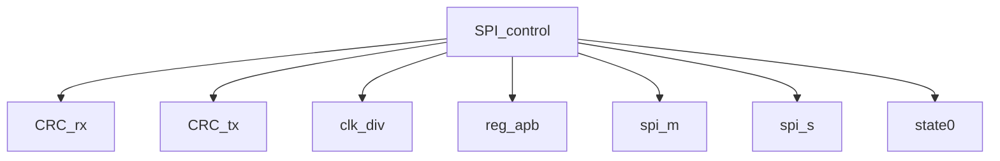

# 模块 `SPI_control`

- 源文件：`rtl\rtl\IONet\SPI\SPI1\SPI_control.v`。
- 职责：**AI 推断**：作为 SPI 外设的顶层集成模块，通过 APB 从接口提供寄存器级配置，并整合 SPI 主/从收发、时钟生成、CRC 校验、错误检测与中断管理功能。
- 说明：该模块拥有完整的 APB 从接口（PADDR、PWDATA、PRDATA 等），并直接连接到寄存器实例 `reg_apb_u`。同时，它将时钟与复位分发到 `clk_div_u`、`spi_m_u`、`spi_s_u`、`CRC_rx_u`、`CRC_tx_u`、`MODF_u` 和 `OVR_u` 等功能子模块，并将内部状态组合为 `SPI_interrupt` 输出，从而承担 SPI 外设的顶层控制角色。

## 1. 层级位置

- Parents：`SPI2NoC`。
- Children：`CRC_rx`, `CRC_tx`, `clk_div`, `reg_apb`, `spi_m`, `spi_s`, `state0`。
- Component children：无。
- Upstream modules：无。
- Downstream modules：无。

### 1.1 本模块结构图



```text
SPI_control
|-- CRC_rx
|-- CRC_tx
|-- clk_div
|-- reg_apb
|-- spi_m
|-- spi_s
`-- state0
```

## 2. 输入/输出接口摘要

- 接收：数据输入：`PADDR`, `PWDATA`；其他输入：`PENABLE`, `PSEL`, `PWRITE`, `clk`, `... +5`。
- 输出：数据输出：`PRDATA`；其他输出：`PREADY`, `PSLVERR`, `SPI_interrupt`, `io_ctl_miso`, `... +8`。

### 2.1 端口分组

| 端口组 | 方向统计 | 代表信号 |
| --- | --- | --- |
| `clock_reset_init` | input:3, output:2 | `clk`, `rst_n`, `sclk_in`, `io_ctl_sclk`, `sclk_out` |
| `other_ports` | input:8, output:11 | `PADDR`, `PWDATA`, `PRDATA`, `PENABLE`, `PSEL`, `PWRITE`, `miso_in`, `mosi_in`, `nss_in`, `PREADY`, 及其余 9 个输出端口 |

## 3. Drive/Data/Free 契约

| Interface | 方向 | Event | Payload | Free/backpressure |
| --- | --- | --- | --- | --- |
| `data_inputs` | input | - | `PADDR [7:0]`, `PWDATA [31:0]` | 未记录 |
| `data_outputs` | output | - | `PRDATA [31:0]` | 未记录 |

## 4. 主要 Drive-centered Flow

- **证据不足**：Manual Context 未提供本模块的 drive flow。

## 5. 内部组件与 assign 影响

### 5.1 内部组件

| 实例 | 类型 | 输入事件 | 输出事件 |
| --- | --- | --- | --- |
| - | - | - | Manual Context 未提供主要内部组件 |

### 5.2 assign 影响

| Assign | 影响区域 | LHS | RHS 摘要 | 解释状态 |
| --- | --- | --- | --- | --- |
| `assign_1` | unknown | `io_ctl_sclk` | MSTR ? 1'b1 : 1'b0 | **证据不足**：无可用的语义层赋值解释。 |
| `assign_2` | unknown | `io_ctl_miso` | MSTR ? 1'b0 : ((BIDIMODE & !BIDIOE) ? 1'b0 : 1'b1) | **证据不足**：无可用的语义层赋值解释。 |
| `assign_3` | unknown | `io_ctl_mosi` | MSTR ? ((BIDIMODE & !BIDIOE) ? 1'b0 : 1'b1) : 1'b0 | **证据不足**：无可用的语义层赋值解释。 |
| `assign_4` | unknown | `io_ctl_nss` | (MSTR & SSOE) ? 1'b1 : 1'b0 | **证据不足**：无可用的语义层赋值解释。 |
| `assign_5` | unknown | `nss_reg` | SSM ? SSI : nss_in | **证据不足**：无可用的语义层赋值解释。 |
| `assign_6` | unknown | `mosi_out` | (BIDIMODE & !BIDIOE) ? 1'b0 : tx_m | **证据不足**：无可用的语义层赋值解释。 |
| `assign_12` | unknown | `SPI_interrupt` | (RXNE & RXNEIE) \| ((MODF \| OVR \| CRCERR) & ERRIE) \| (TXE & TXEIE) \| 1'b0 | **证据不足**：无可用的语义层赋值解释。 |
| `assign_0` | unknown | `sclk_out` | CPOL ? ~sclk_out_div : sclk_out_div | **证据不足**：无可用的语义层赋值解释。 |
