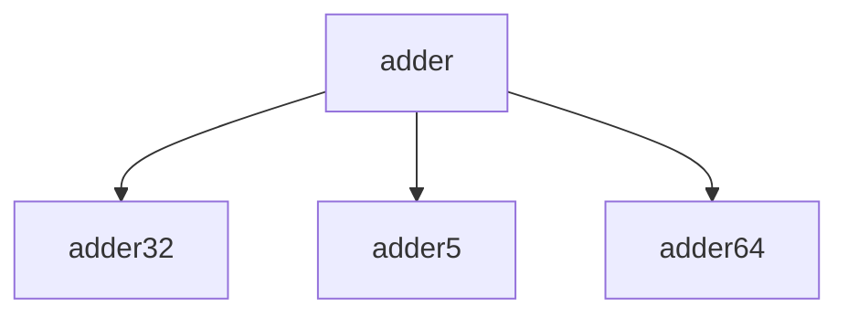

# 模块 `adder`

- 源文件：`rtl\rtl\Execute\adder.v`。
- 职责：AI 推断：多宽度算术加法器，根据操作类型选择32位、5位或64位加法结果。
- 说明：模块通过i_adderType_2选择不同的加法器子模块（adder32、adder5、adder64）的输出，实现不同位宽的加法运算，并输出结果、进位和溢出标志

## 1. 层级位置

- Parents：`execute`。
- Children：`adder32`, `adder5`, `adder64`。
- Component children：无。
- Upstream modules：无。
- Downstream modules：无。

### 1.1 本模块结构图



```text
adder
|-- adder32
|-- adder5
`-- adder64
```

## 2. 输入/输出接口摘要

- 接收：数据输入：`i_oprand1_64`, `i_oprand2_64`；控制输入：`i_addSymbolFlag_1`, `i_adderType_2`, `i_carryInType_1`。
- 输出：数据输出：`o_adderResult_64`；其他输出：`o_adderCarryOut_1`, `o_adderOverFlow_1`。

### 2.1 端口分组

| 端口组 | 方向统计 | 代表信号 |
| --- | --- | --- |
| `other_ports` | input:5, output:3 | `i_oprand1_64`, `i_oprand2_64`, `o_adderResult_64`, `i_addSymbolFlag_1`, `i_adderType_2`, `i_carryInType_1`, `o_adderCarryOut_1`, `o_adderOverFlow_1` |

## 3. Drive/Data/Free 契约

| Interface | 方向 | Event | Payload | Free/backpressure |
| --- | --- | --- | --- | --- |
| `data_inputs` | input | - | `i_oprand1_64 [63:0]`, `i_oprand2_64 [63:0]` | 未记录 |
| `data_outputs` | output | - | `o_adderResult_64 [63:0]` | 未记录 |
| `control_inputs` | input | - | 未记录 | 未记录 |

## 4. 主要 Drive-centered Flow

- 证据不足：Manual Context 未提供本模块 drive flow。

## 5. 内部组件与 assign 影响

### 5.1 内部组件

| 实例 | 类型 | 输入事件 | 输出事件 |
| --- | --- | --- | --- |
| - | - | - | Manual Context 未提供 primary internal component |

### 5.2 assign 影响

| Assign | Impact area | LHS | RHS 摘要 | 解释状态 |
| --- | --- | --- | --- | --- |
| `assign_1` | data_path | `w_oprand2_32` | i_oprand2_64[31:0] | 证据不足：No Semantic Layer assignment interpretation is available. |
| `assign_2` | data_path | `w_oprand1_5` | i_oprand1_64[31:0] | 证据不足：No Semantic Layer assignment interpretation is available. |
| `assign_3` | data_path | `w_oprand2_5` | i_oprand2_64[31:0] | 证据不足：No Semantic Layer assignment interpretation is available. |
| `assign_4` | data_path | `o_adderResult_64` | i_adderType_2 == 2'b00 ? w_adder32Result_32 : (i_adderType_2==2'b01 ? w_adder5Result_5 :(i_ad... | AI 推断：根据i_adderType_2选择最终加法结果输出 |
| `assign_5` | unknown | `o_adderCarryOut_1` | i_adderType_2 == 2'b00 ? w_adder32CarryOut_1 : (i_adderType_2==2'b01 ? w_adder5CarryOut_1 :(i... | AI 推断：根据i_adderType_2选择对应加法器的进位输出 |
| `assign_6` | unknown | `o_adderOverFlow_1` | i_adderType_2 == 2'b00 ? w_adder32OverFlow_1 : (i_adderType_2==2'b01 ? w_adder5OverFlow_1 :(i... | AI 推断：根据i_adderType_2选择对应加法器的溢出标志 |
| `assign_0` | data_path | `w_oprand1_32` | i_oprand1_64[31:0] | 证据不足：No Semantic Layer assignment interpretation is available. |
