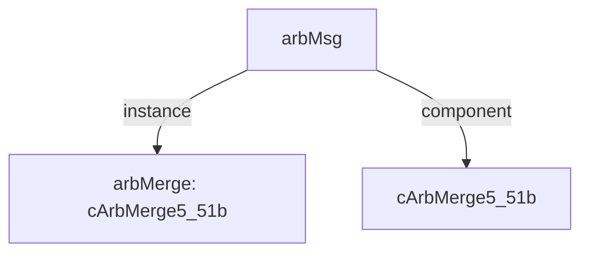

# 模块 `arbMsg`

- 源文件：`rtl\rtl\IONet\IONetwork_9.24\arbMsg.v`
- 职责：**AI 推断**：`i_driveEast` 信号直接连接至 `arbMerge` 输入，模块内无其他逻辑。  
  说明：从切片可见，`i_driveEast` 端口参与拼接信号并连接到 `arbMerge` 的 `i_drive_5` 输入端，该模块内未进行任何额外处理。

## 1. 层级位置

- Parents：`nodeTop`
- Children：无
- Component children：`cArbMerge5_51b`
- Upstream modules：无
- Downstream modules：无

### 1.1 本模块结构图



```text
arbMsg
|-- arbMerge: cArbMerge5_51b
`-- cArbMerge5_51b
```

## 2. 输入/输出接口摘要

- 接收：  
  drive 输入（5个方向）：`i_driveEast`, `i_driveLocal`, `i_driveNorth`, `i_driveSouth`, `i_driveWest`  
  数据输入（5个方向）：`i_eastMsg_51`, `i_localMsg_51`, `i_northMsg_51`, `i_southMsg_51`, `i_westMsg_51`  
  free 输入：`i_freeNext`
- 输出：  
  drive 输出：`o_driveNext`  
  数据输出：`o_msg_51`  
  free 输出（5个方向）：`o_freeEast`, `o_freeLocal`, `o_freeNorth`, `o_freeSouth`, `o_freeWest`

### 2.1 端口分组

| 端口组 | 方向统计 | 代表信号 |
| --- | --- | --- |
| `drive_event` | input:5, output:1 | `i_driveEast`, `i_driveLocal`, `i_driveNorth`, `i_driveSouth`, `i_driveWest`, `o_driveNext` |
| `free_backpressure` | input:1, output:5 | `i_freeNext`, `o_freeEast`, `o_freeLocal`, `o_freeNorth`, `o_freeSouth`, `o_freeWest` |
| `other_ports` | input:5, output:1 | `i_eastMsg_51`, `i_localMsg_51`, `i_northMsg_51`, `i_southMsg_51`, `i_westMsg_51`, `o_msg_51` |

## 3. Drive/Data/Free 契约

| Interface | 方向 | Event | Payload | Free/backpressure |
| --- | --- | --- | --- | --- |
| `i_driveEast` | input | `i_driveEast` | `i_eastMsg_51 [50:0]` | `o_freeEast` |
| `i_driveLocal` | input | `i_driveLocal` | `i_localMsg_51 [50:0]` | `o_freeLocal` |
| `i_driveNorth` | input | `i_driveNorth` | `i_northMsg_51 [50:0]` | `o_freeNorth` |
| `i_driveSouth` | input | `i_driveSouth` | `i_southMsg_51 [50:0]` | `o_freeSouth` |
| `i_driveWest` | input | `i_driveWest` | `i_westMsg_51 [50:0]` | `o_freeWest` |
| `o_driveNext` | output | `o_driveNext` | `o_msg_51 [50:0]` | 未记录 |

## 4. 主要 Drive‑centered Flow

### `i_driveEast`

- 确定性事实：`i_driveEast to o_driveNext`；flow_id = `flow_000_arbMsg_i_driveEast`。
- Payload：`i_driveEast` → `i_eastMsg_51 [50:0]`，`o_driveNext` → `o_msg_51 [50:0]`。
- 输出/影响：`o_driveNext`。
- 结构复杂度：branch = 0，join = 1，blocking = 1。
- **AI 推断**：最终手册应强调该流是 `arbMsg` 模块多输入仲裁合并的一个分支，重点说明控制与数据的配合，并指出背压仅作用于输入侧，输出侧的流控依赖下游。

### `i_driveLocal`

- 确定性事实：`i_driveLocal to o_driveNext`；flow_id = `flow_001_arbMsg_i_driveLocal`。
- Payload：`i_driveLocal` → `i_localMsg_51 [50:0]`，`o_driveNext` → `o_msg_51 [50:0]`。
- 输出/影响：`o_driveNext`。
- 结构复杂度：branch = 0，join = 1，blocking = 1。
- **AI 推断**：本地输入事件驱动（`i_driveLocal`）经多路仲裁合并器 `arbMerge` 选通后，输出到下游下一个事件驱动（`o_driveNext`）。

### `i_driveNorth`

- 确定性事实：`i_driveNorth to o_driveNext`；flow_id = `flow_002_arbMsg_i_driveNorth`。
- Payload：`i_driveNorth` → `i_northMsg_51 [50:0]`，`o_driveNext` → `o_msg_51 [50:0]`。
- 输出/影响：`o_driveNext`。
- 结构复杂度：branch = 0，join = 1，blocking = 1。
- **AI 推断**：当 `i_driveNorth` 事件触发并最终导致 `o_driveNext` 时，北向负载 `i_northMsg_51` 通过 `arbMerge` 的数据通道被传送到 `o_msg_51`。

### `i_driveSouth`

- 确定性事实：`i_driveSouth to o_driveNext`；flow_id = `flow_003_arbMsg_i_driveSouth`。
- Payload：`i_driveSouth` → `i_southMsg_51 [50:0]`，`o_driveNext` → `o_msg_51 [50:0]`。
- 输出/影响：`o_driveNext`。
- 结构复杂度：branch = 0，join = 1，blocking = 1。
- **AI 推断**：手册应突出南向事件参与五路仲裁的角色、负载 `i_southMsg_51` 至 `o_msg_51` 的路径以及 `o_freeSouth` 流控，避免臆测内部仲裁算法。

### `i_driveWest`

- 确定性事实：`i_driveWest to o_driveNext`；flow_id = `flow_004_arbMsg_i_driveWest`。
- Payload：`i_driveWest` → `i_westMsg_51 [50:0]`，`o_driveNext` → `o_msg_51 [50:0]`。
- 输出/影响：`o_driveNext`。
- 结构复杂度：branch = 0，join = 1，blocking = 1。
- **AI 推断**：应强调 `arbMerge` 作为中心仲裁节点的作用，描述多路驱动竞争、西向驱动的可能路径，以及有效载荷跟随事件的选择性传递。避免断言固定的仲裁优先级或时序细节。

## 5. 内部组件与 assign 影响

### 5.1 内部组件

| 实例 | 类型 | 输入事件 | 输出事件 |
| --- | --- | --- | --- |
| `arbMerge` | `cArbMerge5_51b` | `i_driveEast`, `i_driveLocal`, `i_driveNorth`, `i_driveSouth`, `i_driveWest` | `o_driveNext` |

### 5.2 assign 影响

| Assign | Impact area | LHS | RHS 摘要 | 解释状态 |
| --- | --- | --- | --- | --- |
| - | - | - | - | Manual Context 未提供 primary assign 影响 |
