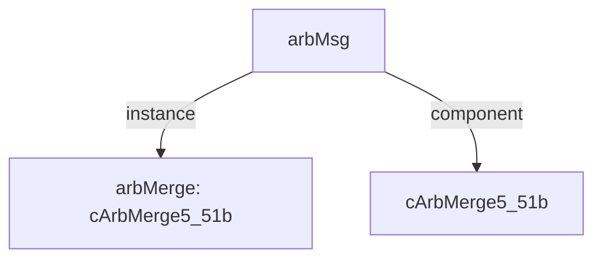

# 模块 `arbMsg`

- 源文件：`rtl\rtl\IONet\IONetwork_9.24\arbMsg.v`。
- 职责：AI 推断：五路输入到一路输出的消息仲裁与合并模块，用于片上网络（IONet）的路由节点。。
- 说明：模块接收来自东、本地、北、南、西五个方向的驱动事件（i_drive*）及其对应的51位消息载荷（i_*Msg_51），通过内部实例arbMerge（cArbMerge5_51b）进行仲裁合并，输出一个驱动事件（o_driveNext）和一条合并后的消息（o_msg_51）。同时，它接收来自下一级的空闲信号（i_freeNext），并生成五个方向各自的空闲信号（o_free*），构成完整的握手机制。

## 1. 层级位置

- Parents：`nodeTop`。
- Children：无。
- Component children：`cArbMerge5_51b`。
- Upstream modules：无。
- Downstream modules：无。

### 1.1 本模块结构图



```text
arbMsg
|-- arbMerge: cArbMerge5_51b
`-- cArbMerge5_51b
```

## 2. 输入/输出接口摘要

- 接收：drive 输入：`i_driveEast`, `i_driveLocal`, `i_driveNorth`, `i_driveSouth`, `... +1`；数据输入：`i_eastMsg_51`, `i_localMsg_51`, `i_northMsg_51`, `i_southMsg_51`, `... +1`；free 输入：`i_freeNext`。
- 输出：drive 输出：`o_driveNext`；数据输出：`o_msg_51`；free 输出：`o_freeEast`, `o_freeLocal`, `o_freeNorth`, `o_freeSouth`, `... +1`。

### 2.1 端口分组

| 端口组 | 方向统计 | 代表信号 |
| --- | --- | --- |
| `drive_event` | input:5, output:1 | `i_driveEast`, `i_driveLocal`, `i_driveNorth`, `i_driveSouth`, `i_driveWest`, `o_driveNext` |
| `free_backpressure` | input:1, output:5 | `i_freeNext`, `o_freeEast`, `o_freeLocal`, `o_freeNorth`, `o_freeSouth`, `o_freeWest` |
| `other_ports` | input:5, output:1 | `i_eastMsg_51`, `i_localMsg_51`, `i_northMsg_51`, `i_southMsg_51`, `i_westMsg_51`, `o_msg_51` |

## 3. Drive/Data/Free 契约

| Interface | 方向 | Event | Payload | Free/backpressure |
| --- | --- | --- | --- | --- |
| `i_driveEast` | input | `i_driveEast` | `i_eastMsg_51 [50:0]` | `o_freeEast` |
| `i_driveLocal` | input | `i_driveLocal` | `i_localMsg_51 [50:0]` | `o_freeLocal` |
| `i_driveNorth` | input | `i_driveNorth` | `i_northMsg_51 [50:0]` | `o_freeNorth` |
| `i_driveSouth` | input | `i_driveSouth` | `i_southMsg_51 [50:0]` | `o_freeSouth` |
| `i_driveWest` | input | `i_driveWest` | `i_westMsg_51 [50:0]` | `o_freeWest` |
| `o_driveNext` | output | `o_driveNext` | `o_msg_51 [50:0]` | 未记录 |

## 4. 主要 Drive-centered Flow

### `i_driveEast`

- 确定性事实：`i_driveEast to o_driveNext`；flow_id=`flow_000_arbMsg_i_driveEast`。
- Payload：`i_driveEast` -> `i_eastMsg_51 [50:0]`, `o_driveNext` -> `o_msg_51 [50:0]`。
- 输出/影响：`o_driveNext`。
- 结构复杂度：branch=0，join=1，blocking=1。
- AI 推断：东向驱动事件 `i_driveEast` 携带一个 51 位的数据负载 `i_eastMsg_51`。

### `i_driveLocal`

- 确定性事实：`i_driveLocal to o_driveNext`；flow_id=`flow_001_arbMsg_i_driveLocal`。
- Payload：`i_driveLocal` -> `i_localMsg_51 [50:0]`, `o_driveNext` -> `o_msg_51 [50:0]`。
- 输出/影响：`o_driveNext`。
- 结构复杂度：branch=0，join=1，blocking=1。
- AI 推断：手册应重点描述 i_driveLocal 事件如何通过 arbMerge 参与仲裁并输出

### `i_driveNorth`

- 确定性事实：`i_driveNorth to o_driveNext`；flow_id=`flow_002_arbMsg_i_driveNorth`。
- Payload：`i_driveNorth` -> `i_northMsg_51 [50:0]`, `o_driveNext` -> `o_msg_51 [50:0]`。
- 输出/影响：`o_driveNext`。
- 结构复杂度：branch=0，join=1，blocking=1。
- AI 推断：驱动事件i_driveNorth携带51位北向消息载荷i_northMsg_51

### `i_driveSouth`

- 确定性事实：`i_driveSouth to o_driveNext`；flow_id=`flow_003_arbMsg_i_driveSouth`。
- Payload：`i_driveSouth` -> `i_southMsg_51 [50:0]`, `o_driveNext` -> `o_msg_51 [50:0]`。
- 输出/影响：`o_driveNext`。
- 结构复杂度：branch=0，join=1，blocking=1。
- AI 推断：文档应强调 i_driveSouth 作为 arbMerge 的输入之一，以及有效载荷 i_southMsg_51 的传递路径，但避免过度解释仲裁逻辑。

### `i_driveWest`

- 确定性事实：`i_driveWest to o_driveNext`；flow_id=`flow_004_arbMsg_i_driveWest`。
- Payload：`i_driveWest` -> `i_westMsg_51 [50:0]`, `o_driveNext` -> `o_msg_51 [50:0]`。
- 输出/影响：`o_driveNext`。
- 结构复杂度：branch=0，join=1，blocking=1。
- AI 推断：西向事件携带51位消息负载，经合并后输出


## 5. 内部组件与 assign 影响

### 5.1 内部组件

| 实例 | 类型 | 输入事件 | 输出事件 |
| --- | --- | --- | --- |
| `arbMerge` | `cArbMerge5_51b` | `i_driveEast`, `i_driveLocal`, `i_driveNorth`, `i_driveSouth`, `i_driveWest` | `o_driveNext` |

### 5.2 assign 影响

| Assign | Impact area | LHS | RHS 摘要 | 解释状态 |
| --- | --- | --- | --- | --- |
| - | - | - | - | Manual Context 未提供 primary assign 影响 |
