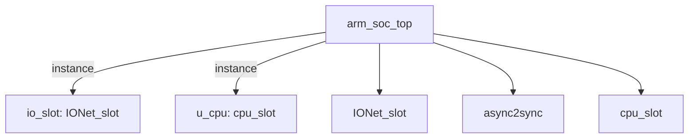

# 模块 `arm_soc_top`

- 源文件：`rtl/rtl/SoC/arm_soc_top.v`。
- 职责：AI 推断：顶层SoC集成模块，连接CPU核心与IO网络，实现处理器与外部IO之间的驱动事件交换。。
- 说明：模块仅包含两个关键实例：u_cpu（cpu_slot）和io_slot（IONet_slot），通过w_driveFrmCPU和w_driveToCPU两条驱动事件信号进行双向通信，无其他数据或事件接口，表明其核心角色是CPU与IO网络的桥接层。

## 1. 层级位置

- Parents：无。
- Children：`IONet_slot`, `async2sync`, `cpu_slot`。
- Component children：无。
- Upstream modules：无。
- Downstream modules：无。

### 1.1 本模块结构图



```text
arm_soc_top
|-- io_slot: IONet_slot
|-- u_cpu: cpu_slot
|-- IONet_slot
|-- async2sync
`-- cpu_slot
```

## 2. 输入/输出接口摘要

- 接收：控制输入：`initMode_pad`；其他输入：`BREG_UART0_pad`, `BREG_UART1_pad`, `FSEN_IIC0_pad`, `HSEN_IIC0_pad`, `... +21`。
- 输出：其他输出：`BAUD_UART0_pad`, `BAUD_UART1_pad`, `CKISO_IIC0_pad`, `DAGND_IIC0_pad`, `... +21`；双向端口：`io_pin_pad`, `miso_SPI1_pad`, `mosi_SPI1_pad`, `nss_SPI1_pad`, `... +1`。

### 2.1 端口分组

| 端口组 | 方向统计 | 代表信号 |
| --- | --- | --- |
| `clock_reset_init` | inout:1, input:7, output:1 | `initMode_pad`, `RCLK_BAUD_UART0_pad`, `RCLK_BAUD_UART1_pad`, `RCLK_UART0_pad`, `RCLK_UART1_pad`, `clk_pad`, `rst_pad`, `sclk_SPI0_pad`, `sclk_SPI1_pad` |
| `serial_boot_uart` | input:1, output:1 | `rx_pin_pad`, `tx_pin_pad` |
| `uart0` | input:6, output:6 | `BREG_UART0_pad`, `NCTS_UART0_pad`, `NDCD_UART0_pad`, `NDSR_UART0_pad`, `NRI_UART0_pad`, `SIN_UART0_pad`, `BAUD_UART0_pad`, `NDTR_UART0_pad`, `NOUT1_UART0_pad`, `NOUT2_UART0_pad`, `... +2` |
| `uart1` | input:6, output:6 | `BREG_UART1_pad`, `NCTS_UART1_pad`, `NDCD_UART1_pad`, `NDSR_UART1_pad`, `NRI_UART1_pad`, `SIN_UART1_pad`, `BAUD_UART1_pad`, `NDTR_UART1_pad`, `NOUT1_UART1_pad`, `NOUT2_UART1_pad`, `... +2` |
| `iic0` | input:5, output:6 | `FSEN_IIC0_pad`, `HSEN_IIC0_pad`, `IFSDA_IIC0_pad`, `ISCL_IIC0_pad`, `ISDA_IIC0_pad`, `CKISO_IIC0_pad`, `DAGND_IIC0_pad`, `DAISO_IIC0_pad`, `ENDRV_IIC0_pad`, `OSCL_IIC0_pad`, `... +1` |
| `spi0` | input:1, output:3 | `miso_SPI0_pad`, `cs_n_SPI0_pad`, `mosi_SPI0_pad`, `startRead_SPI0_pad` |
| `spi1` | inout:3 | `miso_SPI1_pad`, `mosi_SPI1_pad`, `nss_SPI1_pad` |
| `pwm0` | output:1 | `PWM0_OUT_pad` |
| `pwm1` | output:1 | `PWM1_OUT_pad` |
| `gpio` | inout:1 | `io_pin_pad` |

## 3. Drive/Data/Free 契约

| Interface | 方向 | Event | Payload | Free/backpressure |
| --- | --- | --- | --- | --- |
| `control_inputs` | input | - | 未记录 | 未记录 |

## 4. 主要 Drive-centered Flow

- 证据不足：Manual Context 未提供本模块 drive flow。

## 5. 内部组件与 assign 影响

### 5.1 内部组件

| 实例 | 类型 | 输入事件 | 输出事件 |
| --- | --- | --- | --- |
| `io_slot` | `IONet_slot` | `w_driveFrmCPU` | `w_driveToCPU` |
| `u_cpu` | `cpu_slot` | `w_driveToCPU` | `w_driveFrmCPU` |

### 5.2 assign 影响

| Assign | Impact area | LHS | RHS 摘要 | 解释状态 |
| --- | --- | --- | --- | --- |
| - | - | - | - | Manual Context 未提供 primary assign 影响 |
