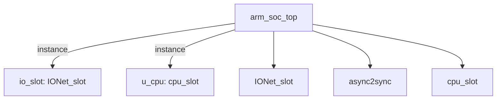

# 模块 `arm_soc_top`

- **源文件**：`rtl\rtl\SoC\arm_soc_top.v`
- **职责**：AI 推断：切片 5‑6 证实 CPU 与 IO 网络之间存在直接的事件驱动转发和数据通路，未发现数据转换逻辑。
- **说明**：
  - 切片 5 显示 `u_cpu.o_driveToMesh` 连接至 `w_driveFrmCPU`，`io_slot.i_drvFCPU` 连接同一信号，同时数据总线 `Local_out` 连接至 `io_slot.i_dataFCPU_51`。
  - 切片 6 显示 `io_slot.o_drv2CPU` 连接至 `w_driveToCPU`，`u_cpu.i_driveFromMesh` 连接，数据总线 `Local_in` 连回 CPU。
  - 设计中未发现组合逻辑或时序数据变换，仅为连线，符合“不含数据转换”的描述。

## 1. 层级位置

- **Parents**：无（顶层）
- **Children**：`IONet_slot`、`async2sync`、`cpu_slot`
- **Component children**：无
- **Upstream / Downstream modules**：无

### 1.1 结构框图



树形视图：
```
arm_soc_top
|-- io_slot: IONet_slot
|-- u_cpu: cpu_slot
|-- IONet_slot
|-- async2sync
`-- cpu_slot
```

## 2. 输入/输出接口摘要

- **接收**：控制输入 `initMode_pad`；其他输入 `BREG_UART0_pad`、`BREG_UART1_pad`、`FSEN_IIC0_pad`、`HSEN_IIC0_pad` 等共计 21 个信号。  
- **输出**：`BAUD_UART0_pad`、`BAUD_UART1_pad`、`CKISO_IIC0_pad`、`DAGND_IIC0_pad` 等共计 21 个信号。  
- **双向端口**：`io_pin_pad`、`miso_SPI1_pad`、`mosi_SPI1_pad`、`nss_SPI1_pad` 等共计 5 个信号。

### 2.1 端口分组

分组依据功能聚类，各组完整端口列表如下：

| 端口组 | 方向统计 | 包含端口 |
| --- | --- | --- |
| `clock_reset_init` | inout: 1, input: 7, output: 1 | `initMode_pad` (input), `RCLK_BAUD_UART0_pad` (input), `RCLK_BAUD_UART1_pad` (input), `RCLK_UART0_pad` (input), `RCLK_UART1_pad` (input), `clk_pad` (input), `rst_pad` (input), `sclk_SPI0_pad` (output, clock) , `sclk_SPI1_pad` (inout) |
| `serial_boot_uart` | input: 1, output: 1 | `rx_pin_pad` (input), `tx_pin_pad` (output) |
| `uart0` | input: 6, output: 6 | `BREG_UART0_pad`, `NCTS_UART0_pad`, `NDCD_UART0_pad`, `NDSR_UART0_pad`, `NRI_UART0_pad`, `SIN_UART0_pad` (inputs); `BAUD_UART0_pad`, `NDTR_UART0_pad`, `NOUT1_UART0_pad`, `NOUT2_UART0_pad`, `NRTS_UART0_pad`, `SOUT_UART0_pad` (outputs) |
| `uart1` | input: 6, output: 6 | `BREG_UART1_pad`, `NCTS_UART1_pad`, `NDCD_UART1_pad`, `NDSR_UART1_pad`, `NRI_UART1_pad`, `SIN_UART1_pad` (inputs); `BAUD_UART1_pad`, `NDTR_UART1_pad`, `NOUT1_UART1_pad`, `NOUT2_UART1_pad`, `NRTS_UART1_pad`, `SOUT_UART1_pad` (outputs) |
| `iic0` | input: 5, output: 6 | `FSEN_IIC0_pad`, `HSEN_IIC0_pad`, `IFSDA_IIC0_pad`, `ISCL_IIC0_pad`, `ISDA_IIC0_pad` (inputs); `CKISO_IIC0_pad`, `DAGND_IIC0_pad`, `DAISO_IIC0_pad`, `ENDRV_IIC0_pad`, `OSCL_IIC0_pad`, `OSDA_IIC0_pad` (outputs) |
| `spi0` | input: 1, output: 3 | `miso_SPI0_pad` (input); `cs_n_SPI0_pad`, `mosi_SPI0_pad`, `startRead_SPI0_pad` (outputs) |
| `spi1` | inout: 3 | `miso_SPI1_pad`, `mosi_SPI1_pad`, `nss_SPI1_pad` |
| `pwm0` | output: 1 | `PWM0_OUT_pad` |
| `pwm1` | output: 1 | `PWM1_OUT_pad` |
| `gpio` | inout: 1 | `io_pin_pad` |

## 3. Drive/Data/Free 契约

| Interface | 方向 | Event | Payload | Free/backpressure |
| --- | --- | --- | --- | --- |
| `control_inputs` | input | - | 未记录 | 未记录 |

## 4. 主要 Drive‑centered Flow

- **证据不足**：Manual Context 未提供本模块 drive flow。

## 5. 内部组件与 assign 影响

### 5.1 内部组件

| 实例 | 类型 | 输入事件 | 输出事件 |
| --- | --- | --- | --- |
| `io_slot` | `IONet_slot` | `w_driveFrmCPU` | `w_driveToCPU` |
| `u_cpu` | `cpu_slot` | `w_driveToCPU` | `w_driveFrmCPU` |

### 5.2 assign 影响

| Assign | Impact area | LHS | RHS 摘要 | 解释状态 |
| --- | --- | --- | --- | --- |
| - | - | - | - | 证据不足：Manual Context 未提供 primary assign 影响 |
