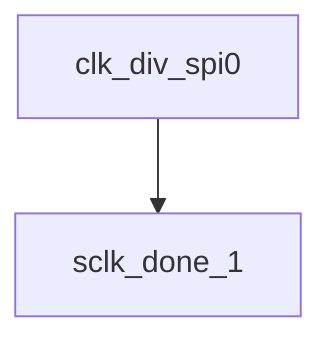

# 模块 `clk_div_spi0`

- 源文件：`rtl\rtl\IONet\SPI\SPI0\clk_div_spi0.v`
- 职责（AI 推断）：SPI0 的时钟生成模块。根据位速率选择输入 `BR` 和片选使能状态，产生经过两级门控的分频时钟 `sclk_out`，同时提供外部可观测的实时计数 `sclk_cnt`。  
- 说明：模块端口包含输入 `BR`（分频系数选择）、`M_en`（主使能），输出 `nss_out`（片选）、`sclk_m`（第一级门控时钟）、`sclk_cnt`（实时计数）以及 `sclk_out`（最终输出时钟）。组合逻辑 `assign sclk_m = nss_out ? 1'b0 : cnt[BR]` 根据 `BR` 选择计数器的一位作为时钟源，片选无效时输出低电平；`assign sclk_out = bit8_out ? sclk_m : 1'b0` 与 `assign bit8_out = (sclk_cnt != 0) ? 1'b1 : 1'b0` 构成两级门控，控制最终时钟输出。子实例 `u_sclk_done_1` 参与传输完成检测，整体结构与描述一致。

## 1. 层级位置

- Parents：`spi_master_spi0`
- Children：`sclk_done_1`
- Component children：无
- Upstream modules：无
- Downstream modules：无

### 1.1 本模块结构图



```text
clk_div_spi0
`-- sclk_done_1
```

## 2. 输入/输出接口摘要

- 接收：数据输入 `BR`；其他输入 `M_en`、`clk`、`rst_n`。
- 输出：数据输出 `sclk_cnt`；其他输出 `nss_out`、`sclk_m`、`sclk_out`。

### 2.1 端口分组

| 端口组 | 方向统计 | 代表信号 |
| --- | --- | --- |
| `clock_reset_init` | input:2, output:3 | `sclk_cnt`, `clk`, `rst_n`, `sclk_m`, `sclk_out` |
| `other_ports` | input:2, output:1 | `BR`, `M_en`, `nss_out` |

## 3. Drive/Data/Free 契约

| Interface | 方向 | Event | Payload | Free/backpressure |
| --- | --- | --- | --- | --- |
| `data_inputs` | input | - | `BR [2:0]` | 未记录 |
| `data_outputs` | output | - | `sclk_cnt [5:0]` | 未记录 |

## 4. 主要 Drive-centered Flow

- 证据不足：Manual Context 未提供本模块 drive flow。

## 5. 内部组件与 assign 影响

### 5.1 内部组件

| 实例 | 类型 | 输入事件 | 输出事件 |
| --- | --- | --- | --- |
| - | - | - | Manual Context 未提供 primary internal component |

### 5.2 assign 影响

| Assign | Impact area | LHS | RHS 摘要 | 解释状态 |
| --- | --- | --- | --- | --- |
| `assign_1` | unknown | `sclk_m` | nss_out ? 1'b0 : cnt[BR] | AI 推断：根据片选信号 nss_out 和速率选择 BR 将计数器某一位选为时钟源，片选无效时输出低电平。 |
| `assign_2` | unknown | `sclk_out` | bit8_out ? sclk_m : 1'b0 | AI 推断：根据片选信号 nss_out 和速率选择 BR 将计数器某一位选为时钟源，片选无效时输出低电平。 |
| `assign_0` | unknown | `bit8_out` | (sclk_cnt != 0) ? 1'b1 : 1'b0 | AI 推断：将分频后的中间时钟 sclk_m 在传输使能 bit8_out 控制下驱动到最终输出，实现两级门控的 SPI 时钟输出。 |
