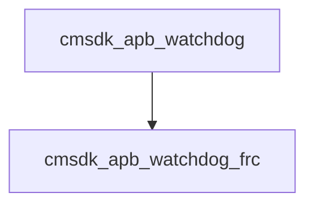

# 模块 `cmsdk_apb_watchdog`

- 源文件：`rtl\rtl\IONet\Watchdog\cmsdk_apb_watchdog.v`
- **AI 推断：** 本模块是基于 APB 总线的看门狗外设控制器，负责寄存器访问、锁定保护以及中断/复位输出的生成与路由。
- 说明：模块内实现了 APB 从设备地址译码、写使能生成、密钥解锁逻辑，并将核心定时功能交由实例 `u_apb_watchdog_frc` 处理。根据内部控制位，选择中断 (`WDOGINT`) 和复位 (`WDOGRES`) 的最终输出源。上下文显示 APB 信号 (`PADDR`, `PSEL`, `PWRITE` 等) 驱动多个使能信号，输出选择逻辑表明本模块是中断与复位的控制节点。

## 1. 层级位置

- Parents：`wd2noc`
- Children：`cmsdk_apb_watchdog_frc`
- Component children：无
- Upstream modules：无
- Downstream modules：无

### 1.1 本模块结构图



```
cmsdk_apb_watchdog
`-- cmsdk_apb_watchdog_frc
```

## 2. 输入/输出接口摘要

- 接收：数据输入：`ECOREVNUM`, `PADDR`, `PWDATA`；其他输入：`PCLK`, `PENABLE`, `PRESETn`, `PSEL`, `WDOGCLK`, `WDOGCLKEN`, `WDOGRESn`（共 10 个 input，其中 4 个时钟/复位/使能信号，6 个其他输入）
- 输出：数据输出：`PRDATA`；其他输出：`WDOGINT`, `WDOGRES`

### 2.1 端口分组

| 端口组 | 方向统计 | 代表信号 |
| --- | --- | --- |
| `clock_reset_init` | input:4 | `PCLK`, `PRESETn`, `WDOGCLK`, `WDOGCLKEN` |
| `other_ports` | input:7, output:3 | `ECOREVNUM`, `PADDR`, `PWDATA`, `PRDATA`, `PENABLE`, `PSEL`, `PWRITE`, `WDOGRESn`, `WDOGINT`, `WDOGRES` |

> 注：`WDOGRESn` 为输入，`WDOGINT` 与 `WDOGRES` 为输出。

## 3. Drive/Data/Free 契约

| Interface | 方向 | Event | Payload | Free/backpressure |
| --- | --- | --- | --- | --- |
| `data_inputs` | input | - | `ECOREVNUM [3:0]`, `PADDR [11:2]`, `PWDATA [31:0]` | 未记录 |
| `data_outputs` | output | - | `PRDATA [31:0]` | 未记录 |

## 4. 主要 Drive-centered Flow

- 证据不足：Manual Context 未提供本模块 drive flow。

## 5. 内部组件与 assign 影响

### 5.1 内部组件

| 实例 | 类型 | 输入事件 | 输出事件 |
| --- | --- | --- | --- |
| `u_apb_watchdog_frc` | `cmsdk_apb_watchdog_frc` | 未记录 | 未记录 |

> 说明：根据描述，核心定时功能由该实例承接，但详细事件信息在手工上下文中缺失。

### 5.2 assign 影响

| Assign | Impact area | LHS | RHS 摘要 | 解释状态 |
| --- | --- | --- | --- | --- |
| `assign_1` | control_path | `wdog_lock_wr_en` | `(PADDR == {ARM_WDOGLA, ARM_WDOGLOCKA}) ? ((PSEL & PWRITE) & (~PENABLE)) : 1'b0` | AI 推断：写锁定寄存器的使能信号，受锁定状态阻断。 |
| `assign_2` | data_path | `wdog_lock_wr_val` | `(PWDATA == 32'h1ACCE551) ? 1'b0 : 1'b1` | AI 推断：解锁码匹配时写入 0，否则写入 1。 |
| `assign_3` | control_path | `wdog_itcr_wr_en` | `(PADDR == {ARM_WDOGIA, ARM_WDOGTCRA}) ? (PSEL & PWRITE & (~PENABLE) & (~wdog_lock)) : 1'b0` | AI 推断：中断控制寄存器写使能，用于决定输出源来自硬件状态还是软件测试值。 |
| `assign_4` | control_path | `wdog_itop_wr_en` | `(PADDR == {ARM_WDOGIA, ARM_WDOGTOPA}) ? (PSEL & PWRITE & (~PENABLE) & (~wdog_lock)) : 1'b0` | AI 推断：中断输出测试寄存器写使能。 |
| `assign_5` | control_path | `prdata_next_en` | `PSEL & (~PWRITE) & (~PENABLE)` | 证据不足：No Semantic Layer assignment interpretation is available. |
| `assign_6` | control_path | `PRDATA` | `i_prdata` | AI 推断：APB 读数据通路控制，`prdata_next_en` 门控内部读寄存器值，`PRDATA` 由 `i_prdata` 直接驱动。 |
| `assign_7` | unknown | `WDOGINT` | `(wdog_itcr == 1'b0) ? i_wdogint : wdog_itop[1]` | 证据不足：No Semantic Layer assignment interpretation is available. |
| `assign_8` | unknown | `WDOGRES` | `(wdog_itcr == 1'b0) ? i_wdogres : wdog_itop[0]` | 证据不足：No Semantic Layer assignment interpretation is available. |
| `assign_0` | control_path | `frc_sel` | `(PSEL & (PADDR [11:5] == ARM_WDOG1A)) ? 1'b1 : 1'b0` | 证据不足：No Semantic Layer assignment interpretation is available. |
