# 模块 `cpu_slot`

- 源文件：`rtl/rtl/slot/cpu_slot.v`。
- 职责：AI 推断：该模块是CPU核心与片上网络Mesh之间的数据与事件桥接槽位，负责路由驱动事件、数据负载和初始化控制流。。
- 说明：通过i_driveFromMesh接收Mesh驱动事件，经内部组件（data_mux、u_cpu_core、u_memory_slot）处理后，通过o_driveToMesh输出响应事件；同时管理初始化序列（SoCStart、select2、event2CPU）和自由信号（i_freeFMesh/o_free2Mesh）。

## 1. 层级位置

- Parents：`arm_soc_top`。
- Children：`cpu_top_all`, `data_slot`, `memory_slot`。
- Component children：`cFifo1`, `cMutexMerge2_1b`, `cSelector2_1b`, `eventSource`。
- Upstream modules：无。
- Downstream modules：无。

### 1.1 本模块结构图

```mermaid
flowchart TB
  cpu_slot["cpu_slot"] -->|instance| event2CPU_cMutexMerge2_1b["event2CPU: cMutexMerge2_1b"]
  cpu_slot["cpu_slot"] -->|instance| select2_cSelector2_1b["select2: cSelector2_1b"]
  cpu_slot["cpu_slot"] -->|instance| cfifo0_cFifo1["cfifo0: cFifo1"]
  cpu_slot["cpu_slot"] -->|instance| SoCStart_eventSource["SoCStart: eventSource"]
  cpu_slot["cpu_slot"] -->|instance| UARTInitStart_eventSource["UARTInitStart: eventSource"]
  cpu_slot["cpu_slot"] -->|instance| data_mux_data_slot["data_mux: data_slot"]
  cpu_slot["cpu_slot"] -->|instance| u_cpu_core_cpu_top_all["u_cpu_core: cpu_top_all"]
  cpu_slot["cpu_slot"] -->|instance| u_memory_slot_memory_slot["u_memory_slot: memory_slot"]
  cpu_slot["cpu_slot"] --> cpu_top_all["cpu_top_all"]
  cpu_slot["cpu_slot"] --> data_slot["data_slot"]
  cpu_slot["cpu_slot"] --> memory_slot["memory_slot"]
  cpu_slot["cpu_slot"] -->|component| cFifo1["cFifo1"]
  cpu_slot["cpu_slot"] -->|component| cMutexMerge2_1b["cMutexMerge2_1b"]
  cpu_slot["cpu_slot"] -->|component| cSelector2_1b["cSelector2_1b"]
  cpu_slot["cpu_slot"] -->|component| eventSource["eventSource"]
```



```text
cpu_slot
|-- event2CPU: cMutexMerge2_1b
|-- select2: cSelector2_1b
|-- cfifo0: cFifo1
|-- SoCStart: eventSource
|-- UARTInitStart: eventSource
|-- data_mux: data_slot
|-- u_cpu_core: cpu_top_all
|-- u_memory_slot: memory_slot
|-- cpu_top_all
|-- data_slot
|-- memory_slot
|-- cFifo1
|-- cMutexMerge2_1b
|-- cSelector2_1b
`-- eventSource
```

## 2. 输入/输出接口摘要

- 接收：drive 输入：`i_driveFromMesh`；数据输入：`i_IntSig`, `i_dataFMesh`；控制输入：`initMode`；free 输入：`i_freeFMesh`；其他输入：`clk`, `init_rx`, `soc_start`。
- 输出：drive 输出：`o_driveToMesh`；数据输出：`o_data2Mesh`；free 输出：`o_free2Mesh`；其他输出：`init_sig`, `init_tx`。

### 2.1 端口分组

| 端口组 | 方向统计 | 代表信号 |
| --- | --- | --- |
| `clock_reset_init` | input:2 | `initMode`, `clk` |
| `drive_event` | input:1, output:1 | `i_driveFromMesh`, `o_driveToMesh` |
| `free_backpressure` | input:1, output:1 | `i_freeFMesh`, `o_free2Mesh` |
| `other_ports` | input:4, output:3 | `i_IntSig`, `i_dataFMesh`, `o_data2Mesh`, `init_rx`, `soc_start`, `init_sig`, `init_tx` |

## 3. Drive/Data/Free 契约

| Interface | 方向 | Event | Payload | Free/backpressure |
| --- | --- | --- | --- | --- |
| `i_driveFromMesh` | input | `i_driveFromMesh` | 未记录 | 未记录 |
| `o_driveToMesh` | output | `o_driveToMesh` | `o_data2Mesh [50:0]` | 未记录 |

## 4. 主要 Drive-centered Flow

### `i_driveFromMesh`

- 确定性事实：`i_driveFromMesh to o_driveToMesh`；flow_id=`flow_000_cpu_slot_i_driveFromMesh`。
- Payload：`o_driveToMesh` -> `o_data2Mesh [50:0]`。
- 输出/影响：`o_driveToMesh`。
- 结构复杂度：branch=3，join=3，blocking=0。
- AI 推断：手册应重点描述i_driveFromMesh事件如何经data_mux分发至CPU核心和内存槽，以及最终输出回Mesh的路径。


## 5. 内部组件与 assign 影响

### 5.1 内部组件

| 实例 | 类型 | 输入事件 | 输出事件 |
| --- | --- | --- | --- |
| `event2CPU` | `cMutexMerge2_1b` | `w_drv2IONetInit`, `w_drv2MemUARTRoad&UART_INIT_SEL` | `w_driveFromStart_1` |
| `select2` | `cSelector2_1b` | `w_drv2initMode_delay` | `w_drv2IONetInit`, `w_drv2InnerInit` |
| `cfifo0` | `cFifo1` | `w_drv2InnerInit` | 无 |
| `SoCStart` | `eventSource` | 无 | `w_drv2initMode` |
| `UARTInitStart` | `eventSource` | 无 | `w_drv2MemUARTRoad` |
| `data_mux` | `data_slot` | `i_driveFromMesh`, `w_driveDcache2Mux`, `w_lsuDriveToDataRout_1` | `o_driveToMesh`, `w_dataRoutDriveToLsu_1`, `w_driveMux2Dcache` |
| `u_cpu_core` | `cpu_top_all` | `w_dataRoutDriveToLsu_1`, `w_driveFromStart_1`, `w_drvIcache2CPU` | `w_drvCpu2Icache`, `w_lsuDriveToDataRout_1` |
| `u_memory_slot` | `memory_slot` | `w_driveMux2Dcache`, `w_drvCpu2Icache` | `w_driveDcache2Mux`, `w_drvIcache2CPU` |

### 5.2 assign 影响

| Assign | Impact area | LHS | RHS 摘要 | 解释状态 |
| --- | --- | --- | --- | --- |
| - | - | - | - | Manual Context 未提供 primary assign 影响 |
