# 模块 `cpu_top_all`

- 源文件：`rtl\rtl\cpu_top_1and2\cpu_top_all.v`
- 职责：AI 推断：`i_dataRoutDriveToLsu_1` 通过 `DRSelector` 将数据路由回复分发为 LSU 驱动与内部驱动两条路径。
- 说明：端口 `i_dataRoutDriveToLsu_1`（源文件中 slice1，line21）连接至 `DRSelector`（slice13，line1388）的 `.i_drive`，接收外部数据路由回复事件。`DRSelector` 的两个输出：`o_driveNext1` 驱动信号 `w_dataRoutDriveToLsu_1` 并送至 LSU，实现 LSU 对数据路由回复的接收；`o_driveNext0` 驱动 `w_intDriveFromDR`，供内部其他逻辑使用。后续经过延迟单元驱动顶层输出 `o_lsuDriveToDataRout_1`。

## 1. 层级位置

- Parents：`cpu_slot`
- Children：`contTap`, `decoder`, `execute`, `fetch`, `grf`, `intAndExc`, `launch`, `lsu`, `prf`, `wb`
- Component children：`cArbMerge2_105b_cpu`, `cFifo1`, `cMutexMerge2_105b_cpu`, `cMutexMerge2_1b`, `cMutexMerge2_36b_xyp`, `cMutexMerge4_32b`, `cPmtFifo1`, `cSelector2_1b`, `cSelector2_1b_xyp`, `cSelector2_65b_cpu`, `cSelector3_2b`, `cSplitter2_1b`, `cSplitter3_NoData_xyp`, `cWaitMerge2_1b`
- Upstream modules：无
- Downstream modules：无

### 1.1 本模块结构图

```mermaid
flowchart TB
  cpu_top_all["cpu_top_all"] -->|instance| exeWaitMerge_cWaitMerge2_1b["exeWaitMerge: cWaitMerge2_1b"]
  cpu_top_all["cpu_top_all"] -->|instance| BranchMerge_cMutexMerge4_32b["BranchMerge: cMutexMerge4_32b"]
  cpu_top_all["cpu_top_all"] -->|instance| DRMutexMerge_cMutexMerge2_105b_cpu["DRMutexMerge: cMutexMerge2_105b_cpu"]
  cpu_top_all["cpu_top_all"] -->|instance| exeMutexMerge_cMutexMerge2_1b["exeMutexMerge: cMutexMerge2_1b"]
  cpu_top_all["cpu_top_all"] -->|instance| icachecArbMerge_cArbMerge2_105b_cpu["icachecArbMerge: cArbMerge2_105b_cpu"]
  cpu_top_all["cpu_top_all"] -->|instance| launchMerge_cMutexMerge2_1b["launchMerge: cMutexMerge2_1b"]
  cpu_top_all["cpu_top_all"] -->|instance| lsuMutexMerge_cMutexMerge2_1b["lsuMutexMerge: cMutexMerge2_1b"]
  cpu_top_all["cpu_top_all"] -->|instance| u1_cMutexMerge2_36b_xyp_cMutexMerge2_36b_xyp["u1_cMutexMerge2_36b_xyp: cMutexMerge2_36b_xyp"]
  cpu_top_all["cpu_top_all"] -->|instance| u2_cMutexMerge2_36b_xyp_cMutexMerge2_36b_xyp["u2_cMutexMerge2_36b_xyp: cMutexMerge2_36b_xyp"]
  cpu_top_all["cpu_top_all"] -->|instance| DRSelector_cSelector2_65b_cpu["DRSelector: cSelector2_65b_cpu"]
  cpu_top_all["cpu_top_all"] -->|instance| decoSplitter_cSplitter2_1b["decoSplitter: cSplitter2_1b"]
  cpu_top_all["cpu_top_all"] -->|instance| exeMutexSele_cSelector3_2b["exeMutexSele: cSelector3_2b"]
  cpu_top_all["cpu_top_all"] -->|instance| exeSele0_cSelector2_1b["exeSele0: cSelector2_1b"]
  cpu_top_all["cpu_top_all"] -->|instance| exeSplitter_cSplitter2_1b["exeSplitter: cSplitter2_1b"]
  cpu_top_all["cpu_top_all"] -->|instance| fetchSele0_cSelector2_1b["fetchSele0: cSelector2_1b"]
  cpu_top_all["cpu_top_all"] -->|instance| fetchSele1_cSelector2_1b["fetchSele1: cSelector2_1b"]
  cpu_top_all["cpu_top_all"] -->|instance| icacheSelector_cSelector2_65b_cpu["icacheSelector: cSelector2_65b_cpu"]
  cpu_top_all["cpu_top_all"] -->|instance| launchSele_cSelector3_2b["launchSele: cSelector3_2b"]
  cpu_top_all["cpu_top_all"] -->|instance| launchWaySele_cSelector2_1b["launchWaySele: cSelector2_1b"]
  cpu_top_all["cpu_top_all"] -->|instance| lsuByWaySele0_cSelector2_1b["lsuByWaySele0: cSelector2_1b"]
  cpu_top_all["cpu_top_all"] --> contTap["contTap"]
  cpu_top_all["cpu_top_all"] --> decoder["decoder"]
  cpu_top_all["cpu_top_all"] --> execute["execute"]
  cpu_top_all["cpu_top_all"] --> fetch["fetch"]
```



```text
cpu_top_all
|-- exeWaitMerge: cWaitMerge2_1b
|-- BranchMerge: cMutexMerge4_32b
|-- DRMutexMerge: cMutexMerge2_105b_cpu
|-- exeMutexMerge: cMutexMerge2_1b
|-- icachecArbMerge: cArbMerge2_105b_cpu
|-- launchMerge: cMutexMerge2_1b
|-- lsuMutexMerge: cMutexMerge2_1b
|-- u1_cMutexMerge2_36b_xyp: cMutexMerge2_36b_xyp
|-- u2_cMutexMerge2_36b_xyp: cMutexMerge2_36b_xyp
|-- DRSelector: cSelector2_65b_cpu
|-- decoSplitter: cSplitter2_1b
|-- exeMutexSele: cSelector3_2b
|-- exeSele0: cSelector2_1b
|-- exeSplitter: cSplitter2_1b
|-- fetchSele0: cSelector2_1b
|-- fetchSele1: cSelector2_1b
|-- icacheSelector: cSelector2_65b_cpu
|-- launchSele: cSelector3_2b
|-- launchWaySele: cSelector2_1b
|-- lsuByWaySele0: cSelector2_1b
|-- contTap
|-- decoder
|-- execute
`-- fetch
```
- 图中仅展示前 24 个结构节点，其余 20 个节点见层级字段或组件表。

## 2. 输入/输出接口摘要

**输入端口**

- Drive 输入：`i_dataRoutDriveToLsu_1`, `i_driveFromStart_1`, `i_drvFICache`
- 数据输入：`i_IntSig`, `i_inst_65`, `i_memData_65`, `i_startPc_32`
- Free 输入：`i_freeFICache`, `i_lsuFreeFromDataRout_1`

**输出端口**

- Drive 输出：`o_drv2ICache`, `o_lsuDriveToDataRout_1`
- 数据输出：`o_cpuToIcache_105`, `o_lsuToDataRoutData_105`
- Free 输出：`o_free2ICache`, `o_freeToStart_1`, `o_lsuFreeToDataRout_1`

### 2.1 端口分组

| 端口组 | 方向统计 | 代表信号 |
| --- | --- | --- |
| `drive_event` | input:3, output:2 | `i_dataRoutDriveToLsu_1`, `i_driveFromStart_1`, `i_drvFICache`, `o_drv2ICache`, `o_lsuDriveToDataRout_1` |
| `free_backpressure` | input:2, output:3 | `i_freeFICache`, `i_lsuFreeFromDataRout_1`, `o_free2ICache`, `o_freeToStart_1`, `o_lsuFreeToDataRout_1` |
| `other_ports` | input:4, output:2 | `i_IntSig`, `i_inst_65`, `i_memData_65`, `i_startPc_32`, `o_cpuToIcache_105`, `o_lsuToDataRoutData_105` |

## 3. Drive/Data/Free 契约

| Interface | 方向 | Event | Payload | Free/backpressure |
| --- | --- | --- | --- | --- |
| `i_dataRoutDriveToLsu_1` | input | `i_dataRoutDriveToLsu_1` | 未记录 | `o_lsuFreeToDataRout_1` |
| `i_driveFromStart_1` | input | `i_driveFromStart_1` | `i_startPc_32 [31:0]` | `o_freeToStart_1` |
| `i_drvFICache` | input | `i_drvFICache` | 未记录 | 未记录 |
| `o_drv2ICache` | output | `o_drv2ICache` | 未记录 | 未记录 |
| `o_lsuDriveToDataRout_1` | output | `o_lsuDriveToDataRout_1` | `o_lsuToDataRoutData_105 [104:0]` | `i_lsuFreeFromDataRout_1` |

## 4. 主要 Drive-centered Flow

### `i_dataRoutDriveToLsu_1`

- 确定性事实：`i_dataRoutDriveToLsu_1` 到 `o_drv2ICache`, `o_lsuDriveToDataRout_1`；flow_id=`flow_000_cpu_top_all_i_dataRoutDriveToLsu_1`
- Payload：`o_lsuDriveToDataRout_1` -> `o_lsuToDataRoutData_105 [104:0]`
- 输出/影响：`o_drv2ICache`, `o_lsuDriveToDataRout_1`
- 结构复杂度：branch=25，join=25，blocking=21
- AI 推断：该 flow 应重点体现数据路由回复和指令 Cache 驱动两条输出路径，中间延迟链细节可简化，强调 `DRSelector` 的分发作用及后续仲裁合并。

### `i_driveFromStart_1`

- 确定性事实：`i_driveFromStart_1` 到 `o_drv2ICache`, `o_lsuDriveToDataRout_1`；flow_id=`flow_002_cpu_top_all_i_driveFromStart_1`
- Payload：`i_driveFromStart_1` -> `i_startPc_32 [31:0]`, `o_lsuDriveToDataRout_1` -> `o_lsuToDataRoutData_105 [104:0]`
- 输出/影响：`o_drv2ICache`, `o_lsuDriveToDataRout_1`
- 结构复杂度：branch=24，join=25，blocking=21
- AI 推断：起始驱动携带 32 位起始 PC 载荷，驱动流主要传播控制令牌，载荷沿流水线经各模块可能被更新，并在数据路由输出端附带 105 位数据；内部分支驱动（如 `w_branchDri3` 等）构成控制反馈环，影响前端的取指合并。

### `i_drvFICache`

- 确定性事实：`i_drvFICache` 到 `o_drv2ICache`, `o_lsuDriveToDataRout_1`；flow_id=`flow_001_cpu_top_all_i_drvFICache`
- Payload：`o_lsuDriveToDataRout_1` -> `o_lsuToDataRoutData_105 [104:0]`
- 输出/影响：`o_drv2ICache`, `o_lsuDriveToDataRout_1`
- 结构复杂度：branch=25，join=25，blocking=21
- AI 推断：应强调 `icacheSelector` 的扇出和 `icachecArbMerge` 的仲裁合并，众多内部延迟可简化描述。

## 5. 内部组件与 assign 影响

### 5.1 内部组件

| 实例 | 类型 | 输入事件 | 输出事件 |
| --- | --- | --- | --- |
| `exeWaitMerge` | `cWaitMerge2_1b` | `w_exeByPathDriveToLaunch1_1`, `w_executeDriveToLsu_1` | `w_exeDrive_1` |
| `BranchMerge` | `cMutexMerge4_32b` | `i_driveFromStart_1` | `w_drvFTop` |
| `DRMutexMerge` | `cMutexMerge2_105b_cpu` | `w_intDriveToDR`, `w_lsuDriveToDataRoutDelay1_1` | `w_lsuDriveToDR_1` |
| `exeMutexMerge` | `cMutexMerge2_1b` | `w_freeFromLsu \| w_freeFromLsuMer \| w_driveToMe`, `w_launchDriveToExeMerDelay2_1` | `w_driveToExeSele_1` |
| `icachecArbMerge` | `cArbMerge2_105b_cpu` | `w_fetchDriveToIcacheDelay_1`, `w_lsuDriveToIcacheDelay_1` | `o_drv2ICache` |
| `launchMerge` | `cMutexMerge2_1b` | `w_driveToExeMer`, `w_executeDriveToLsu_1 \| w_launchFreeFromExeMer1 \| w_launchDriveToMe` | `w_driveToLaunchSele` |
| `lsuMutexMerge` | `cMutexMerge2_1b` | `w_driveToLsuMer`, `w_lsuDriveToWriteBack_1` | `w_lsuDriveToSele` |
| `u1_cMutexMerge2_36b_xyp` | `cMutexMerge2_36b_xyp` | `w_driveToExeMutexMerge_xyp`, `w_exeDriveToExcMutexMerge_1` | `w_exeDriveToExcp_1` |
| `u2_cMutexMerge2_36b_xyp` | `cMutexMerge2_36b_xyp` | `w_driveToLsuMutexMerge_xyp`, `w_lsuDriveToExcMutexMerge1_1` | `w_lsuDriveToExcp_1` |
| `DRSelector` | `cSelector2_65b_cpu` | `i_dataRoutDriveToLsu_1` | `w_dataRoutDriveToLsu_1`, `w_intDriveFromDR` |
| `decoSplitter` | `cSplitter2_1b` | `w_decoderDrive_1` | `w_decoDrive1ToLaunch_1`, `w_decoderDriveToLaunch_1` |
| `exeMutexSele` | `cSelector3_2b` | `w_driveToExeSele1_1`, `w_driveToMe` | `w_driveToLsu`, `w_driveToLsuMer`, `w_driveToMe` |
| ... | ... | ... | ... | 其余 8 个组件省略 |

### 5.2 assign 影响

| Assign | Impact area | LHS | RHS 摘要 | 解释状态 |
| --- | --- | --- | --- | --- |
| - | - | - | - | Manual Context 未提供 primary assign 影响 |
