# 模块 `dataUpdate`

- 源文件：`rtl\rtl\Lsu\dataUpate.v`。
- 职责：AI 推断：数据更新模块，负责在 LSU 内部协调加载和存储操作的数据流，并驱动最终的内存访问和写回路径。。
- 说明：该模块接收来自 LSU 的加载/存储请求，通过选择器、FIFO 和合并器组成的流水线，将加载数据格式化后发送到写回阶段，并将存储数据（地址、数据、写使能）发送到内存接口。其核心作用是作为 LSU 内部数据路径的仲裁和分发中心。

## 1. 层级位置

- Parents：`lsu`。
- Children：无。
- Component children：`cMutexMerge2_104b_lsu`, `cMutexMerge4_32b_lsu`, `cMutexMerge4_74b_lsu`, `cSelector2_2b_lsu`, `cSelector4_68b_lsu`, `cSelector8_106b_lsu`, `lIdleFifo_lsu`, `lbFifo_lsu`, `ldwFifo_lsu`, `ldwmFifo_lsu`, `lhwFifo_lsu`, `lhwmFifo_lsu`, `lwFifo_lsu`, `lwmFifo_lsu`, `sdwFifo_lsu`, `shwFifo_lsu`, `sidleFifo_lsu`, `swFifo_lsu`。
- Upstream modules：无。
- Downstream modules：无。

### 1.1 本模块结构图

```mermaid
flowchart TB
  dataUpdate["dataUpdate"] -->|instance| lbMerge_cMutexMerge4_74b_lsu["lbMerge: cMutexMerge4_74b_lsu"]
  dataUpdate["dataUpdate"] -->|instance| lidleMerge_cMutexMerge4_32b_lsu["lidleMerge: cMutexMerge4_32b_lsu"]
  dataUpdate["dataUpdate"] -->|instance| outMerge_cMutexMerge2_104b_lsu["outMerge: cMutexMerge2_104b_lsu"]
  dataUpdate["dataUpdate"] -->|instance| dataUpdateSelector_cSelector2_2b_lsu["dataUpdateSelector: cSelector2_2b_lsu"]
  dataUpdate["dataUpdate"] -->|instance| loadSelector_cSelector8_106b_lsu["loadSelector: cSelector8_106b_lsu"]
  dataUpdate["dataUpdate"] -->|instance| storeSelector_cSelector4_68b_lsu["storeSelector: cSelector4_68b_lsu"]
  dataUpdate["dataUpdate"] -->|instance| lIdleFifo_lIdleFifo_lsu["lIdleFifo: lIdleFifo_lsu"]
  dataUpdate["dataUpdate"] -->|instance| lbFifo_lbFifo_lsu["lbFifo: lbFifo_lsu"]
  dataUpdate["dataUpdate"] -->|instance| ldwFifo_ldwFifo_lsu["ldwFifo: ldwFifo_lsu"]
  dataUpdate["dataUpdate"] -->|instance| ldwmFifo_ldwmFifo_lsu["ldwmFifo: ldwmFifo_lsu"]
  dataUpdate["dataUpdate"] -->|instance| lhwFifo_lhwFifo_lsu["lhwFifo: lhwFifo_lsu"]
  dataUpdate["dataUpdate"] -->|instance| lhwmFifo_lhwmFifo_lsu["lhwmFifo: lhwmFifo_lsu"]
  dataUpdate["dataUpdate"] -->|instance| lwFifo_lwFifo_lsu["lwFifo: lwFifo_lsu"]
  dataUpdate["dataUpdate"] -->|instance| lwmFifo_lwmFifo_lsu["lwmFifo: lwmFifo_lsu"]
  dataUpdate["dataUpdate"] -->|instance| sdwFifo_sdwFifo_lsu["sdwFifo: sdwFifo_lsu"]
  dataUpdate["dataUpdate"] -->|instance| shwFifo_shwFifo_lsu["shwFifo: shwFifo_lsu"]
  dataUpdate["dataUpdate"] -->|instance| sidleFifo_sidleFifo_lsu["sidleFifo: sidleFifo_lsu"]
  dataUpdate["dataUpdate"] -->|instance| swFifo_swFifo_lsu["swFifo: swFifo_lsu"]
  dataUpdate["dataUpdate"] -->|component| cMutexMerge2_104b_lsu["cMutexMerge2_104b_lsu"]
  dataUpdate["dataUpdate"] -->|component| cMutexMerge4_32b_lsu["cMutexMerge4_32b_lsu"]
  dataUpdate["dataUpdate"] -->|component| cMutexMerge4_74b_lsu["cMutexMerge4_74b_lsu"]
  dataUpdate["dataUpdate"] -->|component| cSelector2_2b_lsu["cSelector2_2b_lsu"]
  dataUpdate["dataUpdate"] -->|component| cSelector4_68b_lsu["cSelector4_68b_lsu"]
  dataUpdate["dataUpdate"] -->|component| cSelector8_106b_lsu["cSelector8_106b_lsu"]
```



```text
dataUpdate
|-- lbMerge: cMutexMerge4_74b_lsu
|-- lidleMerge: cMutexMerge4_32b_lsu
|-- outMerge: cMutexMerge2_104b_lsu
|-- dataUpdateSelector: cSelector2_2b_lsu
|-- loadSelector: cSelector8_106b_lsu
|-- storeSelector: cSelector4_68b_lsu
|-- lIdleFifo: lIdleFifo_lsu
|-- lbFifo: lbFifo_lsu
|-- ldwFifo: ldwFifo_lsu
|-- ldwmFifo: ldwmFifo_lsu
|-- lhwFifo: lhwFifo_lsu
|-- lhwmFifo: lhwmFifo_lsu
|-- lwFifo: lwFifo_lsu
|-- lwmFifo: lwmFifo_lsu
|-- sdwFifo: sdwFifo_lsu
|-- shwFifo: shwFifo_lsu
|-- sidleFifo: sidleFifo_lsu
|-- swFifo: swFifo_lsu
|-- cMutexMerge2_104b_lsu
|-- cMutexMerge4_32b_lsu
|-- cMutexMerge4_74b_lsu
|-- cSelector2_2b_lsu
|-- cSelector4_68b_lsu
`-- cSelector8_106b_lsu
```
- 图中仅展示前 24 个结构节点，其余 12 个节点见层级字段或组件表。

## 2. 输入/输出接口摘要

- 接收：数据输入：`i_dHi_4`, `i_dLo_4`, `i_lsuToDataUpdate_1`, `i_memAddr_32`, `... +2`；控制输入：`i_addrFromPeripheralFlag_1`, `i_lsuType_2`, `i_stateValid_12`；free 输入：`i_dataRoutFreeToDataUpate_1`, `i_writebackFreeToDataUpate_1`；其他输入：`i_loadSign_1`, `i_load_1`, `i_misaligned_1`, `i_store_1`。
- 输出：drive 输出：`o_dataUpdateDriveToMem_1`, `o_dataUpdateDriveToWriteback_1`；数据输出：`o_dataUpdateToLsu_1`, `o_dataUpdateToWritebackData_74`, `o_memAddr_32`, `o_memData_64`；控制输出：`o_memWen_8`。

### 2.1 端口分组

| 端口组 | 方向统计 | 代表信号 |
| --- | --- | --- |
| `drive_event` | output:2 | `o_dataUpdateDriveToMem_1`, `o_dataUpdateDriveToWriteback_1` |
| `free_backpressure` | input:2 | `i_dataRoutFreeToDataUpate_1`, `i_writebackFreeToDataUpate_1` |
| `other_ports` | input:13, output:5 | `i_dHi_4`, `i_dLo_4`, `i_lsuToDataUpdate_1`, `i_memAddr_32`, `i_memData_64`, `i_storeData_64`, `o_dataUpdateToLsu_1`, `o_dataUpdateToWritebackData_74`, `o_memAddr_32`, `o_memData_64`, `... +8` |

## 3. Drive/Data/Free 契约

| Interface | 方向 | Event | Payload | Free/backpressure |
| --- | --- | --- | --- | --- |
| `o_dataUpdateDriveToMem_1` | output | `o_dataUpdateDriveToMem_1` | `o_dataUpdateToLsu_1 1`, `o_dataUpdateToWritebackData_74 [73:0]`, `o_memAddr_32 [31:0]` | 未记录 |
| `o_dataUpdateDriveToWriteback_1` | output | `o_dataUpdateDriveToWriteback_1` | `o_dataUpdateToWritebackData_74 [73:0]` | `i_writebackFreeToDataUpate_1` |

## 4. 主要 Drive-centered Flow

- 证据不足：Manual Context 未提供本模块 drive flow。

## 5. 内部组件与 assign 影响

### 5.1 内部组件

| 实例 | 类型 | 输入事件 | 输出事件 |
| --- | --- | --- | --- |
| `lbMerge` | `cMutexMerge4_74b_lsu` | `w_driveFlb`, `w_driveFldw`, `w_driveFlhw`, `w_driveFlw` | `o_dataUpdateDriveToWriteback_1` |
| `lidleMerge` | `cMutexMerge4_32b_lsu` | `w_driveFlIdle`, `w_driveFldwm`, `w_driveFlhwm`, `w_driveFlwm` | `w_drvFlidleMerge` |
| `outMerge` | `cMutexMerge2_104b_lsu` | `w_drvFlidleMerge`, `w_drvFsidleMerge` | `o_dataUpdateDriveToMem_1` |
| `dataUpdateSelector` | `cSelector2_2b_lsu` | 无 | `w_driveToLoadSelector_1`, `w_driveToStoreSelector_1` |
| `loadSelector` | `cSelector8_106b_lsu` | `w_driveToLoadSelector_1` | `w_lIdleDrive`, `w_lbDrive`, `w_ldwDrive`, `w_ldwmDrive`, `w_lhwDrive`, `w_lhwmDrive`, `w_lwDrive`, `w_lwmDrive` |
| `storeSelector` | `cSelector4_68b_lsu` | `w_driveToStoreSelectorDelay1_1` | `w_sIdleDrive`, `w_sdwDrive`, `w_shwDrive`, `w_swDrive` |
| ... | ... | ... | ... | 其余 12 个组件省略 |

### 5.2 assign 影响

| Assign | Impact area | LHS | RHS 摘要 | 解释状态 |
| --- | --- | --- | --- | --- |
| `assign_1` | control_path | `w_lbGrfData_32` | i_addrFromPeripheralFlag_1 ? {24'b0,w_lbData_64[7:0]} : (w_lbAddr_32[2:0] == 3'b000 ? w_lbLoa... | AI 推断：根据加载字节（lb）指令的地址和符号标志，从 64 位内存数据中提取并符号/零扩展为 32 位数据。 |
| `assign_4` | control_path | `w_lwGrfData_32` | i_addrFromPeripheralFlag_1 ? w_lwData_64[31:0] : (w_lwMisaligned_1 ? (w_lwAddr_32[2:0] == 3'b... | AI 推断：根据加载字（lw）指令的地址和对齐情况，从 64 位内存数据中提取并组合为 32 位数据。 |
| `assign_10` | control_path | `w_storeValid_4` | i_stateValid_12[3:0] | 证据不足：No Semantic Layer assignment interpretation is available. |
| `assign_12` | control_path | `w_swMemWen_8` | w_swMemAddr_32[2:0] == 3'b100 ? 8'b0000_0000 : w_swMemAddr_32[2:0] == 3'b101 ? 8'b0000_0001 :... | AI 推断：根据存储字（sw）指令的地址，生成对应的字节写使能信号。 |
| `assign_0` | control_path | `w_loadValid_8` | i_stateValid_12[11:4] | 证据不足：No Semantic Layer assignment interpretation is available. |
