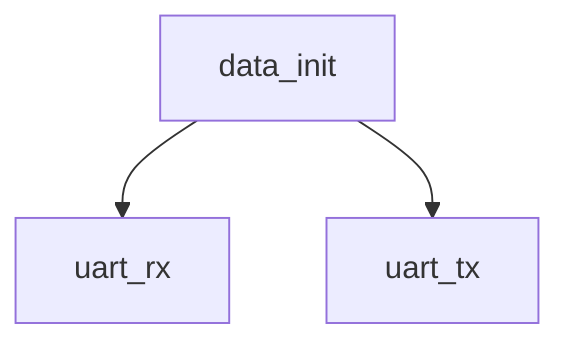

# 模块 `data_init`

- 源文件：`rtl\rtl\memory\data_init.v`
- 职责：**AI 推断**：模块通过 UART 接收配置命令和数据，并驱动指令总线与数据总线，承担初始化接口的角色。
- 说明：切片 2 显示了 `uart_rx` 输入、`uart_tx` 输出以及 `ibus_we`、`ibus_addr_o`、`ibus_data_o`、`dbus_we`、`dbus_addr_o`、`dbus_data_o` 等输出信号，另外还有 `init_sig` 标志。切片 18 表明，在特定状态下，模块会根据接收到的 `number` 字段将 `data`、`addr_i` 等赋值给指令总线与数据总线的地址、数据和写使能，完成将串口数据转换为并行总线访问的初始化任务。

## 1. 层级位置

- Parents：`memory_slot`
- Children：`uart_rx`, `uart_tx`
- Component children：无
- Upstream modules：无
- Downstream modules：无

### 1.1 本模块结构图



```text
data_init
|-- uart_rx
`-- uart_tx
```

## 2. 输入/输出接口摘要

- 接收：其他输入：`clk`, `uart_rx`
- 输出：数据输出：`dbus_addr_o`, `dbus_data_o`, `ibus_addr_o`, `ibus_data_o`；其他输出：`dbus_we`, `ibus_we`, `init_sig`, `uart_tx`

### 2.1 端口分组

| 端口组 | 方向统计 | 代表信号 |
| --- | --- | --- |
| `clock_reset_init` | input:1 | `clk` |
| `other_ports` | input:1, output:8 | `dbus_addr_o`, `dbus_data_o`, `ibus_addr_o`, `ibus_data_o`, `uart_rx`, `dbus_we`, `ibus_we`, `init_sig`, `uart_tx` |

## 3. Drive/Data/Free 契约

| Interface | 方向 | Event | Payload | Free/backpressure |
| --- | --- | --- | --- | --- |
| `data_outputs` | output | - | `dbus_addr_o [31:0]`, `dbus_data_o [63:0]`, `ibus_addr_o [31:0]`, `ibus_data_o [63:0]` | 未记录 |

## 4. 主要 Drive-centered Flow

- **证据不足**：Manual Context 未提供本模块的 drive flow。

## 5. 内部组件与 assign 影响

### 5.1 内部组件

| 实例 | 类型 | 输入事件 | 输出事件 |
| --- | --- | --- | --- |
| - | - | - | Manual Context 未提供 primary internal component |

### 5.2 assign 影响

| Assign | Impact area | LHS | RHS 摘要 | 解释状态 |
| --- | --- | --- | --- | --- |
| `assign_1` | unknown | `ibus_addr_o` | r_ibus_addr_o | 证据不足：No Semantic Layer assignment interpretation is available. |
| `assign_2` | data_path | `ibus_data_o` | {r_ibus_data_o[31:0], r_ibus_data_o[63:32]} | 证据不足：No Semantic Layer assignment interpretation is available. |
| `assign_3` | unknown | `dbus_we` | r_dbus_we | 证据不足：No Semantic Layer assignment interpretation is available. |
| `assign_4` | unknown | `dbus_addr_o` | r_dbus_addr_o | 证据不足：No Semantic Layer assignment interpretation is available. |
| `assign_5` | data_path | `dbus_data_o` | {r_dbus_data_o[31:0], r_dbus_data_o[63:32]} | 证据不足：No Semantic Layer assignment interpretation is available. |
| `assign_7` | unknown | `init_sig` | r_init_1 | 证据不足：No Semantic Layer assignment interpretation is available. |
| `assign_0` | unknown | `ibus_we` | r_ibus_we | 证据不足：No Semantic Layer assignment interpretation is available. |
