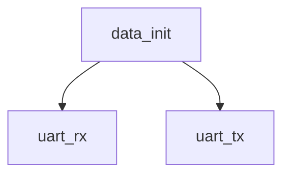

# 模块 `data_init`

- 源文件：`rtl/rtl/memory/data_init.v`。
- 职责：AI 推断：模块通过UART接收数据，驱动指令总线和数据总线，完成初始化写入。。
- 说明：模块输入uart_rx（slice 2 line 21）用于接收外部数据，输出ibus_we、ibus_addr_o、ibus_data_o和dbus_we、dbus_addr_o、dbus_data_o（slice 2 lines 25-30），这些输出由r_ibus_we、r_ibus_addr_o、r_ibus_data_o、r_dbus_we、r_dbus_addr_o、r_dbus_data_o寄存器驱动（slice 4 lines 60-65）。内部实例化uart_rx_inst和uart_tx_inst（slice 1 line 4提到作者，但实例名来自manual context，无需额外源引用）。assign依赖显示d_finish由first、size、number、c_state、WAITSEND、tx_data_ready组合产生（slice 5 line 77，slice 8 lines 213-222），表明存在状态机控制。状态机为独热码，包含IDLE、NUM0等状态（slice 3 lines 39-41，slice 7 lines 106-111）。

## 1. 层级位置

- Parents：`memory_slot`。
- Children：`uart_rx`, `uart_tx`。
- Component children：无。
- Upstream modules：无。
- Downstream modules：无。

### 1.1 本模块结构图



```text
data_init
|-- uart_rx
`-- uart_tx
```

## 2. 输入/输出接口摘要

- 接收：其他输入：`clk`, `uart_rx`。
- 输出：数据输出：`dbus_addr_o`, `dbus_data_o`, `ibus_addr_o`, `ibus_data_o`；其他输出：`dbus_we`, `ibus_we`, `init_sig`, `uart_tx`。

### 2.1 端口分组

| 端口组 | 方向统计 | 代表信号 |
| --- | --- | --- |
| `clock_reset_init` | input:1 | `clk` |
| `other_ports` | input:1, output:8 | `dbus_addr_o`, `dbus_data_o`, `ibus_addr_o`, `ibus_data_o`, `uart_rx`, `dbus_we`, `ibus_we`, `init_sig`, `uart_tx` |

## 3. Drive/Data/Free 契约

| Interface | 方向 | Event | Payload | Free/backpressure |
| --- | --- | --- | --- | --- |
| `data_outputs` | output | - | `dbus_addr_o [31:0]`, `dbus_data_o [63:0]`, `ibus_addr_o [31:0]`, `ibus_data_o [63:0]` | 未记录 |

## 4. 主要 Drive-centered Flow

- 证据不足：Manual Context 未提供本模块 drive flow。

## 5. 内部组件与 assign 影响

### 5.1 内部组件

| 实例 | 类型 | 输入事件 | 输出事件 |
| --- | --- | --- | --- |
| - | - | - | Manual Context 未提供 primary internal component |

### 5.2 assign 影响

| Assign | Impact area | LHS | RHS 摘要 | 解释状态 |
| --- | --- | --- | --- | --- |
| `assign_1` | unknown | `ibus_addr_o` | r_ibus_addr_o | 证据不足：No Semantic Layer assignment interpretation is available. |
| `assign_2` | data_path | `ibus_data_o` | {r_ibus_data_o[31:0], r_ibus_data_o[63:32]} | AI 推断：指令总线数据输出，内部寄存器数据经过32位半字交换后输出 |
| `assign_3` | unknown | `dbus_we` | r_dbus_we | 证据不足：No Semantic Layer assignment interpretation is available. |
| `assign_4` | unknown | `dbus_addr_o` | r_dbus_addr_o | 证据不足：No Semantic Layer assignment interpretation is available. |
| `assign_5` | data_path | `dbus_data_o` | {r_dbus_data_o[31:0], r_dbus_data_o[63:32]} | AI 推断：数据总线数据输出，内部寄存器数据经过32位半字交换后输出 |
| `assign_7` | unknown | `init_sig` | r_init_1 | 证据不足：No Semantic Layer assignment interpretation is available. |
| `assign_8` | data_path | `d_finish` | (first[9:0] == (size-1)) & ( number == 6'h01 ) & c_state == WAITSEND & tx_data_ready | AI 推断：初始化完成标志，由状态机、计数器及UART发送就绪信号共同判定 |
| `assign_0` | unknown | `ibus_we` | r_ibus_we | 证据不足：No Semantic Layer assignment interpretation is available. |
