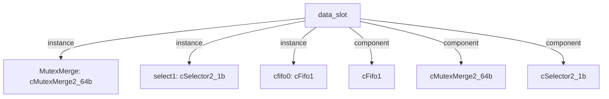

# 模块 `data_slot`

- 源文件：`rtl\rtl\slot\data_slot.v`。
- 职责：AI 推断：数据槽模块，作为CPU、Dcache和Mesh之间的数据通路仲裁与转发中心。
- 说明：模块接收来自CPU、Dcache和Mesh的驱动事件和数据，通过内部组件（cfifo0、MutexMerge、select1）进行仲裁和路由，最终将数据转发到目标端口。事件驱动流和自由信号机制表明其核心功能是协调多个数据源的访问。

## 1. 层级位置

- Parents：`cpu_slot`。
- Children：无。
- Component children：`cFifo1`, `cMutexMerge2_64b`, `cSelector2_1b`。
- Upstream modules：无。
- Downstream modules：无。

### 1.1 本模块结构图



```text
data_slot
|-- MutexMerge: cMutexMerge2_64b
|-- select1: cSelector2_1b
|-- cfifo0: cFifo1
|-- cFifo1
|-- cMutexMerge2_64b
`-- cSelector2_1b
```

## 2. 输入/输出接口摘要

- 接收：drive 输入：`i_driveFromDcache`, `i_driveFromMesh`, `i_drvCpu2Mux`；数据输入：`i_dataCPU2Mux_105`, `i_dataFMesh`, `i_dcache_data`；free 输入：`i_freeFromCpu`, `i_freeFromDcache`, `i_freeFromMesh`。
- 输出：drive 输出：`o_driveToCpu`, `o_driveToDcache`, `o_driveToMesh`；数据输出：`o_data2Mesh`, `o_dcache_addr`, `o_dcache_data`, `o_dcache_we`, `... +1`；free 输出：`o_freeCPUFMux`, `o_freeToDcache`, `o_freeToMesh`。

### 2.1 端口分组

| 端口组 | 方向统计 | 代表信号 |
| --- | --- | --- |
| `drive_event` | input:3, output:3 | `i_driveFromDcache`, `i_driveFromMesh`, `i_drvCpu2Mux`, `o_driveToCpu`, `o_driveToDcache`, `o_driveToMesh` |
| `free_backpressure` | input:3, output:3 | `i_freeFromCpu`, `i_freeFromDcache`, `i_freeFromMesh`, `o_freeCPUFMux`, `o_freeToDcache`, `o_freeToMesh` |
| `other_ports` | input:3, output:5 | `i_dataCPU2Mux_105`, `i_dataFMesh`, `i_dcache_data`, `o_data2Mesh`, `o_dcache_addr`, `o_dcache_data`, `o_dcache_we`, `o_memData_65` |

## 3. Drive/Data/Free 契约

| Interface | 方向 | Event | Payload | Free/backpressure |
| --- | --- | --- | --- | --- |
| `i_driveFromDcache` | input | `i_driveFromDcache` | `i_dcache_data [63:0]` | `o_freeToDcache` |
| `i_driveFromMesh` | input | `i_driveFromMesh` | 未记录 | `o_freeToMesh` |
| `i_drvCpu2Mux` | input | `i_drvCpu2Mux` | `i_dataCPU2Mux_105 [104:0]` | 未记录 |
| `o_driveToCpu` | output | `o_driveToCpu` | 未记录 | `i_freeFromCpu` |
| `o_driveToDcache` | output | `o_driveToDcache` | `o_dcache_addr [31:0]`, `o_dcache_data [63:0]`, `o_dcache_we [7:0]` | `i_freeFromDcache` |
| `o_driveToMesh` | output | `o_driveToMesh` | 未记录 | `i_freeFromMesh` |

## 4. 主要 Drive-centered Flow

### `i_driveFromDcache`

- 确定性事实：`i_driveFromDcache to o_driveToCpu`；flow_id=`flow_001_data_slot_i_driveFromDcache`。
- Payload：`i_driveFromDcache` -> `i_dcache_data [63:0]`。
- 输出/影响：`o_driveToCpu`。
- 结构复杂度：branch=0，join=1，blocking=1。
- AI 推断：手册应重点描述从Dcache到CPU的驱动事件路径，以及MutexMerge处的仲裁行为

### `i_driveFromMesh`

- 确定性事实：`i_driveFromMesh to o_driveToCpu`；flow_id=`flow_002_data_slot_i_driveFromMesh`。
- Payload：未记录。
- 输出/影响：`o_driveToCpu`。
- 结构复杂度：branch=0，join=1，blocking=1。
- AI 推断：手册应重点描述从Mesh到CPU的事件路径，并强调MutexMerge的仲裁行为。

### `i_drvCpu2Mux`

- 确定性事实：`i_drvCpu2Mux to o_driveToDcache, o_driveToMesh`；flow_id=`flow_000_data_slot_i_drvCpu2Mux`。
- Payload：`i_drvCpu2Mux` -> `i_dataCPU2Mux_105 [104:0]`, `o_driveToDcache` -> `o_dcache_addr [31:0]`, `o_driveToDcache` -> `o_dcache_data [63:0]`, `o_driveToDcache` -> `o_dcache_we [7:0]`。
- 输出/影响：`o_driveToDcache`, `o_driveToMesh`。
- 结构复杂度：branch=1，join=0，blocking=1。
- AI 推断：事件i_drvCpu2Mux驱动流经分支后，与Dcache的地址、数据和写使能负载同步输出。


## 5. 内部组件与 assign 影响

### 5.1 内部组件

| 实例 | 类型 | 输入事件 | 输出事件 |
| --- | --- | --- | --- |
| `MutexMerge` | `cMutexMerge2_64b` | `w_delay_driveFromDcache`, `w_delay_driveFromMesh` | `w_driveToCpu` |
| `select1` | `cSelector2_1b` | `w_drvCpu2Mux_delay` | `w_driveToDcache`, `w_driveToMesh` |
| `cfifo0` | `cFifo1` | `i_drvCpu2Mux` | `w_drvCpu2Mux` |

### 5.2 assign 影响

| Assign | Impact area | LHS | RHS 摘要 | 解释状态 |
| --- | --- | --- | --- | --- |
| `assign_1` | data_path | `o_dcache_data` | r_cpu_data | 证据不足：No Semantic Layer assignment interpretation is available. |
| `assign_2` | unknown | `o_dcache_addr` | r_cpu_addr | 证据不足：No Semantic Layer assignment interpretation is available. |
| `assign_4` | data_path | `w_toMesh_1` | i_data_bus_addr >=32'h00001000&&i_data_bus_addr<32'h00001200 | AI 推断：地址解码信号，将CPU访问地址映射到不同的外设或目标 |
| `assign_5` | data_path | `w_toCache_1` | i_data_bus_addr >=32'h00021200 | AI 推断：地址解码信号，将CPU访问地址映射到不同的外设或目标 |
| `assign_6` | data_path | `w_toUART0_1` | i_data_bus_addr >= 32'h00001000 && i_data_bus_addr <= 32'h0000100F | AI 推断：地址解码信号，将CPU访问地址映射到不同的外设或目标 |
| `assign_7` | data_path | `w_toUART1_1` | i_data_bus_addr >= 32'h00001010 && i_data_bus_addr <= 32'h0000101F | AI 推断：地址解码信号，将CPU访问地址映射到不同的外设或目标 |
| `assign_8` | data_path | `w_toPWM0_1` | i_data_bus_addr >= 32'h00001020 && i_data_bus_addr <= 32'h0000102F | AI 推断：地址解码信号，将CPU访问地址映射到不同的外设或目标 |
| `assign_9` | data_path | `w_toPWM1_1` | i_data_bus_addr >= 32'h00001030 && i_data_bus_addr <= 32'h0000103F | AI 推断：地址解码信号，将CPU访问地址映射到不同的外设或目标 |
| `assign_10` | data_path | `w_toIIC_1` | i_data_bus_addr >= 32'h00001040 && i_data_bus_addr <= 32'h0000104F | AI 推断：地址解码信号，将CPU访问地址映射到不同的外设或目标 |
| `assign_11` | data_path | `w_toTIMER_1` | i_data_bus_addr >= 32'h00001050 && i_data_bus_addr <= 32'h0000105F | AI 推断：地址解码信号，将CPU访问地址映射到不同的外设或目标 |
| `assign_12` | data_path | `w_toSPI0_1` | i_data_bus_addr >= 32'h00001060 && i_data_bus_addr <= 32'h0000106F | AI 推断：地址解码信号，将CPU访问地址映射到不同的外设或目标 |
| `assign_13` | data_path | `w_toSPI1_1` | i_data_bus_addr >= 32'h00001070 && i_data_bus_addr <= 32'h0000107F | AI 推断：地址解码信号，将CPU访问地址映射到不同的外设或目标 |
| ... | ... | ... | ... | 其余 3 条 assign 省略 |
