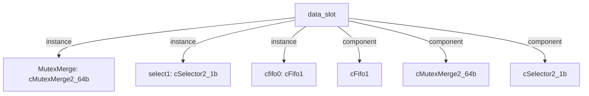

# 模块 `data_slot`

- 源文件：`rtl\rtl\slot\data_slot.v`
- 职责：AI 推断：RTL 明确展示了从 Dcache 到 CPU 的事件路径，包括初始 8 周期延迟、MutexMerge 仲裁以及后续 8 周期延迟，与语义描述相符。具体说明：`i_driveFromDcache` 经过 `delay8U` 得到 `w_delay_driveFromDcache`，然后进入 `cMutexMerge2_64b` 的 `.i_drive1` 和 `.i_data1_64`。MutexMerge 输出 `w_driveToCpu` 再经过两级 `delay4U` 最终到达 `o_driveToCpu`，总延迟为 8+4+4=16 个周期。事件合并与延迟完全匹配语义流描述。

## 1. 层级位置

- Parents：`cpu_slot`
- Children：无
- Component children：`cFifo1`, `cMutexMerge2_64b`, `cSelector2_1b`
- Upstream modules：无
- Downstream modules：无

### 1.1 本模块结构图



```text
data_slot
|-- MutexMerge: cMutexMerge2_64b
|-- select1: cSelector2_1b
|-- cfifo0: cFifo1
|-- cFifo1
|-- cMutexMerge2_64b
`-- cSelector2_1b
```

## 2. 输入/输出接口摘要

- 接收：drive 输入：`i_driveFromDcache`, `i_driveFromMesh`, `i_drvCpu2Mux`；数据输入：`i_dataCPU2Mux_105`, `i_dataFMesh`, `i_dcache_data`；free 输入：`i_freeFromCpu`, `i_freeFromDcache`, `i_freeFromMesh`
- 输出：drive 输出：`o_driveToCpu`, `o_driveToDcache`, `o_driveToMesh`；数据输出：`o_data2Mesh`, `o_dcache_addr`, `o_dcache_data`, `o_dcache_we`, `o_memData_65`；free 输出：`o_freeCPUFMux`, `o_freeToDcache`, `o_freeToMesh`

### 2.1 端口分组

| 端口组 | 方向统计 | 代表信号 |
| --- | --- | --- |
| `drive_event` | input:3, output:3 | `i_driveFromDcache`, `i_driveFromMesh`, `i_drvCpu2Mux`, `o_driveToCpu`, `o_driveToDcache`, `o_driveToMesh` |
| `free_backpressure` | input:3, output:3 | `i_freeFromCpu`, `i_freeFromDcache`, `i_freeFromMesh`, `o_freeCPUFMux`, `o_freeToDcache`, `o_freeToMesh` |
| `other_ports` | input:3, output:5 | `i_dataCPU2Mux_105`, `i_dataFMesh`, `i_dcache_data`, `o_data2Mesh`, `o_dcache_addr`, `o_dcache_data`, `o_dcache_we`, `o_memData_65` |

## 3. Drive/Data/Free 契约

| Interface | 方向 | Event | Payload | Free/backpressure |
| --- | --- | --- | --- | --- |
| `i_driveFromDcache` | input | `i_driveFromDcache` | `i_dcache_data [63:0]` | `o_freeToDcache` |
| `i_driveFromMesh` | input | `i_driveFromMesh` | 未记录 | `o_freeToMesh` |
| `i_drvCpu2Mux` | input | `i_drvCpu2Mux` | `i_dataCPU2Mux_105 [104:0]` | 未记录 |
| `o_driveToCpu` | output | `o_driveToCpu` | 未记录 | `i_freeFromCpu` |
| `o_driveToDcache` | output | `o_driveToDcache` | `o_dcache_addr [31:0]`, `o_dcache_data [63:0]`, `o_dcache_we [7:0]` | `i_freeFromDcache` |
| `o_driveToMesh` | output | `o_driveToMesh` | 未记录 | `i_freeFromMesh` |

## 4. 主要 Drive-centered Flow

### `i_driveFromDcache`

- 确定性事实：`i_driveFromDcache` → `o_driveToCpu`；flow_id=`flow_001_data_slot_i_driveFromDcache`
- Payload：`i_driveFromDcache` → `i_dcache_data [63:0]`
- 输出/影响：`o_driveToCpu`
- 结构复杂度：branch=0，join=1，blocking=1
- AI 推断：重点在于从 Dcache 到 CPU 的事件路径包含 8 周期延迟和 MutexMerge 仲裁；除非有 RTL 额外证据，否则不深入仲裁细节或 payload 传递。

### `i_driveFromMesh`

- 确定性事实：`i_driveFromMesh` → `o_driveToCpu`；flow_id=`flow_002_data_slot_i_driveFromMesh`
- Payload：未记录
- 输出/影响：`o_driveToCpu`
- 结构复杂度：branch=0，join=1，blocking=1
- AI 推断：文档需突出事件延迟合计、MutexMerge 仲裁语义以及 free 握手协议，弱化数据路径的细节。

### `i_drvCpu2Mux`

- 确定性事实：`i_drvCpu2Mux` → `o_driveToDcache`, `o_driveToMesh`；flow_id=`flow_000_data_slot_i_drvCpu2Mux`
- Payload：`i_drvCpu2Mux` → `i_dataCPU2Mux_105 [104:0]`；`o_driveToDcache` → `o_dcache_addr [31:0]`, `o_dcache_data [63:0]`, `o_dcache_we [7:0]`
- 输出/影响：`o_driveToDcache`, `o_driveToMesh`
- 结构复杂度：branch=1，join=0，blocking=1
- AI 推断：输入负载 `i_dataCPU2Mux_105` 可能包含地址、数据与控制位，这些信息通过寄存器间接绑定到 dcache 的输出有效负载，事件流仅提供时序合法性。

## 5. 内部组件与 assign 影响

### 5.1 内部组件

| 实例 | 类型 | 输入事件 | 输出事件 |
| --- | --- | --- | --- |
| `MutexMerge` | `cMutexMerge2_64b` | `w_delay_driveFromDcache`, `w_delay_driveFromMesh` | `w_driveToCpu` |
| `select1` | `cSelector2_1b` | `w_drvCpu2Mux_delay` | `w_driveToDcache`, `w_driveToMesh` |
| `cfifo0` | `cFifo1` | `i_drvCpu2Mux` | `w_drvCpu2Mux` |

### 5.2 assign 影响

| Assign | Impact area | LHS | RHS 摘要 | 解释状态 |
| --- | --- | --- | --- | --- |
| `assign_1` | data_path | `o_dcache_data` | r_cpu_data | 证据不足：No Semantic Layer assignment interpretation is available. |
| `assign_2` | unknown | `o_dcache_addr` | r_cpu_addr | 证据不足：No Semantic Layer assignment interpretation is available. |
| `assign_22` | data_path | `o_data2Mesh` | data_pre_51 | 证据不足：No Semantic Layer assignment interpretation is available. |
| `assign_23` | data_path | `w_dataFromMesh_64` | {r_data0,i_dataFMesh[41:10]} | 证据不足：No Semantic Layer assignment interpretation is available. |
| `assign_24` | data_path | `o_memData_65` | {w_memData_64,r_carry} | 证据不足：No Semantic Layer assignment interpretation is available. |
| `assign_0` | control_path | `o_dcache_we` | r_cpuWen_8 | 证据不足：No Semantic Layer assignment interpretation is available. |
