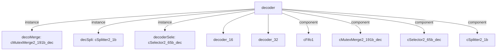

# 模块 `decoder`

- 源文件：`rtl/rtl/Decode/decoder.v`。
- 职责：AI 推断：指令解码与分发核心模块，负责将取指阶段传入的PC和指令数据解码为控制信号，并分发至发射和异常处理阶段。。
- 说明：模块接收来自IF阶段的驱动事件和PC+指令数据，通过内部选择器（decoderSele）根据指令宽度（16位或32位）分流至对应的解码器（decoder16/decoder32），解码结果经互斥合并器（decoMerge）汇总后，输出解码数据、分支立即数、写使能等信号，并产生驱动事件至发射（Launch）和异常（Exc）阶段。同时处理来自下游的释放信号以控制流控。

## 1. 层级位置

- Parents：`cpu_top_all`。
- Children：`decoder_16`, `decoder_32`。
- Component children：`cFifo1`, `cMutexMerge2_191b_dec`, `cSelector2_65b_dec`, `cSplitter2_1b`。
- Upstream modules：无。
- Downstream modules：无。

### 1.1 本模块结构图



```text
decoder
|-- decoMerge: cMutexMerge2_191b_dec
|-- decSpli: cSplitter2_1b
|-- decoderSele: cSelector2_65b_dec
|-- decoder_16
|-- decoder_32
|-- cFifo1
|-- cMutexMerge2_191b_dec
|-- cSelector2_65b_dec
`-- cSplitter2_1b
```

## 2. 输入/输出接口摘要

- 接收：drive 输入：`i_driveFromIF`；数据输入：`i_pcAndIns_64`；free 输入：`i_freeFromExc_1`, `i_freeFromLaunch_1`；其他输入：`i_is16_1`, `i_isInInt`。
- 输出：drive 输出：`o_driveToExc_1`, `o_driveToLaunch_1`；数据输出：`o_blImm9_9`, `o_decPCAndNum_36`, `o_decoderData_187`；控制输出：`o_nzcvWen_4`, `o_wen_2`；free 输出：`o_freeToIF`。

### 2.1 端口分组

| 端口组 | 方向统计 | 代表信号 |
| --- | --- | --- |
| `drive_event` | input:1, output:2 | `i_driveFromIF`, `o_driveToExc_1`, `o_driveToLaunch_1` |
| `free_backpressure` | input:2, output:1 | `i_freeFromExc_1`, `i_freeFromLaunch_1`, `o_freeToIF` |
| `other_ports` | input:3, output:5 | `i_pcAndIns_64`, `o_blImm9_9`, `o_decPCAndNum_36`, `o_decoderData_187`, `o_nzcvWen_4`, `o_wen_2`, `i_is16_1`, `i_isInInt` |

## 3. Drive/Data/Free 契约

| Interface | 方向 | Event | Payload | Free/backpressure |
| --- | --- | --- | --- | --- |
| `i_driveFromIF` | input | `i_driveFromIF` | `i_pcAndIns_64 [ 63:0]` | `o_freeToIF` |
| `o_driveToExc_1` | output | `o_driveToExc_1` | 未记录 | `i_freeFromExc_1` |
| `o_driveToLaunch_1` | output | `o_driveToLaunch_1` | 未记录 | `i_freeFromLaunch_1` |

## 4. 主要 Drive-centered Flow

### `i_driveFromIF`

- 确定性事实：`decoder flow from i_driveFromIF`；flow_id=`flow_000_decoder_i_driveFromIF`。
- Payload：`i_driveFromIF` -> `i_pcAndIns_64 [ 63:0]`。
- 输出/影响：证据不足：Knowledge IR did not find a module output endpoint for this flow.。
- 结构复杂度：branch=1，join=1，blocking=1。
- AI 推断：指令数据作为共享载荷，同时提供给选择器和两个解码器，用于解码操作。


## 5. 内部组件与 assign 影响

### 5.1 内部组件

| 实例 | 类型 | 输入事件 | 输出事件 |
| --- | --- | --- | --- |
| `decoMerge` | `cMutexMerge2_191b_dec` | 无 | 无 |
| `decSpli` | `cSplitter2_1b` | 无 | `o_driveToExc_1`, `o_driveToLaunch_1` |
| `decoderSele` | `cSelector2_65b_dec` | `i_driveFromIF` | 无 |

### 5.2 assign 影响

| Assign | Impact area | LHS | RHS 摘要 | 解释状态 |
| --- | --- | --- | --- | --- |
| `assign_2` | data_path | `o_decoderData_187` | {1'b0, w_decoderData1_191[186:2], w_is16_1} | AI 推断：从合并后的解码数据中提取并组装最终解码输出，包含指令类型、操作数等关键信息。 |
| `assign_3` | control_path | `o_wen_2` | w_decoderData1_191[1:0] | AI 推断：从解码数据中提取写使能信号，控制寄存器写操作。 |
| `assign_4` | unknown | `o_blImm9_9` | r_blImm9_9 | 证据不足：No Semantic Layer assignment interpretation is available. |
| `assign_5` | control_path | `o_nzcvWen_4` | r_nzcvWen_4 | 证据不足：No Semantic Layer assignment interpretation is available. |
| `assign_6` | data_path | `o_decPCAndNum_36` | {w_decoderData1_191[136:105],w_decoderData1_191[190:187]} | AI 推断：从解码数据中提取PC值和指令编号，用于异常处理和调试。 |
