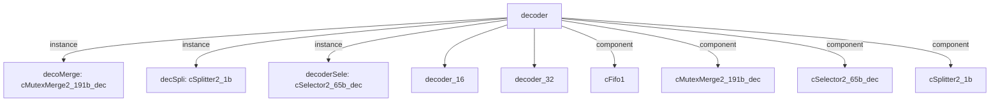

# 模块 `decoder`

- 源文件：`rtl\rtl\Decode\decoder.v`。
- 职责（AI 推断）：模块通过选择器根据 `i_is16_1` 将输入驱动路由至对应的译码器（16 位或 32 位）；译码后的驱动经过合并与延迟链路后，由分离器产生 `o_driveToLaunch_1` 和 `o_driveToExc_1`，同时提取译码数据。
- 数据流说明：切片显示 `i_driveFromIF` 连接至 `decoderSele.i_drive`（line 61）；`decoderSele` 依据 `{i_is16_1, ...}` 选择驱动到 `decoder_16` 或 `decoder_32`（lines 60‑64）；两个译码器的驱动完成信号分别接至 `decoMerge.i_drive0` 和 `.i_drive1`（lines 77‑83, 86‑90, 99‑104）；`decoMerge` 的输出驱动 `decoDriToDecSpli_1`（line 102），经 delay 与 `cFifo1`（lines 112‑115）到达 `decSpli.i_drive`（line 146）；`decSpli` 最终生成 `o_driveToLaunch_1` 与 `o_driveToExc_1`（lines 145‑150）。数据通路与驱动路由与声明一致。

## 1. 层级位置

- Parents：`cpu_top_all`。
- Children：`decoder_16`, `decoder_32`。
- Component children：`cFifo1`, `cMutexMerge2_191b_dec`, `cSelector2_65b_dec`, `cSplitter2_1b`。
- Upstream modules：无。
- Downstream modules：无。

### 1.1 本模块结构图



```text
decoder
|-- decoMerge: cMutexMerge2_191b_dec
|-- decSpli: cSplitter2_1b
|-- decoderSele: cSelector2_65b_dec
|-- decoder_16
|-- decoder_32
|-- cFifo1
|-- cMutexMerge2_191b_dec
|-- cSelector2_65b_dec
`-- cSplitter2_1b
```

## 2. 输入/输出接口摘要

- 接收：drive 输入 `i_driveFromIF`；数据输入 `i_pcAndIns_64`；free 输入 `i_freeFromExc_1`、`i_freeFromLaunch_1`；其他输入 `i_is16_1`、`i_isInInt`。
- 输出：drive 输出 `o_driveToExc_1`、`o_driveToLaunch_1`；数据输出 `o_blImm9_9`、`o_decPCAndNum_36`、`o_decoderData_187`；控制输出 `o_nzcvWen_4`、`o_wen_2`；free 输出 `o_freeToIF`。

### 2.1 端口分组

| 端口组 | 方向统计 | 代表信号 |
| --- | --- | --- |
| `drive_event` | input:1, output:2 | `i_driveFromIF`, `o_driveToExc_1`, `o_driveToLaunch_1` |
| `free_backpressure` | input:2, output:1 | `i_freeFromExc_1`, `i_freeFromLaunch_1`, `o_freeToIF` |
| `other_ports` | input:3, output:5 | `i_pcAndIns_64`, `o_blImm9_9`, `o_decPCAndNum_36`, `o_decoderData_187`, `o_nzcvWen_4`, `o_wen_2`, `i_is16_1`, `i_isInInt` |

## 3. Drive/Data/Free 契约

| Interface | 方向 | Event | Payload | Free/backpressure |
| --- | --- | --- | --- | --- |
| `i_driveFromIF` | input | `i_driveFromIF` | `i_pcAndIns_64 [63:0]` | `o_freeToIF` |
| `o_driveToExc_1` | output | `o_driveToExc_1` | 未记录 | `i_freeFromExc_1` |
| `o_driveToLaunch_1` | output | `o_driveToLaunch_1` | 未记录 | `i_freeFromLaunch_1` |

## 4. 主要 Drive-centered Flow

### `i_driveFromIF`

- Flow 名称：`decoder flow from i_driveFromIF`（ID: `flow_000_decoder_i_driveFromIF`）。
- Payload：`i_driveFromIF` → `i_pcAndIns_64 [63:0]`。
- 输出/影响：证据不足：Knowledge IR did not find a module output endpoint for this flow.
- 结构复杂度：branch=1，join=1，blocking=1。
- AI 推断：手册应强调由 selector 驱动的并行解码架构，并明确指出当前知识未能覆盖合并后的驱动去向，不可臆造下游端点。

## 5. 内部组件与 assign 影响

### 5.1 内部组件

| 实例 | 类型 | 输入事件 | 输出事件 |
| --- | --- | --- | --- |
| `decoMerge` | `cMutexMerge2_191b_dec` | 无 | 无 |
| `decSpli` | `cSplitter2_1b` | 无 | `o_driveToExc_1`, `o_driveToLaunch_1` |
| `decoderSele` | `cSelector2_65b_dec` | `i_driveFromIF` | 无 |

### 5.2 assign 影响

| Assign | Impact area | LHS | RHS 摘要 | 解释状态 |
| --- | --- | --- | --- | --- |
| `assign_2` | data_path | `o_decoderData_187` | {1'b0, w_decoderData1_191[186:2], w_is16_1} | AI 推断：将内部宽译码数据重组为187位输出，末位插入 w_is16_1 标识指令集。 |
| `assign_3` | control_path | `o_wen_2` | w_decoderData1_191[1:0] | 证据不足：No Semantic Layer assignment interpretation is available. |
| `assign_4` | unknown | `o_blImm9_9` | r_blImm9_9 | 证据不足：No Semantic Layer assignment interpretation is available. |
| `assign_5` | control_path | `o_nzcvWen_4` | r_nzcvWen_4 | 证据不足：No Semantic Layer assignment interpretation is available. |
| `assign_6` | data_path | `o_decPCAndNum_36` | {w_decoderData1_191[136:105],w_decoderData1_191[190:187]} | AI 推断：从译码数据中提取 PC 相关字段和立即数，组成36位计算用值。 |
