# 模块 `fetch`

- 源文件：`rtl/rtl/IF/fetch.v`。
- 职责：AI 推断：取指模块，负责接收来自ICache、Top和Dispatch的驱动事件，经过内部流水线处理后，向译码、异常、中断和ICache输出驱动事件。。
- 说明：模块有三个输入驱动事件（i_drvFICache、i_drvFTop、i_drvFdispatch），分别对应ICache、顶层和Dispatch的请求。内部通过大量Fifo、MutexMerge、SelSplit等组件进行事件路由、合并和拆分，最终输出五个驱动事件（o_drv2Dec、o_drv2Excp、o_drv2Excp_2、o_drv2ICache、o_drv2Int），分别指向译码、异常、ICache和中断。同时，模块处理指令数据（i_inst_64）和PC值（i_pcFTop_32、i_pcFdispatch_32），输出取指地址（o_fetchAddr_32）和指令+PC组合（o_instAndPC_66）。

## 1. 层级位置

- Parents：`cpu_top_all`。
- Children：`instSplit`。
- Component children：`cArbMerge2_105b_cpu`, `cFifo1`, `cFifo1_32b_fetch`, `cFifo3_fetch`, `cMutexMerge2_32b_launch`, `cMutexMerge2_66b_fetch`, `cMutexMerge3_32b_fetch`, `cMutexMerge3_32b_launch`, `cPmtFifo1`, `cSelector2_1b`, `cSelector2_33b_fetch`, `cSelector2_66b_fetch`, `cSplitter2_1b_fetch`, `cSplitter2_65b_fetch`。
- Upstream modules：无。
- Downstream modules：无。

### 1.1 本模块结构图

```mermaid
flowchart TB
  fetch["fetch"] -->|instance| merge0_cMutexMerge2_32b_launch["merge0: cMutexMerge2_32b_launch"]
  fetch["fetch"] -->|instance| merge1_cMutexMerge3_32b_launch["merge1: cMutexMerge3_32b_launch"]
  fetch["fetch"] -->|instance| merge2_cMutexMerge2_66b_fetch["merge2: cMutexMerge2_66b_fetch"]
  fetch["fetch"] -->|instance| mergeErr_cMutexMerge3_32b_fetch["mergeErr: cMutexMerge3_32b_fetch"]
  fetch["fetch"] -->|instance| mergeInt_cArbMerge2_105b_cpu["mergeInt: cArbMerge2_105b_cpu"]
  fetch["fetch"] -->|instance| select0_cSelector2_33b_fetch["select0: cSelector2_33b_fetch"]
  fetch["fetch"] -->|instance| select1_cSelector2_66b_fetch["select1: cSelector2_66b_fetch"]
  fetch["fetch"] -->|instance| select2_cSelector2_1b["select2: cSelector2_1b"]
  fetch["fetch"] -->|instance| select3_cSelector2_1b["select3: cSelector2_1b"]
  fetch["fetch"] -->|instance| select4_cSelector2_1b["select4: cSelector2_1b"]
  fetch["fetch"] -->|instance| select5_cSelector2_1b["select5: cSelector2_1b"]
  fetch["fetch"] -->|instance| spliter0_cSplitter2_65b_fetch["spliter0: cSplitter2_65b_fetch"]
  fetch["fetch"] -->|instance| spliter1_cSplitter2_1b_fetch["spliter1: cSplitter2_1b_fetch"]
  fetch["fetch"] -->|instance| spliter2_cSplitter2_1b_fetch["spliter2: cSplitter2_1b_fetch"]
  fetch["fetch"] -->|instance| spliter4_cSplitter2_1b_fetch["spliter4: cSplitter2_1b_fetch"]
  fetch["fetch"] -->|instance| spliter5_cSplitter2_65b_fetch["spliter5: cSplitter2_65b_fetch"]
  fetch["fetch"] -->|instance| spliter_err_2_cSplitter2_1b_fetch["spliter_err_2: cSplitter2_1b_fetch"]
  fetch["fetch"] -->|instance| cfifo0_cFifo3_fetch["cfifo0: cFifo3_fetch"]
  fetch["fetch"] -->|instance| cfifo0_save_cFifo1["cfifo0_save: cFifo1"]
  fetch["fetch"] -->|instance| cfifo1_cFifo3_fetch["cfifo1: cFifo3_fetch"]
  fetch["fetch"] --> instSplit["instSplit"]
  fetch["fetch"] -->|component| cArbMerge2_105b_cpu["cArbMerge2_105b_cpu"]
  fetch["fetch"] -->|component| cFifo1["cFifo1"]
  fetch["fetch"] -->|component| cFifo1_32b_fetch["cFifo1_32b_fetch"]
```



```text
fetch
|-- merge0: cMutexMerge2_32b_launch
|-- merge1: cMutexMerge3_32b_launch
|-- merge2: cMutexMerge2_66b_fetch
|-- mergeErr: cMutexMerge3_32b_fetch
|-- mergeInt: cArbMerge2_105b_cpu
|-- select0: cSelector2_33b_fetch
|-- select1: cSelector2_66b_fetch
|-- select2: cSelector2_1b
|-- select3: cSelector2_1b
|-- select4: cSelector2_1b
|-- select5: cSelector2_1b
|-- spliter0: cSplitter2_65b_fetch
|-- spliter1: cSplitter2_1b_fetch
|-- spliter2: cSplitter2_1b_fetch
|-- spliter4: cSplitter2_1b_fetch
|-- spliter5: cSplitter2_65b_fetch
|-- spliter_err_2: cSplitter2_1b_fetch
|-- cfifo0: cFifo3_fetch
|-- cfifo0_save: cFifo1
|-- cfifo1: cFifo3_fetch
|-- instSplit
|-- cArbMerge2_105b_cpu
|-- cFifo1
`-- cFifo1_32b_fetch
```
- 图中仅展示前 24 个结构节点，其余 11 个节点见层级字段或组件表。

## 2. 输入/输出接口摘要

- 接收：drive 输入：`i_drvFICache`, `i_drvFTop`, `i_drvFdispatch`；数据输入：`i_inst_64`, `i_interrupt`, `i_pcFTop_32`, `i_pcFdispatch_32`；free 输入：`i_freeFDec`, `i_freeFExcp`, `i_freeFExcp_2`, `i_freeFICache`, `... +1`；其他输入：`i_isInInt`。
- 输出：drive 输出：`o_drv2Dec`, `o_drv2Excp`, `o_drv2Excp_2`, `o_drv2ICache`, `... +1`；数据输出：`o_InterruptF_6`, `o_exceptionF_2_4`, `o_exceptionF_4`, `o_fetchAddr_32`, `... +1`；free 输出：`o_free2ICache`, `o_free2Top`, `o_free2dispatch`。

### 2.1 端口分组

| 端口组 | 方向统计 | 代表信号 |
| --- | --- | --- |
| `drive_event` | input:3, output:5 | `i_drvFICache`, `i_drvFTop`, `i_drvFdispatch`, `o_drv2Dec`, `o_drv2Excp`, `o_drv2Excp_2`, `o_drv2ICache`, `o_drv2Int` |
| `free_backpressure` | input:5, output:3 | `i_freeFDec`, `i_freeFExcp`, `i_freeFExcp_2`, `i_freeFICache`, `i_freeFInt`, `o_free2ICache`, `o_free2Top`, `o_free2dispatch` |
| `other_ports` | input:5, output:5 | `i_inst_64`, `i_interrupt`, `i_pcFTop_32`, `i_pcFdispatch_32`, `o_InterruptF_6`, `o_exceptionF_2_4`, `o_exceptionF_4`, `o_fetchAddr_32`, `o_instAndPC_66`, `i_isInInt` |

## 3. Drive/Data/Free 契约

| Interface | 方向 | Event | Payload | Free/backpressure |
| --- | --- | --- | --- | --- |
| `i_drvFICache` | input | `i_drvFICache` | 未记录 | 未记录 |
| `i_drvFTop` | input | `i_drvFTop` | `i_pcFTop_32 [31:0]` | 未记录 |
| `i_drvFdispatch` | input | `i_drvFdispatch` | `i_pcFdispatch_32 [31:0]` | 未记录 |
| `o_drv2Dec` | output | `o_drv2Dec` | 未记录 | 未记录 |
| `o_drv2Excp` | output | `o_drv2Excp` | 未记录 | 未记录 |
| `o_drv2Excp_2` | output | `o_drv2Excp_2` | 未记录 | 未记录 |
| `o_drv2ICache` | output | `o_drv2ICache` | 未记录 | 未记录 |
| `o_drv2Int` | output | `o_drv2Int` | 未记录 | 未记录 |

## 4. 主要 Drive-centered Flow

### `i_drvFICache`

- 确定性事实：`i_drvFICache to o_drv2Excp, o_drv2Dec, o_drv2Excp_2`；flow_id=`flow_001_fetch_i_drvFICache`。
- Payload：未记录。
- 输出/影响：`o_drv2Excp`, `o_drv2Dec`, `o_drv2Excp_2`, `o_drv2ICache`。
- 结构复杂度：branch=5，join=3，blocking=12。
- AI 推断：输入事件通过选择、拆分和合并机制，根据控制信号分发到四个输出端点。

### `i_drvFTop`

- 确定性事实：`i_drvFTop to o_drv2Int, o_drv2ICache`；flow_id=`flow_002_fetch_i_drvFTop`。
- Payload：`i_drvFTop` -> `i_pcFTop_32 [31:0]`。
- 输出/影响：`o_drv2Int`, `o_drv2ICache`。
- 结构复杂度：branch=2，join=2，blocking=7。
- AI 推断：最终手册应重点描述 spliter5 和 select5 的分叉逻辑，以及 mergeInt 和 merge1 的合并/仲裁逻辑。

### `i_drvFdispatch`

- 确定性事实：`i_drvFdispatch to o_drv2Int, o_drv2Excp, o_drv2Dec`；flow_id=`flow_000_fetch_i_drvFdispatch`。
- Payload：`i_drvFdispatch` -> `i_pcFdispatch_32 [31:0]`。
- 输出/影响：`o_drv2Int`, `o_drv2Excp`, `o_drv2Dec`, `o_drv2Excp_2`, `o_drv2ICache`。
- 结构复杂度：branch=8，join=5，blocking=15。
- AI 推断：输入事件 i_drvFdispatch 携带一个 32 位的 PC 值，该值直接连接到 merge0 的数据输入。


## 5. 内部组件与 assign 影响

### 5.1 内部组件

| 实例 | 类型 | 输入事件 | 输出事件 |
| --- | --- | --- | --- |
| `merge0` | `cMutexMerge2_32b_launch` | `w_drv2merge0`, `w_drvSplit02Merge0` | `w_drvMerge02Merge1` |
| `merge1` | `cMutexMerge3_32b_launch` | `w_drvCfifo92merge1`, `w_drvMerge02Merge1`, `w_drvfifo32merge1` | `w_drvMerge12cfifo8` |
| `merge2` | `cMutexMerge2_66b_fetch` | `w_drv2merge2`, `w_drvcfifo52merge2` | `w_drvMerge22Merge3` |
| `mergeErr` | `cMutexMerge3_32b_fetch` | `w_drvDisp2Err`, `w_drvSpliter42Excp` | `o_drv2Excp` |
| `mergeInt` | `cArbMerge2_105b_cpu` | `w_drv2MergeInt`, `w_spliter2Drv2MergeInt` | `o_drv2Int` |
| `select0` | `cSelector2_33b_fetch` | `w_drvSpliter22Select0` | `w_drvDisp2Err`, `w_drvDisp2cfifo0` |
| `select1` | `cSelector2_66b_fetch` | `w_drv2select1_dalay2` | `w_drv2fifo11`, `w_drv2split0` |
| `select2` | `cSelector2_1b` | `w_drv2select2` | `w_drv2Spliter4`, `w_drvselect22cfifo2` |
| `select3` | `cSelector2_1b` | `w_drv2select3` | `w_drvselect32cfifo4`, `w_drvselect32mcfifo5` |
| `select4` | `cSelector2_1b` | `w_drv2select4` | `w_drv2spliter1`, `w_drvselect42cfifo9` |
| `select5` | `cSelector2_1b` | `w_drvCfifo82Select5` | `w_drv2ICache`, `w_drvSelect52Merge3` |
| `spliter0` | `cSplitter2_65b_fetch` | `w_drv2split0` | `w_drv2merge2`, `w_drv2select2` |
| ... | ... | ... | ... | 其余 8 个组件省略 |

### 5.2 assign 影响

| Assign | Impact area | LHS | RHS 摘要 | 解释状态 |
| --- | --- | --- | --- | --- |
| `assign_1` | unknown | `o_exceptionF_4` | (r_PCErr) ? `FetchErrCode : 4'b1111 | AI 推断：异常代码输出，当PC错误时输出FetchErrCode，否则输出4'b1111。 |
| `assign_2` | unknown | `o_exceptionF_2_4` | (i_isInInt & o_instAndPC_66[32]==1'b0 & w_bx & w_bxCount_10 == 10'b0) ? `FetchErrCode_2 : 4'b... | AI 推断：第二异常代码输出，在中断处理且指令未完成时，根据w_bx和w_bxCount_10条件输出FetchErrCode_2。 |
| `assign_4` | unknown | `o_InterruptF_6` | r_InterruptF_6 | 证据不足：No Semantic Layer assignment interpretation is available. |
| `assign_5` | data_path | `o_fetchAddr_32` | r_fetchAddr | 证据不足：No Semantic Layer assignment interpretation is available. |
| `assign_6` | unknown | `o_instAndPC_66` | r_instAndPC_66 | 证据不足：No Semantic Layer assignment interpretation is available. |
| `assign_7` | data_path | `w_instAndPC_66` | (r_curNum==1) ? {r_PCErr,w_inst0PC_32,w_inst0_33} : (r_curNum==2) ? {r_PCErr,w_inst1PC_32,w_i... | AI 推断：指令与PC组合信号，根据当前指令数量（r_curNum）选择对应的指令和PC数据。 |
