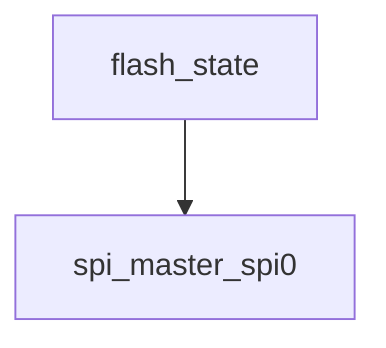

# 模块 `flash_state`

- 源文件：`rtl/rtl/IONet/SPI/SPI0/flash_state.v`。
- 职责：AI 推断：flash_state 是 SPI 闪存协议的状态控制器，负责管理 SPI 主设备与外部闪存之间的读写操作序列。。
- 说明：该模块通过实例化 spi_master_spi0 并驱动其控制信号（如 w_spi_en、w_spi_cs_n）来发起 SPI 事务。其内部状态机（由 r_state 信号指示）决定了何时启动读（READ）或页编程（PAGE_PRO）操作，并基于 i_startRead 和 r_start_spi 等信号生成 SPI 使能信号。输出 o_finish 直接关联到 SPI 片选信号 w_spi_cs_n，表明事务完成。

## 1. 层级位置

- Parents：`SPI02NoC`。
- Children：`spi_master_spi0`。
- Component children：无。
- Upstream modules：无。
- Downstream modules：无。

### 1.1 本模块结构图



```text
flash_state
`-- spi_master_spi0
```

## 2. 输入/输出接口摘要

- 接收：数据输入：`i_ctl`, `i_data2spi`；控制输入：`i_readflag`；其他输入：`clk`, `i_miso`, `i_startRead`, `i_w_en`, `... +1`。
- 输出：数据输出：`o_dataFspi`；其他输出：`o_RXNE`, `o_TXE`, `o_busy`, `o_cs_n`, `... +3`。

### 2.1 端口分组

| 端口组 | 方向统计 | 代表信号 |
| --- | --- | --- |
| `clock_reset_init` | input:2, output:1 | `clk`, `rst_n`, `o_sclk` |
| `other_ports` | input:6, output:7 | `i_ctl`, `i_data2spi`, `o_dataFspi`, `i_readflag`, `i_miso`, `i_startRead`, `i_w_en`, `o_RXNE`, `o_TXE`, `o_busy`, `... +3` |

## 3. Drive/Data/Free 契约

| Interface | 方向 | Event | Payload | Free/backpressure |
| --- | --- | --- | --- | --- |
| `data_inputs` | input | - | `i_ctl [7:0]`, `i_data2spi [31:0]` | 未记录 |
| `data_outputs` | output | - | `o_dataFspi [31:0]` | 未记录 |
| `control_inputs` | input | - | 未记录 | 未记录 |

## 4. 主要 Drive-centered Flow

- 证据不足：Manual Context 未提供本模块 drive flow。

## 5. 内部组件与 assign 影响

### 5.1 内部组件

| 实例 | 类型 | 输入事件 | 输出事件 |
| --- | --- | --- | --- |
| - | - | - | Manual Context 未提供 primary internal component |

### 5.2 assign 影响

| Assign | Impact area | LHS | RHS 摘要 | 解释状态 |
| --- | --- | --- | --- | --- |
| `assign_2` | unknown | `o_finish` | w_spi_cs_n | 证据不足：No Semantic Layer assignment interpretation is available. |
| `assign_0` | unknown | `w_spi_en` | (r_state == READ \| r_state == PAGE_PRO) ? (i_startRead \| ((~r_start_spi_buf) & r_start_spi)) ... | 证据不足：No Semantic Layer assignment interpretation is available. |
