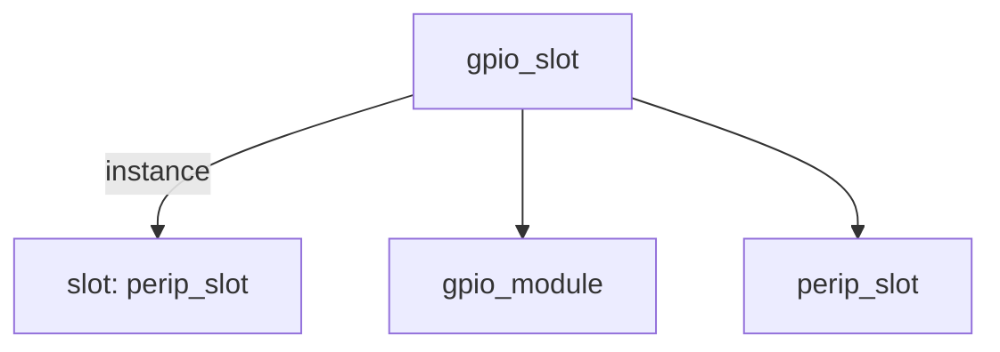

# 模块 `gpio_slot`

- 源文件：`rtl\rtl\IONet\GPIO\gpio_slot.v`
- 职责：**AI 推断：** 该模块将 GPIO 外设集成到 Mesh 总线中，负责总线协议握手与数据路径转换，并直接暴露 GPIO 控制、数据、引脚状态及中断信号。
- 说明：模块内部例化了 `perip_slot`（总线插槽）和 `gpio_module`（GPIO 控制器）。实例 `slot` 处理 `i_driveFrmMesh` / `i_freeNextFrmMesh` 等握手事件，将总线数据转发给 `gpio_module`；`gpio_module` 产生的 `gpio_ctrl_o`、`gpio_data_o`、`io_pin_i` 和 `irq` 直接作为模块边界信号输出，体现了 GPIO 功能与总线适配的合并。

## 1. 层级位置

- Parents：`IONet_slot`
- Children：`gpio_module`、`perip_slot`
- Component children：无
- Upstream modules：无
- Downstream modules：无

### 1.1 本模块结构图



```text
gpio_slot
|-- slot: perip_slot
|-- gpio_module
`-- perip_slot
```

## 2. 输入/输出接口摘要

- **输入**  
  `clk`、`rst_finish`（时钟与复位）  
  `i_driveFrmMesh`（驱动事件）  
  `data_from`（数据输入）  
  `io_pin_i`（GPIO 引脚输入）  
  `i_freeNextFrmMesh`（背压/释放输入）

- **输出**  
  `o_driveNextToMesh`（驱动事件输出）  
  `data_to`（数据输出）  
  `gpio_ctrl_o`、`gpio_data_o`（GPIO 控制与数据）  
  `o_freeToMesh`（释放输出）  
  `irq`（中断）

### 2.1 端口分组

| 端口组               | 方向统计      | 代表信号                                      |
|----------------------|--------------|-----------------------------------------------|
| `clock_reset_init`   | input:2      | `clk`、`rst_finish`                           |
| `gpio`               | input:1, output:2 | `io_pin_i`、`gpio_ctrl_o`、`gpio_data_o`     |
| `drive_event`        | input:1, output:1 | `i_driveFrmMesh`、`o_driveNextToMesh`         |
| `free_backpressure`  | input:1, output:1 | `i_freeNextFrmMesh`、`o_freeToMesh`           |
| `data_and_irq`       | input:1, output:2 | `data_from`、`data_to`、`irq`                 |

## 3. Drive/Data/Free 契约

| Interface              | 方向   | Event               | Payload | Free/backpressure    |
|------------------------|--------|---------------------|---------|----------------------|
| `i_driveFrmMesh`       | input  | `i_driveFrmMesh`    | 未记录  | `o_freeToMesh`       |
| `o_driveNextToMesh`    | output | `o_driveNextToMesh` | 未记录  | `i_freeNextFrmMesh`  |

## 4. 主要 Drive-centered Flow

### `i_driveFrmMesh`

- 确定性事实：`i_driveFrmMesh` 至 `o_driveNextToMesh`  
  flow_id = `flow_000_gpio_slot_i_driveFrmMesh`
- Payload：未记录
- 输出/影响：`o_driveNextToMesh`
- 结构复杂度：branch=0，join=0，blocking=0
- **AI 推断：** 此流为单向事件直通，无需数据转换或仲裁，数据负载和背压细节未在分析中体现。

## 5. 内部组件与 assign 影响

### 5.1 内部组件

| 实例   | 类型         | 输入事件           | 输出事件               |
|--------|--------------|--------------------|------------------------|
| `slot` | `perip_slot` | `i_driveFrmMesh`   | `o_driveNextToMesh`    |

### 5.2 assign 影响

| Assign     | 影响范围  | LHS       | RHS 摘要                 | 解释状态                                          |
|------------|-----------|-----------|--------------------------|---------------------------------------------------|
| `assign_0` | data_path | `data_to` | {w_data_to[50:10], XY}   | **证据不足：** No Semantic Layer assignment interpretation is available. |
