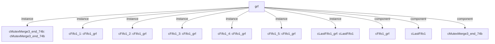

# 模块 `grf`

- **源文件**：`rtl\rtl\GRF\grf.v`
- **职责**：AI 推断：为多执行单元提供寄存器文件读/写仲裁与流水线化的访存接口。
- **概述**：  
  该模块接收来自 Launch、Exe、Exp、Lsu、Wb 五级流水段的驱动事件与 grfw 写事件；  
  通过一组 `cFifo1_grf` 实例进行缓冲，并用 `cMutexMerge3_end_74b` 对写请求进行仲裁合并；  
  同时管理读写冲突，返回对应的寄存器数据，并利用 `i_expWen_2`、`i_lsuWen_2`、`i_wbWen_2` 等写使能信号参与写合并决策。

---

## 1. 层级位置

- **Parents**：`cpu_top_all`
- **Children**：无
- **Component children**：`cFifo1_grf`、`cLastFifo1`、`cMutexMerge3_end_74b`
- **Upstream modules**：无
- **Downstream modules**：无

### 1.1 本模块结构图



```text
grf
|-- cMutexMerge3_end_74b: cMutexMerge3_end_74b
|-- cFifo1_1: cFifo1_grf
|-- cFifo1_2: cFifo1_grf
|-- cFifo1_3: cFifo1_grf
|-- cFifo1_4: cFifo1_grf
|-- cFifo1_5: cFifo1_grf
|-- cLastFifo1_grf: cLastFifo1
|-- cFifo1_grf
|-- cLastFifo1
`-- cMutexMerge3_end_74b
```

---

## 2. 输入/输出接口摘要

### 2.1 主要信号分类

模块总计 33 个输入端口、21 个输出端口，按功能分为三组。

#### drive_event 组（驱动事件）

| 方向 | 端口名称 |
|------|----------|
| input | `i_driveFromExe_1`, `i_driveFromExp_1`, `i_driveFromLsu_1`, `i_driveFromWb_1`, `i_grfDriveFromLaunch_1`, `i_grfwDriveFromExp_1`, `i_grfwDriveFromLsu_1`, `i_grfwDriveFromWB_1` |
| output | `o_grfDriveToExe_1`, `o_grfDriveToExp_1`, `o_grfDriveToLaunch_1`, `o_grfDriveToLsu_1`, `o_grfDriveToWb_1` |

#### free_backpressure 组（反压信号）

| 方向 | 端口名称 |
|------|----------|
| input | `i_grfFreeFromExe_1`, `i_grfFreeFromExp_1`, `i_grfFreeFromLaunch_1`, `i_grfFreeFromLsu_1`, `i_grfFreeFromWb_1` |
| output | `o_grfFreeToExe_1`, `o_grfFreeToExp_1`, `o_grfFreeToLaunch_1`, `o_grfFreeToLsu_1`, `o_grfFreeToWb_1`, `o_grfwFreeToExp_1`, `o_grfwFreeToLsu_1`, `o_grfwFreeToWB_1` |

#### other_ports 组（数据、地址与写使能）

| 方向 | 端口名称 |
|------|----------|
| input | `i_expAddr_8`, `i_expDataToGrf_64`, `i_expWen_2`, `i_lsuAddr_8`, `i_lsuDataToGrf_64`, `i_lsuWen_2`, `i_rs2Addr_8`, `i_rs3Addr_8`, `i_rs4Addr_8`, `i_rsAddr_8`, `i_wbAddr_8`, `i_wbDataToGrf_64`, `i_wbWen_2` |
| output | `o_grfDataToExe_64`, `o_grfDataToExp_192`, `o_grfDataToLaunch_64`, `o_grfDataToLsu_64`, `o_grfDataToWb_64` |

---

## 3. Drive/Data/Free 契约

下表演示各个通道的事件‑数据‑反压绑定关系，Payload 字段列出伴随有效数据。

| Interface | 方向 | Event | Payload | Free / Backpressure |
|-----------|------|-------|---------|----------------------|
| `i_driveFromExe_1` | input | `i_driveFromExe_1` | — | `o_grfFreeToExe_1` |
| `i_driveFromExp_1` | input | `i_driveFromExp_1` | `i_expAddr_8[7:0]`, `i_expDataToGrf_64[63:0]` | `o_grfFreeToExp_1` |
| `i_driveFromLsu_1` | input | `i_driveFromLsu_1` | `i_lsuAddr_8[7:0]`, `i_lsuDataToGrf_64[63:0]` | `o_grfFreeToLsu_1` |
| `i_driveFromWb_1` | input | `i_driveFromWb_1` | `i_wbAddr_8[7:0]`, `i_wbDataToGrf_64[63:0]` | `o_grfFreeToWb_1` |
| `i_grfDriveFromLaunch_1` | input | `i_grfDriveFromLaunch_1` | `i_expDataToGrf_64[63:0]`, `i_lsuDataToGrf_64[63:0]`, `i_wbDataToGrf_64[63:0]` | `o_grfFreeToLaunch_1` |
| `i_grfwDriveFromExp_1` | input | `i_grfwDriveFromExp_1` | `i_expDataToGrf_64[63:0]` | `o_grfFreeToExp_1` |
| `i_grfwDriveFromLsu_1` | input | `i_grfwDriveFromLsu_1` | `i_lsuDataToGrf_64[63:0]` | `o_grfFreeToLsu_1` |
| `i_grfwDriveFromWB_1` | input | `i_grfwDriveFromWB_1` | `i_wbDataToGrf_64[63:0]` | `o_grfFreeToWb_1` |
| `o_grfDriveToExe_1` | output | `o_grfDriveToExe_1` | `o_grfDataToExe_64[63:0]` | `i_grfFreeFromExe_1` |
| `o_grfDriveToExp_1` | output | `o_grfDriveToExp_1` | `o_grfDataToExp_192[191:0]` | `i_grfFreeFromExp_1` |
| `o_grfDriveToLaunch_1` | output | `o_grfDriveToLaunch_1` | `o_grfDataToLaunch_64[63:0]` | `i_grfFreeFromLaunch_1` |
| `o_grfDriveToLsu_1` | output | `o_grfDriveToLsu_1` | `o_grfDataToLsu_64[63:0]` | `i_grfFreeFromLsu_1` |

---

## 4. 主要 Drive-centered Flow

### `i_driveFromExe_1`

- **确定性事实**：`i_driveFromExe_1` → `o_grfDriveToExe_1`；flow_id = `flow_000_grf_i_driveFromExe_1`
- **Payload**：`o_grfDriveToExe_1` 使能 `o_grfDataToExe_64[63:0]`
- **输出/影响**：`o_grfDriveToExe_1`
- **结构复杂度**：branch = 0, join = 0, blocking = 1
- **AI 推断**：输出驱动事件 `o_grfDriveToExe_1` 控制有效负载 `o_grfDataToExe_64` 的采样时刻，形成典型的事件‑数据绑定。

### `i_driveFromExp_1`

- **确定性事实**：`i_driveFromExp_1` → `o_grfDriveToExp_1`；flow_id = `flow_001_grf_i_driveFromExp_1`
- **Payload**：输入 `i_expAddr_8[7:0]`、`i_expDataToGrf_64[63:0]`；输出 `o_grfDataToExp_192[191:0]`
- **输出/影响**：`o_grfDriveToExp_1`
- **结构复杂度**：branch = 0, join = 0, blocking = 1
- **AI 推断**：本流为单级 FIFO 缓冲的简单事件传播，可能因反压而阻塞；输出载荷并非直接转发输入数据，而是来自内部寄存器。

### `i_driveFromLsu_1`

- **确定性事实**：`i_driveFromLsu_1` → `o_grfDriveToLsu_1`；flow_id = `flow_002_grf_i_driveFromLsu_1`
- **Payload**：输入 `i_lsuAddr_8[7:0]`、`i_lsuDataToGrf_64[63:0]`；输出 `o_grfDataToLsu_64[63:0]`
- **输出/影响**：`o_grfDriveToLsu_1`
- **结构复杂度**：branch = 0, join = 0, blocking = 1
- **AI 推断**：控制事件经由 FIFO 与延迟级传播，本流本身不直接处理载荷数据，实际数据通路存在于并行流中。

### `i_driveFromWb_1`

- **确定性事实**：`i_driveFromWb_1` → `o_grfDriveToWb_1`；flow_id = `flow_003_grf_i_driveFromWb_1`
- **Payload**：输入 `i_wbAddr_8[7:0]`、`i_wbDataToGrf_64[63:0]`；输出 `o_grfDataToWb_64[63:0]`
- **输出/影响**：`o_grfDriveToWb_1`
- **结构复杂度**：branch = 0, join = 0, blocking = 1
- **AI 推断**：接口分别使用 `o_grfFreeToWb_1` 与 `i_grfFreeFromWb_1` 作为反压信号，暗示该流采用标准 Free/Drive 协议，FIFO 内部状态负责协调这两个信号。

### `i_grfDriveFromLaunch_1`

- **确定性事实**：`i_grfDriveFromLaunch_1` → `o_grfDriveToLaunch_1`；flow_id = `flow_004_grf_i_grfDriveFromLaunch_1`
- **Payload**：输入多路数据（`i_expDataToGrf_64`、`i_lsuDataToGrf_64`、`i_wbDataToGrf_64`）；输出 `o_grfDataToLaunch_64[63:0]`
- **输出/影响**：`o_grfDriveToLaunch_1`
- **结构复杂度**：branch = 0, join = 0, blocking = 1
- **AI 推断**：通路包含基于 FIFO 的反压机制，通过 `o_grfFreeToLaunch_1` 通知发起端可否接收新事件；输出侧存在 `i_grfFreeFromLaunch_1`，构成完整的 valid/ready 握手。

### `i_grfwDriveFromExp_1`

- **确定性事实**：属于 `grf flow from i_grfwDriveFromExp_1`；flow_id = `flow_005_grf_i_grfwDriveFromExp_1`
- **Payload**：`i_expDataToGrf_64[63:0]`
- **输出/影响**：证据不足：Knowledge IR 未发现该流在模块输出端的端点。
- **结构复杂度**：branch = 0, join = 1, blocking = 2
- **AI 推断**：当 `i_grfwDriveFromExp_1` 有效时采样 `i_expDataToGrf_64`，通过合并器传递给后续 FIFO；`o_grfFreeToExp_1` 向 Exp 单元指示就绪状态。

### `i_grfwDriveFromLsu_1`

- **确定性事实**：属于 `grf flow from i_grfwDriveFromLsu_1`；flow_id = `flow_006_grf_i_grfwDriveFromLsu_1`
- **Payload**：`i_lsuDataToGrf_64[63:0]`
- **输出/影响**：证据不足：Knowledge IR 未发现该流在模块输出端的端点。
- **结构复杂度**：branch = 0, join = 1, blocking = 2
- **AI 推断**：载荷 `i_lsuDataToGrf_64` 随 `i_grfwDriveFromLsu_1` 事件送入合并器，`o_grfFreeToLsu_1` 控制写入节奏。

### `i_grfwDriveFromWB_1`

- **确定性事实**：属于 `grf flow from i_grfwDriveFromWB_1`；flow_id = `flow_007_grf_i_grfwDriveFromWB_1`
- **Payload**：`i_wbDataToGrf_64[63:0]`
- **输出/影响**：证据不足：Knowledge IR 未发现该流在模块输出端的端点。
- **结构复杂度**：branch = 0, join = 1, blocking = 2
- **AI 推断**：`i_wbDataToGrf_64` 作为 `i_grfwDriveFromWB_1` 的伴随数据，在合并器内与驱动绑定传递，无额外 assign 条件。

---

## 5. 内部组件与 assign 影响

### 5.1 内部组件

| 实例 | 类型 | 输入事件 | 输出事件 |
|------|------|----------|----------|
| `cMutexMerge3_end_74b` | `cMutexMerge3_end_74b` | `i_grfwDriveFromExp_1`, `i_grfwDriveFromLsu_1`, `i_grfwDriveFromWB_1` | `w_driveToWrite` |
| `cFifo1_1` | `cFifo1_grf` | `i_grfDriveFromLaunch_1` | 无 |
| `cFifo1_2` | `cFifo1_grf` | `i_driveFromExe_1` | `o_grfDriveToExe_1` |
| `cFifo1_3` | `cFifo1_grf` | `i_driveFromLsu_1` | 无 |
| `cFifo1_4` | `cFifo1_grf` | `i_driveFromWb_1` | `o_grfDriveToWb_1` |
| `cFifo1_5` | `cFifo1_grf` | `i_driveFromExp_1` | `o_grfDriveToExp_1` |
| `cLastFifo1_grf` | `cLastFifo1` | `w_driveToWrite` | 无 |

### 5.2 assign 影响

| Assign | 影响区域 | LHS | RHS 摘要 | 解释状态 |
|--------|----------|-----|----------|----------|
| `assign_1` | unknown | `w_lauindex2_4` | `i_rsAddr_8[7:4]` | AI 推断：将读地址 `i_rsAddr_8` 拆分为两个 4 位索引，用于扩展寄存器存储体的选择。 |
| `assign_2` | data_path | `o_grfDataToLaunch_64` | `{r_rsValue_32[1], r_rsValue_32[0]}` | AI 推断：从内部寄存器组 `r_rsValue_32` 的两个部分拼接出 Launch 端口的 64 位读出数据。 |
| `assign_3` | unknown | `w_exeindex1_4` | `i_rs2Addr_8[3:0]` | 证据不足：No Semantic Layer assignment interpretation is available. |
| `assign_4` | unknown | `w_exeindex2_4` | `i_rs2Addr_8[7:4]` | 证据不足：No Semantic Layer assignment interpretation is available. |
| `assign_5` | data_path | `o_grfDataToExe_64` | `{r_rsValue_32[3], r_rsValue_32[2]}` | 证据不足：No Semantic Layer assignment interpretation is available. |
| `assign_6` | unknown | `w_lsuindex1_4` | `i_rs3Addr_8[3:0]` | 证据不足：No Semantic Layer assignment interpretation is available. |
| `assign_7` | unknown | `w_lsuindex2_4` | `i_rs3Addr_8[7:4]` | 证据不足：No Semantic Layer assignment interpretation is available. |
| `assign_8` | data_path | `o_grfDataToLsu_64` | `{r_rsValue_32[5], r_rsValue_32[4]}` | 证据不足：No Semantic Layer assignment interpretation is available. |
| `assign_9` | unknown | `w_wbindex1_4` | `i_rs4Addr_8[3:0]` | 证据不足：No Semantic Layer assignment interpretation is available. |
| `assign_10` | unknown | `w_wbindex2_4` | `i_rs4Addr_8[7:4]` | 证据不足：No Semantic Layer assignment interpretation is available. |
| `assign_11` | data_path | `o_grfDataToWb_64` | `{r_rsValue_32[7], r_rsValue_32[6]}` | 证据不足：No Semantic Layer assignment interpretation is available. |
| `assign_12` | data_path | `o_grfDataToExp_192` | `r_rsValue_192` | 证据不足：No Semantic Layer assignment interpretation is available. |
| … | … | … | … | 其余 1 条 assign 省略 |

---

**风险提示**：多处信号功能、流程边界及 payload 绑定基于 AI 推断，部分流缺少明确的输出端点记录。最终实现细节需结合源码复核。
